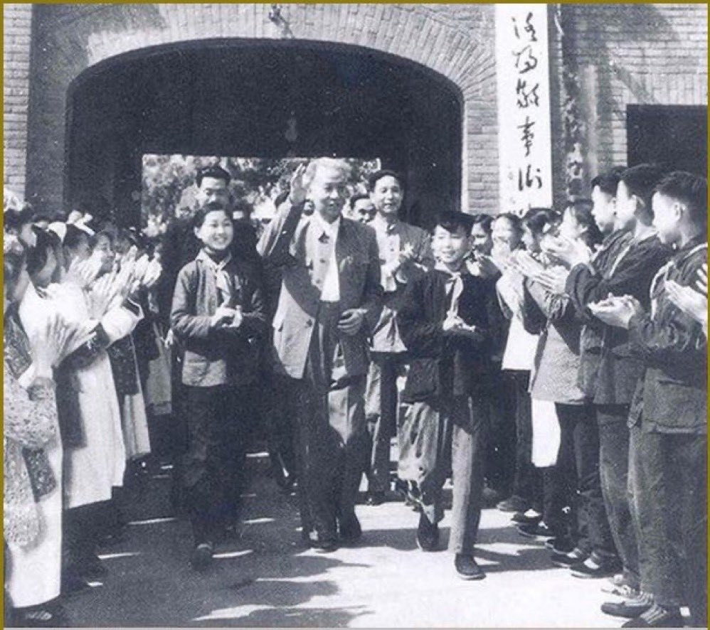
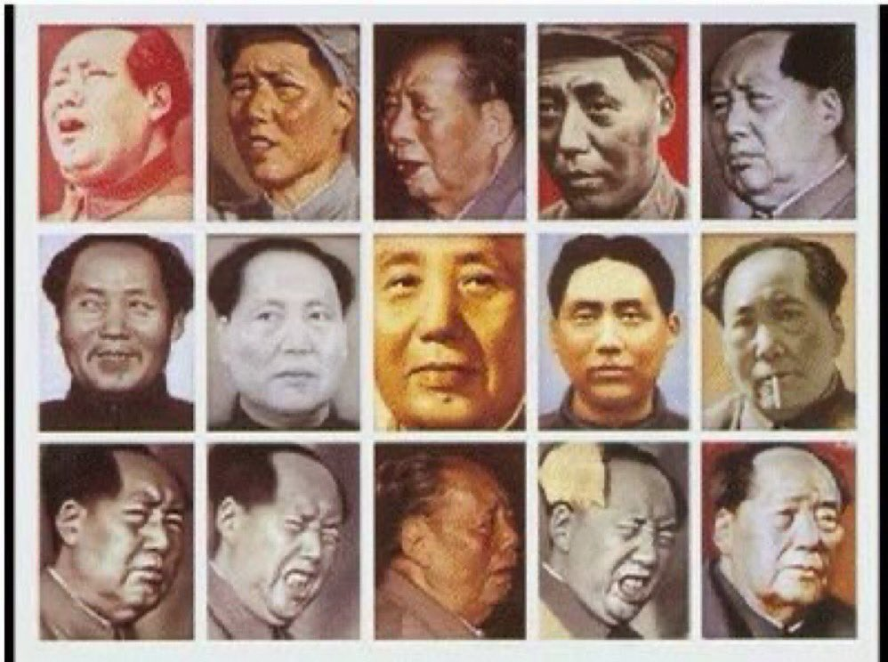

Ivy未央 北京时间 2023-06-30T19:31:52Z 1674742543387353090 转）打倒刘少奇时，老百姓个个义愤填膺；平反刘少奇案是最大冤案时，老百姓个个热泪盈眶。标榜江青是旗手时，全国人民都夸她女中豪杰；打倒江青反革命时，全国人民恨不得吃她的肉。第一次被骗是骗子无耻，第二次被骗是我们自己愚昧，第三次被骗直到现在还在高呼毛万岁的，这就是脑残了，还有没有得救？ https://t.co/0zq2FIXmTd   Ivy未央 北京时间 2023-06-30T14:04:25Z 1674660140937510912 转）毛泽东得和中国人多大仇啊？
1949到1976年这27年，他只干了这些事：整死有钱的人，整死有文化的人，整死有思想的人，整死家庭条件好的人，整死有教养的人，整死有理想的人，整死有骨气的人，整死有同情心的人，整死骨头硬的人，整死有道德的人。
那27年，他从头到尾都在整人，以十年文革告终。 https://t.co/KHRZTge4tV   Ivy未央 北京时间 2023-06-30T09:31:43Z 1674591510770118658 转）布拉格一首当年的地下摇滚歌曲，歌词很有意思：他们害怕老人的记忆，害怕年轻人的思想，害怕墓地的鲜花，害怕工人，害怕教堂，害怕所有的快乐时光，他们害怕电影，害怕画家，害怕音乐家，害怕石块和雕塑，他们害怕电台，害怕技术，害怕信息自由流动，那么我们为什么要怕他们？ https://t.co/MetPZ4M7MT   