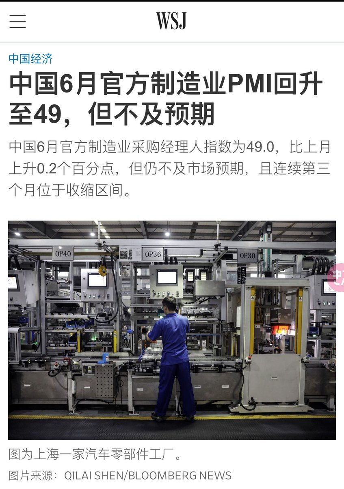

多伦多方脸 北京时间 2023-06-30T23:48:56Z 1674807236697407488 6亿人收入不到1000是李克强说的，烂尾楼很多也是中共自己说的，要不然不会有保交楼，失业率20%，也是中共自己发的
中国确实经济有严重问题
但是为什么美国没有放松制裁呢？
因为你理解美国制裁中国是中国强大，但实际是因为中共做傻逼事了
难道朝鲜不弱小吗？那朝鲜做傻逼事情，就不制裁朝鲜了？   多伦多方脸 北京时间 2023-06-30T23:52:17Z 1674808078909444097 其实说中国人会起来反抗，与不会起来反抗，都为时过早。
这要看中国经济出现问题之后大家如何选择。
如果经济垮了，大家还是苟活，那就没戏了。
不过想想，怎么样经济垮了带来的痛苦都要比疫情严重，既然疫情都有白纸革命
那经济垮了革命自然也不会少   多伦多方脸 北京时间 2023-06-30T18:39:32Z 1674729374535532544 最近有不少人叫我聊聊日本核废水问题。
我本身也不是学核物理的，具体的科普知乎上也有。
不过我觉得一个天天吃鸭脖，各种添加剂的国度。
说因为日本核污染了，要不吃这个，不吃那个了。
和听闻阿斯巴甜致癌，抽根烟压压惊有啥区别？   多伦多方脸 北京时间 2023-06-30T18:54:04Z 1674733030701928449 说到食品安全问题中国实在太多槽点了。
比如大多数饭店做小炒黄牛肉，用的都是蒙古肉。
蒙古肉是鸭肉和其他肉的混合，就是你吃起来很嫩滑的牛肉，阿里巴巴7.5一斤
还有就是我之前说过的巴拉圭，阿根廷黄膘牛排，各种合牛。 https://t.co/9eWAq3DWOS   多伦多方脸 北京时间 2023-06-30T21:44:30Z 1674775921671405568 看来马克龙来中国学到了不少东西。   多伦多方脸 北京时间 2023-06-30T18:34:21Z 1674728068139859968 有一说一，有时候不用太逆向民族主义。
中国肯定还是比这些国家要强挺多的。
现在就算有人在国外焚烧马克思的书，给习近平立一些羞辱性的雕像。
中国人肯定不会无脑去冲别人的大使馆，虽然有些小粉红爱中共，但是离毛时代，离这些宗教狂热分子还差挺远的。   多伦多方脸 北京时间 2023-06-30T19:53:44Z 1674748046398341121 其实大部分中国人的，最终的归宿都是反贼。
只是时间早晚问题。
就和死亡一样。   多伦多方脸 北京时间 2023-06-30T16:43:24Z 1674700147505389568 请善待自己的同胞😤 https://t.co/xd7qOOoiFi   多伦多方脸 北京时间 2023-06-30T14:42:30Z 1674669721432756224 从2012年到现在
腐败问题没有处理好
房价问题没有处理好
债务问题没有处理好
中美关系没有处理好
新冠问题没有处理好
确实指望处理好这次的经济问题，有些困难   多伦多方脸 北京时间 2023-06-30T14:45:10Z 1674670395977515009 支持李老师，我现在真的拉黑假黄推拉的头都疼。
其实卖片，卖写真，我是一点意见都没得。
但是有些明显是诈骗犯的，也请大家擦亮眼睛   多伦多方脸 北京时间 2023-06-30T11:00:34Z 1674613872593100802 推荐你一下，除了天天锤官员，你更应该说一下打的是什么产品，什么药导致的。
这样才能更好的维权 https://t.co/5ZB61lirA2   多伦多方脸 北京时间 2023-06-30T11:11:16Z 1674616563289440257 中国制造业pmi指数为49（PMI指数高于50表明制造业活动扩张，低于50则说明萎缩。)
较上月跌幅稍微减弱，但仍不及市场预期。 https://t.co/cYF44SsLaJ   多伦多方脸 北京时间 2023-06-30T12:11:34Z 1674631740672069645 其实现在中国经济不好，大家也都知道。
很多人都在等，等中国一个救市手段。
但是不知道为啥到现在，强力的措施还没有出来。
如果能救起来，那还能撑撑，再吹吹大国崛起一段时间。
如果就不起来，真就拉了。   