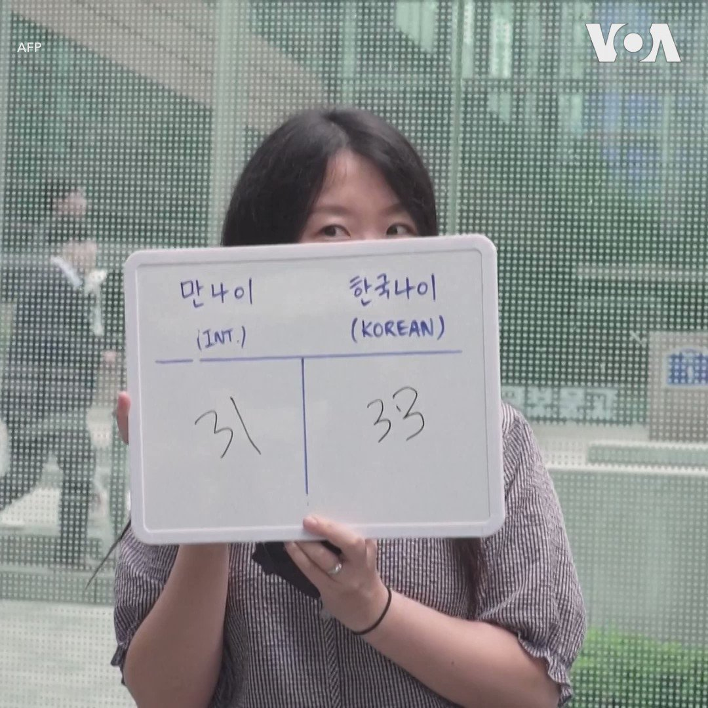

美国之音中文网 北京时间 2023-06-30T09:08:34Z 1674585685054083072 俄罗斯据报道因瓦格纳兵变而拘捕了侵乌俄军副司令苏罗维金 https://t.co/tPi6L2tNmF   美国之音中文网 北京时间 2023-06-30T09:08:36Z 1674585692851310592 美国驳回了中国解除制裁的呼吁 https://t.co/gVawY8fqMA   美国之音中文网 北京时间 2023-06-30T09:37:04Z 1674592858765135872 美国前副总统彭斯突访乌克兰 https://t.co/WRIattoFhO   美国之音中文网 北京时间 2023-06-30T09:53:33Z 1674597005992284161 警察在巴黎郊区枪击青少年导致抗议扩大 https://t.co/uJnLdaNUNB   美国之音中文网 北京时间 2023-06-30T04:24:46Z 1674514263799390208 首尔家庭主妇李正熙(音译 Lee Jung-hee )本来明年就要60岁了，不过韩国自28日起废除了传统方式、要计算年龄“国际年龄”，这样她就年轻了一岁, 李正熙说“这样感觉自己还年轻”。韩国传统方式是从怀胎起开始计算年龄,  而且人们一过年就增加一岁, 例如出生在12月31日的婴儿到第二天、1月1日就变成了两岁。 https://t.co/wCM8RjcglS   美国之音中文网 北京时间 2023-06-30T05:29:34Z 1674530571169714176 美最高法院推翻大学招生中的平权行动 https://t.co/1Zbi4DrY5l   美国之音中文网 北京时间 2023-06-30T05:43:33Z 1674534090492764160 玻利维亚与中国和俄罗斯签约，开发锂矿藏 https://t.co/H4EbHCzK1s   美国之音中文网 北京时间 2023-06-30T02:47:14Z 1674489721026650116 香港导演周冠威两年前制作的《时代革命》纪录片在国际上广受好评，但是现在他说投资者不敢为他的新电影投资。2021年香港推出新的审查法，禁止“可能危害国家安全”的电影。他的电影《1人婚礼》虽然并不涉及政治，但却历经了投资者撤资以及主要演员退出，后来支持者们集资他才得以完成这部电影。 https://t.co/az9OwNNm9a   美国之音中文网 北京时间 2023-06-30T02:48:06Z 1674489936760676368 6月28日，首尔一家人气连锁超市的海盐被抢购一空。由于日本核污水排海在即，许多韩国人出于自身安全担忧，开始了抢盐大战。一位加入抢盐大军的韩国母亲买了5公斤盐，她说：“我想给孩子们吃健康食品，我不能袖手旁观。”另一位抢盐失败的韩国人则说：“我上次来时就没有，今天也是。我下次还得再来。” https://t.co/5eFrhBLuqW   美国之音中文网 北京时间 2023-06-30T03:01:33Z 1674493322331828225 世界媒体看中国: “瓦格纳之后，习近平还会唱普京的曲调嘛” https://t.co/WTl26fXWMl   美国之音中文网 北京时间 2023-06-30T00:49:08Z 1674460000801153024 美国芯片出口新限制令英伟达焦虑，称将导致永久丧失机会 https://t.co/BT9s7Ulkv9   美国之音中文网 北京时间 2023-06-30T01:19:41Z 1674467686485569539 北京当局在香港强推国安法之后，艺术家淋漓和淋浪于2021年选择远离是非之地，踏上了流亡英国的路。但即便他们身在伦敦，这对夫妇仍然感受到了来自北京的威胁。 “我们在这里并不完全安全，”艺术家淋浪说，“如果（英国）政府不坚决反对中共，我们将永远不会安全。” 报道：https://t.co/M0xpucWpBA https://t.co/aKOT1QQFkv   美国之音中文网 北京时间 2023-06-30T01:32:08Z 1674470822105477120 德国官员呼吁对中共外宣工具孔子学院予以限制 https://t.co/dCAvtJKqTS   美国之音中文网 北京时间 2023-06-30T01:32:10Z 1674470830099800064 中国腐败无孔不入 澳新南威尔士前州长涉及隐瞒情人腐败交易的腐败行为 https://t.co/6G90aKOjLr   美国之音中文网 北京时间 2023-06-30T02:16:03Z 1674481872926277632 美公布《国家出口战略》，帮助美企更好地与中国竞争 https://t.co/BVikyINitI   美国之音中文网 北京时间 2023-06-30T02:16:05Z 1674481880937410560 中国以24枚导弹可击沉美军航母? 台湾智库兵推打脸中国“大外宣” https://t.co/M5CjxcmOf7   美国之音中文网 北京时间 2023-06-30T00:06:04Z 1674449160362405888 研究发现：入侵美国领空的中国间谍气球使用美国技术侦察美国 https://t.co/1TpaPAyeBo   美国之音中文网 北京时间 2023-06-30T00:17:15Z 1674451977273593856 英国外交大臣克莱弗利29日在伦敦一家智库的活动上说如果他访问中国一定会提出对中国人权的担忧等议题，他还表示与中国接触对于他希望推动的国际多边体系改革非常重要。克莱弗利对于俄罗斯瓦格纳集团兵变事件表示这是俄罗斯的内部事务。 https://t.co/hEULAUNIMc   美国之音中文网 北京时间 2023-06-30T00:20:04Z 1674452686492811266 红十字会说125名被关押的苏丹士兵获释 https://t.co/R1AQNDC5R7   