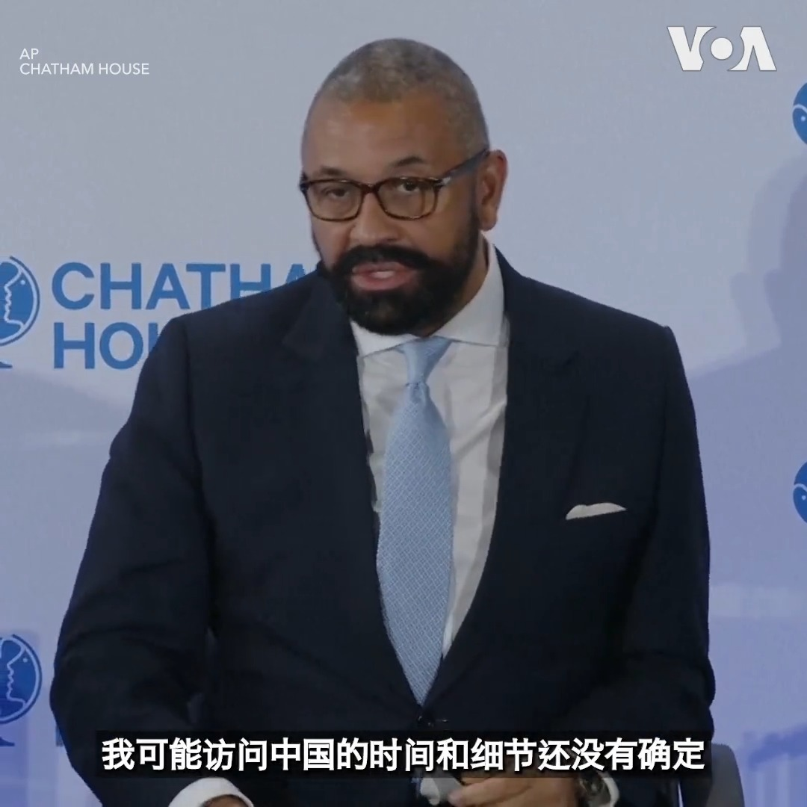

美国之音中文网 北京时间 2023-06-30T02:16:03Z 1674481872926277632 美公布《国家出口战略》，帮助美企更好地与中国竞争 https://t.co/BVikyINitI   美国之音中文网 北京时间 2023-06-30T02:16:05Z 1674481880937410560 中国以24枚导弹可击沉美军航母? 台湾智库兵推打脸中国“大外宣” https://t.co/M5CjxcmOf7   美国之音中文网 北京时间 2023-06-30T00:06:04Z 1674449160362405888 研究发现：入侵美国领空的中国间谍气球使用美国技术侦察美国 https://t.co/1TpaPAyeBo   美国之音中文网 北京时间 2023-06-30T00:17:15Z 1674451977273593856 英国外交大臣克莱弗利29日在伦敦一家智库的活动上说如果他访问中国一定会提出对中国人权的担忧等议题，他还表示与中国接触对于他希望推动的国际多边体系改革非常重要。克莱弗利对于俄罗斯瓦格纳集团兵变事件表示这是俄罗斯的内部事务。 https://t.co/hEULAUNIMc   美国之音中文网 北京时间 2023-06-30T00:20:04Z 1674452686492811266 红十字会说125名被关押的苏丹士兵获释 https://t.co/R1AQNDC5R7   