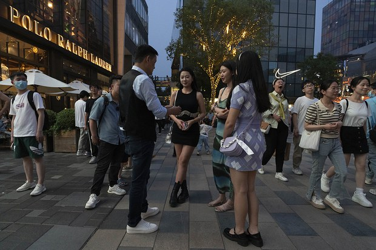

自由亚洲电台 北京时间 2023-06-30T10:01:50Z 1674599092545286145 #胡锡进 6月27日高调宣布进入中国股市，三天来每天在微博更新盈亏动态，成为股民和网民热议话题，各大平台关注，多次上热搜。
第三天，老胡说：“我的整个仓绿了，从昨天盈利200多元变成上午倒亏300几十元”，于是又转了10万进去。
你觉得胡锡进炒股能赚钱吗？他是韭菜还是镰刀？ https://t.co/AuLZCfpX64   自由亚洲电台 北京时间 2023-06-30T09:55:03Z 1674597383135428613 RT @RFA_Chinese: 【诚征受访者：35岁求职嫌你老？】
中国的招聘信息中，时常只招募35岁以下的年轻人，”35”岁彷彿成了魔咒数字，成为投身劳动市场的无形限制。本台想徵集35岁左右、因为年龄限制而就业受阻的青年，欢迎在评论区留言，或电邮fankui@rfa.org…   自由亚洲电台 北京时间 2023-06-30T07:12:35Z 1674556498788204544 近日，由中国海外流亡律师群体发起的"#公民法庭"宣布成立。本台针对法庭成立的目的和首批关注哪些案件等信息，采访了部分发起人士。
https://t.co/0XBFmlbLCr   自由亚洲电台 北京时间 2023-06-30T09:50:06Z 1674596136647294977 【#亚太报道（2023-6-29）】
欢迎收听和订阅播客【亚太报道】 https://t.co/MjLNSvVMqc

中国 #流亡律师 群体成立 #公民法庭 / 《#中国对外关系法》七一实施 / #黄河 水灌溉农田要不要收费？ / #胡锡进 炒股引发“韭菜”与“镰刀”热议 / 《#港区国安法》生效三周年 https://t.co/sVPzvf8YQU   自由亚洲电台 北京时间 2023-06-30T04:30:01Z 1674515587937230848 中国国防部星期四针对美国、日本、菲律宾打算将 #南海联合演习常态化 做出回应，称坚决捍卫国家主权。
https://t.co/8qXZx3Jux6   自由亚洲电台 北京时间 2023-06-30T05:34:57Z 1674531927078912000 RT @RFA_Chinese: 【诚征受访者：35岁求职嫌你老？】
中国的招聘信息中，时常只招募35岁以下的年轻人，”35”岁彷彿成了魔咒数字，成为投身劳动市场的无形限制。本台想徵集35岁左右、因为年龄限制而就业受阻的青年，欢迎在评论区留言，或电邮fankui@rfa.org…   自由亚洲电台 北京时间 2023-06-30T02:45:16Z 1674489223691522048 《#港区国安法》生效三周年前夕，英国国会议员促请英国政府协助在囚的香港传媒大亨 #黎智英、制裁打压人权的中港官员。
更有议员批评政府只会搬出BNO（英国国民海外护照）签证计划回应香港问题，却未采取实际行动，来迫使中国政府为撕毁《中英联合声明》承担责任。

https://t.co/p6HZKGxean   自由亚洲电台 北京时间 2023-06-30T02:53:54Z 1674491399784534016 专栏 | #军事无禁区：加紧威慑－从 #台海 不安局势升高谈起
https://t.co/8rF5vemmMl   自由亚洲电台 北京时间 2023-06-30T03:30:01Z 1674500485766864898 评论 | #胡平：中美必有一战吗？
https://t.co/OnQiDnVQVt   自由亚洲电台 北京时间 2023-06-30T04:00:01Z 1674508036478758912 评论 | #魏京生：中共的虚伪和尴尬
#七一 
https://t.co/vPW2hE68fA   自由亚洲电台 北京时间 2023-06-30T00:49:32Z 1674460100365516800 《#中华人民共和国对外关系法》将自7月1日起实施。
有分析指，该法形同钳制所有外国人政治表态，趋近 #香港国安法 范畴，中国将更为闭关锁国。
https://t.co/YCeIvkPr2W   自由亚洲电台 北京时间 2023-06-30T01:26:52Z 1674469493484167168 #事实查核｜美国总统 #拜登 承认出售国家机密？
https://t.co/zeQwePA9yA   自由亚洲电台 北京时间 2023-06-30T02:25:26Z 1674484233983631376 中国国务院常务会议29号审议通过《#关于促进家居消费的若干措施》。
据澎湃新闻报道，中国国务院总理 #李强  在29号召开国务院常务会议，通过这项促进消费的措施。会议指出，家居消费“涉及领域多、上下游链条长、规模体量大、采取针对性措施加以提振，有利带动居民消费增长和经济恢复。
会议提到，要打好政策组合拳，促进家居消费政策要与 #老旧小区改造、住宅”#适老化“改造、便民生活圈建设、完善废旧物资回收网络等政策衔接配合、协调发力，形成促销费的合力。
会议还表示，要提高供给质量和水平、鼓励企业提供更多个性化、定制化家居商品，进一步增强居民消费意愿，助力生活品质改善。   