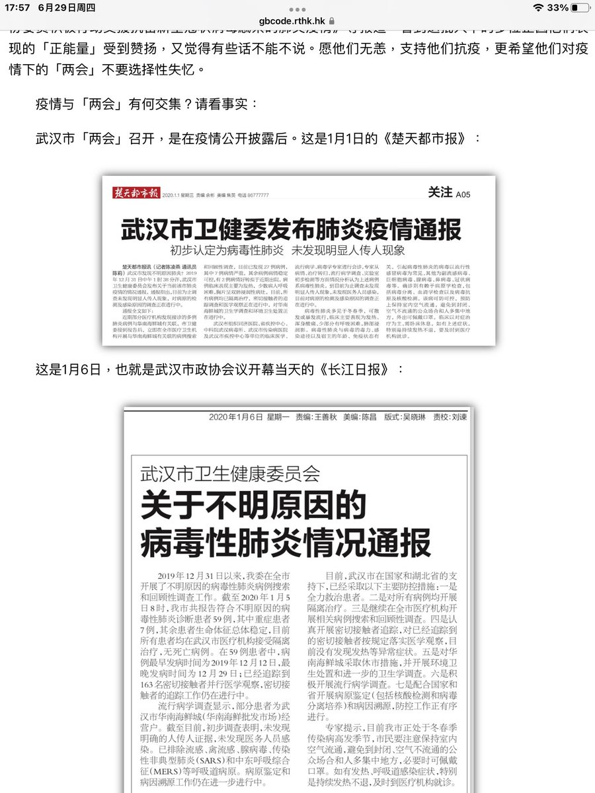
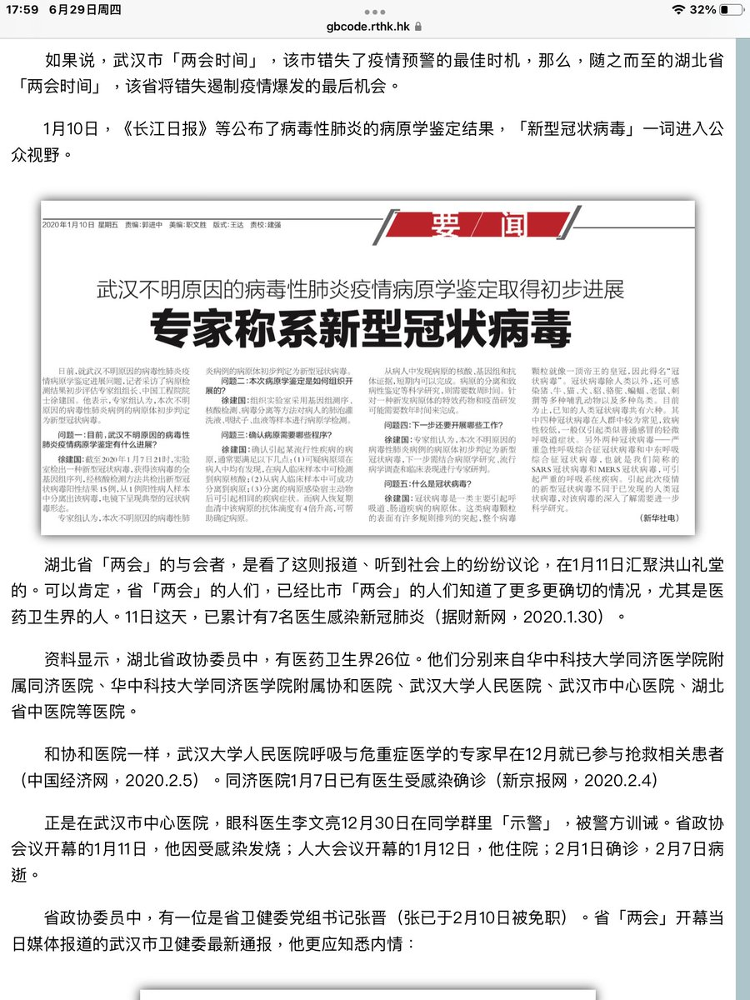
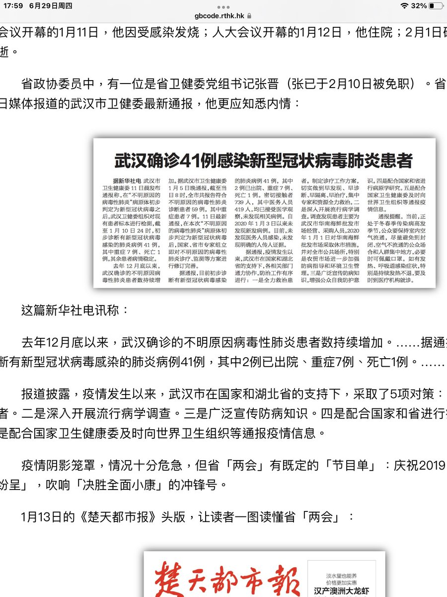
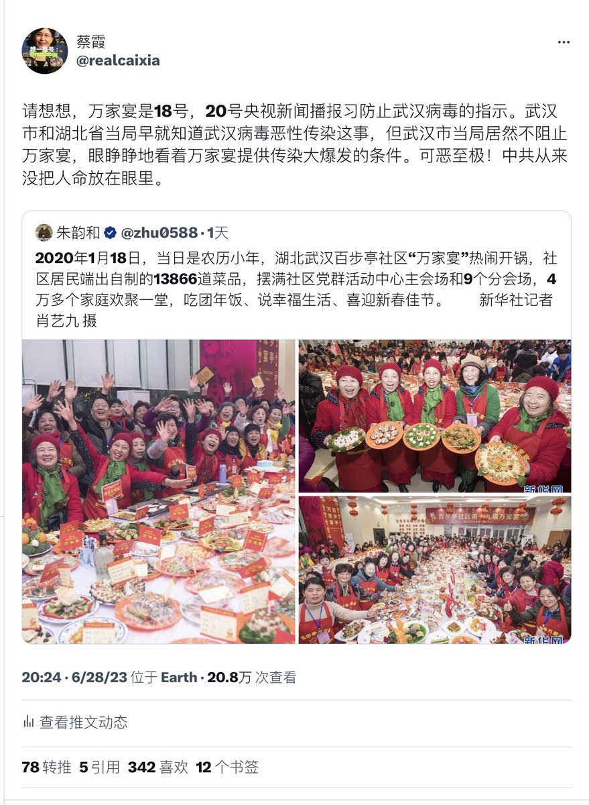

蔡霞 北京时间 2023-06-30T06:16:48Z 1674542458267480064 这是我截取著名的媒体传播研究学者、著名作家、报告文学《唐山大地震》作者钱钢先生2020年3月文章中的材料。2020年1月1号至2020年1月13号之间，当地报纸三次报道，新华社1月11号报道一次，请见图3。这四次报道均隐瞒“人传人”这一最关键的真相！时至今日，还有人为中共习当局洗地，无耻至极！ https://t.co/3ePzPZg2qp   蔡霞 北京时间 2023-06-30T04:20:09Z 1674513104095330305 RT @realcaixia: 家居不是家俱。家居產業會是針對牆國進入老年化社會而提出的新的經濟增長點嗎？亦如此前中共政府的住房、教育、醫療產業化？
老年保健、醫療、日常照顧、特殊護理、孤獨陪伴、心理疏解、老年生活特殊商品等等，有巨大的社會需求。李強口說是家居若實際把居家養老當…   