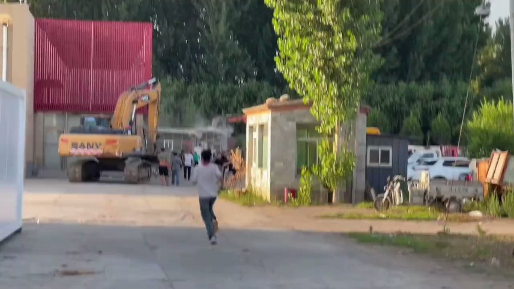
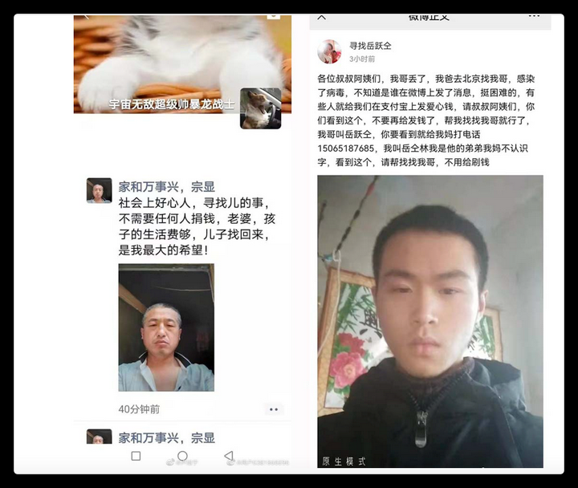
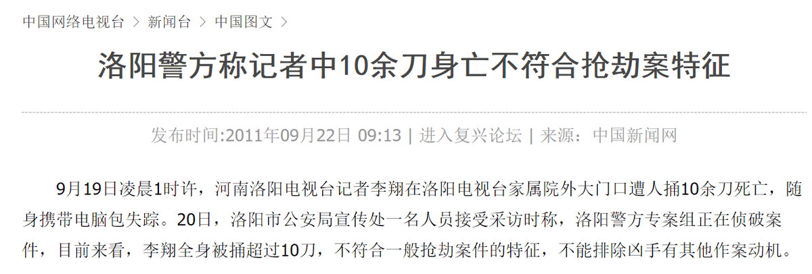
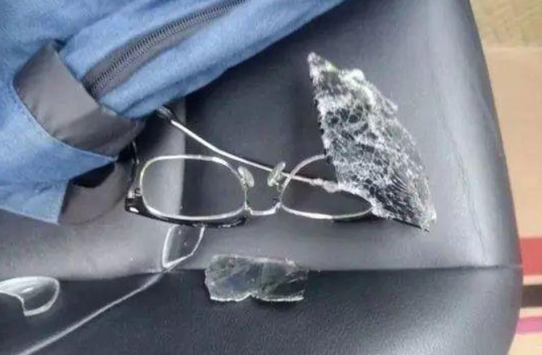
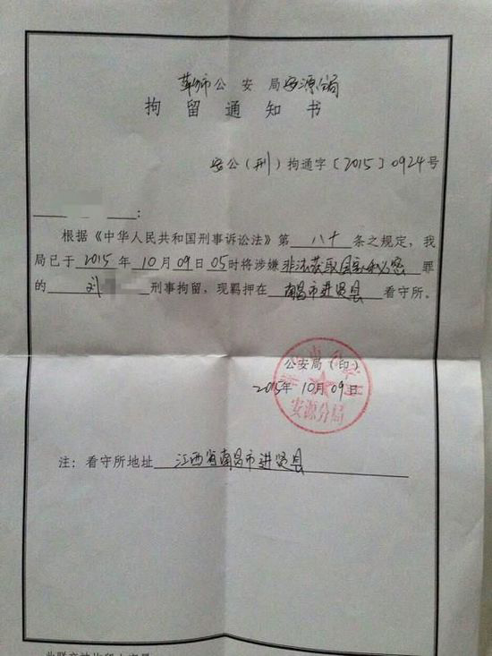
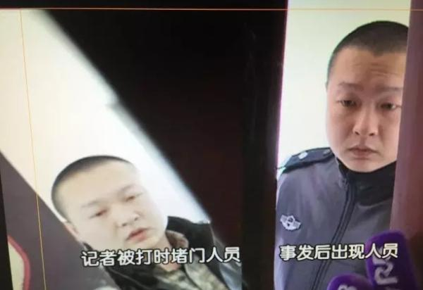
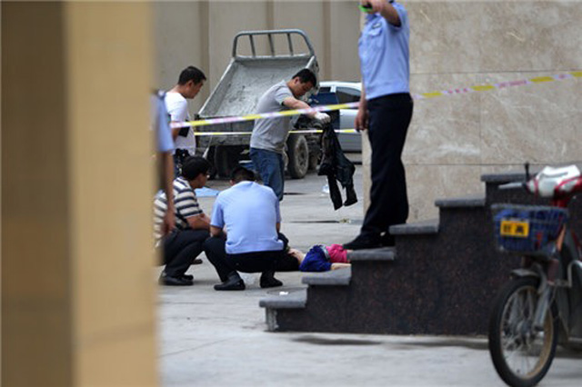
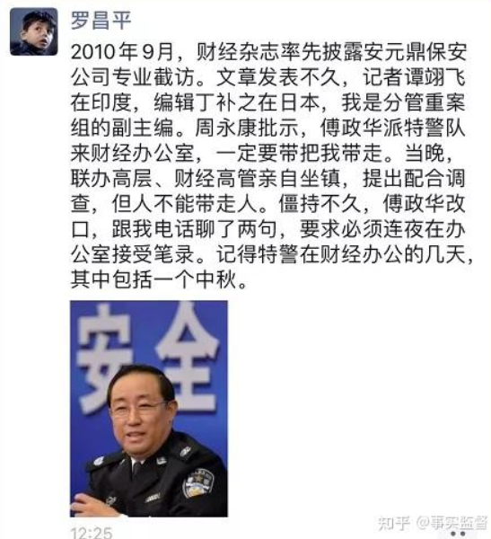
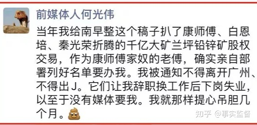
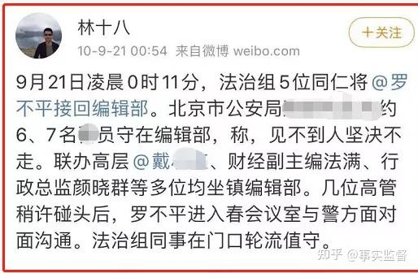

谁将十万横扫三江 北京时间 2023-06-30T06:43:02Z 1674549059972141056 RT @whyyoutouzhele: 网友投稿
谨防上当受骗！
近日，大量假黄推霸占推特评论区
有网友测试加了假黄推提供的电报，对方会以看相册为由让安装一个app，应用注册需要国内手机号和通讯录权限定位权限和相册权限，不给权限不能用。
由于手机号实名，APP可能存在收集实名用…   谁将十万横扫三江 北京时间 2023-06-30T07:10:57Z 1674556086257586177 RT @whyyoutouzhele: 网友投稿
6.29日下午6点半，北京市房山区坟庄村强拆现场。
视频中显示， 当地有关部门雇佣了一群年轻人围住受害者，不让其靠近。
受害人只能眼睁睁看着自己住了三十年的家被强拆。 https://t.co/ivKWNidm2q   谁将十万横扫三江 北京时间 2023-06-30T07:49:46Z 1674565855580151808 调查记者不是不敢报道，只是劣币驱逐良币，想去现场调查的都被人手更多的军警宪特抓进监狱了

1.1989年，《郑州晚报》记者殷新生，因揭披郑州市检察院越权事件，被诬陷入狱。
2.1998年，《山西青年报》记者高勤荣，因揭露山西运城渗灌工程造假，被判刑12年。

3.2002年,《京华时报》记者杨威,因采访物业纠纷问题而遭遇殴打，导致耳鼓膜穿孔。

4.2003年，《南方都市报》因报道孙志刚案与非典事件，影响高层仕途，主编程益中被捕。

5.2005年，《河南商报》记者范友峰,因调查报道聂树斌案，被迫辞职,淡出新闻界。

6.2006年,冰点周刊因刊登《现代化与历史教科书》，被停刊整顿，主编副主编均被免职。

7.2008年，《法制日报》记者朱文娜，因采写辽宁西丰拆迁案,被警方拘传。

8.2008年,《民主与法制时报》记者景剑锋,因报道山西公安包庇黑恶势力，被判刑1年。

9. 2009年,《河北青年报》副总编辑乐倩,遭遇歹徒报复行凶,歹徒边打边喊“叫你报!”

10.2010年,《经济观察报》记者仇子明，因报道凯恩股份交易内幕，被当地公安局网上通缉。

11.2012年，《东方早报》记者简光洲，三鹿奶粉首位报道人，发表“新闻已死”,离开新闻行业。

11.2013年,《新快报》记者刘虎，因实名举报工商总局副局长，被关押346天。

12.2013年3月全国两会时，“时代周报”北京记者宋阳标提问民政部长死猪江葬问题，同年8月被公安以“寻衅滋事”被刑拘。

13.2013年，《南岛晚报》记者杨琼文，因曝光海南万宁校长开房案，被迫离职。

14.2013年，中国揭黑记者第一人王克勤，因《北京暴雨失踪者》一文，《经济观察报》调查部被解散，王克勤本人被迫离职。

15.2016年，《兰州晨报》《兰州晚报》《西部商报》三名驻武威记者，因被当地部门视为发布“负面报道"而遭遇逮捕。

16.2022年，调查记者宋阳标因揭露成都市锦江区违建别墅群，在成都双流国际机场赶飞机路上失踪，后有当地公安局向其亲属电话告知宋阳标因“网络寻衅滋事”再次被刑事拘留。

2017年，中国在册新闻调查记者仅剩175人。传统媒体中的调查记者保有量仅130人，在六年前，这个数字还是306人。而我们是一个拥有14亿人口的超级大国 （数据来源:张志安《新媒体环境下调查记者行业生态变化报告》)   谁将十万横扫三江 北京时间 2023-06-30T07:50:16Z 1674565979807035393 https://t.co/UVN5KCioZy   谁将十万横扫三江 北京时间 2023-06-30T07:51:19Z 1674566245319077888 https://t.co/JMKairFmR9   谁将十万横扫三江 北京时间 2023-06-30T07:59:17Z 1674568251786039296 3月2日,中国新闻周刊副总编辑陈晓萍离满55岁生日当天洒泪宣布退休，在周刊工作二十多年，周刊编辑部由她管理，在网上留下"说真话"三个字
此前，因《对话"流调中最辛苦的中国人"：来北京找儿子，凌晨打零工补贴家用》一文她被中国新闻社全系统通报批评，同时被通报的有社会部主任刘向南，副主编韩永 https://t.co/BbH9rRflx7   谁将十万横扫三江 北京时间 2023-06-30T08:06:24Z 1674570039972986881 2011年9月15日洛阳记者李翔仅在社交平台发布文章“网友投诉栾川有炼制地沟油窝点，食安委回应未发现”，三天后就身中十多刀死亡 https://t.co/cPkC3uyqWv   谁将十万横扫三江 北京时间 2023-06-30T08:09:10Z 1674570737313800193 2023年5月30日，一名极目新闻记者在贵州省毕节市织金县追踪报道“水电站放水致两名教师溺亡”，被3名不明身份人员围殴 https://t.co/Q0lfkSV9oG   谁将十万横扫三江 北京时间 2023-06-30T08:10:20Z 1674571032433397763 南方都市报记者刘某因报道王林案，被冠以涉嫌非法获取国家秘密罪刑拘 https://t.co/wQInGd2RZL   谁将十万横扫三江 北京时间 2023-06-30T08:13:45Z 1674571890076319745 2023年6月27日《广东民声热线》拍摄记者因调查企业违规违法情况被持刀威胁 https://t.co/7Oc72uD0N5   谁将十万横扫三江 北京时间 2023-06-30T08:19:37Z 1674573366844612609 2014年哈尔滨电视台女记者曹阳因一起物流纠纷采访派出所，遭派出所所长关门“殴打” https://t.co/Gp2YFESBMo   谁将十万横扫三江 北京时间 2023-06-30T08:28:53Z 1674575698336550914 2022年11月27日BBC记者埃德· 劳伦斯（Ed Lawrence）在上海拍摄抗议人群期间被中国警察殴打并拘留 https://t.co/cEV7U9d4xL   谁将十万横扫三江 北京时间 2023-06-30T08:33:29Z 1674576855100190722 “唐山烧烤店打人”事件各地记者被阻挠，有人被拘，写承诺书 https://t.co/aGW6tbBu2Z   谁将十万横扫三江 北京时间 2023-06-30T08:37:33Z 1674577878347059204 2015年河南某地不顾居民意见，强行启建违章建筑，河南日报记者到场跟进报道被城管殴打   谁将十万横扫三江 北京时间 2023-06-30T08:39:04Z 1674578263107338243 2020年，两名记者在原阳采访4名男童被埋事件，被采访现场被殴打，手机和拍摄设备被抢走，刷机，所有内容都被清空 https://t.co/XGrf84dD3t   谁将十万横扫三江 北京时间 2023-06-30T08:44:56Z 1674579740404088832 2016年《兰州晨报》《兰州晚报》和《西部商报》驻武威的三名记者深挖武威“巧克力女孩”事件后先后失联，半月后凉州检察院宣称三人涉嫌敲诈勒索罪

张永生被公安抓捕的理由几经变化：

一是警方于14日向《兰州晨报》通报所说，张永生是在洗浴城涉嫌嫖娼被抓；

二是当地宣传部门向省有关部门汇报时所说，张永生是警方在办案过程中发现其违法线索被抓；

三是《武威日报》在19日的通报中所说，张永生自述是当地警方在治安大清查中因违法被抓；

四是据家属转述会见过张永生的辩护律师的说法，张永生对律师说自己是在当地西关大街上被抓   谁将十万横扫三江 北京时间 2023-06-30T08:46:02Z 1674580014812246016 2016年郑州女子坠落身亡，记者采访被抢夺相机删照片。“再不走，以妨碍公务拘留你!” https://t.co/7HjOBWV46Z   谁将十万横扫三江 北京时间 2023-06-30T08:53:49Z 1674581975188004864 调查记者罗昌平等人被公安威胁，落马后才敢说 https://t.co/87zuWgMsGd   