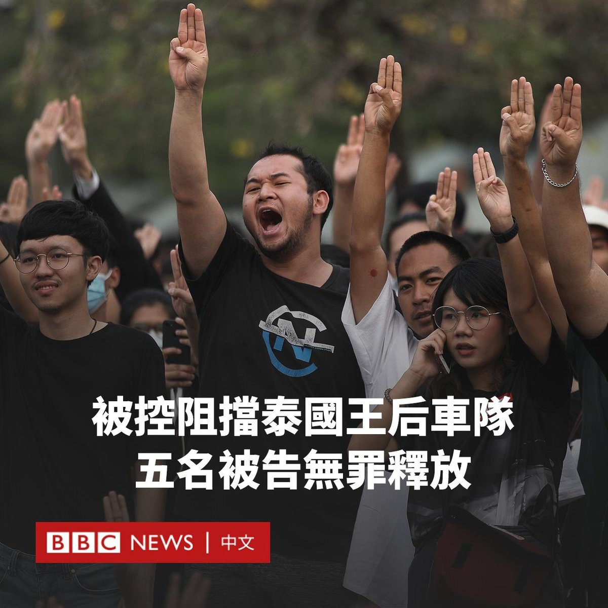
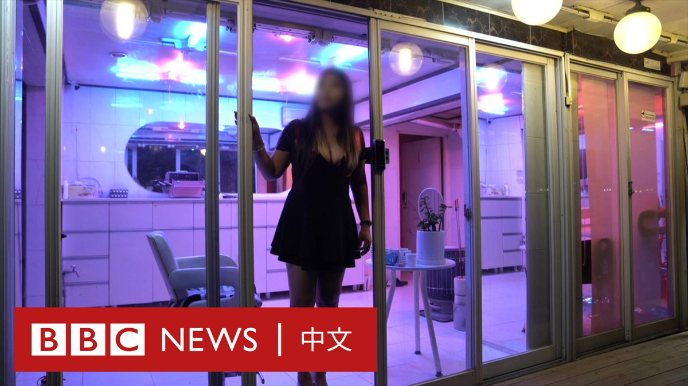

D英国广播公司BBC 北京时间 2023-06-29T17:24:24Z 1674348078566977539 【最新消息】英格兰和威尔士上诉法院推翻了高等法院的裁决，裁定英国政府将寻求庇护者送往卢旺达的计划是非法的。 https://t.co/JCWDxkyYFW   D英国广播公司BBC 北京时间 2023-06-29T17:26:46Z 1674348674745524229 此前报导：https://t.co/6TtlogUirl   D英国广播公司BBC 北京时间 2023-06-29T14:54:15Z 1674310292761870337 在法国警察枪杀一名17岁的司机后，法国多地爆发抗议，截至目前有150人被警方逮捕。

这名遇害的年轻人名为纳赫勒（Nahel），住在巴黎郊区。他周二（6月27日）在拒绝交通执法后，在驾车离开时被警察开枪近距离射杀。有报道称，纳赫勒来自一个阿尔及利亚裔家庭。

从法国总统马克龙（Emmanuel Macron）到足球运动员姆巴佩（Kylian Mbappé）在内的很多名人都谴责了这起杀戮事件。

但对死亡事件的抗议演变为暴力事件，抗议者向警察局和其他建筑物投掷烟花和炸药，并点燃汽车和垃圾箱。人群还似乎闯入里尔郊区的一个市政厅。

法国内政部长达尔马宁（Gérald Darmanin）周四（6月29日）上午表示，已有150人在夜间抗议期间被捕，多处政府建筑被“纵火或袭击”。

爱丽舍宫宣布，在彻夜的骚乱后，法国总统马克龙已召集部分部长召开危机会议。

楠泰尔（Nanterre）议会议员萨布丽娜·塞拜希（Sabrina Sebaihi）对BBC说，她和法国走上街头的人们一样感到愤怒。

“局势仍然非常紧张，人们仍然非常愤怒。我不仅理解，而且我也感到愤怒。”她说道。“这一切已经发生了太多年了。”

路透社汇编的一项统计发现，自2017年以来，法国警察在交通拦截时引发致命枪击的受害者中，大多数是黑人或阿拉伯人。去年有创纪录的13人因不听从交通拦截而死亡。   D英国广播公司BBC 北京时间 2023-06-29T16:00:07Z 1674326866566447105 在有报道称中国驻欧盟使团团长傅聪表示，北京“不反对”乌克兰收回1991年所划定的全部领土的目标，其中包括2014年被吞并的克里米亚半岛后，中国外交部表示，北京的立场是“一贯的”，希望克里米亚问题能通过政治途径解决。https://t.co/CCoK3LglQE   D英国广播公司BBC 北京时间 2023-06-29T13:23:22Z 1674287419183755264 泰国曼谷刑事法院宣判，五名被指控阻挡泰国王后车队的抗议者无罪释放。

此案源于2020年的民主抗议活动，当时载有王后素提达（Suthida）的车队在曼谷与示威者相遇。

法院认为，在车队通过抗议集会时，被告并没有故意阻碍王室车队通行。

泰国宪法规定民众需尊重君主制，冒犯君主和王室者可能被判长期监禁。批评者称，泰国政府利用这项法律打压言论自由，联合国已多次呼吁泰国修改该法律。

这些由年轻人领导的示威活动一直延续到2021年，示威者前所未有地要求当局进行一系列针对王室的改革。

这些抗议者则依据泰国刑法第110条“损害王后、王储或摄政王自由”罪被起诉，该法律禁止对高级王室成员实施暴力，最低刑期也有16年监禁。

检方称，抗议者知道王室车队将经过该地区，故意脱离示威活动封锁车队的路线。

然而，曼谷刑事法院得出结论，由于在该地区有王室车队行驶的信息未公开，抗议者不可能知道。

裁决后，其中一名活动人士接受路透社采访时表示：“我真的很高兴……我们一直在为此而斗争，坚持我们是清白的。”   D英国广播公司BBC 北京时间 2023-06-29T11:36:55Z 1674260633695444993 分析人士认为，现阶段台湾选战各候选人的支持度都是以“负面投票”为主，在蓝绿“被讨厌值”都居高的情况下，柯文哲同时批判蓝绿得到不少支持。但他语出惊人的政治风格也很容易导致选举期间发生较大变数。https://t.co/FTEENkUj5f   D英国广播公司BBC 北京时间 2023-06-29T09:04:49Z 1674222352715116544 自20世纪50年代以来，韩国坡州市的龙珠谷（音译）一直是红灯区。2004年，韩国将性交易定为非法活动后，很多妓院仍在暗中运作。

官方现在正采取多种措施迫使性工作者离开，包括在一些房屋前安装监控设备，这引发性工作者担忧生计。 https://t.co/H4dQTXUgs2   