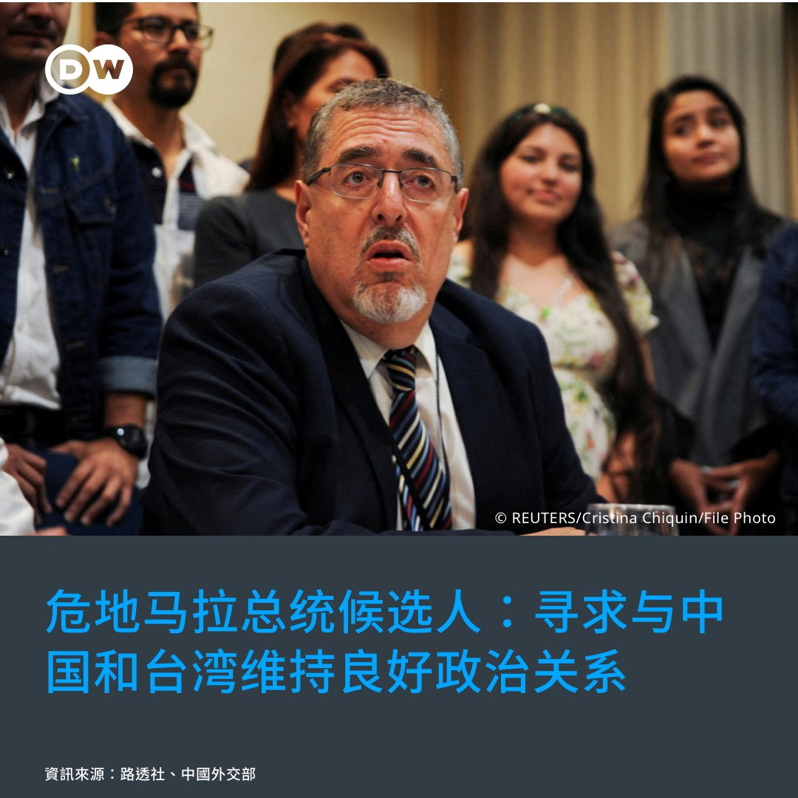
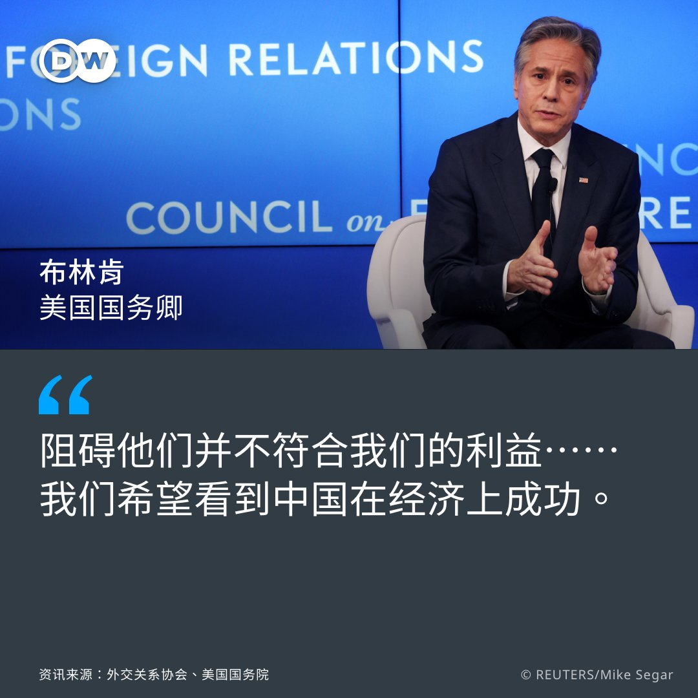

德国之声 北京时间 2023-06-29T13:14:50Z 1674285275231428610 路透社指出，黑利得知中国的回应时进一步表示："如果中国共产党别再输送芬太尼到我们的边境，别再抢劫我们的企业、监视我们、在军事上威胁我们的盟友，那么我们的关系就会更好。"

这番你来我往，谁说得更有道理❓欢迎您留言与我们分享看法👇   德国之声 北京时间 2023-06-29T13:15:12Z 1674285366105309186 关于芬太尼贸易，请看DW的相关报导👇
打击芬太尼 美国制裁中国13个实体与个人
🔗https://t.co/frMgUbuHkG
美起诉涉芬太尼中国公司 中方批钓鱼执法
🔗https://t.co/KrRjR3xJCV

黑利是谁？她在智库说了什么：
共和党竞选人黑利：川普对华太友好 共产中国是敌人
🔗https://t.co/W85s7vcc8c   德国之声 北京时间 2023-06-29T14:12:10Z 1674299702529998849 【危地马拉选边站❓】🇨🇳 🇬🇹 🇹🇼

台湾友邦 #危地马拉 的总统大选25日登场，其中一位候选人阿雷瓦洛（Bernardo Arevalo）出乎各界意料，闯进将于8月举行的第二轮投票。 （下续） https://t.co/v7ETbLrd37   德国之声 北京时间 2023-06-29T14:12:32Z 1674299795236700160 路透社引述当地媒体报导，阿雷瓦洛27日称他若当选，将与 #中国 发展更密切的关系。他认为危地马拉需强化、拓展跟中国的贸易关系，并盼能"在相互尊重的框架下，跟中国及台湾维持良好的政治关系"。 （下续）   德国之声 北京时间 2023-06-29T14:13:13Z 1674299964594307075 #台湾 外交部回应，将持续向危地马拉候选人说明双方合作成果，并"积极争取2位候选人支持危地马拉和台湾之间的友谊传统"。

#中国 外交部发言人毛宁28日则重申"一个中国原则"是"大势所趋"，"相信会有更多国家选择站在历史正确一边"。   德国之声 北京时间 2023-06-29T12:00:53Z 1674266663087140864 【布林肯：遏制中国，不符合美国利益】🇨🇳 🇺🇸
详细报导👉https://t.co/uNczjaBC8Y

美国国务卿布林肯（Antony Blinken）6月中旬出访中国，28日他出席智库外交关系协会（CFR）讲座，回顾了他当时与北京谈的议题。 （下续） https://t.co/lk4fShD55H   德国之声 北京时间 2023-06-29T12:01:14Z 1674266752228765699 #美中关系：布林肯说，虽然中国认为美国的目的是"遏制"他们、与他们脱钩，但事实并非如此。他说，美国"希望看到中国在经济上真的成功"，这符合美国的利益。 （下续）   德国之声 北京时间 2023-06-29T12:01:34Z 1674266834395176960 #台湾 🇹🇼：布林肯重申美国的"一中政策"不变，主张两岸分歧以和平方式解决，反对任何一方片面改变现状。他表示，《台湾关系法》一直确保美国可以用必要手段协助台湾自卫。 （下续）   德国之声 北京时间 2023-06-29T12:02:01Z 1674266949461655555 #俄乌战争 🇷🇺 🇺🇦：布林肯表示，希望中国在谈判中扮演具建设性的角色，发挥对俄国的影响力；但同时，也要避免中国"火上浇油"，例如提供致命武器给俄国。

您怎么看待布林肯的说法❓欢迎留言与我们分享👇   德国之声 北京时间 2023-06-29T10:10:35Z 1674238903442866176 #美国 国务院亚太助卿康达28日表示，提到了明年1月的 #台湾 #总统大选，他呼吁各方应负责任地行事。谈及 #印度，他则表示美国将强化与印度的合作。他还说了什么？
https://t.co/uNczjaC9Yw   德国之声 北京时间 2023-06-29T07:25:00Z 1674197233531777027 据《华尔街日报》周二（6月27日）报道，美国政府正在考虑进一步收紧向中国出口先进 #芯片 的限制。

去年9月，#英伟达 称美政府要求其停止向中国出口两款用于人工智能的最先进芯片。拜登政府于10月公布了一系列新的出口限制措施，其中涉及半导体领域。

https://t.co/bGpzXlVdr0   德国之声 北京时间 2023-06-29T09:33:00Z 1674229446012706816 瓦格纳的叛变，给中国带来怎样的警示？　https://t.co/RPtNMeKdHf   