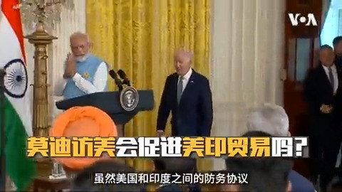
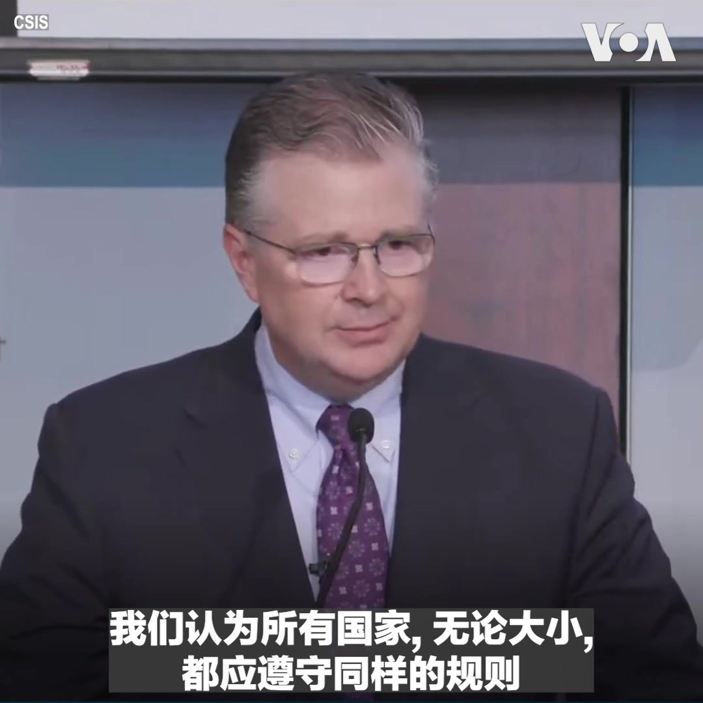
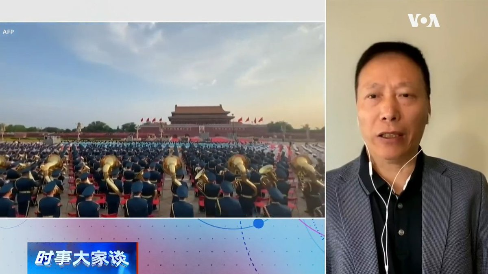
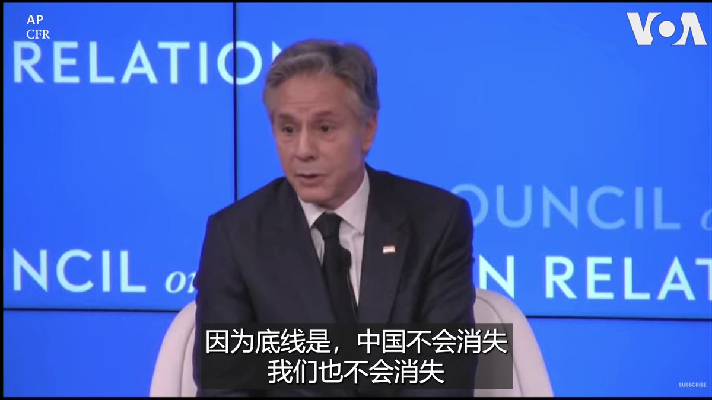
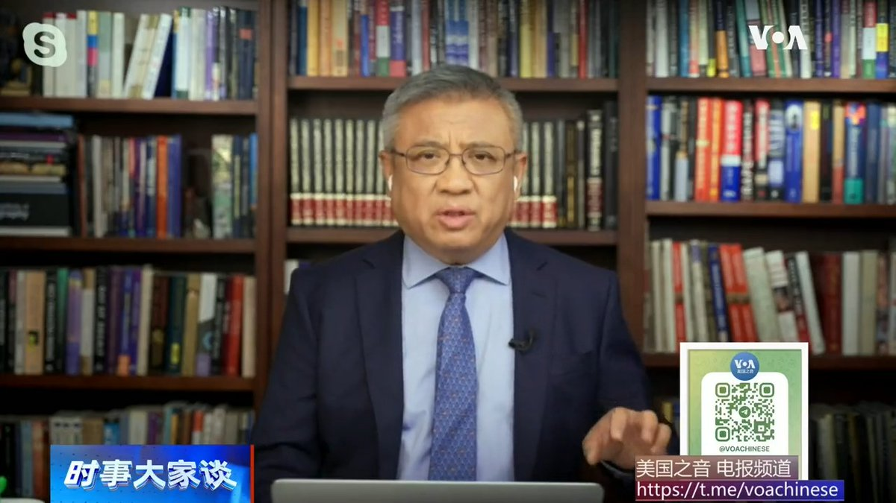
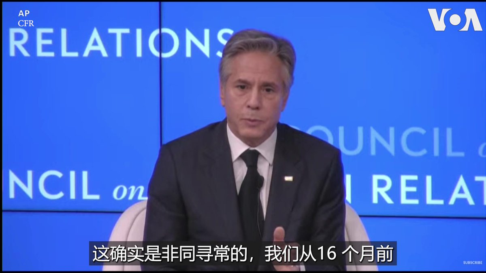

美国之音中文网 北京时间 2023-06-29T14:31:35Z 1674304586843295744 行程尚未敲定 美国财长耶伦盼“与中国重建联系” https://t.co/uhBatXP9GB   美国之音中文网 北京时间 2023-06-29T14:45:02Z 1674307974167420928 增进人员互动 美中将分阶段恢复商业航班 https://t.co/ReMT0ej016   美国之音中文网 北京时间 2023-06-29T15:48:34Z 1674323959503028225 中国电商货品免税大量涌入美国 国会议员们找邮局协助调查 https://t.co/5MQp1EVnuh   美国之音中文网 北京时间 2023-06-29T11:06:03Z 1674252865517547520 分析：越南总理访中同时美航母抵越 “并非巧合” https://t.co/VIdOMXuIze   美国之音中文网 北京时间 2023-06-29T10:05:33Z 1674237636905668608 美国人对经济悲观，总统宣扬“拜登经济学” https://t.co/WzJyfm9KXC   美国之音中文网 北京时间 2023-06-29T10:19:00Z 1674241022430441472 美国是印度最大的贸易伙伴，两国之间的贸易总额在2022年达到1,910亿美元。随着两国关系日益密切，美国之音记者克里斯·卡斯奎霍 (Chris Casquejo) 带您展望促进美印贸易的前景。 https://t.co/cQ3lLICjHr   美国之音中文网 北京时间 2023-06-29T06:38:00Z 1674185405585924096 中国将于7月1日起施行修订后的反间谍法，扩大有关间谍行为的定义。美国国务院副发言人帕特尔6月28日在例行记者会上回答媒体提问时说，美国正在密切关注该法落实后的影响。 https://t.co/p6yf5AlkkC   美国之音中文网 北京时间 2023-06-29T07:00:01Z 1674190947410903040 中国总理李强在夏季达沃斯论坛上批评“去风险”是伪命题，事实如何？北京反对“将经贸问题政治化”，还说“要让企业自己做决定”，是否想对西方企业与政府分而治之？此外，中国审计署公布2022年度财政审计报告，暴露了地方财政的哪些黑幕？6/29时事大家谈将讨论这些问题，请留言参与。 https://t.co/eh2779eBlL   美国之音中文网 北京时间 2023-06-29T07:01:09Z 1674191231944134657 中国在缅甸的网络犯罪集团现在以全球受害者为目标 https://t.co/Amw4Z5iBgE   美国之音中文网 北京时间 2023-06-29T07:01:11Z 1674191240953491458 沙特通讯社：美国领事馆附近爆发枪战，一名持枪男子被打死 https://t.co/hGvlBqBl6C   美国之音中文网 北京时间 2023-06-29T07:08:00Z 1674192955362656258 “我们看到中国在南中国海采取越来越多的胁迫行为，包括试图行使其扩张性和非法的海洋主张，”美国国务院亚太助卿康达(Danile Kritenbrink)周三在战略与国际研究中心举办的南中国海会议上说。康达强调，美国的政策是支持各国行使主权追求国家利益，无论大国小国都需遵守同样规则，大国不应欺凌小国。 https://t.co/nos07PZ4SL   美国之音中文网 北京时间 2023-06-29T08:09:43Z 1674208489806364672 “这是幅移动的画面。我们还没看到最后一幕，”美国务卿布林肯6月28日在一座谈会上谈到瓦格纳兵变时说。但他认为这概括普京入侵乌克兰的全面失败。他说，16 个月前，俄军在基辅郊区，以为可轻易地把乌克兰从地图上抹去，16个月后，我们看到普京自己的雇佣军向莫斯科挺进，“这真的是非同寻常，”布林肯说。 https://t.co/eATZ13VIhU   美国之音中文网 北京时间 2023-06-29T08:15:04Z 1674209835427188736 布林肯：美国寻求与中国和平共处 https://t.co/hdOqgyf9lz   美国之音中文网 北京时间 2023-06-29T08:47:34Z 1674218011358818304 乌克兰逮捕一名被控指引俄军空袭克拉马托尔斯克披萨餐厅的男子 https://t.co/feAA1cEW6W   美国之音中文网 北京时间 2023-06-29T08:47:35Z 1674218018925314048 美众院军委会访台与总统蔡英文会面 罗杰斯：国会对台支持坚定不移 https://t.co/akXN3cDu6C   美国之音中文网 北京时间 2023-06-29T09:00:01Z 1674221145254658048 一键解锁#美国热搜 榜 1、习近平打琉球牌 图谋冲绳 2、地方政府卖地造假800亿3、拜登戒掉中国瘾 4、2027李强取代习近平 5、习近平是中国最热畅销书作家 6、外语教材成外宣教材 7、钟南山脸颊上的口红8、轮椅上的忠字舞 9、千人桌面操 https://t.co/ev97gE5uy8 https://t.co/mYsOS7srag   美国之音中文网 北京时间 2023-06-29T09:19:03Z 1674225936798208000 民调：64%有可能投票的美国人认为美国应该正式承认台湾 https://t.co/cEQbfxFBBU   美国之音中文网 北京时间 2023-06-29T09:21:00Z 1674226425983819779 中国拟订全世界第一部爱国主义教育法。专栏作家蔡慎坤说，习通过修宪获得第三届连任后，经济下行冲击中共统治合法性的基础，民众的信任危机对他有巨大杀伤力，爱国主义和民族主义是他拿得出手的一个洗脑题材。 #完整版：  https://t.co/Po8xEFsfme https://t.co/XDKhPFUCR2   美国之音中文网 北京时间 2023-06-29T09:49:02Z 1674233482271395841 美国期待与印度在南中国海开展更多合作 https://t.co/nPfcmCNsQJ   美国之音中文网 北京时间 2023-06-29T04:38:14Z 1674155264667426818 “你如何定义成功？美国对华政策的现实目标究竟是什么？”美国著名智库外交关系协会会长哈斯周四在一座谈会上问美国国务卿布林肯。布林肯说，至少在短期内，美国对华政策没有一个终点线。“更多是达到我们能和平共处、也许一个更有成效的共处。因为底线是，中国不会消失。我们也不会消失，”他说。 https://t.co/H3sZTSUcvU   美国之音中文网 北京时间 2023-06-29T05:13:00Z 1674164014694408192 中国拟订以“习思想”为指导的爱国主义教育法。时政评论人横河说，爱国主义和马列主义是相矛盾的，马列主义是全世界共产，工人阶级是无祖国的，这表明中共意识形态已经破产，习只能用爱国主义来维持统治。 #完整版： https://t.co/Po8xEFsNbM https://t.co/57SWY0lEMr   美国之音中文网 北京时间 2023-06-29T05:14:08Z 1674164299592523776 拜登:普京“绝对”因为瓦格纳兵变而被削弱 https://t.co/Gi2yXKMBCP   美国之音中文网 北京时间 2023-06-29T05:26:33Z 1674167427221843968 美国中西部和东岸烟雾弥漫 空气质量恶化 https://t.co/ZuQTr5t3K7   美国之音中文网 北京时间 2023-06-29T06:03:48Z 1674176799780249600 多名中港艺术家在伦敦举办主题为“被北京禁止”的展览，展出目前在中国和港难以展出的政治艺术作品。澳大利亚华裔艺术家巴丢草是参展者之一。他过去的展览屡遭中共阻挠，但他说这种威胁一定程度上成为创作的材料。他说，艺术家追求自由，中共则将敢于自由表达的艺术家视为威胁。https://t.co/6KrVNVANFE https://t.co/wUYuQikbWr   美国之音中文网 北京时间 2023-06-29T06:09:12Z 1674178160005640192 “你如何定义成功？美国对华政策的现实目标究竟是什么？”美国著名智库外交关系协会会长哈斯周四在一座谈会上问美国国务卿布林肯。布林肯说，至少在短期内，美国对华政策没有一个终点线。“更多是达到我们能和平共处、也许一个更有成效的共处。因为底线是，中国不会消失。我们也不会消失，”他说。 https://t.co/EqYbIPtxEV   美国之音中文网 北京时间 2023-06-29T03:13:36Z 1674133968621555712 英国举行“被北京禁止”展览 中港艺术家以作品挑战政权 https://t.co/sGGQG0qoAX   美国之音中文网 北京时间 2023-06-29T01:27:33Z 1674107279728312320 法国外长访问蒙古，续推两国价值十亿欧元铀矿开采交易 https://t.co/COl7ZI3dx5   美国之音中文网 北京时间 2023-06-29T01:35:11Z 1674109202145640449 美联社获得的一份销售数据显示，自2020年美国政府禁止香味电子烟产品以来，在美国销售的各种电子烟增加到9000多种，增长近两倍。这种增长几乎完全受到来自中国的非法一次性电子烟的驱动。报道：https://t.co/QAeV7yMdtp https://t.co/lPPSSefk5O   美国之音中文网 北京时间 2023-06-29T01:44:04Z 1674111437504126977 林培瑞：“孔乙己文学”真能深刻说明中国当前问题？ https://t.co/ddYaBnMyIk   美国之音中文网 北京时间 2023-06-29T01:44:06Z 1674111446366699520 美国最新民调：瓦格纳兵变促使更多美国人支持军援乌克兰 https://t.co/PSk7xZeYxV   美国之音中文网 北京时间 2023-06-29T00:15:03Z 1674089035395125248 就中国经济发声被指炒作，“最赚钱财经作家”吴晓波遭噤声 https://t.co/wSjLYQ843A   