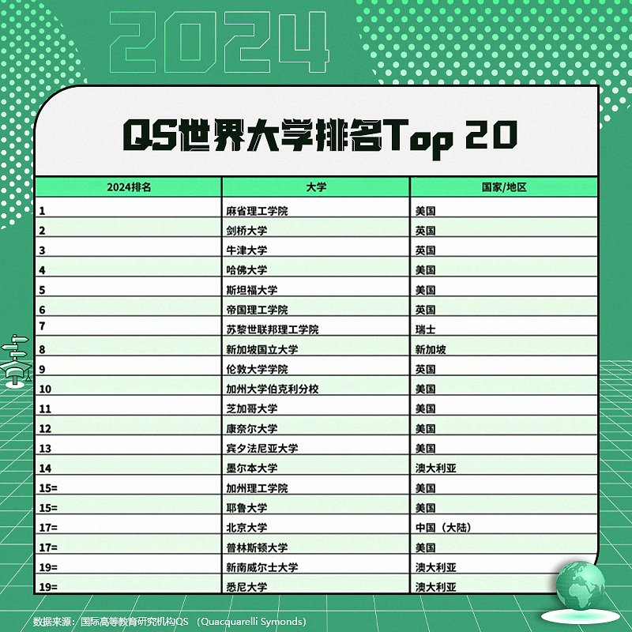
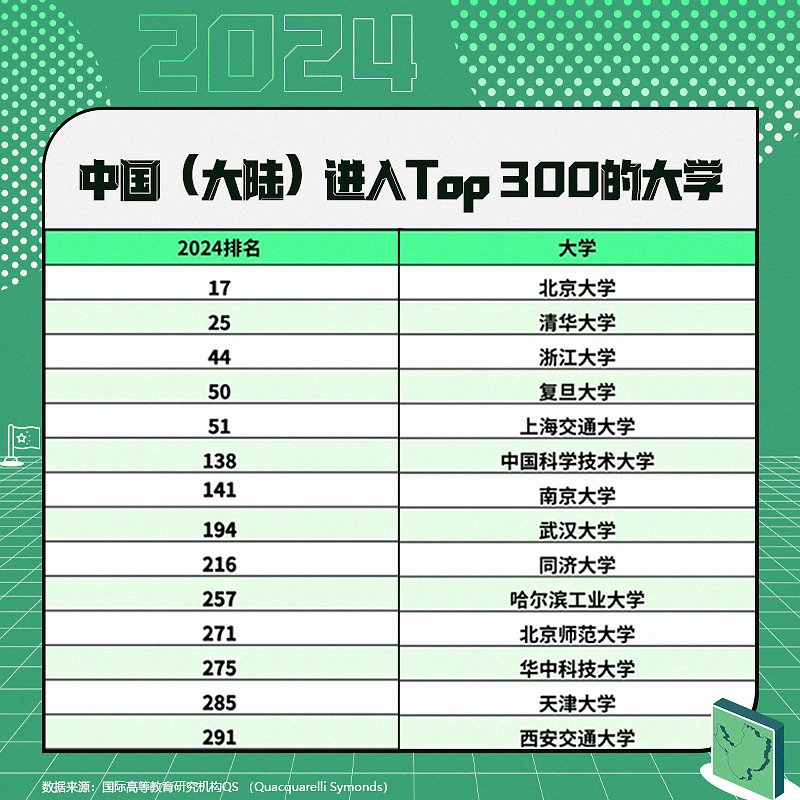

自由亚洲电台 北京时间 2023-06-29T04:36:07Z 1674154733936975878 著名旅美华裔作家 #严歌苓 因为谴责中国政府对新冠疫情处理不当，并呼吁关注铁链女事件，于去年遭到中国政府的封杀。今年六月，她通过自己在德国柏林成立的出版机构出版了她最新的中文小说《#米拉蒂》。本台记者王允 @Jeff23Wang 就此对严歌苓进行了专访。

https://t.co/uRExHLoisb   自由亚洲电台 北京时间 2023-06-29T05:18:26Z 1674165383396495362 近日，有中国网友表示，在目前通行的2020年出版的第12版《#新华字典》中没有看到"#倭寇"这个词，这表明这一词汇已被删除。尽管有中国官媒对此进行了辟谣，但在中国的互联网上，仍有不少针对此事的极端民族主义声音。为什么会这样？

https://t.co/IKBDQ4PyPU   自由亚洲电台 北京时间 2023-06-29T05:19:20Z 1674165610979430401 专栏 | #网络博弈：#泽连斯基 发核爆警告　#华人乌克兰志愿者 最担心什么
https://t.co/xw6Ys5HIwb   自由亚洲电台 北京时间 2023-06-29T05:30:31Z 1674168422874116096 【QS世界大学排名大洗牌！】
国际高等教育研究机构QS （Quacquarelli Symonds）今日正式发布第20版世界大学排名。这次排名方法进行了有史以来最大化调整，引入了3项全新指标：可持续发展、就业成果和国际研究网络。并重新校准学术声誉、雇主声誉和师生比等已有指标的权重。
麻省理工、剑桥、牛津位列前三，北京大学与普林斯顿并列17，清华大学位列第25。
你觉得这个排名靠谱吗？你的学校上榜了吗？   自由亚洲电台 北京时间 2023-06-29T05:49:28Z 1674173194893156353 美国、中国，谁是世界第一经济强国？6月27日，皮尤发布一份新调查报告显示，在其调查的全球23个国家当中，中位数为41%的民众站美国，33%受访者选中国。您认为，谁才是世界领先的经济大国？ https://t.co/j7XwjfdZMB   自由亚洲电台 北京时间 2023-06-29T05:50:26Z 1674173438070538242 周二，正在角逐共和党总统候选人提名的美国前驻联合国大使黑利阐明她的对华政策： https://t.co/htXlvZSIG0   自由亚洲电台 北京时间 2023-06-29T06:00:03Z 1674175857789911040 香港移民 #邹至蕙 当选加拿大第一大城市 #多伦多市长，成为多伦多首位少数族裔市长。邹至蕙之前曾多次公开表态支持 #香港民主 并声援 #六四。尽管在选举期间她曾被指参与亲中团体的活动，但邹至蕙在当选后的记者会上关切那些在香港被捕的民主派人士，也坚持捍卫民主价值。

https://t.co/ThdEXuoIFA   自由亚洲电台 北京时间 2023-06-29T04:00:07Z 1674145675116945417 美国国务卿 #布林肯（Antony Blinken）周三在一场研讨会上重申 #美国对华政策 以及对台立场，并表示中国经济发展符合美国利益。
https://t.co/iSQefjWfTe   自由亚洲电台 北京时间 2023-06-29T04:09:14Z 1674147970458198022 中国驻欧外交官 #傅聪 日前公开支持乌克兰收复包括 #克里米亚 在内的被俄吞并领土，这是影射 #台湾，还是 #中俄联盟 出现动摇？
https://t.co/xcwCI3OCfV   自由亚洲电台 北京时间 2023-06-29T00:45:25Z 1674096677563805696 #巴丢草 说：“可能更多的香港人，特别是年轻的人会选择离开他们的故乡，但这并不代表香港的殒落。因为我始终觉得，一个人的故乡会跟随他。即便这么多香港人在流亡的状态，但他们来到，等于把香港的精神、文化，以及自我的认同也带过来。”
https://t.co/sj8raOyNjA   自由亚洲电台 北京时间 2023-06-29T01:29:06Z 1674107667697270784 两艘 #俄罗斯军舰 罕见地由南向北经过 #台湾 东部海域，据民间监测，军舰距台外海仅26浬。有分析认为，俄军舰应是参加军演返程，针对日本政治意味较浓，但也突显台日国安具连动性。

https://t.co/blLmugsgID   自由亚洲电台 北京时间 2023-06-29T01:51:27Z 1674113293630468097 #事实查核｜美媒证实 #瓦格纳 拿 #美国中情局 62亿美元？
https://t.co/AcerunNZe1   自由亚洲电台 北京时间 2023-06-29T02:01:54Z 1674115923270324224 根据美国《华尔街日报》星期四报道，知情人士透露，美国商务部可能最快在下月初采取行动，禁止 #英伟达 和其他芯片制造商在未获得许可证的情况下，向中国和其他重点国家出口 #芯片。

https://t.co/0AeNKg0sIh   自由亚洲电台 北京时间 2023-06-29T02:06:21Z 1674117044072251392 美国联邦众议院军事委员会主席 #罗杰斯 等九名跨党派国会议员访台，#台湾 外交部表示，这是近年最大规模 #美国会议员访台。#蔡英文 总统会见访团表示，会持续跟美国携手合作守护印太区域的和平跟稳定。罗杰斯则表示，台美共通价值令双方深化友谊，对台湾的支持坚定不移。

https://t.co/X9ca1uLWGd   