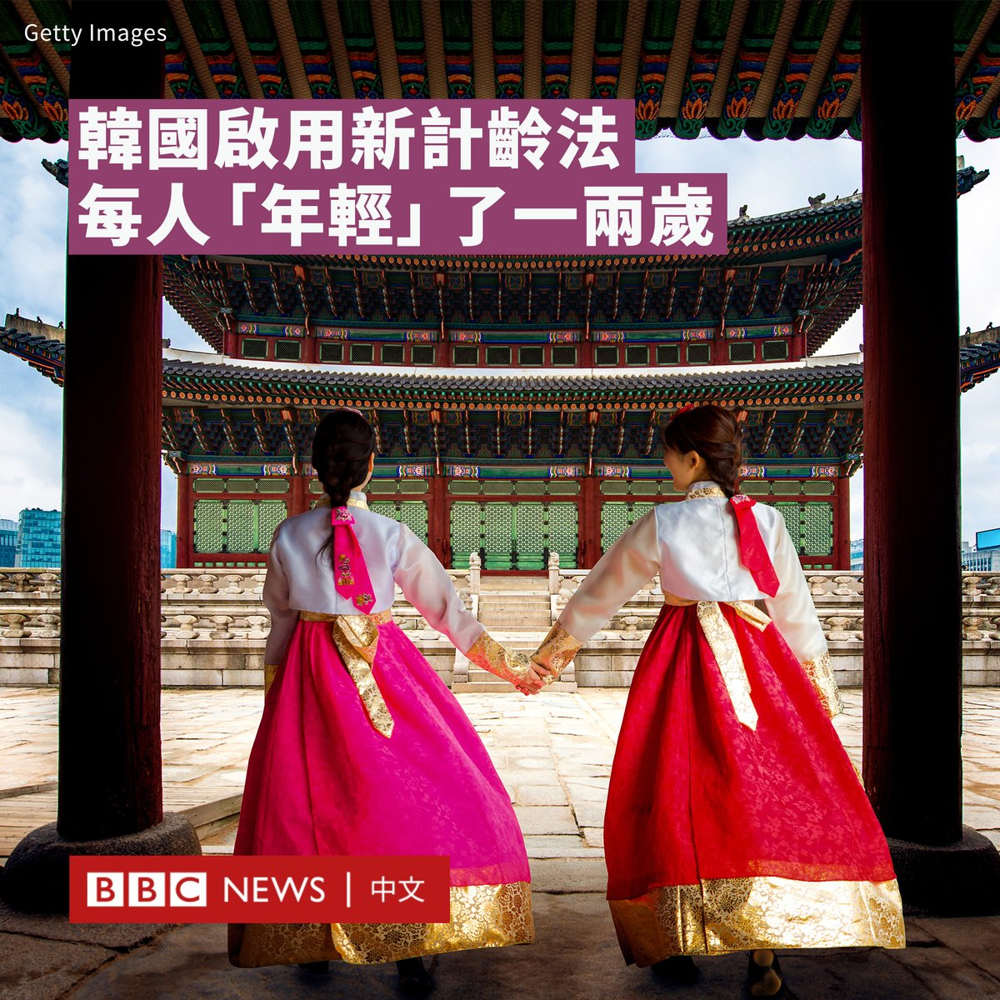
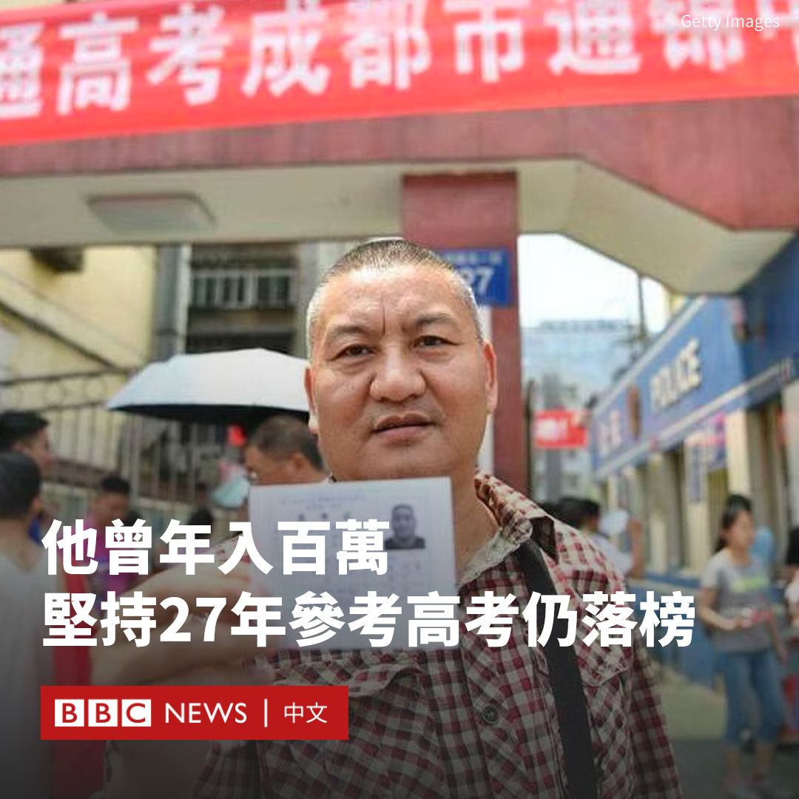

D英国广播公司BBC 北京时间 2023-06-28T20:15:38Z 1674028784033595392 一名游客因在意大利古罗马竞技场遗址的墙上刻下名字，引发该国民众愤怒。警方称，正在调查该事件。

据报道，这名游客的行为被其他人拍摄下来，拍摄者在口头上训斥了这名男子，并把影片交给了安保人员。

影片显示，一名男子用锁匙在罗马斗兽场砖墙上刻上名字“Ivan + Hayley 23”，他旁边有一名女子，尚不清楚他们的关系。

当拍摄者对他进行指责时，该名男子报以微笑回应。

罗马斗兽场建于古典时代的罗马帝国，至今已有将近两千年的历史，是意大利最受欢迎的旅游景点。

意大利文化部长圣朱利亚诺（Gennaro Sangiuliano）发声明谴责该行为，指其是“非常恶劣、不道德和极不文明的行为”，希望能够找出相关人士，根据意大利的法律惩处。

意大利媒体表示，警方正调查事件，若被定罪可被罚款15,000欧元以及监禁5年。   D英国广播公司BBC 北京时间 2023-06-28T16:50:34Z 1673977178239926272 韩国周三（6月28日）开始废除该国传统的虚岁计龄法，将与国际通用的周岁计龄法对齐，这让该国国民变得“年轻”了一两岁。

在韩国，当一名婴儿出生时，他们被认为是一岁。到了新年，他们又增加了一岁。这意味着一名在12月出生的婴儿在短短几周内，就会被认为是两岁了。

虚岁计龄法的传统起源于中国和亚洲其他地区。但韩国被认为是唯一仍普遍以这种方式计算年龄的国家。

新上任的总统尹锡悦是这一改变的推动者。他表示，不统一的年龄计算方法造成了“不必要的社会和经济成本”，例如，基于年龄的保险赔付和养老金资格引发纠纷。

根据韩国当地一间研究所在2022年进行的一项调查，四分之三的韩国人赞成这一改变。

韩国法制处表示，将于周三正式实施周岁计龄法，若无法律上特别规定，当天起行政和民事上的年龄均按周岁计算，法令、合同、公文中标注的年龄均以周岁为准。

据报导，烟酒类购买、强制性兵役和入学的法定年龄仍将保持不变。   D英国广播公司BBC 北京时间 2023-06-28T17:02:02Z 1673980060687286273 此前报道：https://t.co/NamAUc4ST6   D英国广播公司BBC 北京时间 2023-06-28T18:00:57Z 1673994888801665024 从2021年起，中国最大的“骄傲”活动就一直处于暂停状态，显示近年LGBT群体在这个国家的活动越发困难。https://t.co/8mn3ex2mzp   D英国广播公司BBC 北京时间 2023-06-28T14:56:46Z 1673948537288278016 “我们（与普里戈津）主要用脏话交谈。后来我突然想到，脏话比正常词语多了十倍。”

有关结束瓦格纳兵变的谈判的新细节浮出水面。克里姆林宫的盟友、白俄罗斯总统卢卡申科（Alexander Lukashenko）周二（6月27日）描述了在瓦格纳雇佣军向莫斯科进军时，他与普京和普里戈津进行的电话交谈。

他称，他曾劝说普京不要杀死普里戈津，并表示“糟糕的和平也比任何战争都好”。他表示，自己随后给普里戈津打电话，警告他如果继续前进，会像“一只虫子一样被辗碎”。   D英国广播公司BBC 北京时间 2023-06-28T13:00:11Z 1673919197599117312 这是来自中国四川的一位百万富翁追求成为“知识分子”📖的故事，他已经连续第27次参加高考，但都名落孙山。

上周，56岁的梁实在四川省满分750分的高考中，获得424分，这个分数比该省大学本科的分数线低了34分。

自1983年以来，梁实参加了二十多次考试，他向中国媒体“潮新闻”表示，他对今年的成绩感到失望，不知道他是否能实现自己的梦想。

“成绩出来了，非常不理想，在考虑要不要继续考。”他说道。“感觉投入和产出不成正比。”

高考是众所周知的难度高，测试高中毕业生的语文、数学、英语以及他们选择的科学或人文学科。考试结果将决定他们能否被大学录取。

中国政府数据显示，2021年有41.6%的考生被大学或学院录取。

在一个被认为学历是获得好工作必要条件的社会里，高考被视为一个决定性的机会，特别是对于那些出身寒门的人。

对于梁实说，他一直梦想被名校录取并成为一名“知识分子”。

在他16岁参加第一次高考失败后，他做了不同的工作，但仍然坚持每年都申请高考，直到1992年，年龄超出了限制。

其后，他在90年代中期开始做木材批发生意，成为商人，在一年内赚了一百万元，然后开始了建材生意。

但是，当中国政府在2001年取消了高考的年龄限制后，他又开始了他的考试之旅。今年6月7日，他再次前往考场参加高考。

被网友称为“高考最牛钉子户”的他，戒掉了喝酒和打麻将，专注于学习，但结果仍然不如人意。

梁实表示，这次与以往不同，他开始感到失败并想放弃，他说：“我内心开始摇摆了，如果一直看不到希望，还不如每天喝喝盖碗茶呢。”   D英国广播公司BBC 北京时间 2023-06-28T11:27:36Z 1673895897359343621 在BBC总部一个演播室内，一位员工坐在他的笔记本电脑前。数千英里外，一位黑客在看着他打的每一个字。

然后，这名员工拿起手机输入密码，现在黑客也把它记下来了。

BBC《广角镜》栏目在两个中国监控摄像头品牌身上发现多项保安漏洞，而其产品在英国和世界各地得到广泛采用。
https://t.co/baPyXPxo9N   D英国广播公司BBC 北京时间 2023-06-28T09:52:58Z 1673872083489804289 Voguing是一种起源于与20世纪中期纽约的舞蹈形式，之后因为深受性少数群体（LGBTQ）的欢迎而被更多人认识。

在中国，由于性少数议题与传统和官方宣传的价值观不符，近年一些运营多年的彩虹公益团体纷纷解散，而与性少数文化关系密切的Voguing舞团只能低调举办舞会。 https://t.co/HfNFY0HlLR   