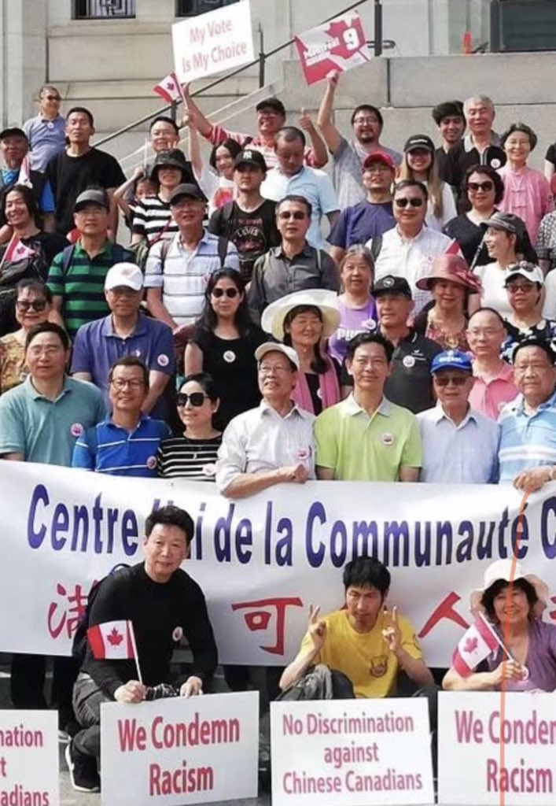
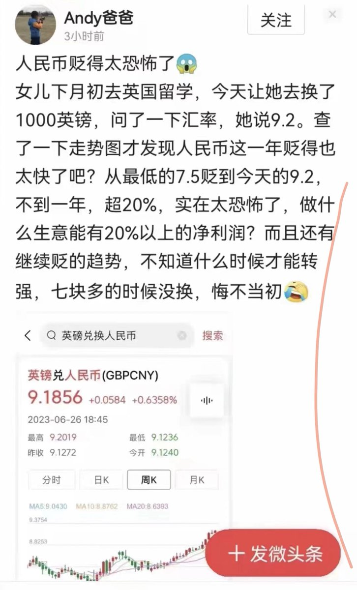

Petrichor 北京时间 2023-06-28T07:24:11Z 1673834639276793856 大学时代潘光旦因跳高摔断了腿，后来感染截肢，每次检讨，他都要“金鸡独立”四个小时。1952年2月初，《光明日报》分两次刊登潘光旦的长篇检讨：《我为何仇美仇不起来》；12月5日出版的《盟讯》发表了潘的第四次检讨，仅摘要就将近3万字。   Petrichor 北京时间 2023-06-28T07:24:38Z 1673834753844191233 辅仁大学校长陈垣在《光明日报》上做了长篇自我检讨，批判自己出于“个人利益”，“二三十年来，做了帝国主义的俘虏，忠实地替帝国主义者奴役和麻醉青年，帝国主义就通过我，稳扎稳打在学校里做着太上皇”。   Petrichor 北京时间 2023-06-28T07:27:32Z 1673835483518869507 批斗陆志韦最积极的是他女儿陆瑶华，她是党员。会上批判父亲是一个“彻头彻尾的帝国主义的爪牙，是忠心执行美国文化侵略的工具”，父亲的“几滴眼泪不能收买她的良心”，她会“像志愿军和美帝国主义战斗一样，坚决地斗争陆志韦。”陆志韦的儿子陆卓明在批判会上保持了沉默，因此于1953年被开除出青年团。   Petrichor 北京时间 2023-06-28T07:45:42Z 1673840057189376000 6月24日一些华人到加拿大国会山举行反歧视和外国代理人注册法活动。6月26日就出现华人邹至蕙当选为加拿大最大城市多伦多的市长，说明加拿大根本不存在华裔恐惧症，不存在被别有用心放大宣扬的排华危险，更没有污名化华人社区及对华裔从政人士的围剿。只要承认加拿大价值和遵纪守法都会活得好好的。 https://t.co/uHf05Xysqx   Petrichor 北京时间 2023-06-28T07:48:22Z 1673840729230045184 打脸来得太快，两边通吃的人，不自在了。   Petrichor 北京时间 2023-06-28T01:21:55Z 1673743475680985103 人民选择了他，那么就得为自己的选择买单。 https://t.co/aH5VT4afZU   Petrichor 北京时间 2023-06-28T01:34:08Z 1673746548990042116 马克思主义学院毕业生都该要饭去，他们学的东西没用？ https://t.co/YA7vIn8Ok7   