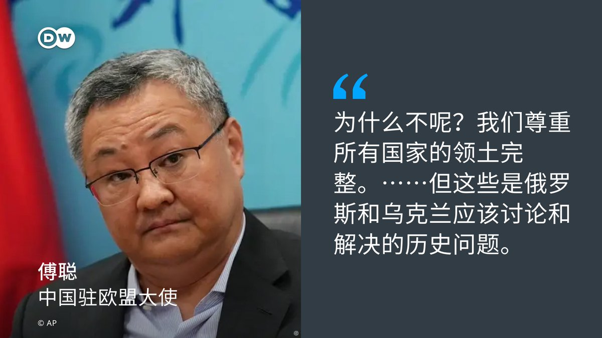
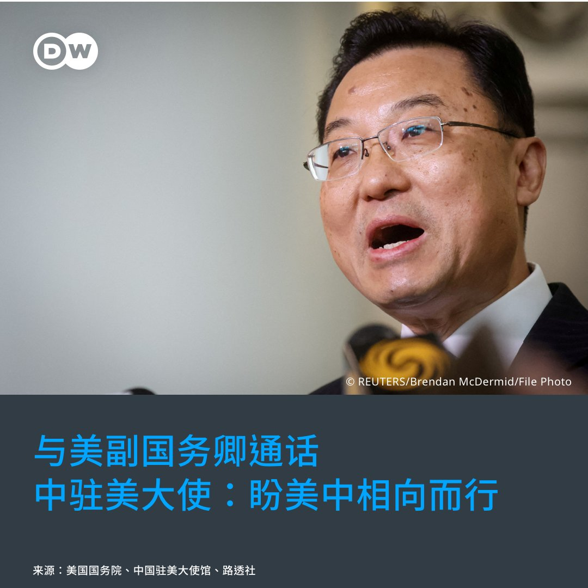
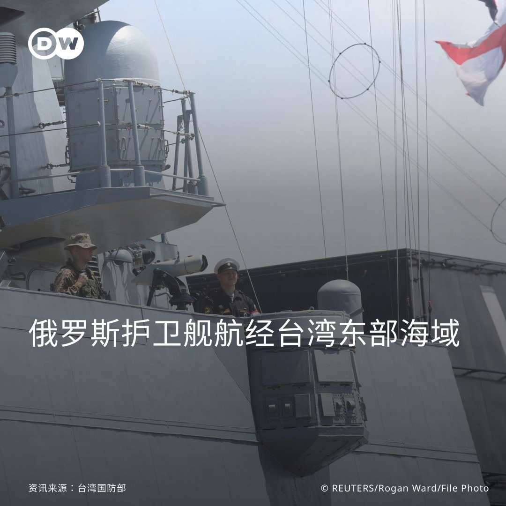
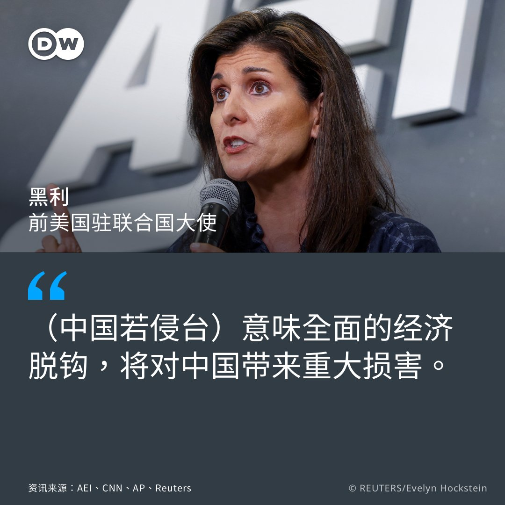
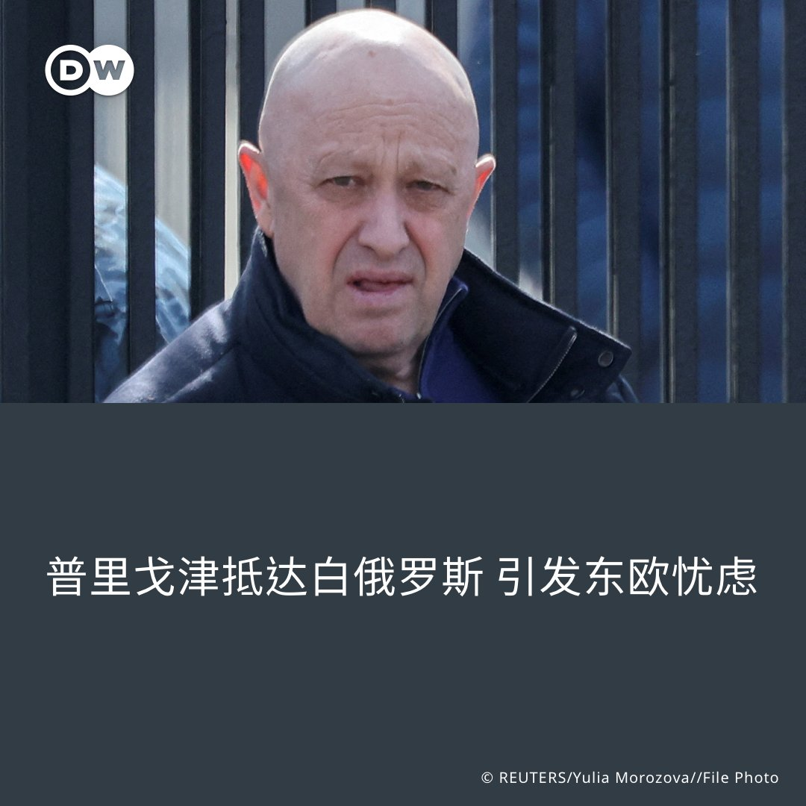
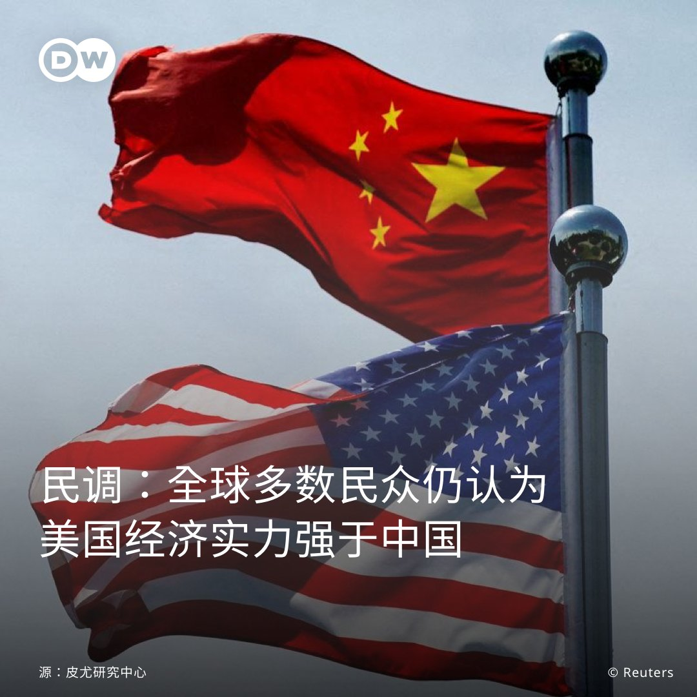

德国之声 北京时间 2023-06-28T22:24:28Z 1674061204841480200 据 #白俄罗斯 总统说法，瓦格纳集团首领 #普里戈津 已抵达白俄。对此，白俄罗斯反对派认为这对当地社会稳定构成威胁，波兰、立陶宛等国也发出警告。卢卡申科还表示，是他劝说 #普京 不要杀掉普里戈津，“把目光👀放远一点”。

https://t.co/EuvHOMecEt   德国之声 北京时间 2023-06-28T23:25:00Z 1674076437848940546 随著俄罗斯发生动荡🌊，#中俄友谊 会不会出现裂痕？《商报》对此作出了分析。《新苏黎世报》则关注了中国新的 #安全法规 让外资对中国市场望而却步。

https://t.co/3jh4JhLyW4   德国之声 北京时间 2023-06-28T21:09:00Z 1674042212173197316 #加强北约东翼力量 德宣布派兵常驻立陶宛
德国🇩🇪决定在 #立陶宛 部署4000常驻士兵，以加强 #北约 东部防御。此前，立陶宛总统曾多次呼吁北约加强在该国的存在。德国防长表示，德国有责任保护北约东翼。 https://t.co/v78wkxWWRx   德国之声 北京时间 2023-06-28T18:47:50Z 1674006689501028352 详情报导：https://t.co/W85s7vcc8c   德国之声 北京时间 2023-06-28T18:55:00Z 1674008489939566595 👱🏻‍♀️👗💄
你想像过芭比娃娃一样生活吗？ 🏠
美国加州有真实版的芭比娃娃屋，7月开放入住！
#芭比娃娃 #芭比娃娃屋 #barbie #barbieandken https://t.co/3xL8AEkTTx   德国之声 北京时间 2023-06-28T19:34:00Z 1674018304833486849 傅聪在被问到中国🇨🇳是否支持乌克兰收复 #克里米亚半岛 在内的被侵占领土时说：“为什么不呢？我们尊重所有国家的领土完整。……但这些是俄罗斯🇷🇺 和乌克兰🇺🇦 应该讨论和解决的历史问题，这就是我们的立场。”

详情报导：https://t.co/e797zrYRMO https://t.co/C2RDB5gmDh   德国之声 北京时间 2023-06-28T20:20:00Z 1674029880865099777 中国🇨🇳总理李强强调今年有望实现5%的 #增长目标。德国GIGA亚洲研究所舒勒（Margot Schüller）博士认为，中国有巨大的 #国内市场，与此同时对国外的依赖没有那么强，如果能成功推动国内经济领域增长，并且不重复过去旧的投资模式，那的确是有可能实现的。

https://t.co/OrnwfX9rEY   德国之声 北京时间 2023-06-28T16:31:00Z 1673972251220226049 一名前三星高管涉嫌为 #富士康 在中国开设芯片工厂窃取商业机密而受到起诉。曝光的违法细节包括挖走人才，被告律师反驳了指控，认为被告是 #韩国🇰🇷 卷入中美竞争的替罪羊。

https://t.co/0s7nlWCCtr   德国之声 北京时间 2023-06-28T17:17:00Z 1673983827356557312 #空中计程车🚖有望明年实现？你会选择用这种方式出行吗  空中计程车有可能明年就能成为现实，一些公司已经跃跃欲试，不过这个高科技理念想要成为现实，仍然面临着一系列挑战 #dwdigital #flyingcars https://t.co/EbavSarNQh   德国之声 北京时间 2023-06-28T18:11:00Z 1673997417115709441 时评人邓聿文指出，可以被看作普京 #白手套 的 #普里戈津 在这次兵变中付出了惨重代价，他为什么愿意接受“流放”白俄、兵变戛然而止的结果，是这起事件的诡异之处。无论如何，对于普里戈津和普京来说，这是一场 #双输的兵变。

https://t.co/Oo0MgBzdmf   德国之声 北京时间 2023-06-28T14:54:44Z 1673948024597364736 #美国 众议院军事委员会跨党派议员27日抵达 #台湾，28日下午会见台湾总统 #蔡英文。访团此行正值 #中美关系 的敏感时刻，将与台湾谈哪些议题？台美官员今年频繁互动，又代表什么意义？🇨🇳 🇺🇸 🇹🇼
https://t.co/5NoWjjIFq1   德国之声 北京时间 2023-06-28T15:14:17Z 1673952947091173379 【美副国务卿与中驻美大使通话】🇺🇸 🇨🇳

#美国 国务院表示，副国务卿 #谢尔曼（Wendy Sherman）27日跟 #中国 驻美大使 #谢锋 通了电话，以跟进美国国务卿布林肯（Antony Blinken）先前造访中国讨论的议题。 （下续） https://t.co/YfRwE9MJGy   德国之声 北京时间 2023-06-28T15:15:11Z 1673953174179250177 据路透社报导，谢尔曼向谢锋重申在各议题上保持沟通管道畅通的重要性。国务院发言人说，这是一场"实质性"的谈话。 （下续）   德国之声 北京时间 2023-06-28T15:15:34Z 1673953269754785792 中国驻美大使馆的声明则称，"健康稳定的中美关系，符合两国共同利益"，并提及中国国家主习近平主张的"相互尊重、和平相处、合作共赢"等原则，"希望美方与中方相向而行"，并依中美三个联合公报的原则，"妥善处理台湾等重要敏感问题"。   德国之声 北京时间 2023-06-28T15:16:05Z 1673953399694413824 #布林肯 出访北京的时候，跟习近平谈了什么❓请看DW先前的报导👇
布林肯告诉习近平：拜登认为美中有义务处理好关系
🔗https://t.co/UFXMncUoRc
布林肯支持"独裁者"表述：总统替大家说话
🔗https://t.co/QK4uNaY5tF   德国之声 北京时间 2023-06-28T13:11:25Z 1673922026166255616 台湾国防部27日表示，截至当天晚上11时左右，在台湾东部海域侦获2艘 #俄罗斯籍护卫舰，由南向北航行，并从台湾东北部港口苏澳的外海，向东南方向脱离台湾应变区。对此，台湾军方出动任务机、舰及岸置飞弹系统，全程监控其动向。 （下续） https://t.co/NnK4CdlBGH   德国之声 北京时间 2023-06-28T13:12:13Z 1673922227589242883 路透社引述俄罗斯国际文传电讯社（Interfax）报导指，俄国太平洋舰队有一支舰艇分队已进入菲律宾海的南部海域执行任务。

在俄乌战争持续、且俄国爆发短暂的叛乱事件之际，俄国船舰行经台湾附近，您怎么看❓   德国之声 北京时间 2023-06-28T13:13:02Z 1673922431302488065 上图为俄罗斯护卫舰戈尔什科夫海军上将号今年2月在南非进行演习。

俄罗斯相关报导👇
瓦格纳兵变给习近平敲响了警钟？
🔗https://t.co/2A6fvkTuuA
普里戈津抵达白俄罗斯 引发东欧忧虑
🔗https://t.co/EuvHOMecEt   德国之声 北京时间 2023-06-28T14:03:45Z 1673935193596411904 【前美驻联合国大使：中国是美国的敌人】🇨🇳 🇺🇸 🇹🇼

前美国驻联合国大使黑利（Nikki Haley）27日在华府智库美国企业研究所（AEI）演讲。黑利今年初宣布角逐共和党的总统候选人提名；路透社指出，她的言论是共和党可能的候选人所发表、对中国立场最为强硬的言论之一。 （下续） https://t.co/j99kwKs6Yo   德国之声 北京时间 2023-06-28T14:04:12Z 1673935307828260867 黑利把共产党统治下的 #中国 称为 #敌人，是二战以来美国所面对"最危险的外国威胁"。她说，美国必须立即采取行动，维护和平、避免战争。 （下续）   德国之声 北京时间 2023-06-28T14:04:37Z 1673935413088534528 针对 #台湾 议题，黑利说美国应明确让中国知道，如果中国侵略台湾，不只会受到制裁，还将"意味着全面的经济脱钩，对中国带来重大损害"。她认为，美国应该协助台湾自卫；不过，她并未正面回应是否应调整美国对台的"战略模糊"政策。 （下续）   德国之声 北京时间 2023-06-28T14:04:55Z 1673935489449984001 黑利说，中国正在密切关注 #俄乌战争，而如果美国和西方国家抛弃乌克兰、让俄国夺走其领土与自由，就会让中国接收到明确讯号、促使中国加快侵略台湾的脚步，"警示灯已经在闪烁了"。 （下续）   德国之声 北京时间 2023-06-28T14:05:14Z 1673935568290340864 她还提及中国在美国的 #芬太尼 危机中扮演的角色，主张应取消与中国的正常贸易关系，直到芬太尼停止流入美国。 "如果中国想恢复正常贸易，就必须停止杀害美国人。"

黑利的言论，您赞同吗❓欢迎与我们分享看法👇   德国之声 北京时间 2023-06-28T11:14:14Z 1673892536698511363 【普里戈津抵达 #白俄罗斯】🇷🇺 🇧🇾

据白俄罗斯总统卢卡申科说法，#瓦格纳 集团首领 #普里戈津 已抵达白俄。对此，白俄罗斯反对派认为这对当地社会稳定构成威胁，#波兰、#立陶宛 等国也发出警告。东欧各国的担忧是什么❓
详细报导👉https://t.co/EuvHOMecEt https://t.co/bC7FlaCXyA   德国之声 北京时间 2023-06-28T12:05:00Z 1673905310266712065 【🇺🇸 vs 🇨🇳 ：谁才是经济第一强国❓】皮尤研究中心27日公布一份民调，在全球23个受访国之中，大多数民众仍倾向将 #美国、而非 #中国，视为 #世界领先的经济大国。(续) https://t.co/TkSQWNMv55   德国之声 北京时间 2023-06-28T12:05:30Z 1673905438335844352 总体数据显示，有41％民众认为 #美国经济实力 位居全球第一，而33%认为中国是此领域的冠军🏆。不过，就单一国家而言，部分欧洲国家如 #德国、#荷兰 以及 #澳大利亚，则有更多人视中国为领先美国的全球头号经济体。   德国之声 北京时间 2023-06-28T07:02:00Z 1673829058038345728 专家认为，疫情期间的严格措施及其后果给人们带来的震惊仍需要时间来消逝，人们的消费🛍️信心也需要重新建立。

https://t.co/n15QcJTzOx   德国之声 北京时间 2023-06-28T09:59:26Z 1673873712452628480 #新西兰 总理希普金斯展开访中🇨🇳之旅，27日会见 #习近平 ，两人除讨论深化贸易外，亦谈及气候、#俄乌战争 等议题。🇳🇿新西兰近年在 #人权、国际秩序等方面态度较为强硬，双方分别说了什么？
https://t.co/qJdFg1DqJu   