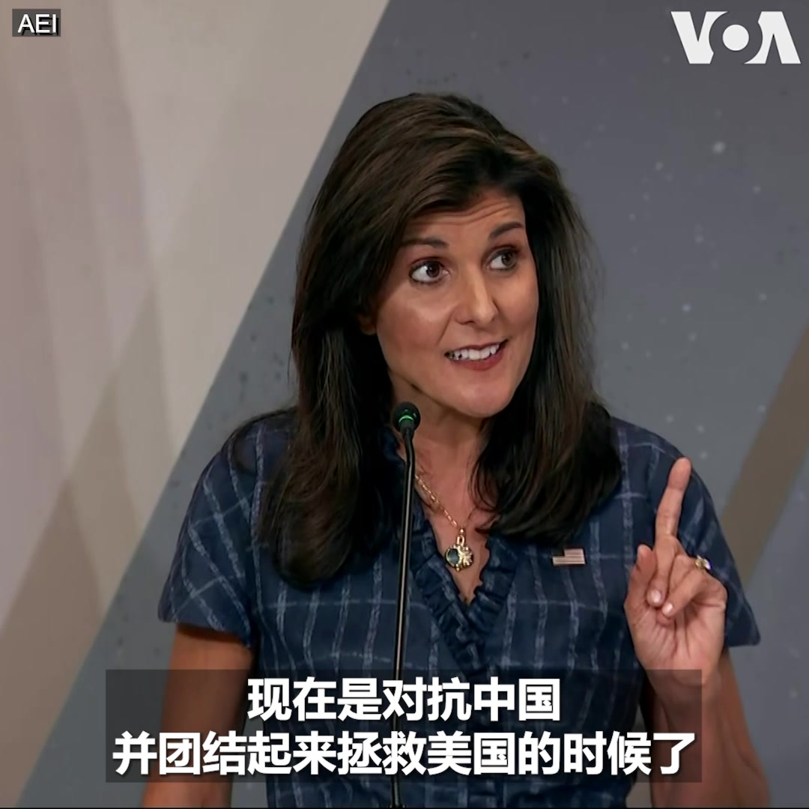
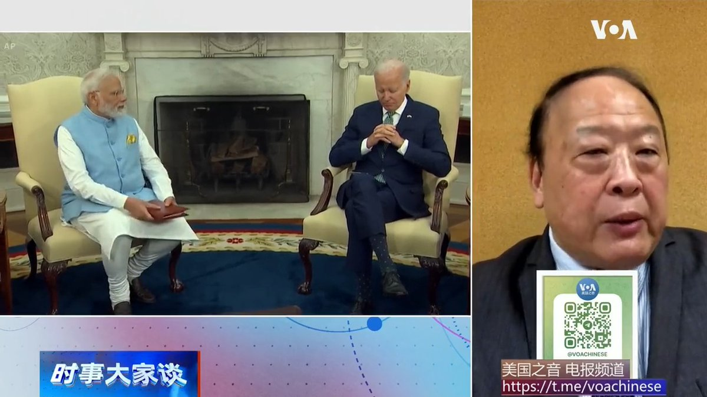
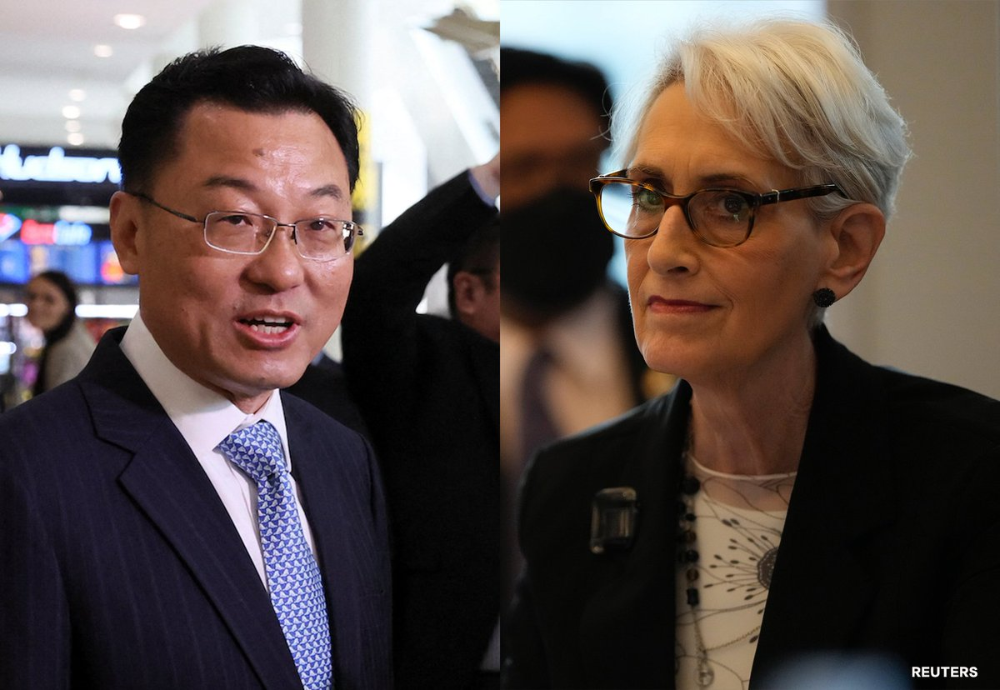
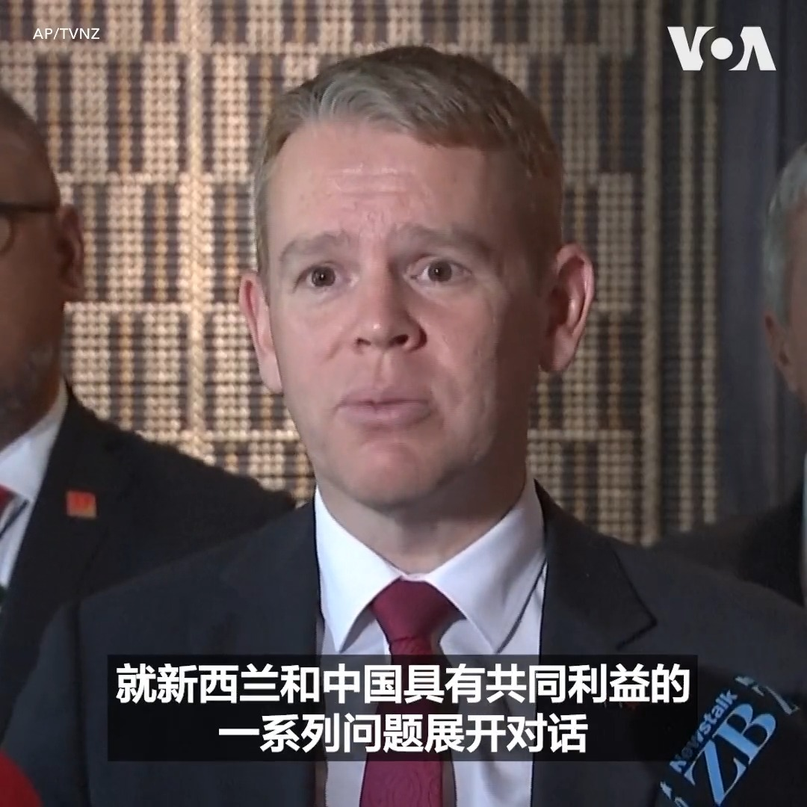

美国之音中文网 北京时间 2023-06-28T08:40:02Z 1673853729337118724 美国制裁参与非法黄金交易以资助瓦格纳集团的公司 https://t.co/hMqNgTv2bB   美国之音中文网 北京时间 2023-06-28T08:53:33Z 1673857132259835905 美众院军委会主席率跨党派议员访问台湾，将与总统蔡英文会面 https://t.co/Dmgl2cbOJP   美国之音中文网 北京时间 2023-06-28T09:28:33Z 1673865937509027841 美众院外委会宣布设立“老虎”工作组加快对外军售，盼尽快向台湾交付武器 https://t.co/rlSHp4Lfjg   美国之音中文网 北京时间 2023-06-28T09:59:05Z 1673873621822078976 共和党议员敦促拜登：勿向全球气候基金提供援助以资助中国 https://t.co/wfYwaIundI   美国之音中文网 北京时间 2023-06-28T04:32:29Z 1673791430320594945 瓦格纳兵变夭折，中国网民一片喝彩，称普大帝威武，普大厨不识时务，现在普京还是昔日的普京，俄罗斯还是昔日的俄罗斯。果真如此吗？香港荣休全国政协委员刘梦熊说，普利戈津兵变与林彪叛逃有异曲同工之妙，戳穿了独裁者永远正确，不可一世的神话。#时事大家谈完整版：https://t.co/Zx7xmJq6kr https://t.co/b2R7zGqRPd   美国之音中文网 北京时间 2023-06-28T04:40:33Z 1673793459650711552 土耳其著名政治家呼吁邀请维吾尔领袖热比娅·卡德尔访问土耳其 https://t.co/tN2S1opawE   美国之音中文网 北京时间 2023-06-28T04:56:32Z 1673797485624692739 成千上万的非法电子烟正在从中国涌入美国 https://t.co/Bd2ssw7zuH   美国之音中文网 北京时间 2023-06-28T04:56:34Z 1673797494395002880 黑利大使：共产主义中国是美国最大的敌人，入侵台湾意味着全面经济脱钩 https://t.co/4JymyGqeLX   美国之音中文网 北京时间 2023-06-28T05:09:12Z 1673800673002151937 中国指责美国联邦法庭对三名参与猎狐行动的人员定罪，称美方是别有用心对中方追逃追赃工作进行污蔑抹黑。然而，按照定罪书和美国现有法律，这三名参与猎狐行动的人员确实违反了美国的法律。 请看#揭谎频道：https://t.co/v3mSRBIkcc   美国之音中文网 北京时间 2023-06-28T05:23:02Z 1673804154563891201 以色列和巴勒斯坦官员讨论约旦河西岸暴力事件 https://t.co/K3I9O8cgv3   美国之音中文网 北京时间 2023-06-28T05:33:36Z 1673806811839995904 “共产主义中国是个敌人。它是自二战以来我们面临的最危险的外国威胁,”正在角逐共和党总统候选人提名的前美国驻联合国大使黑利周二在美国企业研究所发表演讲时说。黑利还说，美国应该“毫无歉意地跟台湾站在一起”，中国入侵台湾意味着美国与中国的全面经济脱钩。报道：https://t.co/Aim9UiYWqH https://t.co/29lTurtVg1   美国之音中文网 北京时间 2023-06-28T05:40:00Z 1673808421802622976 中国和印度同为亚洲人口大国，有着基本相同的国情和经历。中国改革开放之前，两国基本上处于同一个经济发展水平，拉开两国差距的起跑线发生在1979年，中国开始向美国敞开怀抱，而印度却傍上了前共产大国苏联。美国资深媒体人魏碧洲说，美国因素将在中印竞争中起决定性作用https://t.co/Zx7xmJq6kr https://t.co/pfpa1hVpHz   美国之音中文网 北京时间 2023-06-28T05:52:04Z 1673811460697522176 南非期待中国帮其解决电力危机 https://t.co/IRSTvXgveA   美国之音中文网 北京时间 2023-06-28T06:08:33Z 1673815609229082625 日本将把韩国重新纳入贸易白名单 https://t.co/qkKQjkJECn   美国之音中文网 北京时间 2023-06-28T06:08:35Z 1673815617378619392 内塔尼亚胡：中国邀请他进行国事访问 https://t.co/jLQr7vVqqj   美国之音中文网 北京时间 2023-06-28T02:20:27Z 1673758204722053120 美国国务院发言人米勒周二通过声明表示，副国务卿谢尔曼与中国驻美大使谢锋在当天通了电话。两人讨论了美中关系的关键优先事项及一系列全球和地区问题。谢尔曼重申两国保持开放沟通渠道的重要性，并指出美国将继续利用外交手段提出美方关注的领域，以及美中利益一致的潜在合作领域。 https://t.co/T4JSaUT3fb   美国之音中文网 北京时间 2023-06-28T04:10:32Z 1673785909119180800 普里戈津抵达白俄罗斯，卢卡申科声称说服普京留其性命，瓦格纳向俄军交出重型装备 https://t.co/0ZwtUUJmGW   美国之音中文网 北京时间 2023-06-28T00:35:02Z 1673731673471733760 新西兰总理希普金斯表示，他与中国领导人习近平的会晤“热情和有建设性”。他表示，会谈主要聚焦经济议题，但也讨论了中美关系、乌克兰冲突、太平洋区域问题和人权等一系列议题。他说，他重申了新西兰在这些问题上的立场，并敦促中国利用一切可能的影响力来结束乌克兰冲突。https://t.co/7p0sSFPbZQ https://t.co/JtJQsTW4EB   美国之音中文网 北京时间 2023-06-28T01:24:33Z 1673744137101926400 李强在天津达沃斯论坛上试图安抚外国公司及投资者 https://t.co/BoGEKJBK8D   美国之音中文网 北京时间 2023-06-28T01:40:11Z 1673748071308742656 美越靠拢北京不安，李尚福向越南防长示好愿加强军事合作 https://t.co/6fyADWzNqY   美国之音中文网 北京时间 2023-06-28T02:24:08Z 1673759130417504256 中国在古巴设立军事设施的计划以及存在多年的窃听站被披露后引发轩然大波。军事分析人士认为，中国可能将古巴变为情报枢纽，而且在更广泛拉丁美洲和加勒比地区的经济、情报和军事活动正在显著威胁美国的利益和领导力。报道内容：https://t.co/otpwMqSdOX https://t.co/1PgvTUMQMK   美国之音中文网 北京时间 2023-06-28T00:01:44Z 1673723296422952960 新西兰总理会晤习近平讨论双边关系及广泛国际议题https://t.co/QscXvYqGdo   