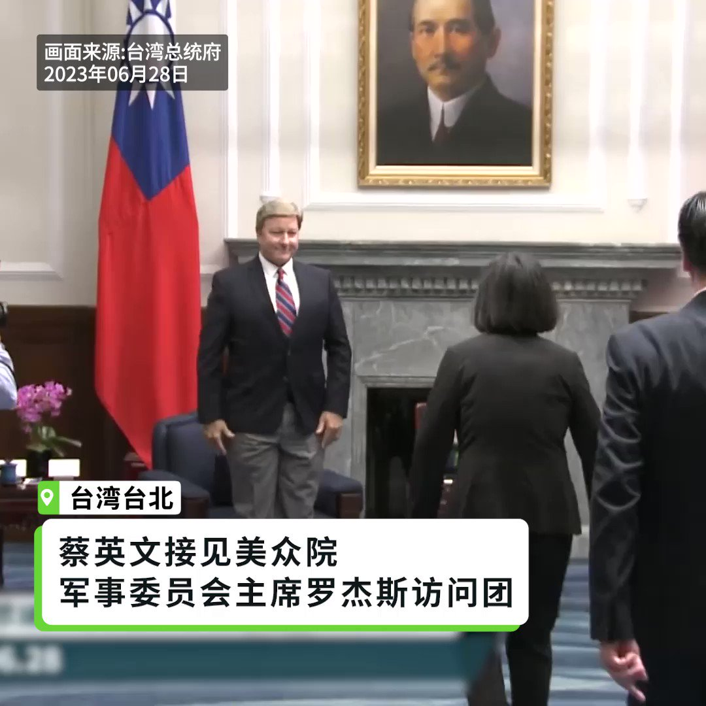
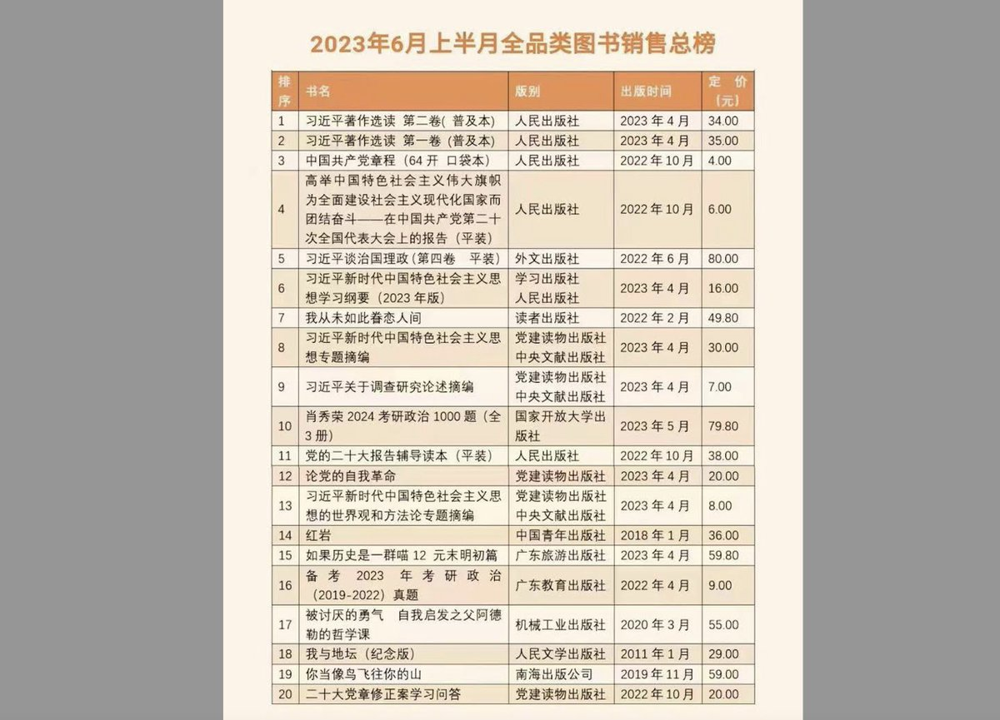

自由亚洲电台 北京时间 2023-06-28T18:40:02Z 1674004722808938507 【美国会军委会主席等9人访团晋见蔡英文】
【罗杰斯：台美共通价值深化友谊】
美国联邦 #众议院军事委员会 主席 #罗杰斯（Mike Rogers）等9名跨党派国会议员访台，台湾外交部表示，这是近年最大规模美国会议员访台。#蔡英文 总统会见访团表示，会持续跟美国携手合作守护印太区域的和平跟稳定。罗杰斯则表示，台美共通价值令双方深化友谊，对台湾的支持坚定不移。
详细报道：https://t.co/uR2CsOb4UW   自由亚洲电台 北京时间 2023-06-28T17:12:01Z 1673982576317595648 【习近平著作销量囊括中国5、6月份图书销量前5名】
#习近平著作 和 #中共党章 等政治读物的销量，已经囊括中国5、6月份图书销售量前五名，在前20本 #畅销书 中，7本是习近平著作以及讲话。
详细报道：https://t.co/KOiidYFrDU https://t.co/spiAKZqud0   自由亚洲电台 北京时间 2023-06-28T18:01:42Z 1673995078900273152 【广东顺德基督徒被刑事拘留】
【广州一教会牧师被勒令加入官方教会】
广东 #顺德 #盛佳教会 4名基督徒被当局以“非法经营罪”，刑事拘留已查过一个月，据该教会信徒说，被捕者近期可能会被检察院批捕。另外，广州 #圣经归正教会 不断受到当局骚扰，该教会牧师 #黄小宁 更被官员警告，如不加入官方三自教会，就要坐牢。
详细报道： https://t.co/BEPRyUIMkB   自由亚洲电台 北京时间 2023-06-28T14:54:59Z 1673948088812322817 https://t.co/psK4UEtLe8   自由亚洲电台 北京时间 2023-06-28T11:18:22Z 1673893576919449601 RT @RFA_Chinese: 【“数据控”习近平对世界意味着什么？】
美国胡佛研究所近日发表报告指出，中共总书记 #习近平 对网路 #大数据 的经济和社会影响力“近乎痴迷”，他统治下的中国党国体系，正试图通过企业扩张，将世界各地的海量数据引向中国，以提高中国的情报搜集和操控…   自由亚洲电台 北京时间 2023-06-28T04:31:27Z 1673791173285261312 本周二，中共领导人 #习近平 在北京高调会见到访的 #新西兰 总理，而预计美国财政部长 #耶伦 也将在下个月访问中国。有学者指出，目前国际社会在对华政策上已达成共识，与中国合作并不影响需要应对的挑战。

https://t.co/MVbyR1waDS   自由亚洲电台 北京时间 2023-06-28T04:48:54Z 1673795561491939333 #事实查核｜扬言继续"做中国不喜欢的事"，#布林肯 露出真面目？
https://t.co/Y8HTqXfYzD   自由亚洲电台 北京时间 2023-06-28T04:52:25Z 1673796448197156864 【#亚太报道（2023-6-27）】
欢迎收听和订阅播客【亚太报道】 https://t.co/MjLNSvVMqc

财经作家 #吴晓波再遭微博禁言 / 中国各地去年虚报财政收入逾800亿元 / 什么是“ #严重政治问题书刊”？ / 多国政要相继访问北京 / 台湾“#汉光演习”将首次移师国际机场 https://t.co/V0IkItMFGu   自由亚洲电台 北京时间 2023-06-28T05:21:00Z 1673803639511728130 经过七个月的"违纪违法"调查，北京市原国资委主任 #张贵林 日前被正式通告"双开"。但在他的罪名中，私藏、阅览"#严重政治问题的书刊"一条最为突出，引发舆论热议。

https://t.co/d3fpycxUFX   自由亚洲电台 北京时间 2023-06-28T05:41:42Z 1673808849042649091 【“数据控”习近平对世界意味着什么？】
美国胡佛研究所近日发表报告指出，中共总书记 #习近平 对网路 #大数据 的经济和社会影响力“近乎痴迷”，他统治下的中国党国体系，正试图通过企业扩张，将世界各地的海量数据引向中国，以提高中国的情报搜集和操控外国的影响力。
胡佛研究所客座研究员Matthew Johnson最近发表题为“中国的数据主导大战略”（China's Grand Strategy for Data Dominance）的报告。他认为，在中国的数据管理官僚体系下，所有的中企都被整合到一个由中共集中控制的国家数据基础设施内，目的是在与西方的战略竞争中为党的目标服务。这基于一个完全单一的前提：让中国最大限度地吸收全球数据，且尽可能不要让中国的数据被外界获取。   自由亚洲电台 北京时间 2023-06-28T05:59:01Z 1673813207285374976 据路透社6月27日发自华盛顿 的消息，美国国务院表示，美国常务副国务卿温迪· #谢尔曼 周二与 #中国驻美大使 通电话，就美国国务卿 #布林肯 上周访问北京期间讨论的问题进行后续跟进。
https://t.co/uFavV63u2W   自由亚洲电台 北京时间 2023-06-28T06:01:05Z 1673813726884167683 今年2月初，美国击落飞经上空的中国"间谍气球"。美国国务卿布林肯访华结束后说，与中国的“气球事件”应到此为止。6月26日，英国媒体BBC发表调查长文，称与人工智能公司 Synthetaic合作，筛选了卫星捕获的大量数据，发现了多张气球飞越东亚的图像。您认为，中国间谍气球何时了？   自由亚洲电台 北京时间 2023-06-28T02:27:09Z 1673759890622529536 俄罗斯总统 #普京 表示，#瓦格纳 雇佣军组织的成员完全由国家资助。普京称，仅从 2022 年 5 月到 2023 年 5 月，瓦格纳就获得了 862.62 亿卢布（10 亿美元）的工资和奖金，这些资金来自俄国防部和国家预算。
https://t.co/QUqqQu9cRR   自由亚洲电台 北京时间 2023-06-28T03:03:15Z 1673768975937708047 6月27日，四川汶川发生山洪泥石流，官媒称大雨和山体滑坡已造成3人失联4人遇难 https://t.co/N6UPh7oHL1   自由亚洲电台 北京时间 2023-06-28T00:29:04Z 1673730174985310214 台湾“#汉光演习”今年预计移师桃园机场，并将首次在国际机场举行反空降等多种演练。

https://t.co/Fng9q5h3r3   自由亚洲电台 北京时间 2023-06-28T01:54:20Z 1673751632172158977 “是否重启 #两岸服贸协议”，近日成为台湾总统大选的热议话题。本周一，台湾本土派社团召开记者会，呼吁各党大选参选人对此表态。

https://t.co/s1WH1qzDGt   自由亚洲电台 北京时间 2023-06-28T00:03:53Z 1673723837949812737 #吴晓波再次被禁言
博主“石景山辛芷蕾”发文反问，如何区分“为现状发声”和“攻击否定政策制度”呢？相比解决问题和正面回应问题，捂嘴是一件太简单的事，“捂一个大V的嘴尚且如此简单，何况普通民众呢？”
https://t.co/5MEGPAHjFH   