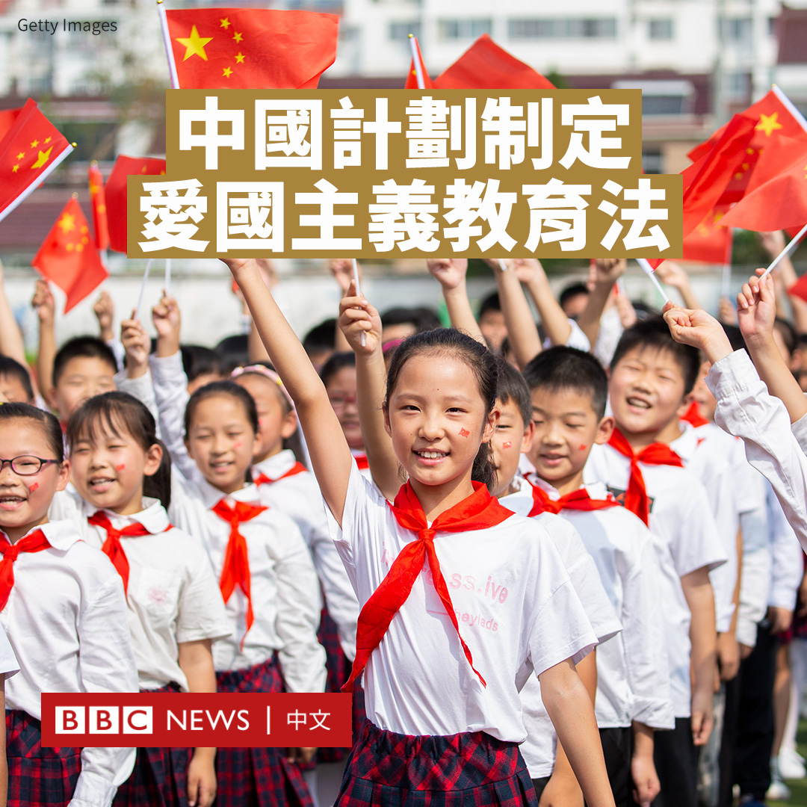
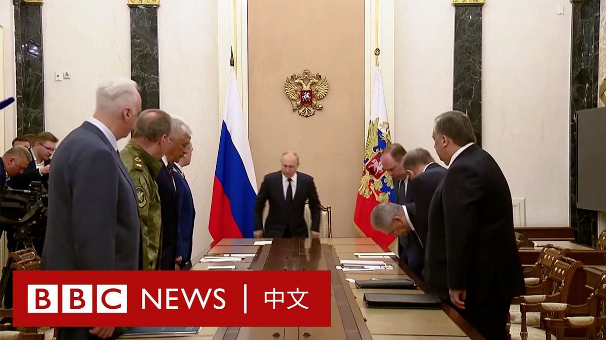
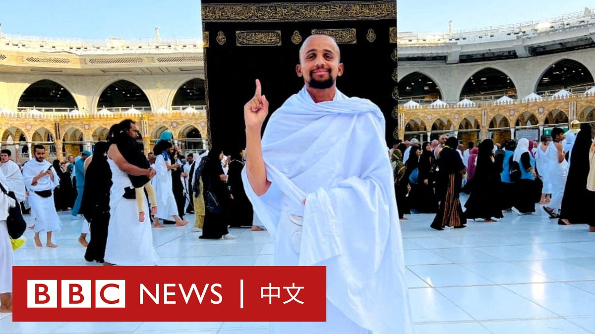
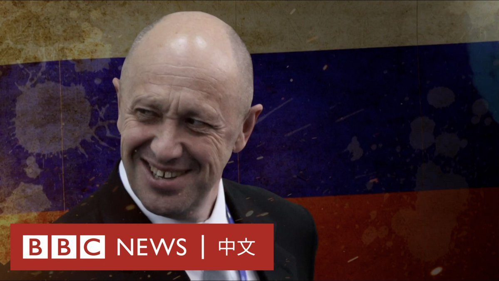

D英国广播公司BBC 北京时间 2023-06-27T20:51:34Z 1673675437594009601 为拯救本地鸟类，新西兰决定消灭所有的老鼠和其他掠食者。这个计划能行得通吗？https://t.co/t1bMmHJaow   D英国广播公司BBC 北京时间 2023-06-27T18:44:58Z 1673643578654965761 BBC与人工智能公司Synthetaic合作，通过筛查卫星捕获的大量数据，发现多个气球穿越东亚的图像，包括其在日本和台湾上空的飞行。https://t.co/7I9mWbD4gu   D英国广播公司BBC 北京时间 2023-06-27T19:20:11Z 1673652440128802816 出生于香港的邹至蕙（Olivia Chow）在加拿大多伦多激烈的市长选举中获胜，成为当地首位华裔女市长。

66岁的邹至蕙以37%得票率，成功击败了另外101名参选者。

作为左翼进步派代表，邹至蕙表示，她将致力于建设一个“更多关爱、更宜居和更安全”的城市。

邹至蕙在选前承诺上台后将调高房产税、兴建保障性住房，以及其他对于租房者的支持政策，以应对多伦多市日益严峻的住屋危机。

此次选举是在该市主政八年的前市长庄德利（John Tory）辞职后进行的补选。

今年2月，当地媒体披露这名已婚市长在新冠疫情期间，与一名工作人员有染。他在文章发表后的几个小时内提出辞职。

邹至蕙于1957年生于香港，父亲是香港公务员，曾任职教育署。13岁时，邹至蕙随父母移民多伦多。

在胜选演讲中，她指多伦多是一个充满希望、充满第二次机会的地方。她说：“多伦多是一个让移民的孩子可以成为你面前的新市长的地方。”   D英国广播公司BBC 北京时间 2023-06-27T16:32:08Z 1673610148903014400 据美国警方称，一名美国女子在乘坐Uber时，因认为司机绑架了她，从而从后座射杀了司机。该女子被控谋杀。

德克萨斯州边境城市埃尔帕索（El Paso）的警方称，这名女子名为菲比·科帕斯（Phoebe Copas），其认为自己被Uber司机带到了墨西哥。

执法当局在声明中说，她随后向司机丹尼尔·皮德拉·加西亚（Daniel Piedra Garcia）开枪。

这名52岁的司机在医院的重症监护病房抢救数天后去世。

据警方文件显示，当科帕斯坐在车里时，看到了写着“华雷斯，墨西哥”（Juarez, Mexico）的交通路牌，这可能使她误认为自己被绑架了。

埃尔帕索和华雷斯是两座毗邻的城市，并排坐落在美国和墨西哥边境的两侧。

警方文件进一步解释说，科帕斯在认为自己被绑架后，从手提包中掏出一把枪，向司机的头部开枪。该车随后撞上了障碍物，然后停了下来。

科帕斯来自肯塔基州，她当时正在前往男朋友家的途中，据称，她随后拨打了紧急电话911，拍下了司机的照片，并将其发给她的男友。

埃尔帕索警方的声明说：“调查后发现绑架并不存在，司机也没有偏离科帕斯的目的地。”   D英国广播公司BBC 北京时间 2023-06-27T17:42:07Z 1673627760936497152 据中国媒体报道，中国当局正在计划制定《爱国主义教育法》，加强针对全体公民的爱国主义教育，突出对青少年和儿童的教育。

据报道，中国全国人大常委会周一（6月26日）审议了爱国主义教育法草案。该草案致力于“培育和增进对中华民族和伟大祖国的情感”、“传承民族精神、增强国家观念，壮大和团结一切爱国力量”。

当局尚未发布《爱国主义教育法》草案的具体内容，但官方媒体指，爱国主义教育包括思想政治、历史文化、国家象征标志、国家统一和民族团结、国家安全和国防、英烈和模范人物事迹等方面。

官方媒体报道称，该法还将突出对公职人员、企业事业单位职工、农村居民、代表性人士、宗教人士、港澳和台湾民众以及海外侨胞等不同群体，分别作出“针对性”的爱国主义教育规定。

据报道，该法还将对“违背爱国主义精神的禁止性行为”及其法律责任作了规定。

中国宣布起草这一法律之际，北京和西方的关系显著恶化，台海紧张局势也不断加剧。

香港特区行政长官李家超周二（6月27日）表示，他非常支持爱国主义教育。香港政府会对接中央政府在这方面的要求。   D英国广播公司BBC 北京时间 2023-06-27T15:34:38Z 1673595680903008257 克里姆林宫的官方画面显示，周一（6月26日）晚上，俄罗斯总统普京（Vladimir Putin）会见了俄罗斯国防部长绍伊古（Sergei Shoigu）、总检察长、内政部长和联邦安全局长等高级官员。

“我召集大家是为了感谢你们这几天所做的工作，讨论目前的形势，并在分析国内发生的事件后，谈谈我们面临的任务。”普京说道。

起兵反叛的瓦格纳首领普里戈津（Yevgeny Prigozhin）曾要求解雇绍伊古。

普京当天在演讲中，措辞强硬地批评参与反叛的瓦格纳集团首领希望“看到俄罗斯陷入血腥冲突”。

普京称，组织叛乱的人希望通过“犯罪行为”来“分裂和削弱国家”。但他把普通的瓦格纳士兵称为“爱国者”，允许他们加入正规军、去白俄罗斯或回国。

普里戈津则否认试图推翻普京政权，表示进军的目的是“为了避免瓦格纳遭到破坏”。他还称手下没有人同意与俄罗斯国防部签订收编合同。

普里戈津没有透露他所在的位置，他曾同意撤军后离开俄罗斯前往白俄罗斯。   D英国广播公司BBC 北京时间 2023-06-27T14:08:37Z 1673574033978269696 中国领导人习近平考察中国国家版本馆，提及曾经独立的琉球王国（今日本冲绳）与福建的历史渊源，意外触动中日关系的敏感神经。北京是在打“冲绳牌”，亦或只是事发偶然？https://t.co/8Wir9oRmcR   D英国广播公司BBC 北京时间 2023-06-27T12:15:19Z 1673545521196318722 一位巴基斯坦学生携带着雨伞和背包，步行超过4000公里，实现了他想步行前往麦加完成朝圣的愿望。

乌斯曼·阿沙德从他的故乡奥卡拉出发，穿越巴基斯坦、伊朗、阿联酋和沙特阿拉伯，最终到达圣城麦加。 https://t.co/p76Tfd9wei   D英国广播公司BBC 北京时间 2023-06-27T10:47:06Z 1673523318169665538 随着中国青年人失业率连续几年走高，越来越多的年轻毕业生找不到合适的工作，很多人选择了依靠体力劳动的“蓝领”工作。

这也推动了网络上的一场辩论——大学生是否应该脱下“孔乙己的长衫”。该比喻指的是鲁迅小说中一位落魄书生已到乞讨的地步，却依然执拗地穿着象征身份的长衫。https://t.co/Smbf1fss0U   D英国广播公司BBC 北京时间 2023-06-27T08:23:01Z 1673487061024911360 在结束了自己亲自发动的武装叛乱后，瓦格纳集团首领叶夫根尼·普里戈津（Yevgeny Prigozhin）与克里姆林宫达成协议，他将前往白俄罗斯。 从曾经的阶下囚到普京的“御用厨师”，从俄军在乌克兰战场的关键人物到莫斯科口中的“叛变者”，普里戈津是谁？ https://t.co/Qz5hhHCPy6   