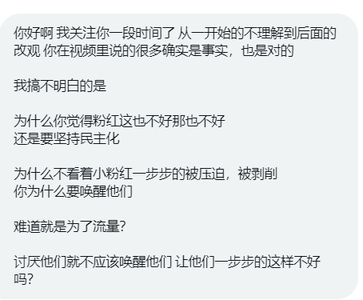
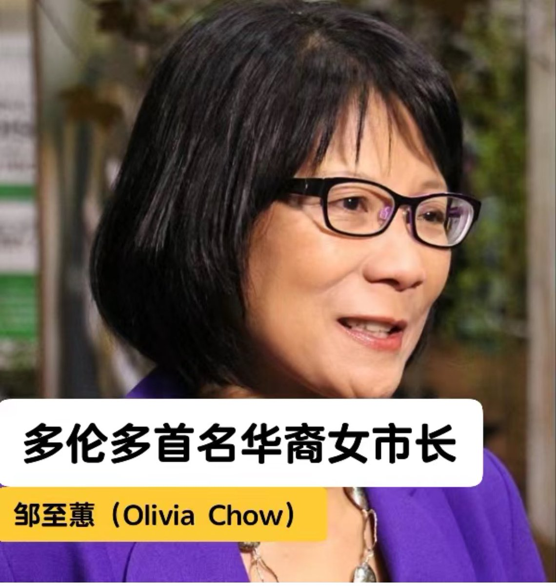

多伦多方脸 北京时间 2023-06-27T11:37:31Z 1673536005914382336 实际情况是，根据2021年的调查
民主党支持率
在15000美元收入以下较高，支持率是63%
并且优势一直到50000美元 
但是到了富裕家庭这个趋势又出现反转，富裕家庭对于民主党的支持率达到了75%
而从学历上来说，低学历和研究生对于民主党的支持率较高
民主党的票仓是穷人和富人 https://t.co/pgPVetJ6Ag   多伦多方脸 北京时间 2023-06-27T11:48:01Z 1673538647944220674 今天不更新了，因为昨天更新了，然后我明天也不一定更新，因为昨天发热躺了一天。
今天不一定能把视频做好，尽量哈。   多伦多方脸 北京时间 2023-06-27T10:23:02Z 1673517264451305472 对于这个问题，我并不反对小粉红，小粉红也不是我们的敌人，大家都是普通人，除了某些粉红头头，或者带任务的减刑人员。
甚至对于我的自我定义是一个爱国者（非爱党者）
在我看来，粉红是需要改变的人，当然能改变他们的主要是铁拳，语言，文字只是辅助作用。
只有把粉红改变了，才有可能改变中国 https://t.co/IVV0PwjgPV https://t.co/3vbnpVPkx5   多伦多方脸 北京时间 2023-06-27T09:39:02Z 1673506188334596097 多伦多选出了第一位华裔女市长。
邹至蕙
我观察了一下华裔圈子这个人和前段时间的沈观健完全不同，他在参选的时候，有大量诋毁他的文章在中文圈流传。
看来这个并非中共中意的人选啊🤔 https://t.co/D2WaaM8q4X https://t.co/07Ya4TGiBB   多伦多方脸 北京时间 2023-06-27T09:51:51Z 1673509415637618688 十万粉丝奖牌🏅
感谢大家的支持，谢谢每一位关注者！ https://t.co/tvlfbRaG9g   