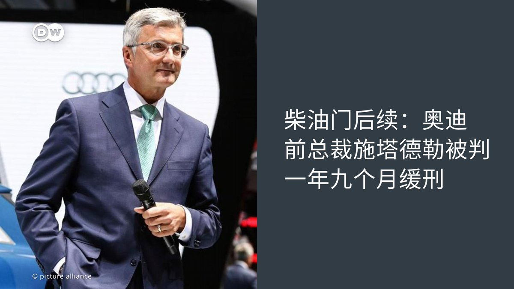
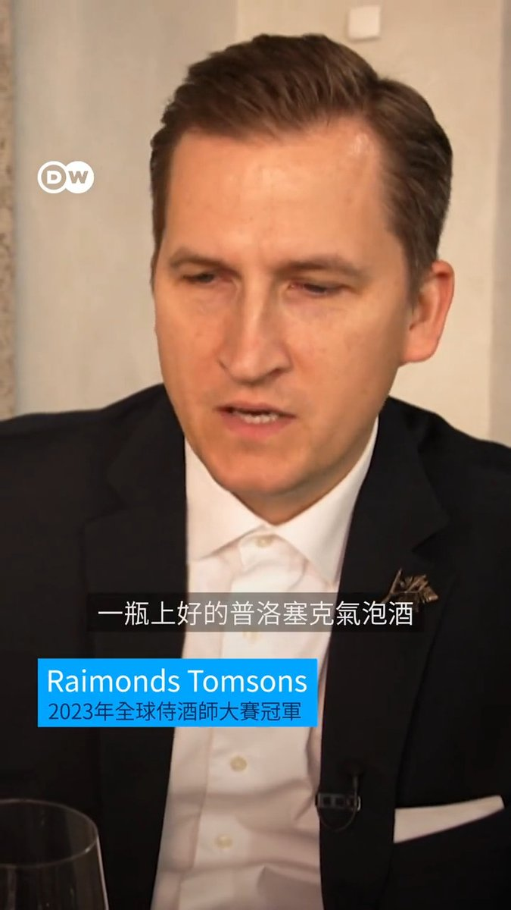

德国之声 北京时间 2023-06-27T23:06:00Z 1673709268418326529 德国🇩🇪、法国🇫🇷和意大利🇮🇹的经济部长周一（6月26日）在柏林表示，对于对安全风险的考量，他们希望在关键原材料的采购方面进行更密切的合作，并减少对来自 #中国 的进口的依赖。

https://t.co/6iYwRldojy   德国之声 北京时间 2023-06-27T23:42:00Z 1673718327997526017 《新苏黎世报》分析认为，虽然 #瓦格纳集团 哗变让中共高层看到，普京在俄罗斯的地位何其脆弱，但北京还是会暗中支持普京。

文章写道：“面对一位被削弱、甚至被夺权的俄罗斯总统，中国将在反制 #美国霸权 的尝试中失去一个重要的盟友。”

https://t.co/oj5PzE82YJ   德国之声 北京时间 2023-06-27T21:11:00Z 1673680327506788352 澳大利亚媒体报道称，新西兰外长马胡塔今年3月访华期间与中国外长秦刚会谈时，受到秦刚“长篇大论的教训”。马胡塔回应表示，那是一场 #直率有力 的讨论。

https://t.co/uvsGtVX1qY   德国之声 北京时间 2023-06-27T21:44:00Z 1673688632371052545 德国大众集团旗下的汽车🚘品牌 #奥迪 前CEO施塔德勒6月27日因 #柴油门 事件，被慕尼黑法院以 “疏忽欺诈罪” 判处一年九个月缓刑、罚款110 万欧元，成为大众集团受柴油门影响被定罪的最高级别高管。根据认罪协议，施塔德勒承认即使在 “柴油门” 事件为公众所知之后，他仍允许配备操纵软件的汽车继续销售。 https://t.co/uNADwLHeAi   德国之声 北京时间 2023-06-27T21:45:37Z 1673689040720125953 柴油门事件可以追溯到2015年，当时美国环保局发现大众集团在2014年至2015年期间销售带有非法软件的车辆并且在排放测试中作弊。   德国之声 北京时间 2023-06-27T18:55:00Z 1673646102011060224 俄罗斯上周末发生的 #瓦格纳集团 兵变虽已迅速收场，但震波犹存。作为俄罗斯最重要的盟友，中共领导人从中看到了什么样的警讯？

一位政治学教授認為这会提醒习近平，#民族主义是一柄双刃剑，因为极端民族主义者可以用更激进的好战言论对掌权的政治强人超车。

https://t.co/2A6fvkTuuA   德国之声 北京时间 2023-06-27T19:41:00Z 1673657678394949632 2011年3月11日，一场九级地震在日本东海岸引发了巨大的海啸。渔民小野在他的船上得以幸存，但他在陆地上的家被摧毁了。海啸还冲击了 #福岛核电站，引发了爆炸和熔毁。

如今他担心，将这些稀释过的核电站冷却水☢️💧排入大海会再次破坏渔民们的生计。

https://t.co/jQrNsRaxU9   德国之声 北京时间 2023-06-27T20:26:00Z 1673669002781167616 #占用公共资源！巴塞罗纳推亚马逊税💵💵💵💵💵
#巴塞罗纳 推出新规，对电商征税，即所谓的 #亚马逊税。这是第一个对电商快递征税💵的欧洲城市。当地政府希望以此遏制快递车辆乱停🛺，减少 #环境污染，扶持线下零售商。 https://t.co/bkgTNayKte   德国之声 北京时间 2023-06-27T17:07:00Z 1673618923059650561 座落在柏林市中心的 #佩加蒙博物馆 是柏林规模最大的博物馆，收藏着伊斯兰和古代近东地区的艺术品。

不过，想一睹文物风采的人必须把握机会了。从今年10月23日起，博物馆将闭馆整修四年，到2027年才会再次开馆。而馆方近日也宣布从7月1日起延长每日营业时间，以接纳更多想在闭馆整修前来参观的民众。 https://t.co/Ni4qHkuV5z   德国之声 北京时间 2023-06-27T17:07:27Z 1673619038155550720 相关报导：

👉最受欢迎的柏林十大博物馆
https://t.co/WupZxdRBYr

👉十家你不应错过的德国博物馆
https://t.co/0rVWivhQ1h   德国之声 北京时间 2023-06-27T18:13:00Z 1673635532419608578 #怎么判断好的气泡酒？🥂
如何能喝上一瓶价钱不贵的上好的气泡酒？分辨好的气泡酒的简单方法又是什么？#Dweuromaxx https://t.co/F2FmVbzwpt   德国之声 北京时间 2023-06-27T15:02:23Z 1673587561246371845 #中国 总理 #李强 27日在 #世界经济论坛 于天津举办的“新领军者年会”上称，部分国家的“去依赖、降风险”说法是把经贸问题政治化的伪命题。他还称，中国今年第二季经济增速会加快，有望达成5%的年增长目标。
https://t.co/gZ0RVRTfNz   德国之声 北京时间 2023-06-27T16:03:00Z 1673602817200717824 一年一度的慕尼黑啤酒节🍻又慢慢临近了，因通货膨胀，今年啤酒价格水涨船高，每扎一升装的啤酒要价高至14.9欧元，去年价格大约为10欧元左右。#Oktoberfest #Oktoberfest2023 #Germany #Bavaria https://t.co/PS8wZIzJxU   德国之声 北京时间 2023-06-27T12:59:04Z 1673556530795298818 【消息：#耶伦 即将访中】🇺🇸 🇨🇳

延宕多时，美国财长耶伦造访 #中国 之行可能在7月登场。据彭博社消息，她将与中国副总理 #何立峰 会面；此前，耶伦曾于今年1月会晤当时的中国副总理刘鹤。耶伦近期针对 #美中经济关系，有哪些说法？
详细报导👉https://t.co/og9ls0mZb4 https://t.co/pVomrDl6Bx   德国之声 北京时间 2023-06-27T13:29:31Z 1673564194304557057 据微博管理员26日发布的"本周创作安全小贴士"，多位大V用户因"炒作 #失业率、散布抹黑证券市场发展等负面有害信息，发布攻击否定现行政策和管理制度的内容"，而违反法规、遭到 #禁言，其中包含吴晓波。 （下续） https://t.co/nTHWOSKSlF   德国之声 北京时间 2023-06-27T13:30:01Z 1673564317307006976 吴晓波是中国最具影响力的财经作家之一，着有关于中国经济转型的畅销书，也替财新网撰稿。有中国网友说："吴晓波为什么被封，是因为说了实话吗？"

在中国经济前景未明之际，经济评论亦成了管制对象。去年，经济学家任泽平也曾因主张央行多印钱、鼓励生育等言论，遭微博禁言。   德国之声 北京时间 2023-06-27T13:30:29Z 1673564434621427712 您怎么看待北京近期对网路与自媒体的控制❓欢迎留言与我们分享看法👇

相关报导👇
中国社媒审查升级 外国使馆微博纪念六四被删
🔗https://t.co/hfYLFU1UqG
标普降中国经济预测 专家谈如何缓解就业难
https://t.co/n15QcJT1YZ   德国之声 北京时间 2023-06-27T11:10:23Z 1673529177163845636 #俄罗斯 24日发生戏剧性的叛乱事件后，#普京 与 #瓦格纳 集团的首领普里戈津26日均对此事发表了最新说法。他们说了什么？中美、北约、乌克兰对此又有何反应？https://t.co/GaGXd7bXE0   德国之声 北京时间 2023-06-27T07:03:00Z 1673466921679724544 瑞士🇨🇭情报部门表示，俄罗斯对乌克兰的入侵使众多国际组织所在地的该国成为 #俄罗斯 和 #中国 间谍活动的中心。全球🌎正在转向由美国和中国之间的系统性竞争塑造的 #两极世界秩序。

https://t.co/BmYreEZuye   德国之声 北京时间 2023-06-27T09:01:18Z 1673496691759017987 白宫印太事务协调员坎贝尔（Kurt Campbell）26日在华府智库战略暨国际研究中心（CSIS）的论坛上表示，俄国近期的短暂叛乱事件，令中国政府不安。他并未对此说法多做说明。（下续） https://t.co/R5dP6SXXW7   德国之声 北京时间 2023-06-27T09:01:42Z 1673496795039559681 针对瓦格纳叛乱事件，中国外交部发言人毛宁26日在记者会上重申中国立场，称此事是"俄罗斯的内政"，且"中方支持也相信俄罗斯能够维护国家稳定，实现发展繁荣"。

图为中国国家主席习近平3月在西安出席中国与中亚峰会。   德国之声 北京时间 2023-06-27T09:02:07Z 1673496899234455552 北京对瓦格纳叛乱的态度是什么❓请看DW的相关分析报导👇
中国、北韩支持俄国政府
🔗https://t.co/KSTmxc6Kl0
瓦格纳兵变给习近平敲响了警钟？
🔗https://t.co/2A6fvkTuuA   