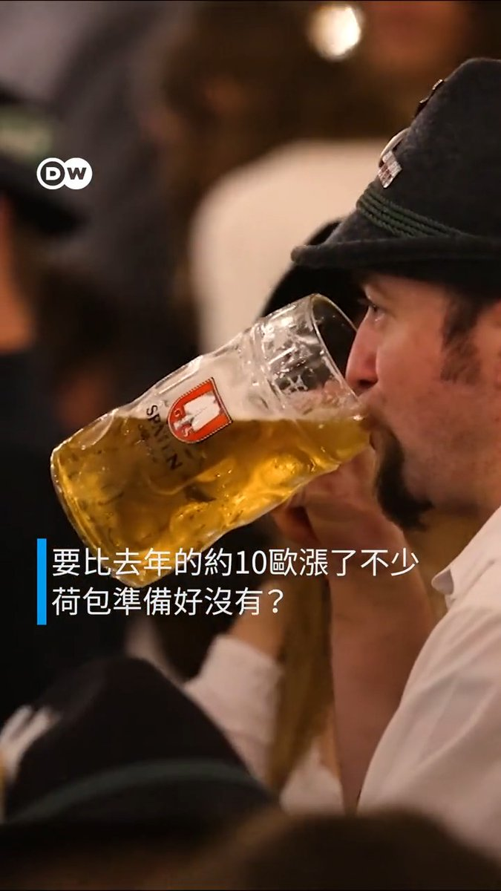
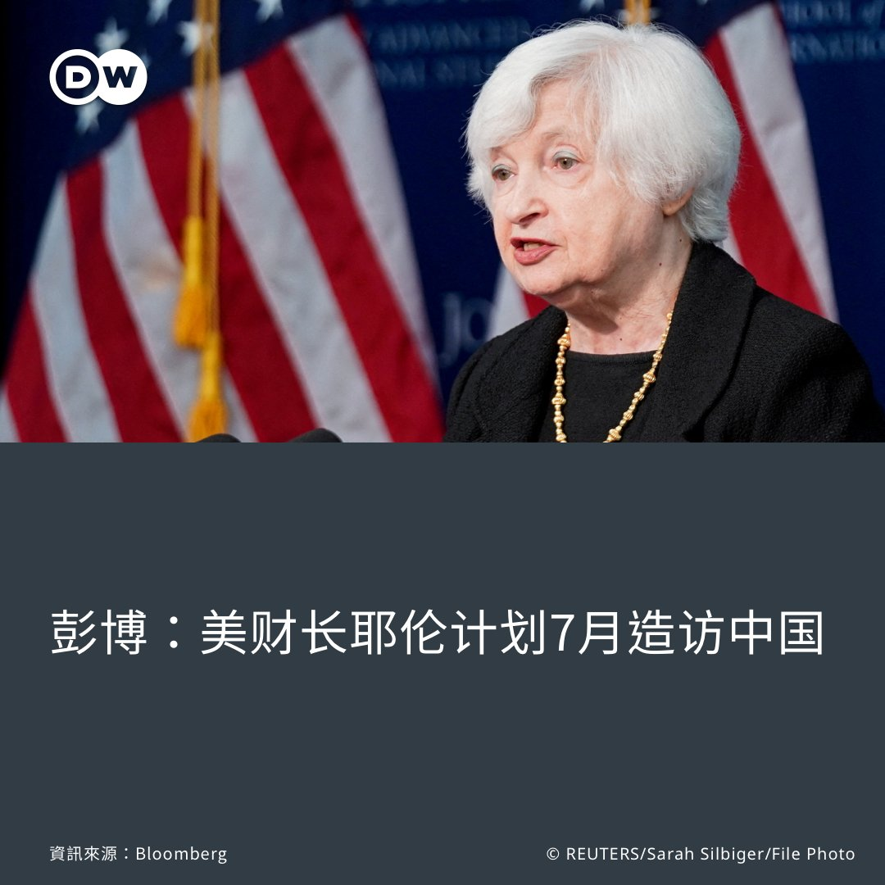
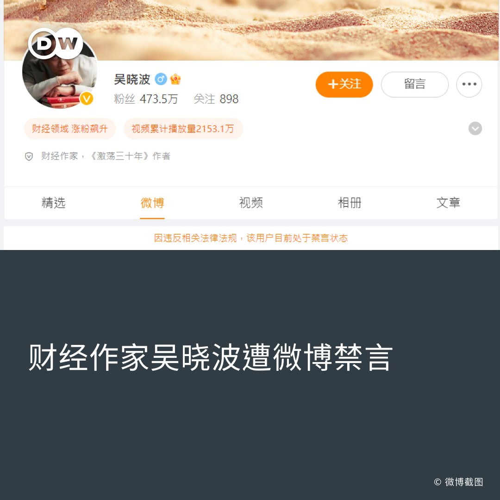
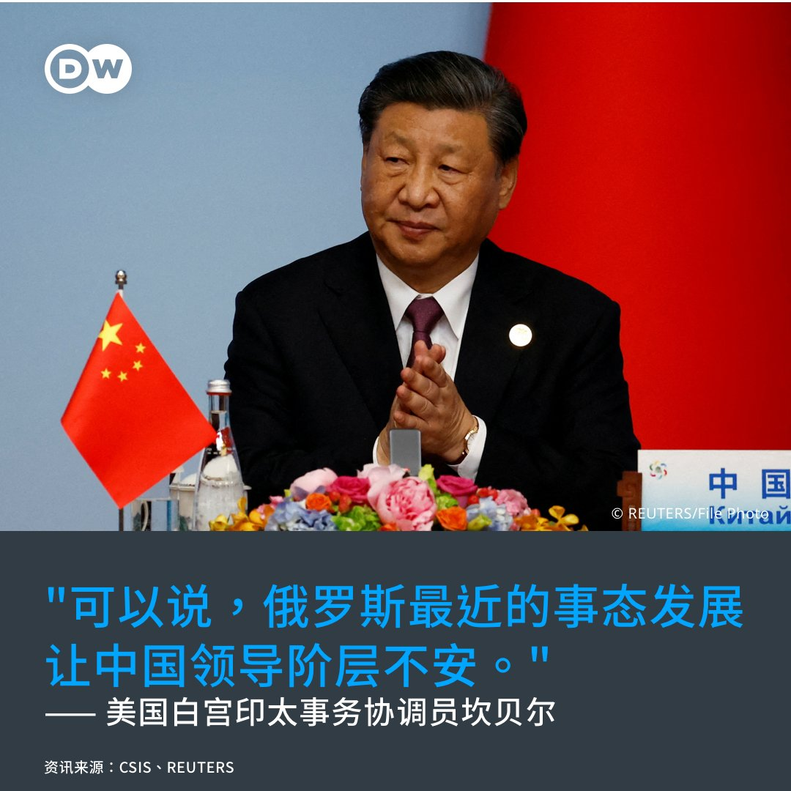

德国之声 北京时间 2023-06-27T16:03:00Z 1673602817200717824 一年一度的慕尼黑啤酒节🍻又慢慢临近了，因通货膨胀，今年啤酒价格水涨船高，每扎一升装的啤酒要价高至14.9欧元，去年价格大约为10欧元左右。#Oktoberfest #Oktoberfest2023 #Germany #Bavaria https://t.co/PS8wZIzJxU   德国之声 北京时间 2023-06-27T12:59:04Z 1673556530795298818 【消息：#耶伦 即将访中】🇺🇸 🇨🇳

延宕多时，美国财长耶伦造访 #中国 之行可能在7月登场。据彭博社消息，她将与中国副总理 #何立峰 会面；此前，耶伦曾于今年1月会晤当时的中国副总理刘鹤。耶伦近期针对 #美中经济关系，有哪些说法？
详细报导👉https://t.co/og9ls0mZb4 https://t.co/pVomrDl6Bx   德国之声 北京时间 2023-06-27T13:29:31Z 1673564194304557057 据微博管理员26日发布的"本周创作安全小贴士"，多位大V用户因"炒作 #失业率、散布抹黑证券市场发展等负面有害信息，发布攻击否定现行政策和管理制度的内容"，而违反法规、遭到 #禁言，其中包含吴晓波。 （下续） https://t.co/nTHWOSKSlF   德国之声 北京时间 2023-06-27T13:30:01Z 1673564317307006976 吴晓波是中国最具影响力的财经作家之一，着有关于中国经济转型的畅销书，也替财新网撰稿。有中国网友说："吴晓波为什么被封，是因为说了实话吗？"

在中国经济前景未明之际，经济评论亦成了管制对象。去年，经济学家任泽平也曾因主张央行多印钱、鼓励生育等言论，遭微博禁言。   德国之声 北京时间 2023-06-27T13:30:29Z 1673564434621427712 您怎么看待北京近期对网路与自媒体的控制❓欢迎留言与我们分享看法👇

相关报导👇
中国社媒审查升级 外国使馆微博纪念六四被删
🔗https://t.co/hfYLFU1UqG
标普降中国经济预测 专家谈如何缓解就业难
https://t.co/n15QcJT1YZ   德国之声 北京时间 2023-06-27T11:10:23Z 1673529177163845636 #俄罗斯 24日发生戏剧性的叛乱事件后，#普京 与 #瓦格纳 集团的首领普里戈津26日均对此事发表了最新说法。他们说了什么？中美、北约、乌克兰对此又有何反应？https://t.co/GaGXd7bXE0   德国之声 北京时间 2023-06-27T07:03:00Z 1673466921679724544 瑞士🇨🇭情报部门表示，俄罗斯对乌克兰的入侵使众多国际组织所在地的该国成为 #俄罗斯 和 #中国 间谍活动的中心。全球🌎正在转向由美国和中国之间的系统性竞争塑造的 #两极世界秩序。

https://t.co/BmYreEZuye   德国之声 北京时间 2023-06-27T09:01:18Z 1673496691759017987 白宫印太事务协调员坎贝尔（Kurt Campbell）26日在华府智库战略暨国际研究中心（CSIS）的论坛上表示，俄国近期的短暂叛乱事件，令中国政府不安。他并未对此说法多做说明。（下续） https://t.co/R5dP6SXXW7   德国之声 北京时间 2023-06-27T09:01:42Z 1673496795039559681 针对瓦格纳叛乱事件，中国外交部发言人毛宁26日在记者会上重申中国立场，称此事是"俄罗斯的内政"，且"中方支持也相信俄罗斯能够维护国家稳定，实现发展繁荣"。

图为中国国家主席习近平3月在西安出席中国与中亚峰会。   德国之声 北京时间 2023-06-27T09:02:07Z 1673496899234455552 北京对瓦格纳叛乱的态度是什么❓请看DW的相关分析报导👇
中国、北韩支持俄国政府
🔗https://t.co/KSTmxc6Kl0
瓦格纳兵变给习近平敲响了警钟？
🔗https://t.co/2A6fvkTuuA   