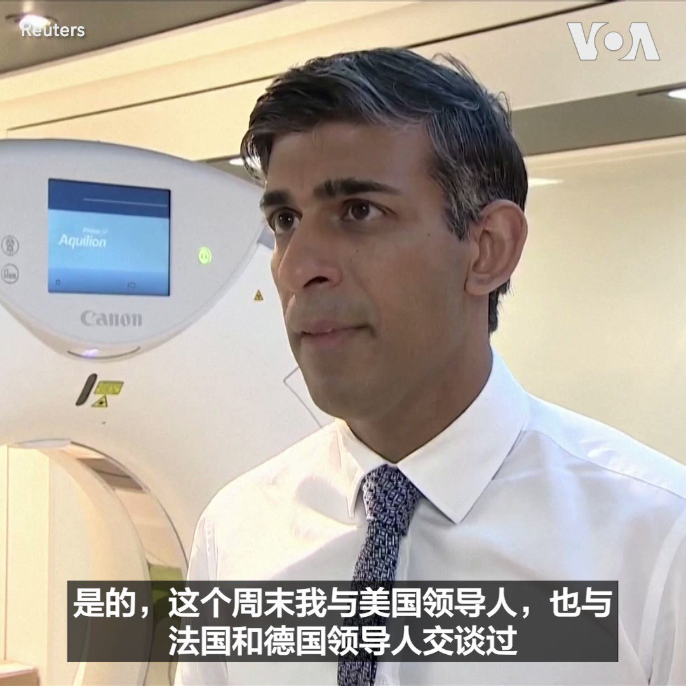
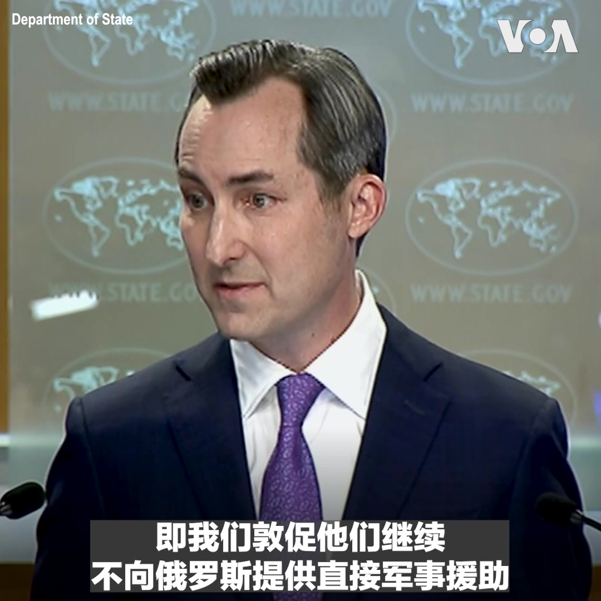
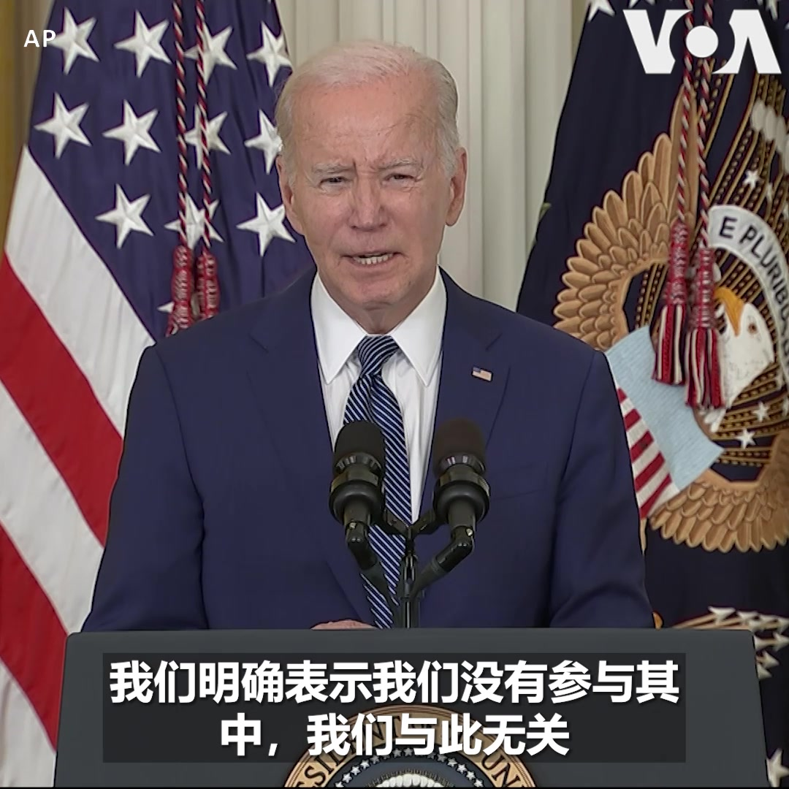
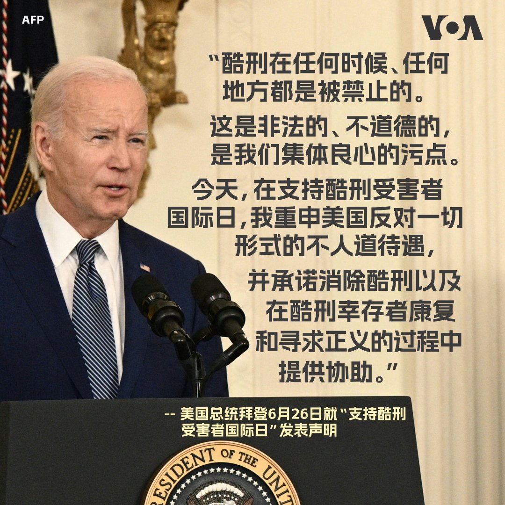

美国之音中文网 北京时间 2023-06-27T17:38:02Z 1673626734858735616 人权机构裁定荷兰芯片龙头ASML可拒绝某些国籍的求职者以遵循美国出口规则 https://t.co/nHoFyIWXZ3   美国之音中文网 北京时间 2023-06-27T18:22:33Z 1673637935034544129 多伦多选出首位华裔市长 香港出生的邹至蕙曾任加拿大国会议员 https://t.co/vtLNxEYLXC   美国之音中文网 北京时间 2023-06-27T15:22:33Z 1673592638870810624 中共军机抵近24海里线 台湾国防部称进入领空就反击 https://t.co/j7yQqdqZnT   美国之音中文网 北京时间 2023-06-27T15:52:35Z 1673600195395977217 虽首批交付核潜艇时间未定 美国仍对AUKUS项目有信心 https://t.co/uAM7IpyExj   美国之音中文网 北京时间 2023-06-27T13:26:34Z 1673563448427573248 曾在美国留学和工作 中国籍雇员被任命联合国副秘书长 https://t.co/t29A924QHl   美国之音中文网 北京时间 2023-06-27T13:42:04Z 1673567349281267714 日媒曝美日韩领导人筹备8月举办峰会 讨论朝鲜威胁与中国霸权 https://t.co/Ug0xYrzdcz   美国之音中文网 北京时间 2023-06-27T10:14:33Z 1673515125880520705 芝加哥地区一名药剂师因盗窃和出售新冠疫苗卡而被定罪 https://t.co/bt6BtcG2CI   美国之音中文网 北京时间 2023-06-27T10:14:34Z 1673515133639995396 中国、古巴军事情报合作抬头，解放军或将在入侵台湾时从后院攻击美国？ https://t.co/po7D3avUMx   美国之音中文网 北京时间 2023-06-27T10:28:03Z 1673518526580289537 阿姆斯特丹冬宫博物馆因乌克兰问题与俄罗斯断绝关系后更名 https://t.co/NnlmCUYhyU   美国之音中文网 北京时间 2023-06-27T10:28:05Z 1673518535405101056 胡佛报告：习近平网罗全球数据意图支配世界 https://t.co/Ry5N0zFIX5   美国之音中文网 北京时间 2023-06-27T06:43:04Z 1673461906299035648 欧盟将对乌军援增加到逾130亿美元 https://t.co/opbLreKRR9   美国之音中文网 北京时间 2023-06-27T06:55:58Z 1673465152296091649 “可以说，俄罗斯最近的事态发展让中国领导层感到不安,”白宫国安会印太协调员坎贝尔6月26日在战略与国际研究中心的一个讨论会上被问到俄罗斯过去72小时发生的事情是否会影响到习近平对普京的支持时说。
他还回答了为了与中方建立军方沟通渠道，是否值得取消美国对中国防长李尚福的制裁的问题。 https://t.co/aRaLgEhBlF   美国之音中文网 北京时间 2023-06-27T07:00:00Z 1673466167451873280 瓦格纳兵变震惊中南海，习近平是否更不敢打台湾？俄罗斯深陷“百年变局”，是否还有可能与中共联手挑战西方秩序？普京究竟还能撑多久？一个弱化的俄罗斯究竟对中国有利还是不利？美东时间週二上午9点【时事大家谈】欢迎留言参加讨论。 https://t.co/BCJbniU7zj   美国之音中文网 北京时间 2023-06-27T07:44:03Z 1673477251978121216 美参众两院军委会相继表决通过2024财年《国防授权法》， 新民调显示美民众持续支持助台抗中 https://t.co/ePUe4VHvUo   美国之音中文网 北京时间 2023-06-27T07:44:05Z 1673477260614180865 西方领导人：瓦格纳兵变失败凸显普京的弱点 https://t.co/fueZ3HVlYj   美国之音中文网 北京时间 2023-06-27T07:58:33Z 1673480903329447936 快速支援部队在喀土穆推进后 战斗蔓延苏丹东南部 https://t.co/WGKus6SCcb   美国之音中文网 北京时间 2023-06-27T09:01:52Z 1673496838014648320 一键解锁#美国热搜 榜 1、揭秘中国在海外的那些“瓦格纳公司”2、普里戈津发动的叛变预兆中国的不确定性3、道士姓党，听党指挥4、中国到洛杉矶货柜海运价格跌95%5、比较瓦格纳一日兵变与林彪叛逃6、厨师被要求背灭火器炒菜7、因噎废食，烧烤摊禁止用煤气8、重温小粉红对普京的深情诉说 https://t.co/gWJ2HPs0wA   美国之音中文网 北京时间 2023-06-27T09:42:33Z 1673507075727704065 美国再向乌克兰提供多达5亿美元援助 https://t.co/G1BUoD2OkE   美国之音中文网 北京时间 2023-06-27T09:59:06Z 1673511237827850241 联合国教科文组织成员国即将就美国重返申请投票 https://t.co/PXebJ4wlvh   美国之音中文网 北京时间 2023-06-27T04:32:08Z 1673428956090089478 德国、法国和意大利达成原材料合作协议 https://t.co/DL9iXASEGC   美国之音中文网 北京时间 2023-06-27T04:36:47Z 1673430125424295944 英国首相苏纳克26日表示，英国要做好准备，应对俄罗斯可能发生的不同状况；他指出瓦格纳雇佣兵集团与俄罗斯总统普京之间的紧张可能造成破坏稳定的影响，并强调要与盟友保持紧密联系确保协调行动来应对各种状况。 https://t.co/oYUYydV5Gc   美国之音中文网 北京时间 2023-06-27T05:02:10Z 1673436513818882049 未遂兵变后，普京与普里戈津分别首次公开发话 https://t.co/zZQN1bvDDw   美国之音中文网 北京时间 2023-06-27T05:17:33Z 1673440384863858689 巴基斯坦军方：102名前总理汗的支持者在军事法庭受审 https://t.co/zsg9jbzmni   美国之音中文网 北京时间 2023-06-27T05:27:11Z 1673442808945086464 瓦格纳兵变事件是否会让中国在乌克兰战争中对俄罗斯的支持产生犹豫？美国国务院发言人马修·米勒6月26日在例行记者会上回答此问题时说，他不想猜测中国政府的观点，但他表示，美国敦促中国继续不要向俄罗斯提供直接军事援助。 https://t.co/nwMyBpJ0EK   美国之音中文网 北京时间 2023-06-27T06:15:34Z 1673454984443330560 塞尔维亚在逮捕增加紧张局势后释放了三名科索沃警察 https://t.co/HRzxDxVp7P   美国之音中文网 北京时间 2023-06-27T02:38:05Z 1673400254430052352 黄浦江封: 瓦格纳兵变冲击中国 敲响个人威权体制丧钟 https://t.co/cHS1SBhpor   美国之音中文网 北京时间 2023-06-27T02:41:47Z 1673401187113250817 美国总统拜登6月26日表示， 他和国安团队全程密切监控瓦格纳兵变过程，并和主要盟友及乌克兰总统泽连斯基保持密切协调。“我们必须确保不给普京任何借口，我强调，我们不给普京任何借口，将这归咎于西方或北约，”拜登说，“我们明确表示我们没有参与其中，我们与此无关，这是俄罗斯体制内斗争的一部分。” https://t.co/HKXC6uzY2J   美国之音中文网 北京时间 2023-06-27T04:08:37Z 1673423038753411072 6月26日是联合国支持酷刑受害者国际日。美国总统拜登发表声明说，酷刑摧毁生命和家庭，但每天，世界各地的人权和人类尊严都遭受着这种可怕的侵犯。拜登说，在乌克兰，有俄罗斯军队实施令人震惊的暴行的证据；在朝鲜，可信的报道称政府对妇女实施酷刑和其他形式的残忍处罚。 https://t.co/EFhdNW8Eno   美国之音中文网 北京时间 2023-06-27T00:38:40Z 1673370200744546304 美国财政部长耶伦23日在巴黎的一次峰会上表示世界期待美国与中国两大经济体合作。这次峰会决定给弱势国家提供1000亿美元特别提款权，缓解债务和应对气候变化的影响。 https://t.co/xNkIMyp0iP   美国之音中文网 北京时间 2023-06-27T00:53:04Z 1673373826699374593 美朝鲜问题专家出新书描述金正恩胞妹金与正为“嗜杀恶魔” https://t.co/sdwWO2Yfxu   美国之音中文网 北京时间 2023-06-27T01:39:33Z 1673385524990722048 防疫解封后首次穆斯林朝觐开始，前往沙特的伊斯兰教徒预计多达200万 https://t.co/VfCDV20dUj   美国之音中文网 北京时间 2023-06-27T01:55:03Z 1673389424988819458 澳大利亚高等法院驳回俄罗斯的使馆禁令  https://t.co/clX6TTFbc6   美国之音中文网 北京时间 2023-06-27T02:10:10Z 1673393230141075456 美中恢复高层会谈之际 观察人士: 习近平的“极限思维”恐再添“灰色地带冲突” https://t.co/Z7XCmMOzxq   