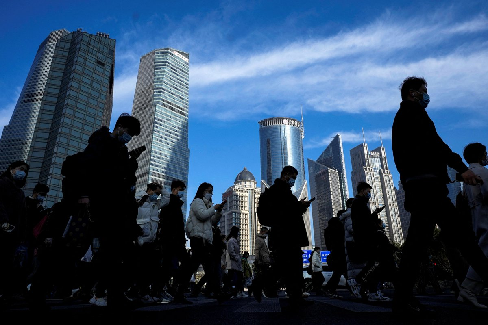
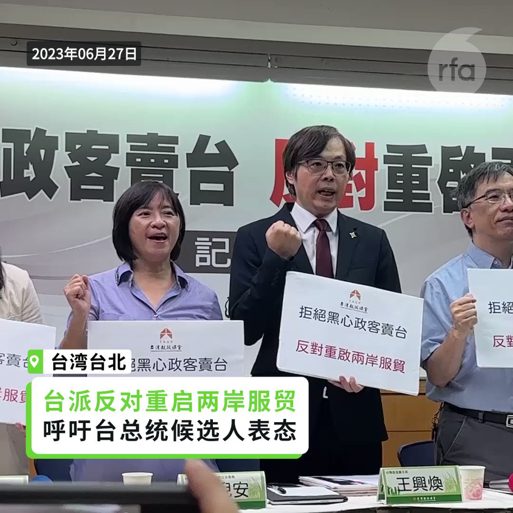
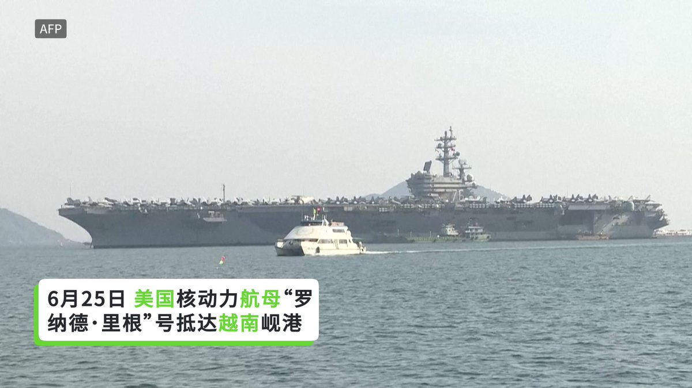
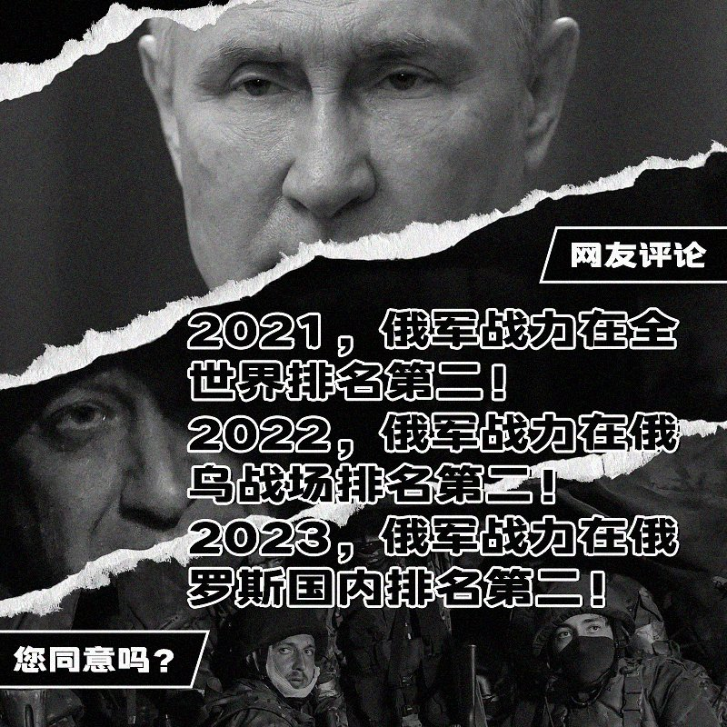
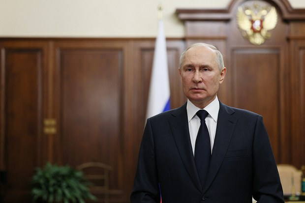
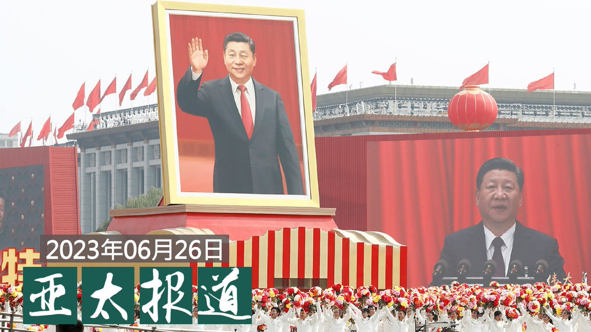
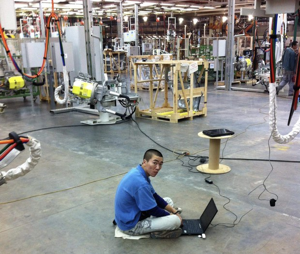
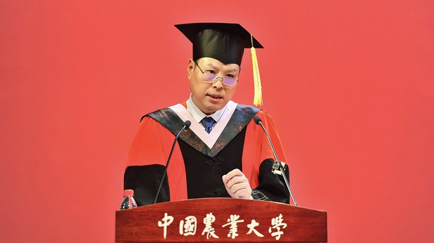

自由亚洲电台 北京时间 2023-06-27T22:12:44Z 1673695863057547265 RT @RFA_Chinese: 近日，赣州市人大常委会机关出台文件，加强对离退休干部因私出国的管理。

老干部润出中国现象引发网友强烈质疑：他们为何放弃国内优厚待遇，老来远走他国？在美加等发达国家，生活成本远超国内，他们哪来那么多钱？有网友建议剥夺出国养老离退休人员的退休福利…   自由亚洲电台 北京时间 2023-06-27T19:00:36Z 1673647512887103488 【审计报告显示70地区虚增收入逾800亿】
【学者：为中纪委采取行动作铺垫】
中国审计署最新发布的2022年度 #审计报告 显示，去年70个地区 #虚增财政收入 逾800亿元。移送重大违纪违法问题线索300多起。
财经评论人士蔡慎坤周二接受本台采访时说：“审计署长期以来由中央一把手控制，他是贯彻一把手的意思，各地审计署也是。他所谓发现的问题，也都是即将开展 #反腐 的那些问题，就是对原有的他不满意的一些部门或机构，要进行反腐的，就通过审计署，审计署从某种程度上扮演的中纪委的经济审计的角色。”
详细报道：https://t.co/9mXqIwMAkz   自由亚洲电台 北京时间 2023-06-27T19:32:10Z 1673655457859215363 【台派社团反对重启两岸服贸协议】
【呼吁总统参选人表态】

“重启两岸 #服贸协议”近日成为台湾总统大选话题。台湾本土派社团召开记者会表示反对，呼吁各党参选人应对是否重启服贸进行表态。与会的台北市议员苗博雅直指，当前全世界都在 #围堵中国，重启服贸把台湾锁进中国只是“绕远路”，更冒着被迫承认“#一中”政治前提的风险，台湾应把有限资源、人力投入和民主阵营国家的经贸谈判。   自由亚洲电台 北京时间 2023-06-27T17:33:48Z 1673625668754743296 https://t.co/uOOGLnnX1s   自由亚洲电台 北京时间 2023-06-27T16:23:06Z 1673607876512972803 【政府财政吃紧 乐山卖大佛经营权】
【多地医院卖陪护服务】
四川风景区管委会近日被曝光以17亿元出售 #乐山大佛 30年经营权。北京、上海等地的公立医院则不准患者家属陪护，该由医院提供收费看护服务。另有上海多家餐厅出售凉菜被罚款。
https://t.co/svEhxjtMJO https://t.co/9Fnz2prZ8z   自由亚洲电台 北京时间 2023-06-27T10:17:26Z 1673515854519230464 评论 | #陈光诚：心善行正事 天生为共敌
https://t.co/UQzTCwS8Lk   自由亚洲电台 北京时间 2023-06-27T06:21:06Z 1673456377132630016 近日，赣州市人大常委会机关出台文件，加强对离退休干部因私出国的管理。

老干部润出中国现象引发网友强烈质疑：他们为何放弃国内优厚待遇，老来远走他国？在美加等发达国家，生活成本远超国内，他们哪来那么多钱？有网友建议剥夺出国养老离退休人员的退休福利，这合理吗？ https://t.co/XZ198EV8vG   自由亚洲电台 北京时间 2023-06-27T06:34:50Z 1673459835105574912 美越提升双边关系制衡中国？美国航母“罗纳德･里根”号访问越南。 https://t.co/9F4WagLmaw   自由亚洲电台 北京时间 2023-06-27T06:54:13Z 1673464713752068096 RT @RFA_Chinese: 俗话说，害人之心不可有；防人之心不可无。德国机床公司 #德玛吉（DMG MORI）日前通知其在中国的企业，从4月1号起对该厂在华的每台机床加装位置传感装置。如果移动该机床位置，传感装置将启动，机床就会上锁，导致无法使用，需要该厂授权代表解锁。这…   自由亚洲电台 北京时间 2023-06-27T07:34:55Z 1673474952622899200 美国国务卿 #布林肯访华 至今，美中之间仍未建立直接的军事对话机制。本周一， 美国国家安全委员会印太事务协调员 #坎贝尔（Kurt Campbell）再度强调了美中沟通对于维护地区安全的重要性。

https://t.co/RwhdpyoYJo   自由亚洲电台 北京时间 2023-06-27T07:40:16Z 1673476300969787395 【#瓦格纳兵变 增强普京权威？】
《纽约时报》称兵变凸显 #普京 权力脆弱，这是他统治俄罗斯23年以来个人权威遭遇的最大挑战，俄罗斯的稳定已无处可寻。
但中国《环球时报》称这是西方对俄罗斯政治的"妄想"。叛乱在短时间内被平息，表明克里姆林宫保持着强大的威慑能力，这将进一步增强其权威。在中国社交媒体上能看到许多支持普京的帖子。
您怎么看？   自由亚洲电台 北京时间 2023-06-27T08:00:00Z 1673481268129067016 #事实查核｜美国"#应急撤离计划"是将 #台湾 当作“棋子”的阴谋？
https://t.co/wEQp8CS5wf   自由亚洲电台 北京时间 2023-06-27T09:00:01Z 1673496371482226688 专栏 | #夜话中南海：#薄熙来 大秘 #徐鸣 退休后是如何回重庆"“利用影响力"的
https://t.co/UxrWDhXdZ1   自由亚洲电台 北京时间 2023-06-27T09:23:02Z 1673502165166333952 RT @RFA_Chinese: 近日，赣州市人大常委会机关出台文件，加强对离退休干部因私出国的管理。

老干部润出中国现象引发网友强烈质疑：他们为何放弃国内优厚待遇，老来远走他国？在美加等发达国家，生活成本远超国内，他们哪来那么多钱？有网友建议剥夺出国养老离退休人员的退休福利…   自由亚洲电台 北京时间 2023-06-27T04:25:29Z 1673427280453079040 5月1日上午，位于山东的中化集团鲁西化工双氧水生产区发生爆炸火灾，造成9死、1伤、1失联；
5月26日，河北廊坊大城县臧屯派出所爆炸案造成4死，2失联，该事件疑似警方囤放非法爆竹酿祸；
6月13日，天津两个小区发生爆炸，导致3死、多人受伤，嫌疑人利用烟花爆竹作案。
https://t.co/H2CD59fCiU   自由亚洲电台 北京时间 2023-06-27T04:36:45Z 1673430116284747782 【#普里戈津 突然发表音频讲话】
把这次叛乱称为“起义”，表示无意推翻普京政权。据美国《纽约时报》，这段音频是6月26日发布在社交媒体电报（Telegram）群里的。

英国《卫报》在网站上发布了普里戈津讲话的音频节选。普里戈津在讲话中强调，这次行动表明俄罗斯在领土安全上存在严重问题，而起义行动是基于社会的要求，因为俄罗斯入侵乌克兰的军事领导层存在失败。

另据《纽约时报》报道，普里戈津在讲话中解释说，这次行动是为了抗议国防部强迫他的部队与政府签订协议，协议将使得瓦格纳军队从7月1日起停止在乌克兰的行动。但当看到继续抗议可能导致俄罗斯人流血，瓦格纳就停止了行动。

据《卫报》报道，普里戈津还表示，他的部队将抵制被俄罗斯国防部吞并，并拒绝签订合同；同时，瓦格纳甚至可能被允许在白俄罗斯继续进行行动。

普里戈津在讲话中还指责俄罗斯正规军对瓦格纳的炮击，并称这次起义就是为了防止瓦格纳军队被摧毁，并追究那些由于其不专业行为而犯下大量错误的官员的责任。

同时他又声称，瓦格纳军队进入俄罗斯境内是对俄罗斯入侵乌克兰的示范，如果让瓦格纳来采取入侵行动，有可能一天就能完成任务。普里戈津矛头针对的俄罗斯国防部长绍伊古周一早些时候露面，一段视频显示他参观了‘西部’集团军的前沿指挥所。

普里戈津没有表明他的所在地，也没有透露是否会按照先前与白俄罗斯领导人卢卡申科达成的协议一样流亡到白俄罗斯。   自由亚洲电台 北京时间 2023-06-27T04:38:30Z 1673430556803997697 【普京现身讲话 将对叛乱组织者追责】
俄罗斯总统 #普京 在周六瓦格纳部队的叛乱中止后，约两天时间没有现身，直到周一晚当地时间10点突然通过电视发表讲话。英国天空新闻实时转播了这次讲话。

普京在讲话中强调，将对周六这次叛乱的组织者追究刑事责任，他强调，每个人都知道应当如此。他说这是刑事犯罪，削弱了国家，是从外部对国家的威胁。

他还说，叛乱的组织者违背了那些被迫卷入这一组织的人们。这种自杀性的行为是新纳粹，他们的目的是让俄罗斯士兵互相屠杀，他们就是想杀害士兵和普通人，想分裂俄罗斯社会。他们是想为自己的失败而进行报复。但他们做错了。

同时，俄罗斯人也知道瓦格纳军队的绝大多数人都是忠于俄罗斯的。他们凭借自己的勇气保卫了顿巴斯。而他们最后在叛乱行动中转过身来，避免了俄罗斯人流血。要感谢这些决定中止行动，避免了流血冲突的士兵们。普京希望这些士兵能与国防部联系，或者回到自己的家。俄罗斯政府将遵守之前的誓言。现在就是取决于这些士兵自己的选择了。普京在讲话的最后感谢了白俄罗斯总统卢卡申科斡旋这场叛乱，帮助俄罗斯恢复了和平。

据英国广播公司（BBC）周一早些时候曾报道，俄罗斯多家媒体披露，普里戈津仍在因试图组织武装叛乱而受到调查，针对普里戈津的刑事案件尚未撤销。而据半岛电视台网站周日（6月25日）报道，在克里姆林宫发言人佩斯科夫透露的普京和卢卡申科之间的协议要点中提到，结束针对普里戈津的刑事指控，之后他将前往白俄罗斯。

周一早些时候，瓦格纳部队的首领普里戈津通过社媒发布了一段11分钟的讲话音频，强调他并无意推翻普京政权。   自由亚洲电台 北京时间 2023-06-27T05:00:00Z 1673435970438586368 评论 | 王丹 @wangdan1989 ：关于 #瓦格纳 军团哗变的几点思考
https://t.co/AIos6Rnf6h   自由亚洲电台 北京时间 2023-06-27T05:45:44Z 1673447477557727232 专栏 | #西藏纵览：#冬虫夏草 减产给西藏牧民带来压力；藏族学生仅能使用汉语参加高考
https://t.co/B5dBSEqeDO   自由亚洲电台 北京时间 2023-06-27T05:53:06Z 1673449332434169856 【#亚太报道（2023-6-26）】
欢迎收听和订阅播客【亚太报道】 https://t.co/MjLNSvVMqc

中方观望 #瓦格纳兵变 引热议 / “#习思想”要为爱国教育指明方向 / 中国农大院长向毕业生呼唤公民意识 / 湖南异议人士 #谢文飞被以“寻衅滋事罪”判刑 / 德国企业给销往中国的机床“上锁” https://t.co/S1KucrbmyA   自由亚洲电台 北京时间 2023-06-27T06:00:03Z 1673451082054537217 评论 | #程晓农：#台海 和与战，究竟作何解？
https://t.co/lj5QUCZAJs   自由亚洲电台 北京时间 2023-06-27T06:10:07Z 1673453612498812928 RT @RFA_Chinese: 【#普里戈津 突然发表音频讲话】
把这次叛乱称为“起义”，表示无意推翻普京政权。据美国《纽约时报》，这段音频是6月26日发布在社交媒体电报（Telegram）群里的。… https://t.co/pCtvFcVjOt   自由亚洲电台 北京时间 2023-06-27T06:10:46Z 1673453779054735362 RT @RFA_Chinese: 【普京现身讲话 将对叛乱组织者追责】
俄罗斯总统 #普京 在周六瓦格纳部队的叛乱中止后，约两天时间没有现身，直到周一晚当地时间10点突然通过电视发表讲话。英国天空新闻实时转播了这次讲话。… https://t.co/ILHsome5O4   自由亚洲电台 北京时间 2023-06-27T02:38:18Z 1673400310138830848 中国外交部发言人 #毛宁 就“#瓦格纳兵变”答外媒记者提问，表示中方支持并相信俄罗斯可以维护国家稳定。
美国国务卿 #布林肯 在接受采访时表示，瓦格纳兵变显示出俄罗斯国家权威的真正裂痕。
您怎么看？ https://t.co/Z35ay00Y9e   自由亚洲电台 北京时间 2023-06-27T03:10:48Z 1673408488922583041 德国 #大众汽车 计划将其与一家中国芯片制造商合作研发的技术留在中国，以免受到美国芯片禁令影响。
日本卫浴产品制造商 #骊住集团(Lixil)则在重组其供应链，在中国生产面向中国的产品，在北美生产面向美国的产品。
这种“孤岛”经营策略利弊何在？
https://t.co/uubtquR3XY https://t.co/Aur5JXD9Ly   自由亚洲电台 北京时间 2023-06-27T03:47:49Z 1673417801506123780 【中国农大院长 #叶敬忠 毕业致辞】说得很好，转起来！
面对权力的包围，我不能要求你们像一枚鸡蛋撞向坚硬的高墙，但希望你们能够保留装在脆弱外壳里那颗真善美的灵魂；希望你们不要熄灭灵魂深处那束真善美的光；希望你们保持向着真善美的那束光自由奔跑的勇气，即便摔了一跤，也可以面带微笑。你们的奔跑或许可以让更多人获得平等，让更多人享有自由，让更多人得到尊重。

https://t.co/UukI6l9wJF   自由亚洲电台 北京时间 2023-06-27T00:30:01Z 1673368023389077505 英国媒体《星期日邮报》近日披露，中国监控摄像头正在英国 #军情六处 总部前录制 英国间谍的画面。

报道称，这些摄像头是中国 #海康威视 公司制造，该公司被美国政府以国家安全为由已经在美国联邦建筑物中禁用，而现在它们被安装在英国军情六处伦敦基地前大门对面的路灯上。
https://t.co/WfWYfCmUkQ   自由亚洲电台 北京时间 2023-06-27T01:11:19Z 1673378418317049862 《华尔街日报》指出，知情人士称，中国官员暗示，台湾副总统 #赖清德 的政治立场可能会加剧 #台海 紧张局势，进一步损害美中关系。中国官员显然希望能够争取美国的合作 ...中国官员问 #布林肯，对明年1月台湾选举的结果，美国是否有既得利益，美国人是否将民进党视为朋友。

https://t.co/B2lscubbl1   自由亚洲电台 北京时间 2023-06-27T02:24:21Z 1673396799518961664 总部设于伦敦的人权组织“#香港监察”（Hong Kong Watch）周六（24日）在伦敦举办“静默拍卖会”，十五位身在海外的香港艺术家捐出作品展出及拍卖，包括港人熟悉的阿涂、黄照达、张嘉莉、#淋漓淋浪等，不少作品都与香港历史文化有关。

https://t.co/ar1IkJNUrL   自由亚洲电台 北京时间 2023-06-27T00:00:14Z 1673360531284176896 中国官方媒体本周一披露，当局正计划专门立法，加强爱国主义教育，并以所谓的“#习思想”作为指导。有评论认为，此举旨在强化对青少年实施 #洗脑教育，以及便于习近平在政治上打击异己。

https://t.co/RYh4zY9BSQ   