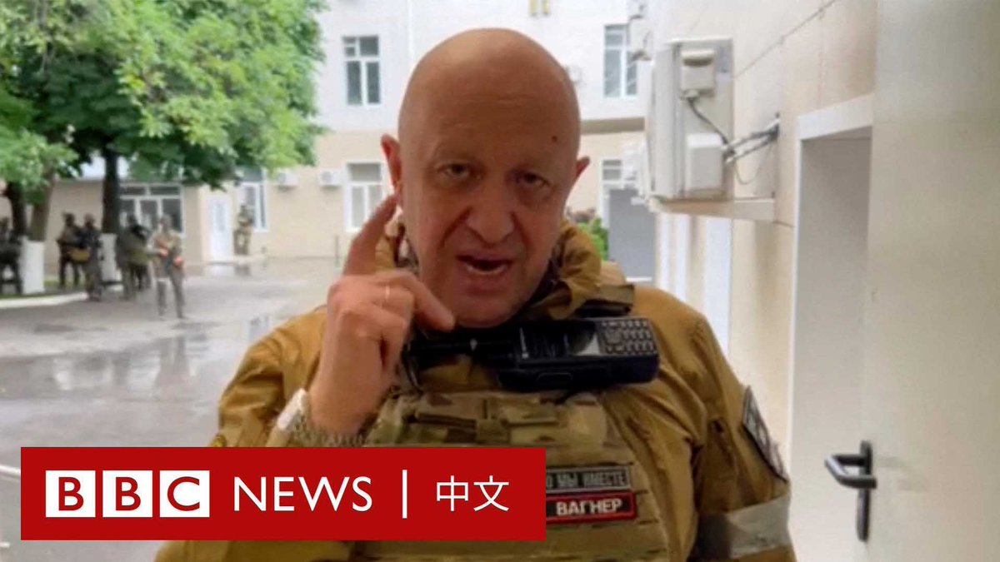
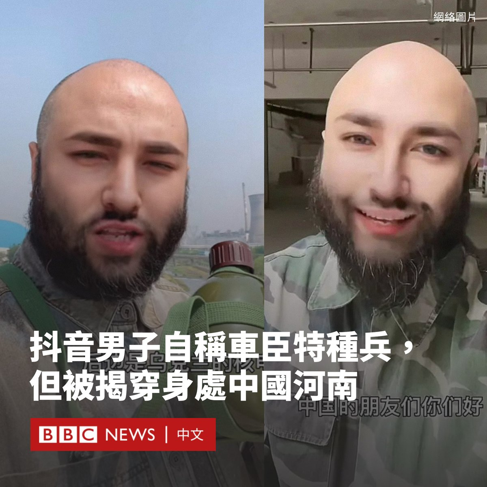
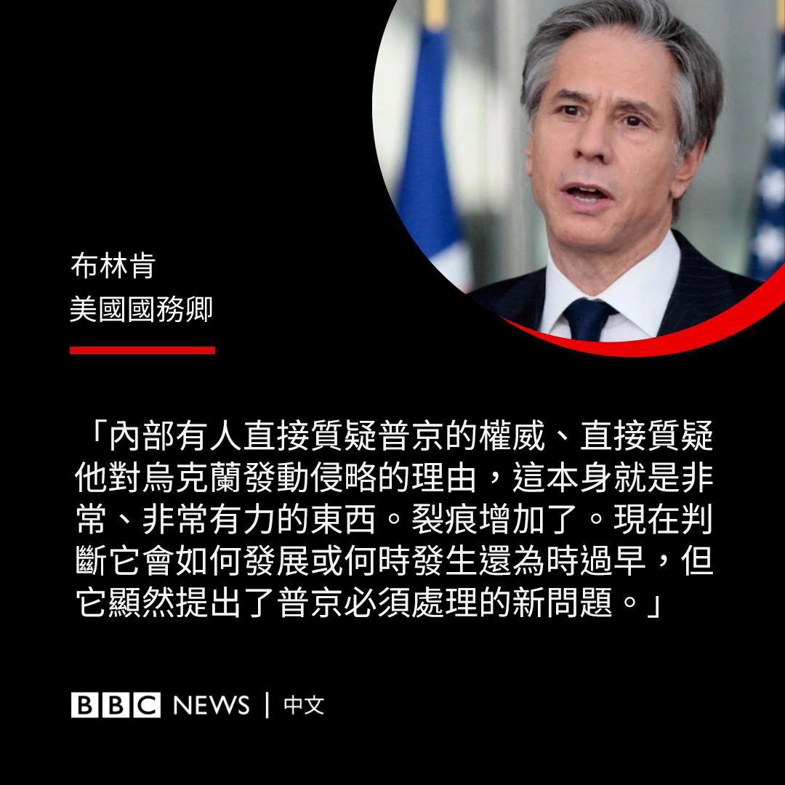
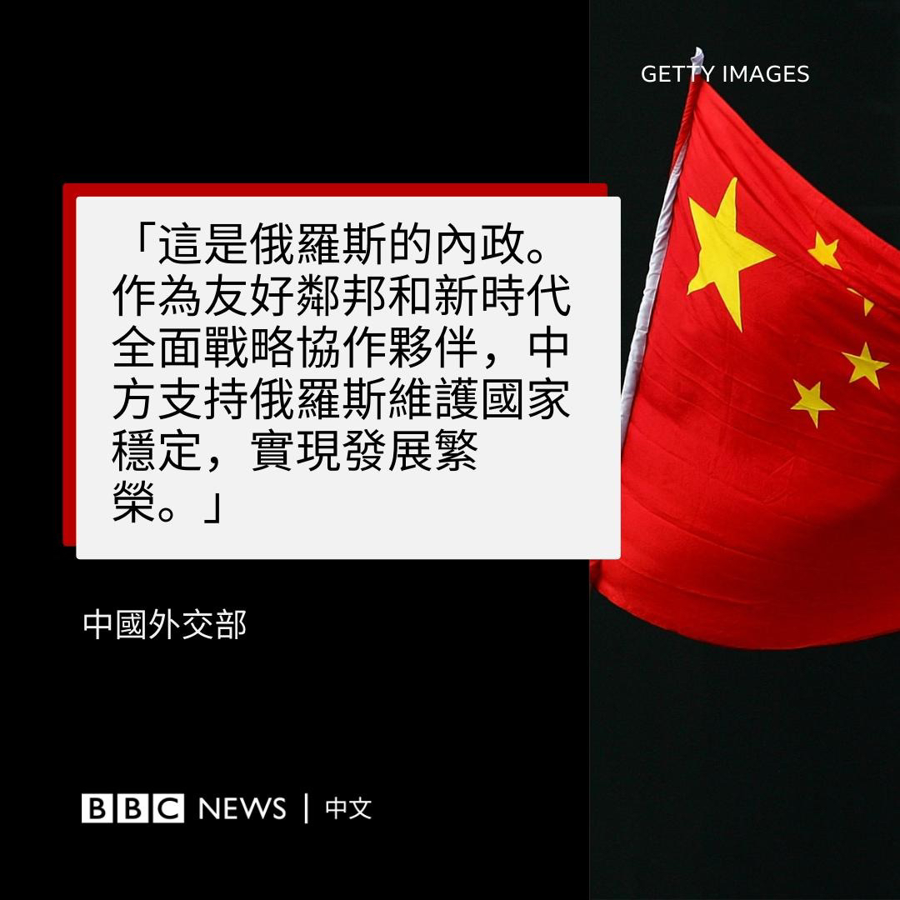
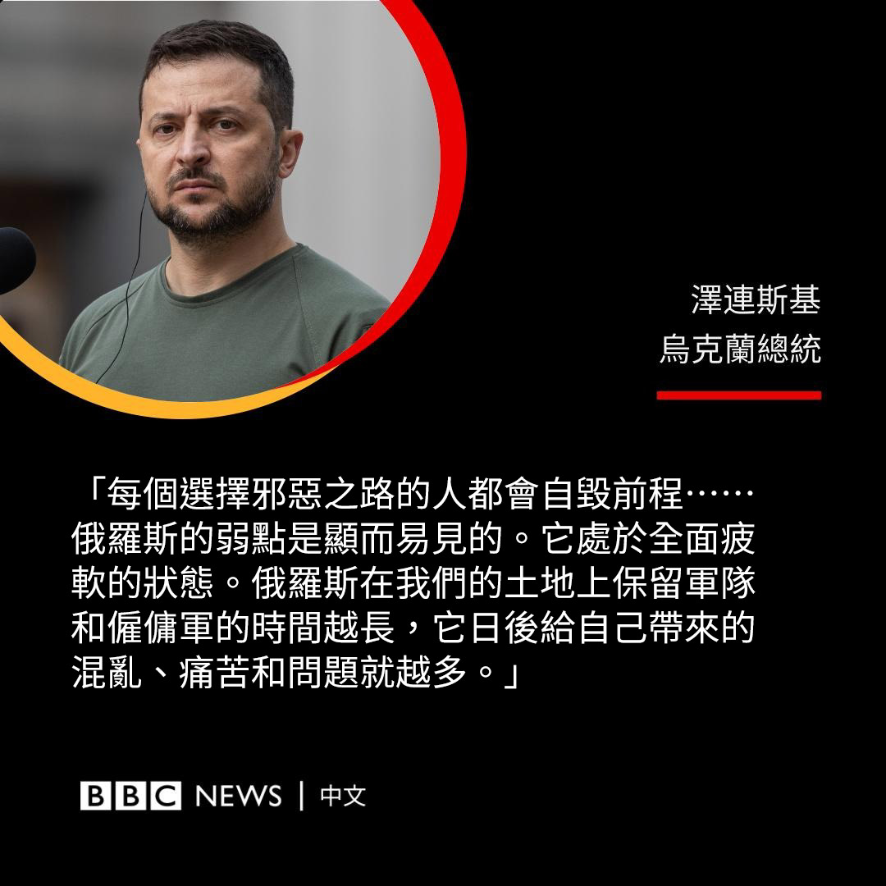

D英国广播公司BBC 北京时间 2023-06-26T22:00:01Z 1673330277068963841 瓦格纳集团的兵变如同闪电般开始，也如同闪电般结束，但普京昔日密友领导的这场仅持续了24小时的短暂叛变将带来怎样的后续影响？BBC记者罗斯·阿特金斯（Ros Atkins）为你解释。 https://t.co/W1XS36V0q9   D英国广播公司BBC 北京时间 2023-06-26T18:40:00Z 1673279939616067585 被关押的缅甸民选领袖昂山素季（Aung San Suu Kyi）之子金‧阿里斯（Kim Aris）接受BBC独家采访，呼吁军方释放他的母亲。

2021年，昂山素季政府被军方政变推翻后，她被判处33年监禁。持英国国籍的金‧阿里斯表示，军方没有向他提供任何有关其母亲或她健康状况的信息。 https://t.co/UUwAMoFhWf   D英国广播公司BBC 北京时间 2023-06-26T20:18:02Z 1673304610314899458 美国情报机关解密一份报告，指出武汉病毒研究所是新冠病毒之说既无直接证据，又不能排除之际，两名被媒体报道指为“零号病人”的武汉科学家投书美国期刊否认指控。https://t.co/15vLSYj8IG   D英国广播公司BBC 北京时间 2023-06-26T16:34:22Z 1673248322533093378 加拿大多伦多即将迎来市长选举，这次选举历史性地吸引了101人参加，以及一只狗。

这只名为“莫莉”（Molly）的狗是一只六岁的狼和哈士奇混血犬。由于选举规则要求候选人必须年满18岁，且为加拿大公民，这使得莫莉的主人托比·希普斯（Toby Heaps）和她一起联合参选。

希普斯表示，他们的施政纲领之一包括减少城市道路冬季融雪剂的滥用，因为这种含盐量极高的融雪剂会对犬类柔嫩的爪垫造成伤害。

他们的竞选活动还提出要解决高昂房价的问题、对大型企业加税、禁止在新住宅和商业建筑中使用化石燃料加热系统等。

尽管一些人批评希普斯的竞选活动是“恶搞”，希普斯称，如果他们的组合胜选，他将指定莫莉为该市第一个荣誉狗市长。

“我认为，如果房间里有一只动物，市政厅会做出更好的决定。”他告诉BBC。

此次选举是在该市主政八年的前市长庄德利（John Tory）辞职后进行的补选。尽管他三次连任，但批评者认为他任内多伦多的不平等加剧，暴力活动也有所增加。

今年2月，当地媒体披露这名已婚市长在新冠疫情期间，与一名工作人员有染。他在文章发表后的几个小时内提出辞职。

此次选举的参选门槛非常低。多伦多市民只需缴纳250加元（189美元）和25个签名即可参加竞选。由于候选人不按政党路线竞选，这意味着没有提名过程，不会减少候选人的数量。

专家认为，100多名候选者出现在选票上有利有弊。一方面，它确保了各种声音都能被纳入其中，但另一方面这意味着下一任市长很可能由很小比例的人口决定。   D英国广播公司BBC 北京时间 2023-06-26T17:32:17Z 1673262899077455872 【最新消息】据俄罗斯多家通讯社报道，瓦格纳集团首领普里戈津（Yevgeny Prigozhin）仍在因试图组织武装叛乱而接受调查。

“针对普里戈津的刑事案件尚未撤销。”俄罗斯三家主要新闻机构塔斯社（TASS）、俄罗斯新闻社（RIA）和国际文传电讯社（Interfax）援引俄罗斯总检察长办公室消息人士的话说。

克里姆林宫此前表示，普里戈津将前往白俄罗斯，针对他的刑事案件将被撤销。   D英国广播公司BBC 北京时间 2023-06-26T14:54:36Z 1673223215035056133 几个月来，中国抖音上的一名名为“保尔·柯察铁”的男子吸引了超过30万粉丝。他声称自己是一名在乌克兰前线作战的俄罗斯士兵，但人们发现他实际位于中国河南省。

抖音在上周发布的一份声明中表示，由于他仿冒俄罗斯军人“博取流量”，已无限期封禁其账号。

在影片中，这名光头并留有络腮胡的男子说着普通话。他称自己是一名车臣特种部队的士兵。

“中国的朋友们你们好，我们现在乌克兰哈尔科夫的核电站。”他在一条被广为转发的影片中说道。

在其他的影片中，他还声称自己活捉了美军士兵，并且扣押了乌克兰总统泽连斯基（Volodymyr Zelensky）的汽车。借助这些影片的热度，他得以在自己的网店大卖包括伏特加酒、蜂蜜在内的俄罗斯商品。

然而，一些网友发现了疑点，例如他说话带有中国方言口音，而其账号的IP地址显示他在河南省。人们还发现，他的视频中所谓的“核电站”其实是河南洛阳的一家发电厂。

据中国媒体“第六声”（Sixth Tone）报道，他最终被发现使用了Deepfake技术和人工智能工具，来改变自己的外表，编造虚假身份。

去年，一位自称来自俄罗斯、名叫“娜娜”的女子因分享自己在中国的生活而走红，吸引了近200万粉丝。但该账号最终被揭露是一名中国人通过化妆和使用变脸特效工具来假冒俄罗斯人，在被用户投诉和官方媒体批评后被封号。   D英国广播公司BBC 北京时间 2023-06-26T13:22:07Z 1673199942293241859 俄罗斯经历了混乱而戏剧化的周末，在一天多的时间内，曾协助俄军入侵乌克兰的瓦格纳雇佣军发动叛乱，并朝莫斯科进军，但在短时间内又与当局达成退兵协议。

美国国务卿布林肯（Antony Blinken）表示，瓦格纳的叛变是“非同寻常的一幕”，展现了俄罗斯政治中“真正的裂痕”。他表示，此次兵变带来了许多“深刻的问题”，其将在“未来几天和几周内”得到解答。

乌克兰总统泽连斯基（Volodymyr Zelensky）在推特上写道，该事件展现了“俄罗斯的领导人们无法控制任何事”，是一场“完全的混乱”。

他在另一条推文中称，“任何选择邪恶道路的人都会毁灭自己”，并补充说：“长期以来，俄罗斯利用宣传来掩盖其软弱和政府的愚蠢。现在其局势如此混乱，任何谎言都无法掩盖。”

中国外交部周日（6月25日）发表声明，称该事件是“俄罗斯的内政”。声明指：“作为友好邻邦和新时代全面战略协作伙伴，中方支持俄罗斯维护国家稳定，实现发展繁荣。”   D英国广播公司BBC 北京时间 2023-06-26T11:38:27Z 1673173853088915456 特斯拉CEO马斯克（Elon Musk）和微软创始人比尔·盖茨（Bill Gates）半个月内先后访华，受到高层热情和高规格的接待。但另一方面，北京对德勤、美光、贝恩等知名外企施以重拳。

中国政府为何对不同的外企区别对待？在中国和西方日益紧张的关系下，中国和外资企业还互相需要吗？https://t.co/6FNmnPw2OV   D英国广播公司BBC 北京时间 2023-06-26T09:20:25Z 1673139115926384640 墨西哥城市墨西卡利位于美墨边境线上。这里有一座“地下中国城”，它最初由中国移民在20世纪初修建。

它曾是墨西哥最大、最繁荣的华裔社区，在1920年，华裔人口达到约1.7万。如今，这里的华裔移民希望将这座“地下中国城”开发成当地的旅游项目，吸引更多的华人到访。 https://t.co/c11AYjLiRs   