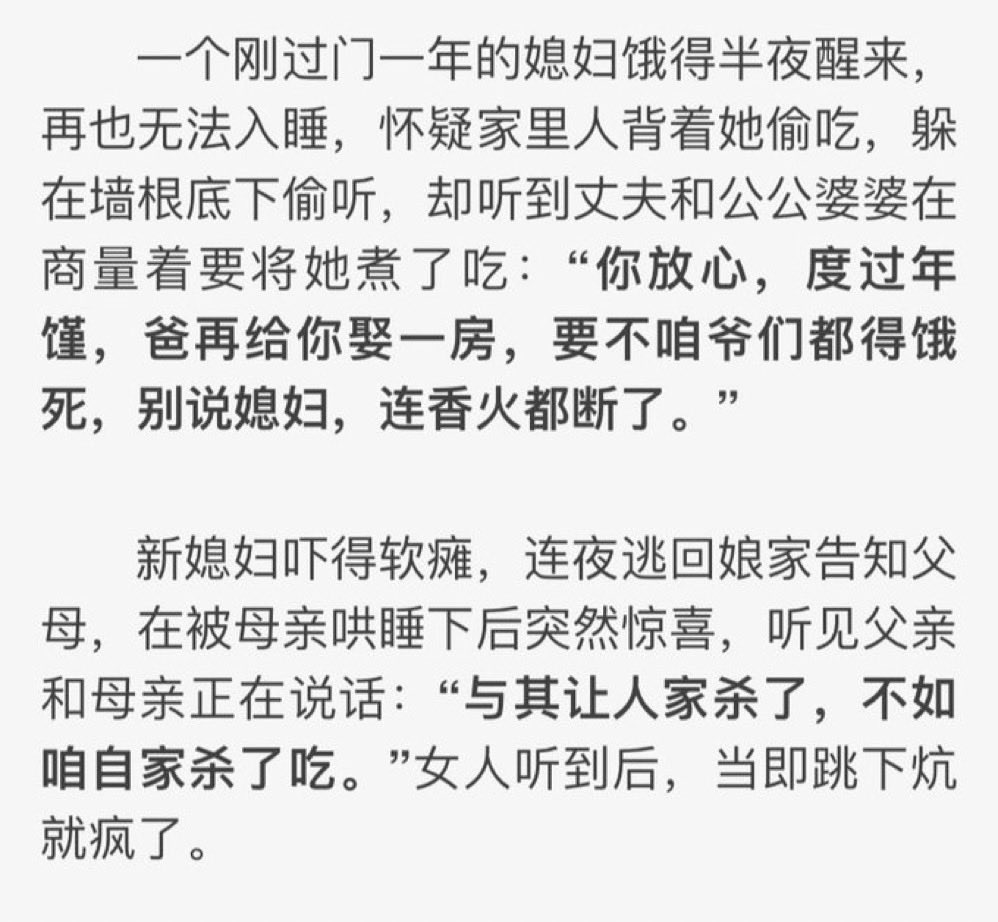
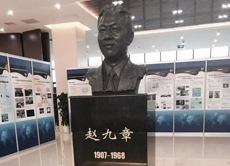

Ivy未央 北京时间 2023-06-26T11:36:28Z 1673173355476705281 《白鹿原》人吃人的年代 https://t.co/we0lHtG5aI   Ivy未央 北京时间 2023-06-26T09:03:32Z 1673134865913376773 转）1945年，赵九章提出“长波斜压不稳定”理论，成为现代天气预报的理论基础之一
1949年，赵拒绝赴台，成为中国人造卫星的奠基人。文革中被打成反动学术权威，受尽凌辱迫害
1968年，赵选择自杀。同年，中国科学院有20名一级研究员自杀
—— 人才都整死了，然后告诉人民说，落后都是因为外国封锁造成的 https://t.co/c6xHQ3wvQy   