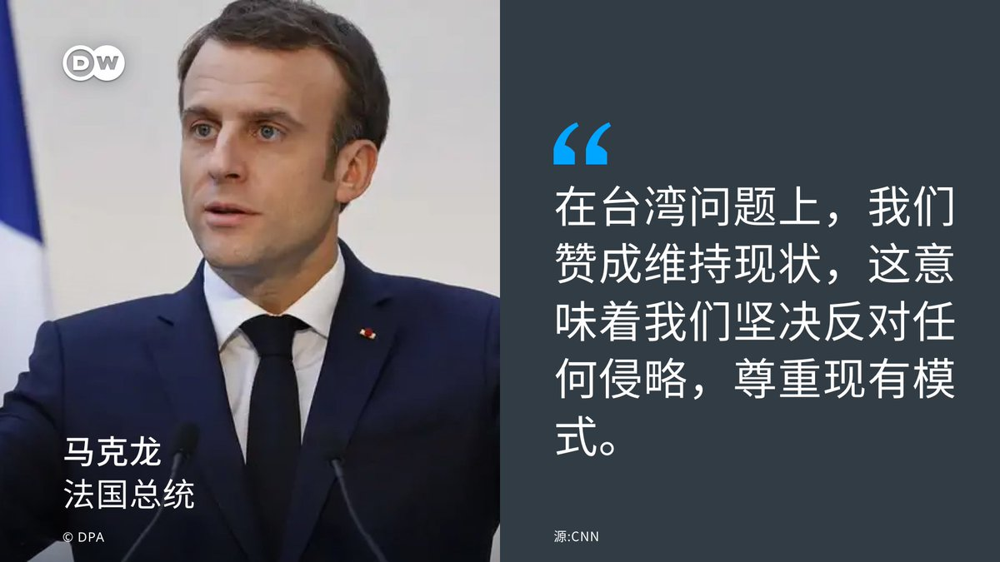
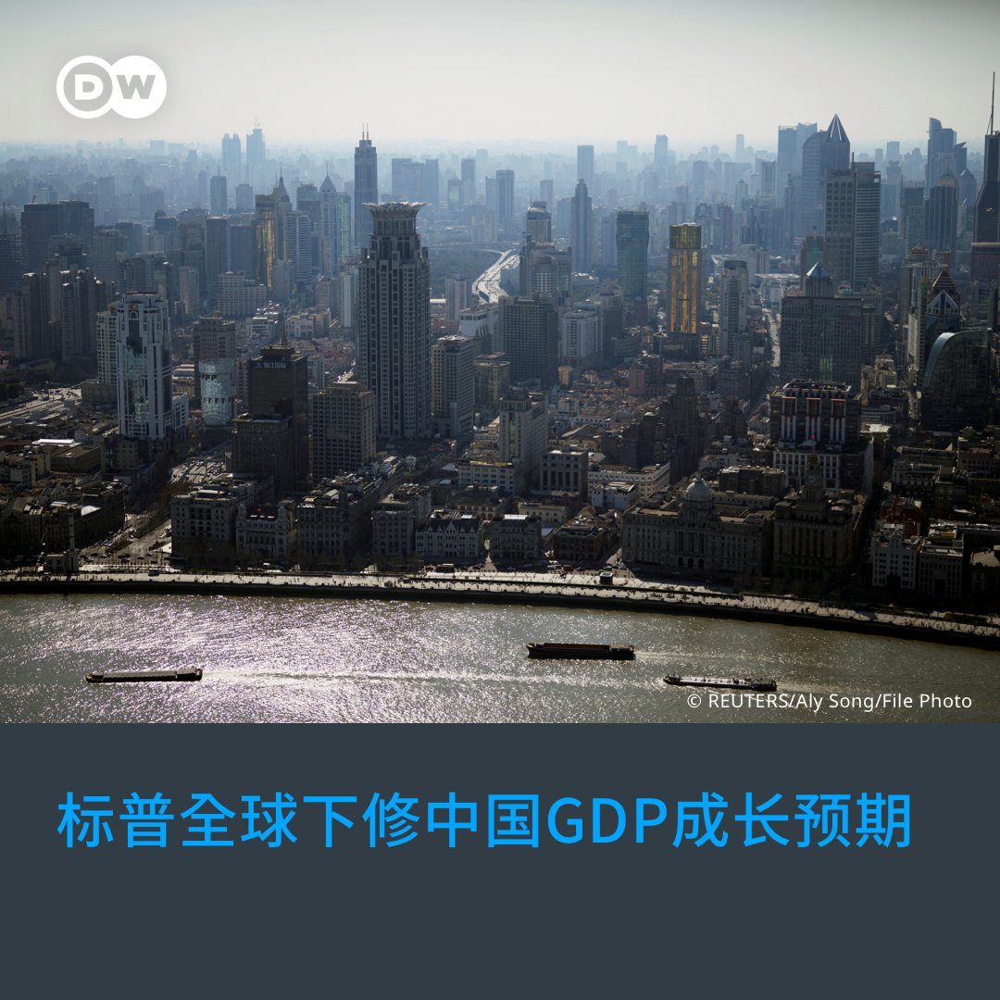
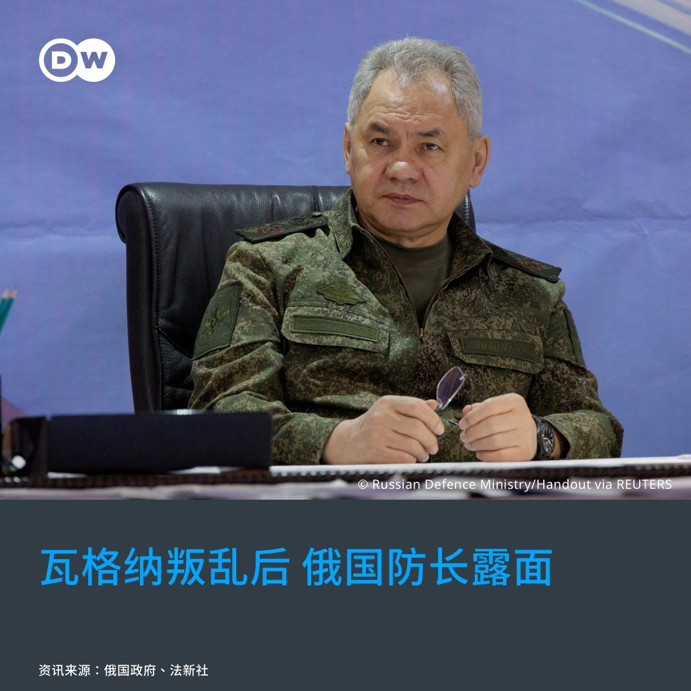
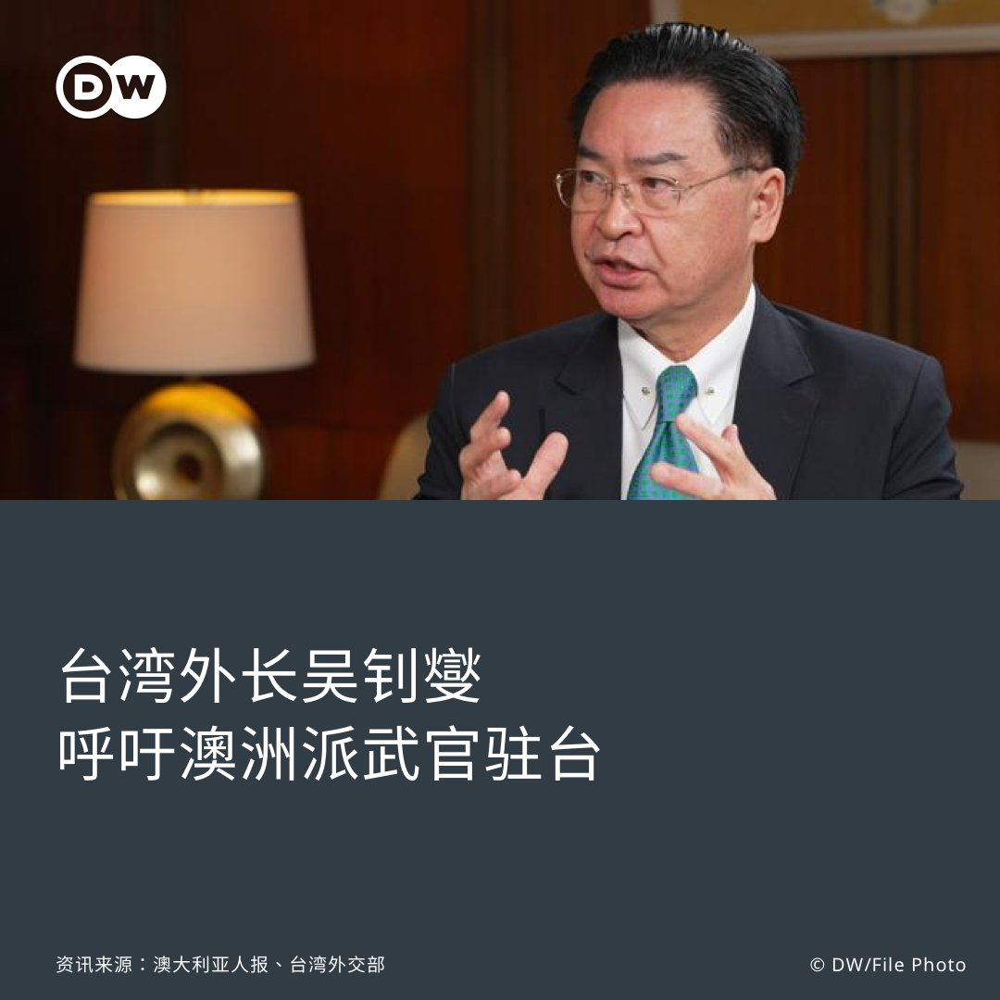

德国之声 北京时间 2023-06-26T17:42:00Z 1673265343001931778 法国🇫🇷总统马克龙在今年4月访华期间接受采访，呼吁欧盟🇪🇺实施战略自主，不该为台湾卷入中美冲突，并称欧盟可以成为与中、美并驾齐驱的 #第三极，此言论当时引起了轩然大波。

上周日，当马克龙接受CNN采访时再次被问到对华态度一事。 https://t.co/eXpMvEJ3UX   德国之声 北京时间 2023-06-26T17:42:38Z 1673265503496810496 马克龙表示：”在台湾问题上，我们赞成维持现状。这意味着我们坚决反对任何侵略，我们确实尊重现有模式。这是我向习近平主席重申的，我知道这也是拜登总统的立场。”   德国之声 北京时间 2023-06-26T17:42:51Z 1673265556361822209 马克龙也强调：”拥有一个更加自主的欧洲和欧盟是非常重要的。为什么？因为它对全球秩序相当有帮助，这甚至对美国也很有帮助，有一个更强大的欧洲，有能力解决其边境发生的冲突。......欧洲人必须建立自己的能力，以维护其领土和周边地区的和平。”   德国之声 北京时间 2023-06-26T14:41:24Z 1673219893372526593 【中国经济表现如何❓】🇨🇳

国际评级公司标普全球（S&amp;P Global）26日下修中国2023年國內生產總值（GDP）的成长预估，从5.5%调整为5.2%。该公司分析："中国的复苏应会持续下去，但步调并不平均，且投资与工业发展停滞。"（下续） https://t.co/zz9hZ2KhPx   德国之声 北京时间 2023-06-26T14:41:53Z 1673220016508919808 路透社指出，标普全球是今年第一个下修对中国经济预期的国际评级机构，但此前多间大型银行也都在本月下调其评估，例如高盛（Goldman Sachs）的预估从6%调整为5.4%，理由是中国市场信心持续疲软，以及房地产市场受到的阻力超乎预期、持续笼罩阴霾。   德国之声 北京时间 2023-06-26T14:42:12Z 1673220097446498304 近期中国的经济到底是好是坏❓请看DW的相关报导👇
中国经济疫后复苏乏力
🔗https://t.co/rGSIwSXzgv
中国上季GDP加速成长 达一年来最高
🔗https://t.co/gfjOe7K7f3   德国之声 北京时间 2023-06-26T15:17:32Z 1673228988251004929 俄罗斯政府26日释出影像，显示俄国防长 #绍伊古（Sergey Shoigu）在乌克兰的战场上视察俄军的战况。法新社指出，这是雇佣兵集团瓦格纳叛乱之后，绍伊古首度公开现身。（下续） https://t.co/6MtbciWJOA   德国之声 北京时间 2023-06-26T15:18:07Z 1673229135378776064 事实上，瓦格纳首领 #普里戈津（Yevgeny Prigozhin）声称欲推翻的目标就是绍伊古以及俄军总参谋长格拉西莫夫（Valery Gerasimov），这也让绍伊古的动向成为焦点。据俄媒26日公布的画面，绍伊古在乌克兰与俄军将领召开会议、听取当地战情时，强调俄国对乌克兰武器与士兵进行了"高效的侦测与毁灭工作"。   德国之声 北京时间 2023-06-26T15:18:29Z 1673229228408446976 更多关于瓦格纳叛乱的分析，请看DW的相关报导👇
瓦格纳叛乱曝普丁弱点 有利乌军反攻？
🔗https://t.co/5OzlK4MccM
瓦格纳叛乱 中国、朝鲜支持俄国政府
🔗https://t.co/KSTmxc6Kl0   德国之声 北京时间 2023-06-26T15:45:45Z 1673236090600448002 为挽救居高不下的青年失业率，#中国 政府推出"青年就业服务攻坚行动"，盼协助失业青年、应届毕业生求职。然而，许多中国网民对此抱持怀疑态度，他们对此政策有何批评？🇨🇳 https://t.co/vC1vjjipMO   德国之声 北京时间 2023-06-26T13:02:30Z 1673195003714125827 韩联社24日报导称，在 #韩中关系 紧张之际，旅游需求大减，使得航空公司暂停部分赴中国的航班。

报导引述匿名的业界人士说法指，#大韩航空 将自8月1日起停飞 #金浦与北京 航线，8月9日起暂停 #金浦与厦门 航线，一直到10月28日为止。 （下续） https://t.co/qoQTTHzouD   德国之声 北京时间 2023-06-26T13:03:34Z 1673195273634324480 #韩亚航空 早在6月20日起就暂停 #仁川与西安 航线，并将从7月6日、8日起分别暂停 #金浦飞北京、#仁川飞深圳，同样持续到10月28日。 （下续）   德国之声 北京时间 2023-06-26T13:04:12Z 1673195435417124866 另一方面，韩国外长#朴振 25日接受韩联社访问，谈及韩中关系时说道：「尹锡悦政府的基本立场是促进韩中关系，朝着以互相尊重、互惠与共同利益为基础的成熟、健康关系发展。」朴振说，双方关系「没有必要」恶化。 （下续）   德国之声 北京时间 2023-06-26T13:04:43Z 1673195564941410304 6月初，两国曾因一名外交官的争议言论，再起争端。当时中国驻韩大使 #邢海明 称，美国正竭力打压中国，有的人赌美国赢、中国输，这显然是误判，没看清历史大势；这番言论在韩国引发争议，朴振25日也再度批评他的言行以外交官来说并不适当。   德国之声 北京时间 2023-06-26T13:05:02Z 1673195641810419712 韩国和中国的关系近期如何❓请看DW的相关报导👇
韩国召见中国驻韩大使抗议其「挑衅行为」
🔗https://t.co/NCbTCwd2Y4
中国不满美韩联合声明 向韩国提出交涉
🔗https://t.co/B4AzBiIUbo   德国之声 北京时间 2023-06-26T11:53:12Z 1673177565497012224 俄罗斯周末爆发短暂 #叛乱行动，有专家认为，此事表明 #普京 对内部精英的控制力“异常减弱”，且私人军团  #瓦格纳 的叛变，可能严重损害俄军士气，有助乌克兰“乘着此一势头突破前线”。
https://t.co/5OzlK4MK2k   德国之声 北京时间 2023-06-26T10:59:27Z 1673164037482328065 据《澳大利亚人报》（The Australian）25日报导，面对跟 #中国 的地缘政治紧张，台湾外交部长 #吴钊燮 认为 #澳大利亚 与 #台湾 应互派武官进驻对方的办事处。（下续） https://t.co/CyDQLUonjS   德国之声 北京时间 2023-06-26T11:01:03Z 1673164440995282950 根据台湾外交部26日新闻稿，吴钊燮说："派驻武官可提供双方系统性和制度化的接触，共享情资及对局势的评估，此议题需要台澳双方审慎讨论，台湾尊重澳洲政府的决定。"

据报导，吴钊燮称美国、日本和新加坡在台都有类似安排，而澳大利亚官员已在跟台湾安全部门交流，代表澳方重视台湾的观点。 （下续）   德国之声 北京时间 2023-06-26T11:01:29Z 1673164550365904896 与此同时，澳大利亚总理 #阿尔巴尼斯 25日表示，他将在"适当日子"安排造访中国的行程。澳中贸易近期有破冰迹象，阿尔巴尼斯也强调了两国贸易的重要性。此外，他重申希望中国释放被关押的澳大利亚华裔记者 #成蕾。   德国之声 北京时间 2023-06-26T11:01:46Z 1673164620956151810 相关报导👇
澳洲人如何看待中澳关系、习近平与台海危机？
🔗https://t.co/lA7j3oDd2b
中澳关系升温 澳总理称愿与习近平会面
🔗https://t.co/SpRGj7I5Gd   德国之声 北京时间 2023-06-26T09:59:39Z 1673148992136552449 #瓦格纳 雇佣兵集团24日发动叛乱行动之后，#俄罗斯 副外长鲁登科在北京会见了中国 外长 #秦刚，北京和平壤25日也都对此事作出了首次评论。他们分别说了什么？🇷🇺🇨🇳🇰🇵https://t.co/KSTmxc7iay   