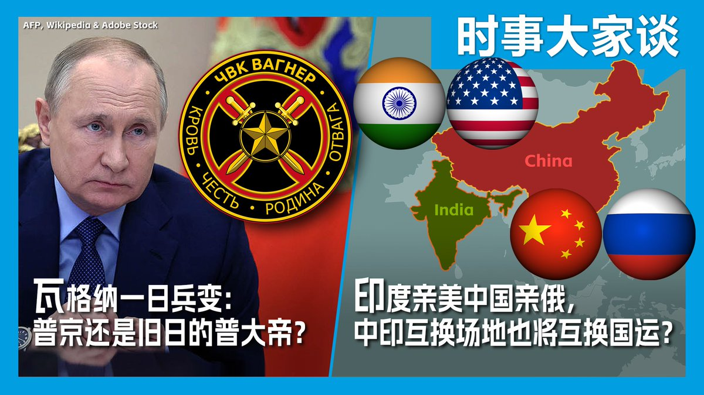
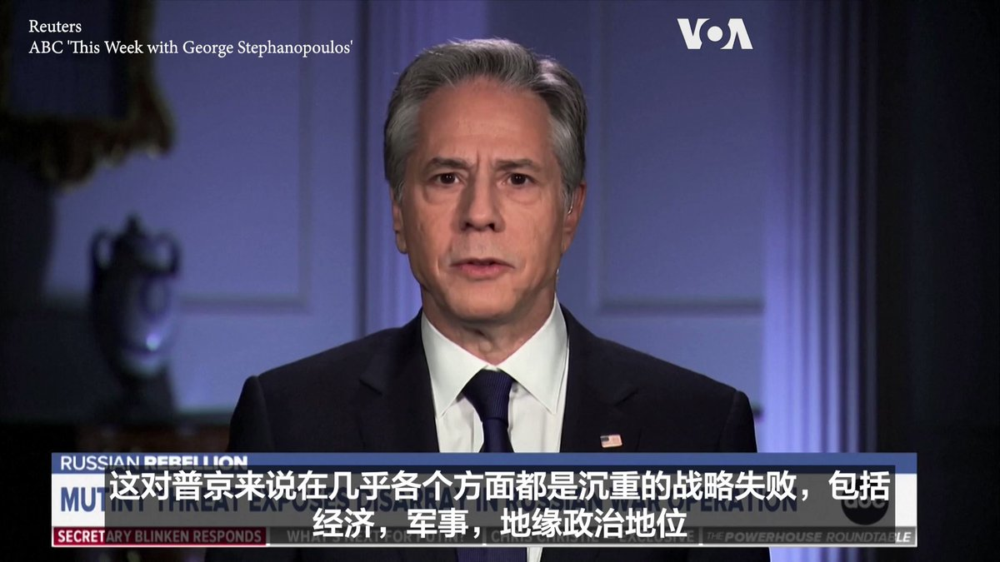
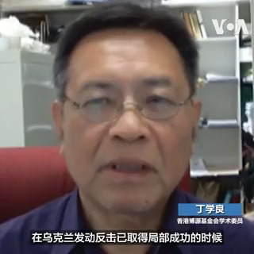

美国之音中文网 北京时间 2023-06-26T08:00:00Z 1673118879088795649 瓦格纳兵变夭折了，但它对俄乌战局以及普京的权威和地位造成深远的影响。兵变背后有哪些复杂背景？普京为平息兵变做出了哪些让步？昔日中国向美国开放，印度傍上了苏联，结果40年分出高低。如今印度亲美，中国亲俄，中印竞争还需要40年决出新的胜负吗？请看美国之音6月26日时事大家谈。 https://t.co/N48Mq6IUgC   美国之音中文网 北京时间 2023-06-26T09:06:05Z 1673135507918950400 来自中国的包裹涌入美国； 有人说 800 美元的免税限额是一个错误 https://t.co/vQoqFbiuLl   美国之音中文网 北京时间 2023-06-26T03:15:25Z 1673047262262595584 “最后的结果会怎样我们还不清楚，但我们的确看到有真正的裂痕在出现，对普京的权威构成了直接挑战”，美国国务卿布林肯25日接受了一系列的电视采访，讨论俄罗斯瓦格纳集团前一天中途放弃的叛乱造成的影响。布林肯在ABC的节目上说，这分散了俄罗斯的精力，可能对乌克兰在战场上有所帮助。 https://t.co/uvQJ9Bp6pl   美国之音中文网 北京时间 2023-06-26T03:39:33Z 1673053336520765440 布林肯：普里戈津针对莫斯科的叛乱表明普京的统治存在“非常严重的裂痕” https://t.co/ckgfTspber   美国之音中文网 北京时间 2023-06-26T04:08:05Z 1673060514229022720 美国官员们认为：中国的习近平是独裁者 https://t.co/GHfV5i021j   美国之音中文网 北京时间 2023-06-26T00:35:04Z 1673006908540862466 瓦格纳“快闪兵变”爆普京败象? 观察人士:中国中立观望、不可能军援俄罗斯 https://t.co/xoxmjPBCb0   美国之音中文网 北京时间 2023-06-26T00:48:33Z 1673010300264775682 瓦格纳雇佣军兵变惊魂，秦刚在北京会见俄副外长表支持 https://t.co/tU7mKW20pD   美国之音中文网 北京时间 2023-06-26T01:04:03Z 1673014202515193856 韩国外长：首尔无意恶化与中国关系 https://t.co/iH41uCpuCx   美国之音中文网 北京时间 2023-06-26T01:45:12Z 1673024558360842240 俄罗斯佣兵瓦格纳集团发动的兵变虽不到一日就落幕，但观察人士分析，此“快闪兵变”暴露了俄国政、军高层“不可调和的矛盾”，因此，俄军战败迹象已现。他们说，一旦普京战败，中国绝不可能军援俄国，因为代价太高，所以，中国此时应会保持中立，静观其变。
报道: https://t.co/4teEnOFxXg https://t.co/Wj1hUYLuUH   