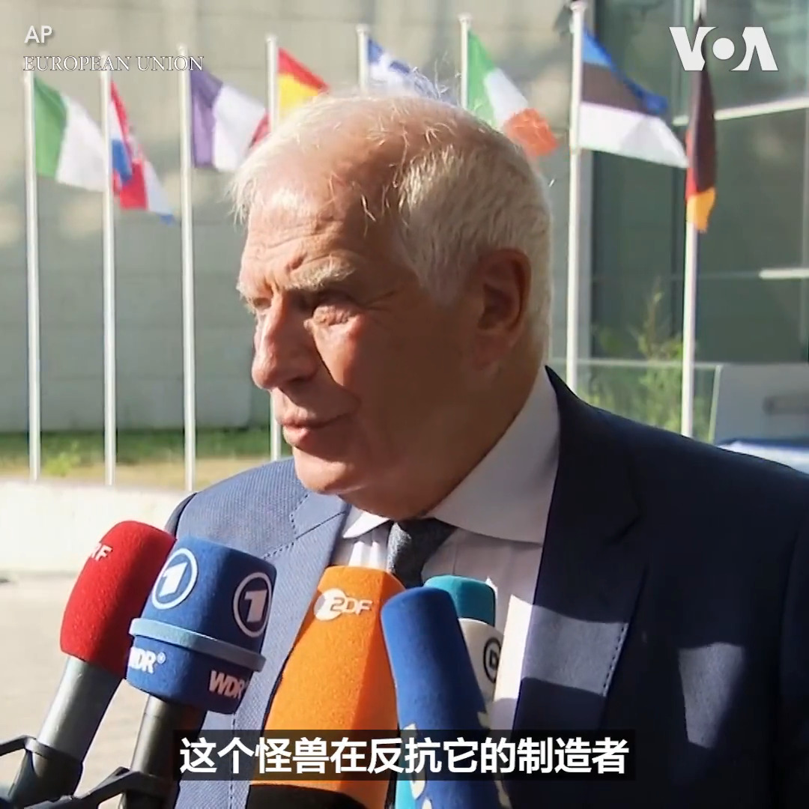

美国之音中文网 北京时间 2023-06-26T22:24:05Z 1673336332498661379 瓦格纳兵变后，被普里戈津骂惨的俄防长邵伊古首次公开露面 https://t.co/PpFvlbHRJa   美国之音中文网 北京时间 2023-06-26T22:40:34Z 1673340480732508162 俄罗斯兵变虽落幕，但闹剧险让全球经济陷入进一步困境 https://t.co/PPw7V5kVX4   美国之音中文网 北京时间 2023-06-26T23:41:05Z 1673355710183399424 新西兰总理专机老旧不堪不可靠 飞北京要备用飞机伴飞 https://t.co/dDa32QhHuL   美国之音中文网 北京时间 2023-06-26T23:41:07Z 1673355718408441856 美国最高法院的大裁决即将到来 https://t.co/Jt2a0WeuWn   美国之音中文网 北京时间 2023-06-26T21:48:26Z 1673327363034345472 “普京制造了瓦格纳这个怪兽；现在这个怪兽在咬他”，欧盟外交与安全政策高级代表博雷利26日在卢森堡主持欧盟外长会议之前对媒体表示瓦格纳的叛乱显示俄罗斯军方权力出现分裂，并且说这是入侵乌克兰的后果之一。这次欧盟外长会议将讨论对乌克兰提供更多的支持。 https://t.co/ywpTpnrw43   美国之音中文网 北京时间 2023-06-26T17:34:04Z 1673263345783410691 一大国际评级机构下调中国今年GDP预期 https://t.co/OHnBhqX3hq   美国之音中文网 北京时间 2023-06-26T17:48:03Z 1673266867409154048 澳大利亚加码援助乌克兰 送70辆军用车辆抗击俄罗斯入侵 https://t.co/dYOEqE6vHN   美国之音中文网 北京时间 2023-06-26T18:21:03Z 1673275171912966145 日本抗议俄罗斯将二战结束纪念日改为“反日本军国主义战争胜利纪念日” https://t.co/5TbDqwYbDK   美国之音中文网 北京时间 2023-06-26T14:33:35Z 1673217925992570880 中国拟在古巴建立基地 布林肯：已明确向北京和哈瓦那表达关切 https://t.co/Xl56ZSbNaW   美国之音中文网 北京时间 2023-06-26T14:48:03Z 1673221570276511747 中国“强烈抗议”美国起诉多家中国芬太尼制造与销售商 https://t.co/9iQxjOZPS2   美国之音中文网 北京时间 2023-06-26T15:18:34Z 1673229246259662848 因应中国威胁 台湾呼吁澳大利亚互派武官共享情资 https://t.co/SgzD6iKzWh   美国之音中文网 北京时间 2023-06-26T16:08:05Z 1673241709638205440 朝鲜举行大型集会威胁对美国展开“复仇战争” https://t.co/fVGWRBlJIj   美国之音中文网 北京时间 2023-06-26T12:34:05Z 1673187853411713026 反莫斯科的兵变和平落幕 雇佣军的未来和俄乌战争的走向仍扑朔迷离 https://t.co/rZxOahSvox   美国之音中文网 北京时间 2023-06-26T14:19:34Z 1673214399732142081 中国对瓦格纳兵变事件打破沉默 表态支持莫斯科 https://t.co/lftg0PvLUx   美国之音中文网 北京时间 2023-06-26T10:05:06Z 1673150362734456833 拜登和泽连斯基讨论俄乌战局以及美国对乌克兰的支持 https://t.co/dPAAF63f6y   美国之音中文网 北京时间 2023-06-26T06:55:34Z 1673102664320819200 俄罗斯空袭造成基辅死亡人数上升 https://t.co/qLlr99d0uQ   美国之音中文网 北京时间 2023-06-26T08:00:00Z 1673118879088795649 瓦格纳兵变夭折了，但它对俄乌战局以及普京的权威和地位造成深远的影响。兵变背后有哪些复杂背景？普京为平息兵变做出了哪些让步？昔日中国向美国开放，印度傍上了苏联，结果40年分出高低。如今印度亲美，中国亲俄，中印竞争还需要40年决出新的胜负吗？请看美国之音6月26日时事大家谈。 https://t.co/N48Mq6IUgC   美国之音中文网 北京时间 2023-06-26T09:06:05Z 1673135507918950400 来自中国的包裹涌入美国； 有人说 800 美元的免税限额是一个错误 https://t.co/vQoqFbiuLl   美国之音中文网 北京时间 2023-06-26T03:15:25Z 1673047262262595584 “最后的结果会怎样我们还不清楚，但我们的确看到有真正的裂痕在出现，对普京的权威构成了直接挑战”，美国国务卿布林肯25日接受了一系列的电视采访，讨论俄罗斯瓦格纳集团前一天中途放弃的叛乱造成的影响。布林肯在ABC的节目上说，这分散了俄罗斯的精力，可能对乌克兰在战场上有所帮助。 https://t.co/uvQJ9Bp6pl   美国之音中文网 北京时间 2023-06-26T03:39:33Z 1673053336520765440 布林肯：普里戈津针对莫斯科的叛乱表明普京的统治存在“非常严重的裂痕” https://t.co/ckgfTspber   美国之音中文网 北京时间 2023-06-26T04:08:05Z 1673060514229022720 美国官员们认为：中国的习近平是独裁者 https://t.co/GHfV5i021j   美国之音中文网 北京时间 2023-06-26T00:35:04Z 1673006908540862466 瓦格纳“快闪兵变”爆普京败象? 观察人士:中国中立观望、不可能军援俄罗斯 https://t.co/xoxmjPBCb0   美国之音中文网 北京时间 2023-06-26T00:48:33Z 1673010300264775682 瓦格纳雇佣军兵变惊魂，秦刚在北京会见俄副外长表支持 https://t.co/tU7mKW20pD   美国之音中文网 北京时间 2023-06-26T01:04:03Z 1673014202515193856 韩国外长：首尔无意恶化与中国关系 https://t.co/iH41uCpuCx   美国之音中文网 北京时间 2023-06-26T01:45:12Z 1673024558360842240 俄罗斯佣兵瓦格纳集团发动的兵变虽不到一日就落幕，但观察人士分析，此“快闪兵变”暴露了俄国政、军高层“不可调和的矛盾”，因此，俄军战败迹象已现。他们说，一旦普京战败，中国绝不可能军援俄国，因为代价太高，所以，中国此时应会保持中立，静观其变。
报道: https://t.co/4teEnOFxXg https://t.co/Wj1hUYLuUH   