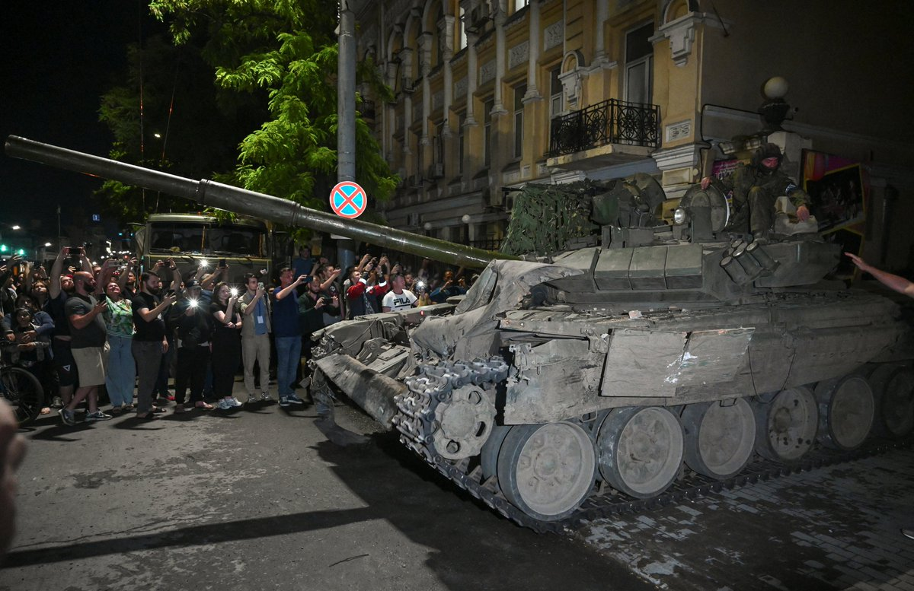
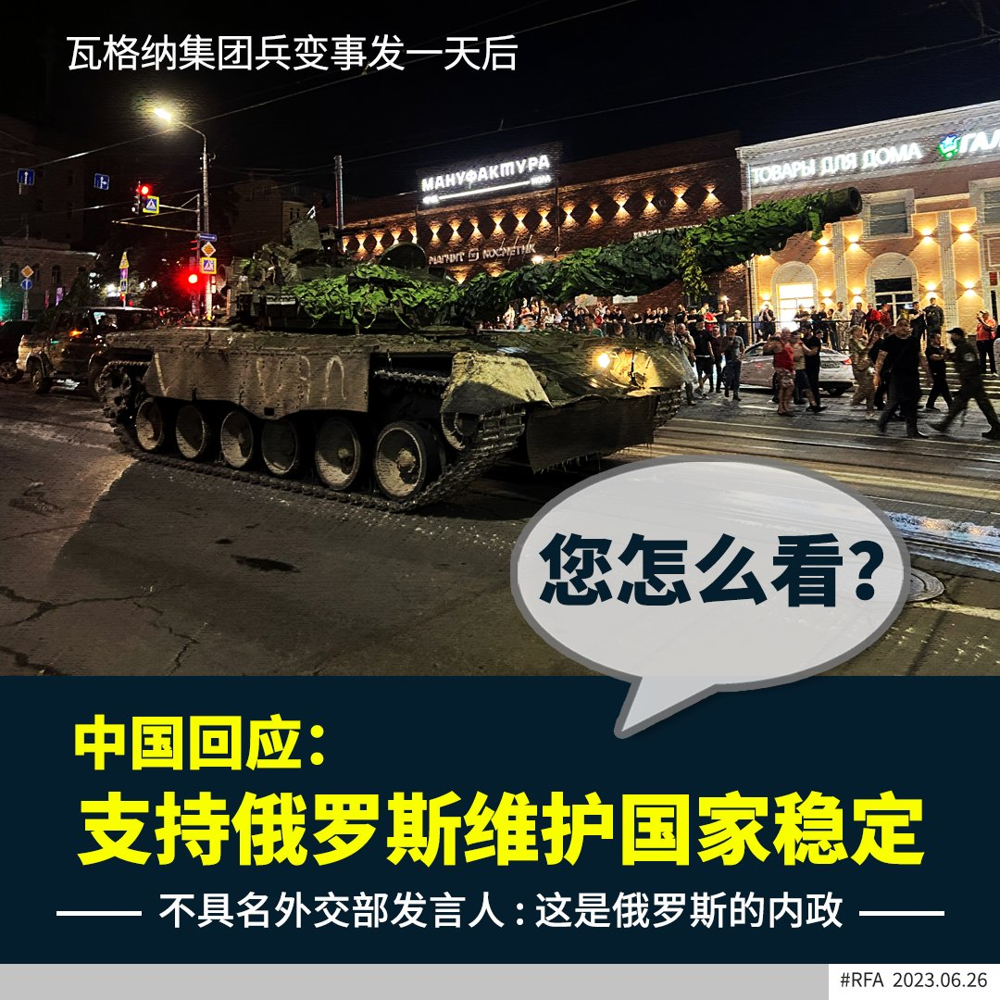

自由亚洲电台 北京时间 2023-06-26T22:07:10Z 1673332074650976261 被羁押超过三年的湖南异议人士 #谢文飞 被裁定寻衅滋事罪成，判处有期徒刑四年半。外界关注，他会否被转送曾传出虐待囚犯和强迫劳动的 #赤山监狱 服刑。

https://t.co/TIua0U3FBt   自由亚洲电台 北京时间 2023-06-26T15:39:12Z 1673234441152659457 https://t.co/B2lscubJaz   自由亚洲电台 北京时间 2023-06-26T16:26:15Z 1673246281614135297 【瓦格纳武装兵变动摇普京威权】
【中国屏息关注局势变化】
俄罗斯 #瓦格纳 雇佣军发起兵变，牵动着中国民众，也给 #中国 高层应对突发军事事件敲响了警钟。学者认为，此次瓦格纳兵变将对 #普京 政权，乃至中国产生重大影响。
详细报道：https://t.co/UkjtqzlfwC https://t.co/iBoELbUPYE   自由亚洲电台 北京时间 2023-06-26T11:59:33Z 1673179165938552833 【中国回应瓦格纳事件：支持俄罗斯维护国家稳定】
【事发一天多后才表态 您怎么看？】
中国外交部25日晚上首度对瓦格纳集团表态，中国外交部透过官网，以不具名的“外交部发言人就瓦格纳集团事件答记者问”的名义作出回应表示:“这是 #俄罗斯的内政。作为友好邻邦和新时代全面战略协作伙伴，中方支持俄罗斯维护国家稳定，实现发展繁荣。”
这是在 #普利戈任 与 #瓦格纳 集团武装人员已从俄南部军区司令部撤离、普里戈任接受白俄罗斯总统卢卡申科调停后，中国才做出的简短回应。
在此之前，中国外交部官方网站25日下午以“部长活动”的头条位置发布声明，国务委员兼外长秦刚当天在北京会见俄罗斯副外长鲁登科，“同他就中俄关系及共同关心的国际和地区问题交换意见”。
对中国的表态方式，您怎么看？   自由亚洲电台 北京时间 2023-06-26T01:05:36Z 1673014593747308546 中国外交部官方网站本周日以“部长活动”的头条位置发布声明，国务委员兼外长秦刚当天在北京会见俄罗斯副外长鲁登科，“同他就中俄关系及共同关心的国际和地区问题交换意见”。

https://t.co/jdN0ubqOdh   自由亚洲电台 北京时间 2023-06-26T01:46:03Z 1673024772807221250 越南外交部本周日证实，美国尼米兹级航空母舰“罗纳德·里根号”当天到访中部城市岘港，并将停留至6月30日。

https://t.co/bCgkAaW7J9   