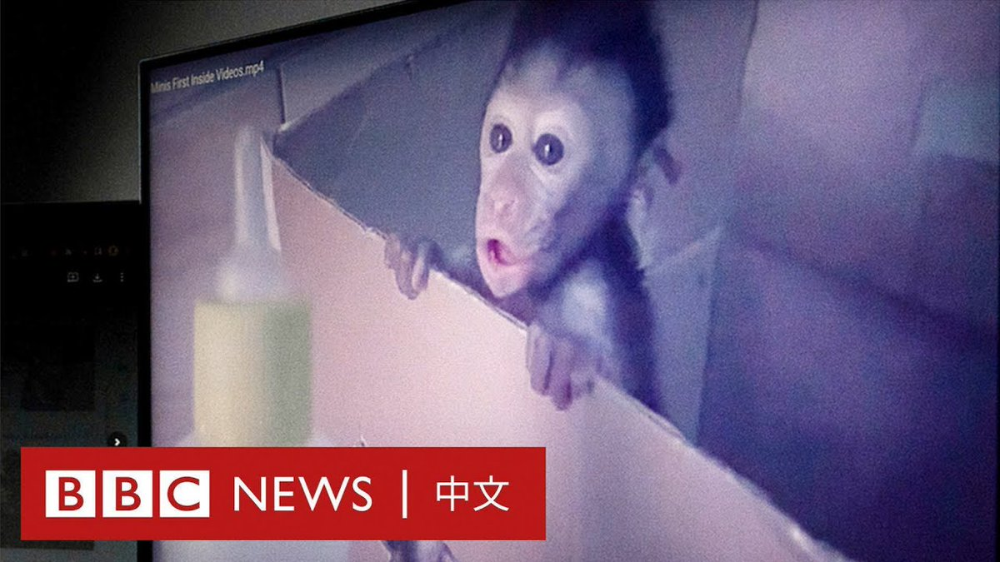
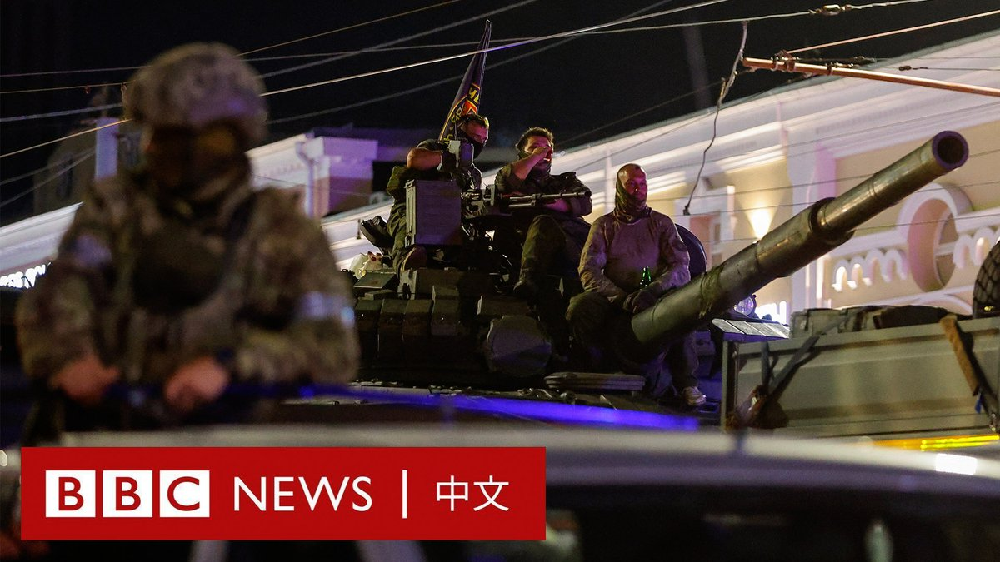
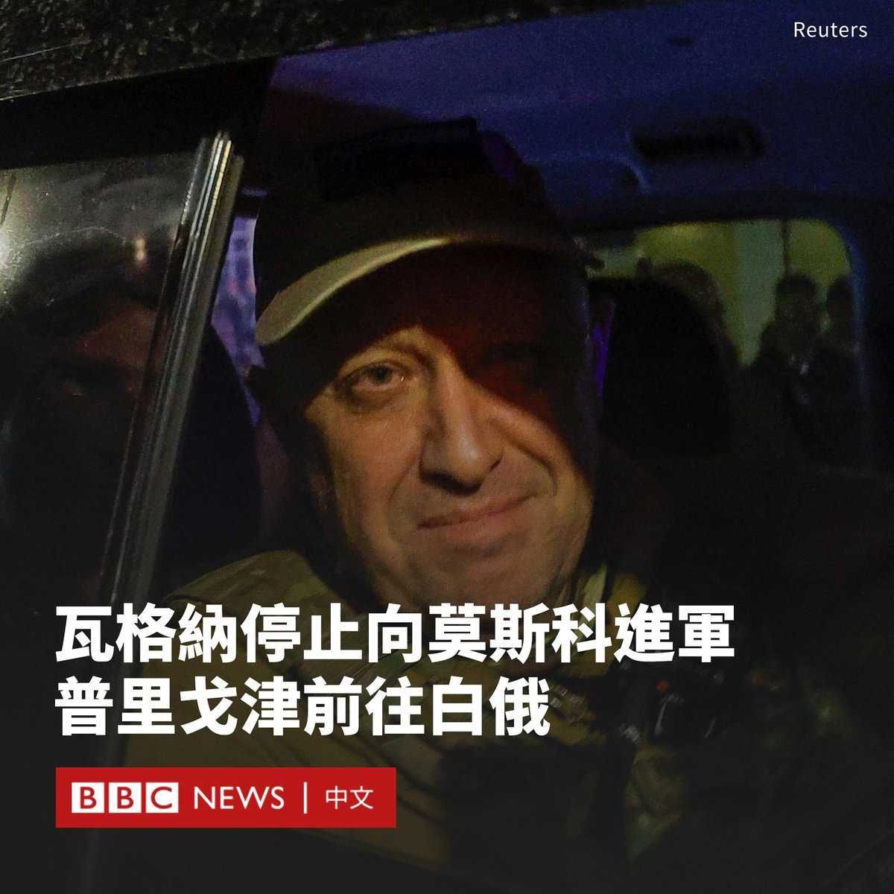
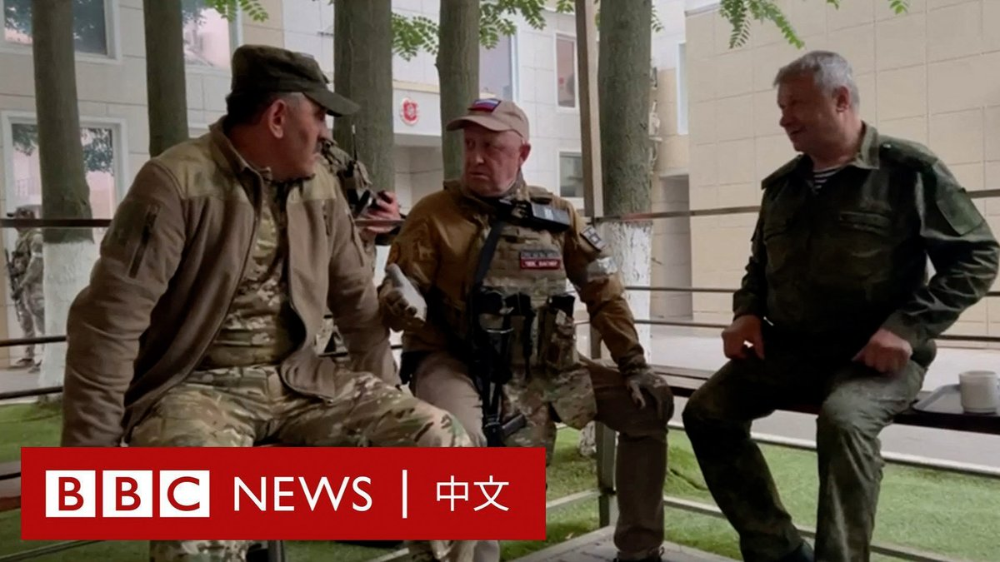

D英国广播公司BBC 北京时间 2023-06-25T17:04:15Z 1672893455201099776 BBC一项长达一年的调查揭露了横跨印尼和美国的虐待猴子社群。这些虐待、仇恨猴子的群体开始于YouTube，接着转移到Telegram加密群组。

BBC发现，数百名来自美国、英国以及其他国家的“客户”付费，以让印尼人虐待并杀害长尾猕猴宝宝。

阅读详细英文调查：https://t.co/nKYLqwE2Sn https://t.co/VjX2MXVgBF   D英国广播公司BBC 北京时间 2023-06-25T14:52:27Z 1672860289350639617 在白俄罗斯的斡旋下，俄罗斯总统普京与起兵反叛的瓦格纳雇佣兵达成协议，这个准军事组织停止向莫斯科进军，并从占领的南部城市撤离。

克里姆林宫表示，该组织首领普里戈津将前往白俄罗斯，参与反叛活动的瓦格纳士兵也不会被起诉。 https://t.co/yinMqT7KMh   D英国广播公司BBC 北京时间 2023-06-25T12:20:03Z 1672821935531773952 在瓦格纳集团首领普里戈津（Yevgeny Prigozhin）同意停止进军莫斯科后，克林姆林宫表示，他将前往白俄罗斯，对他提出的武装反叛刑事指控将被撤销。

白俄罗斯总统卢卡申科（Alexander Lukashenko）的办公室说，卢卡申科与普里戈津谈判达成撤军协议，并得到俄罗斯总统普京的批准。

克里姆林宫发言人佩斯科夫（Sergey Peskov）表示，参与反叛活动的瓦格纳士兵不会被起诉。他说，“我们一直尊重他们在前线的英雄事迹。”莫斯科感谢卢卡申科为危机降温所发挥的作用。

他还表示，瓦格纳士兵可以与国防部签订合同。

不过，普里戈津与俄官方达成的协议细节尚不清楚，特别是关于俄罗斯国防部长绍伊古（Sergei Shoigu）和武装部队总参谋长格拉西莫夫（Valery Gerasimov）的命运。普里戈津曾要求两人被撤职。

画面显示，一些瓦格纳雇佣兵已经撤离他们所占领的俄罗斯南方城市顿河畔罗斯托夫。   D英国广播公司BBC 北京时间 2023-06-25T01:39:52Z 1672660825759428609 【最新消息】据白俄罗斯总统办公室消息，白俄罗斯总统卢卡申科（Alexander Lukashenko）称与瓦格纳首脑普里戈津（Yevgeny Prigozhin）举行会谈，普里戈津已同意停止其部队进一步向莫斯科挺进，以“避免流血事件”。 https://t.co/ddR46LUJU5   D英国广播公司BBC 北京时间 2023-06-25T02:05:47Z 1672667348397080577 俄罗斯在过去24小时内发生了什么？这段影片为你总结。 https://t.co/HvGfsuappW   