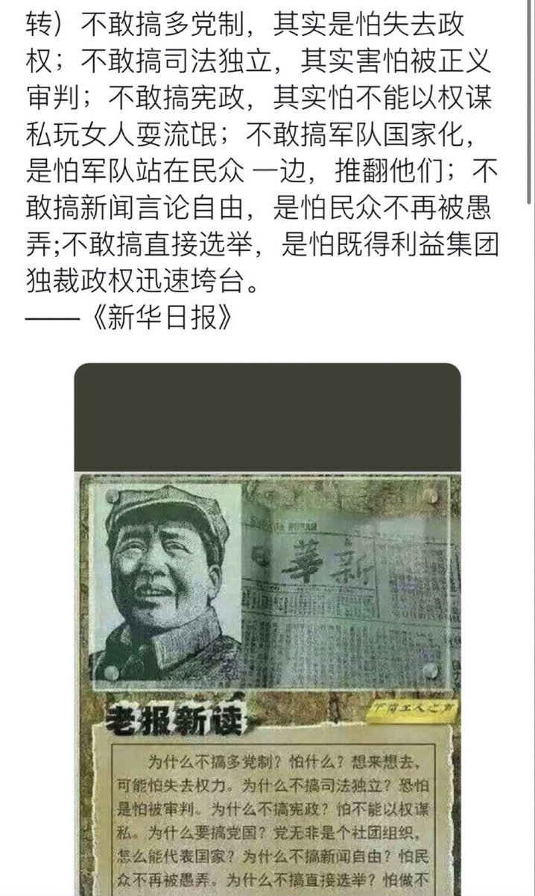

Ivy未央 北京时间 2023-06-25T19:00:16Z 1672922652879511554 转）凭什么中国人可以主张“自古以来”，台湾人、西藏人、新疆人…就不能主张“自古以来”？中国人可以按自己的主张设一个时间点，说该时间点以来台湾是中国“不可分割的一部分”，那台湾人为什么就不能设一个时间点，说“自古以来台湾和中国大陆没有关系”——强迫别人认同你的主张，这不是霸权主义和侵略是什么 https://t.co/IamwvMifVe   Ivy未央 北京时间 2023-06-25T12:51:26Z 1672829831912800258 中共为什么不敢搞多党制？… https://t.co/CqHxfC8hco   Ivy未央 北京时间 2023-06-25T09:31:25Z 1672779497647624199 郑渊洁:什么“祖国养育了你”,我一看到说这话的这帮骚货就头疼。我父母劳动,我自己劳动 ,靠自己劳动养活自己,咋变成了祖国养活的? 我不劳动,你那鸟祖国养活我吗?中国只有一种人是靠“祖国”养活的,对!就是你们这些官僚寄生虫们。你们啥价值也不创造,别人养着你们 ,你们还养出道理来了。 https://t.co/zqAeDbAuLV   