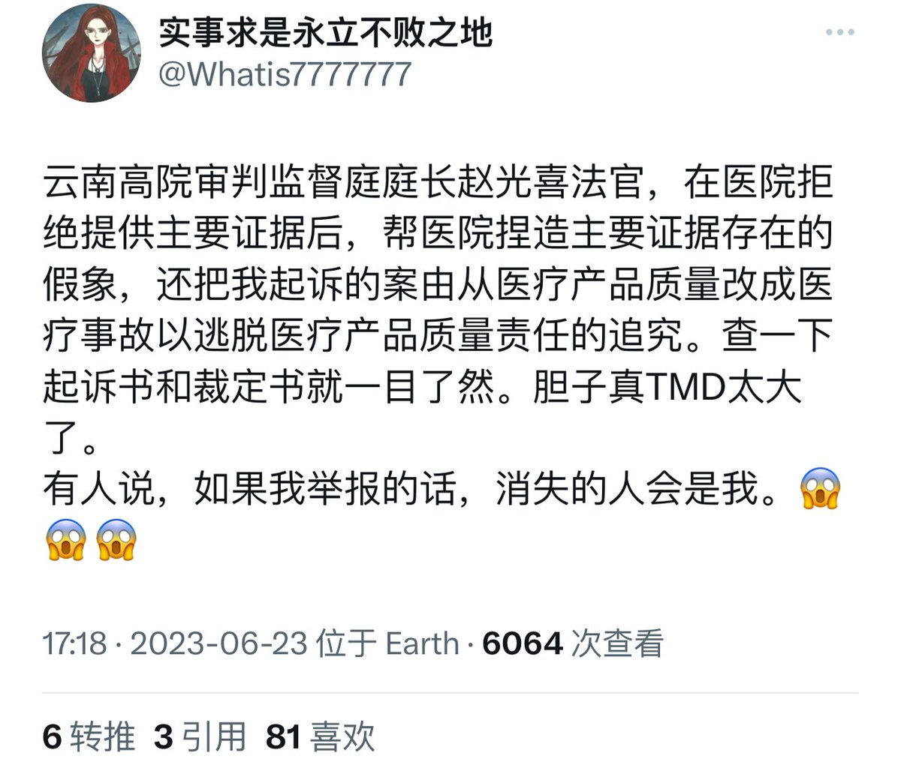
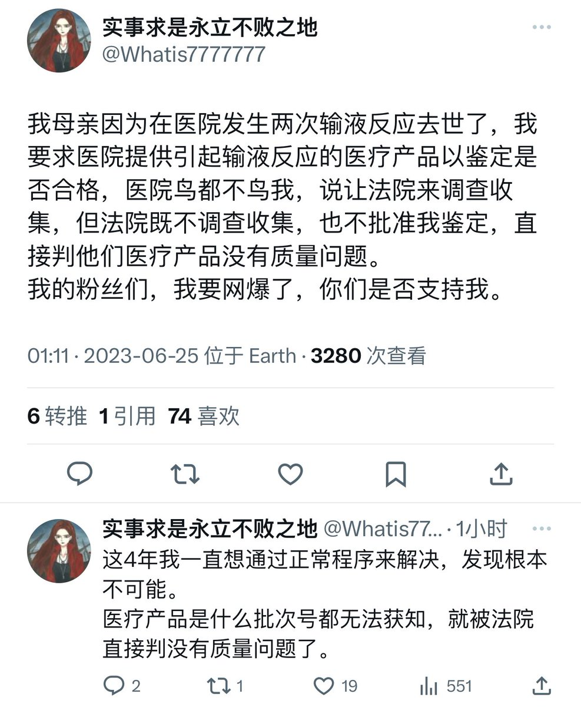
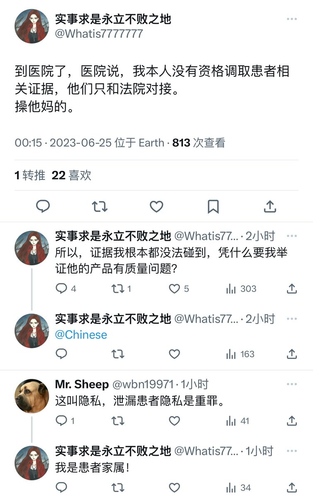
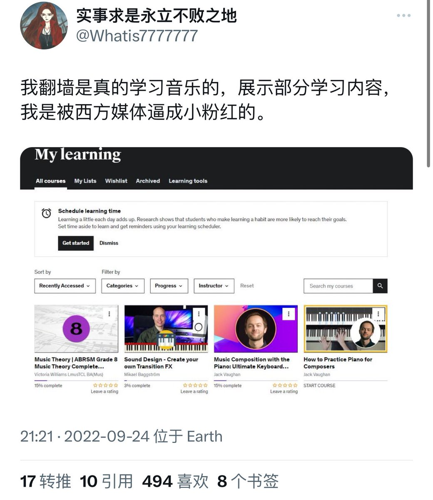
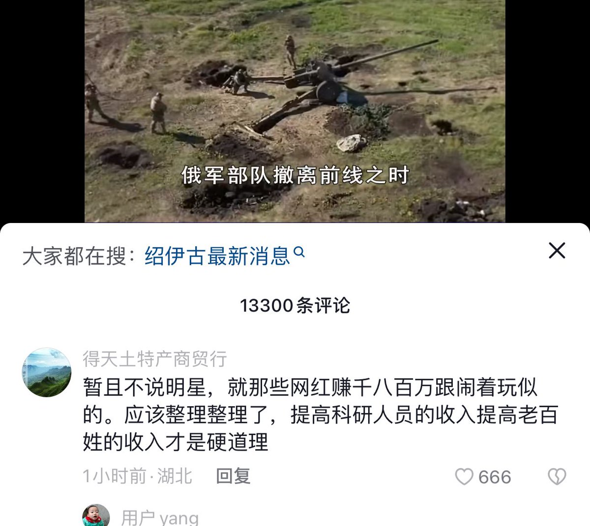
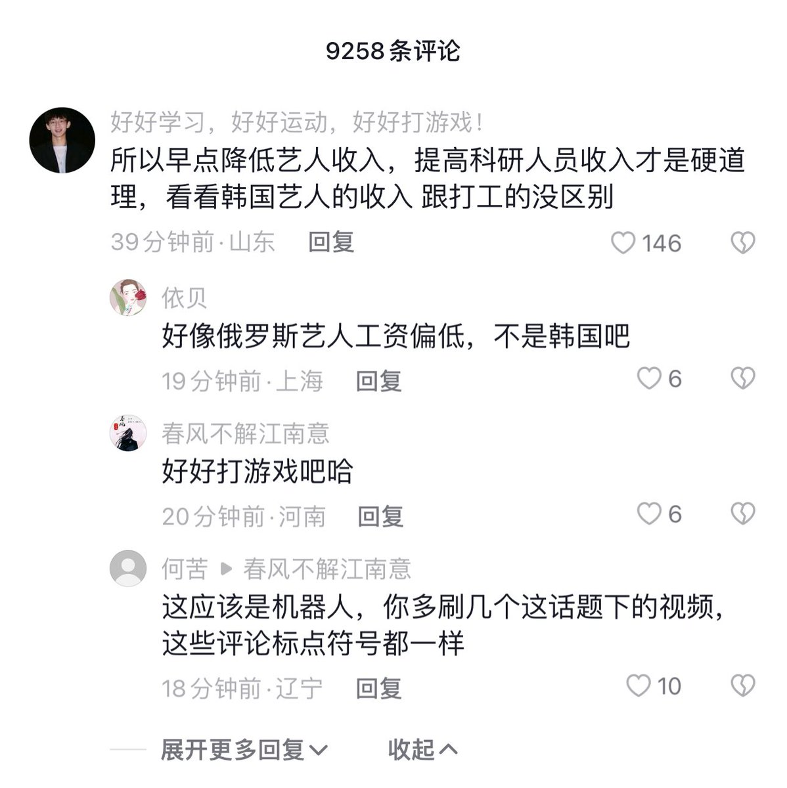
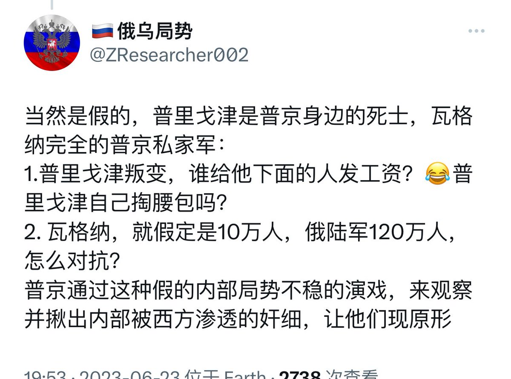
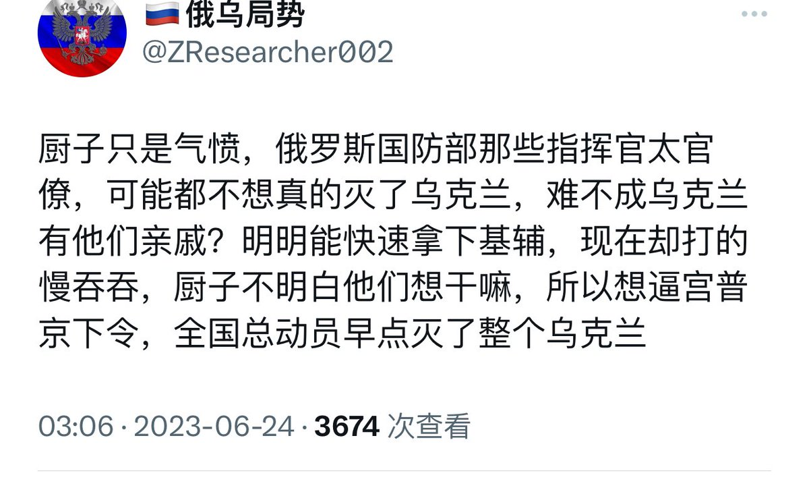
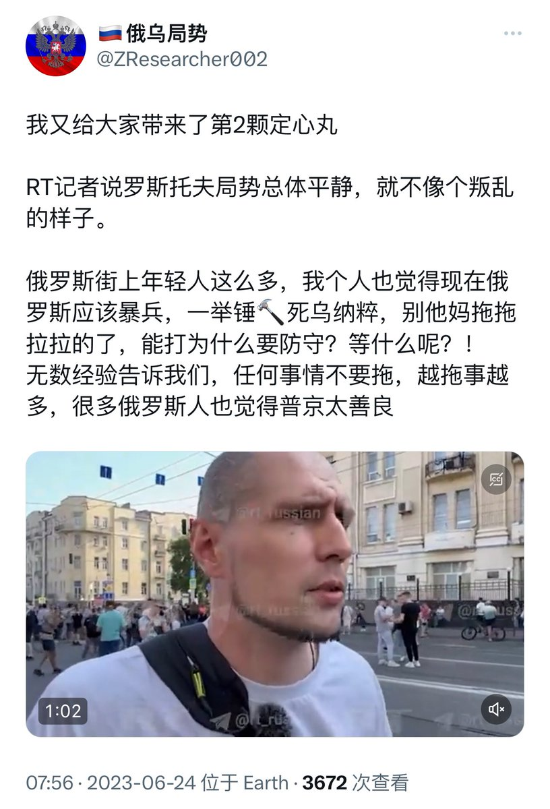

多伦多方脸 北京时间 2023-06-25T18:50:27Z 1672920182782840832 临时插更一期节目 聊聊我对政变的看法。 
1.瓦格纳不是什么好东西，两个恶魔间的铲斗
2.瓦格纳哗变是预料之中的事情 
3.现在政变还并未结束，还要看到底谈的是什么结果，普京很有可能变成了汉献帝
方脸说：大局还未定！目前只是风波刚起！ https://t.co/wdXYIncC1a 来自 @YouTube   多伦多方脸 北京时间 2023-06-25T17:24:24Z 1672898526983110662 铁拳饶过谁？ https://t.co/Dg41nsxNrB   多伦多方脸 北京时间 2023-06-25T13:01:14Z 1672832297924726785 到现在还有粉红觉得我不在加拿大。
我是鬼，不能见阳光，否则就要死了。所以我白天睡觉。
现在全网求一个蓝色彼岸花。 https://t.co/O4DLnHG3jU https://t.co/wssV7ZyOJz   多伦多方脸 北京时间 2023-06-25T11:54:20Z 1672815461829066752 瓦格纳的和谈是完全在意料之中的。
只是没想到那么快，以为起码先拿下莫斯科在和谈，这样筹码才多些，但是整个时代感觉什么都在变快，哗变来的比想象的要快，和谈也来的比想象的要快。
为什么一定会和谈
这主要是因为，瓦格纳根本没有建立新政权的能力，中国人老是迷信枪杆子里出政权。但是枪杆子里出不了政权。(就像董卓一样，不理解协天子以令诸侯的重要性)
瓦格纳就算占领了莫斯科，干掉了普京，统御全部军队，他也没有办法统治。因为他根本没有合法性。
这个我相信普里戈津自己应该很清楚。
普京长久的基本盘还是在那里的
他和他幕后的人追求的应该是一个普京被钳制，权力多极化的俄罗斯
只是他和他背后的人通过这次政变做到没有，做到哪一步，我们需要再观望一下，这个毕竟也不是一步到位的。   多伦多方脸 北京时间 2023-06-25T00:38:00Z 1672645256586854400 说实话我对瓦格纳一次就能推到普京并不抱太大希望。(当然也并非不可能)
但是从今天起普京就不再是以前的那个普京了。
他的权威和个人威信将大受打击。
他庇护下的白俄罗斯众国，也会变的岌岌可危。
什么赢下乌克兰战争，那就别想了
而他也该想想世界之大，未来哪个国家能收留他了。   多伦多方脸 北京时间 2023-06-25T01:13:19Z 1672654147529883650 很多现在聊俄罗斯情况的抖音，底下都能刷到类似的评论，这是什么暗语吗？ https://t.co/eP7JHxEZzX https://t.co/O6B2c7gWPB   多伦多方脸 北京时间 2023-06-25T01:18:37Z 1672655481444392961 根据俄新社消息
普里戈津通过卢卡申科进行和谈。 https://t.co/ZbgMjdv6fG   多伦多方脸 北京时间 2023-06-25T01:39:24Z 1672660709745000448 目前多个博主都发了相关信息，已经基本确定瓦格纳接受谈判。
困了，明天再追进展。
不过谈判，并不代表好戏结束   多伦多方脸 北京时间 2023-06-25T00:20:43Z 1672640908129628160 黄俄孝子的心路历程
12小时前，都是假的
6小时前，只是为了要求普京暴兵拿下乌克兰
1小时前，没事现在都很稳定，总体局势平静大家放心。 https://t.co/CG5lQanvDl   