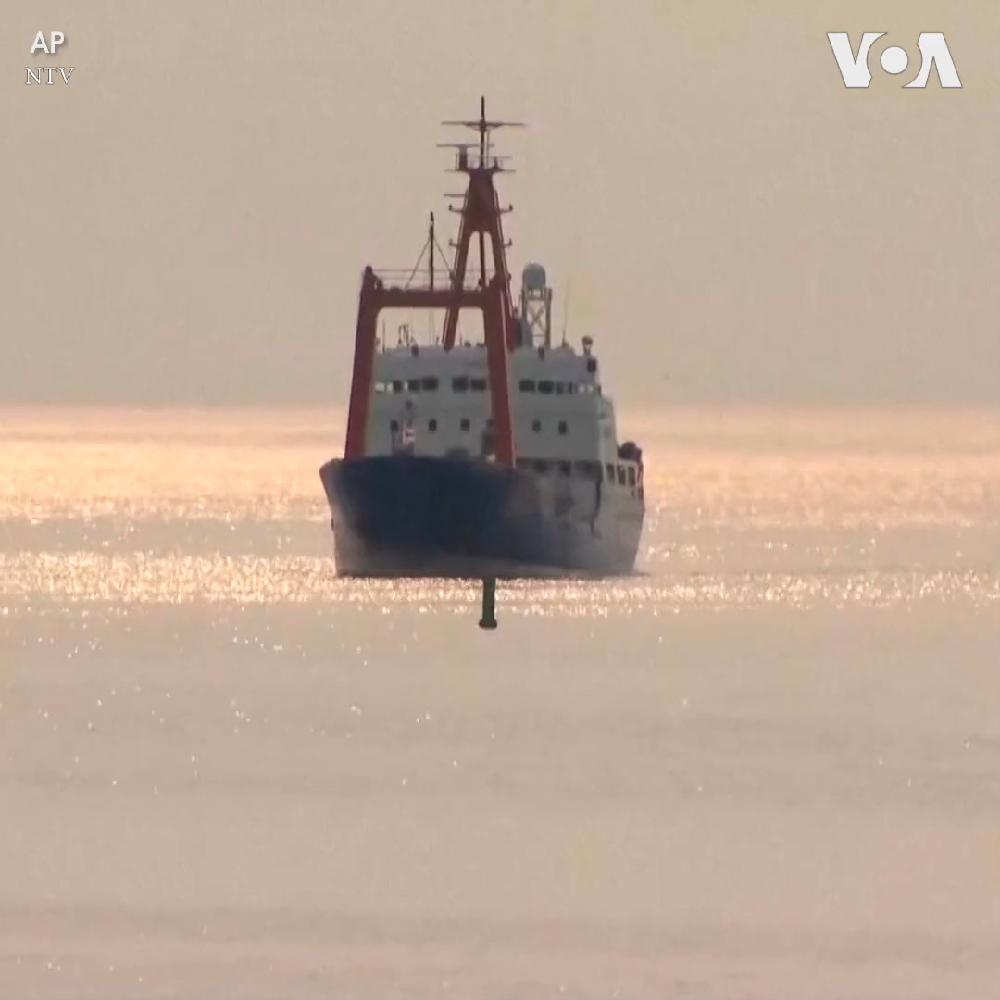

美国之音中文网 北京时间 2023-06-25T04:30:34Z 1672703786937384960 香港国际龙舟赛间断四年后重新举行 https://t.co/VOCQKhaJSd   美国之音中文网 北京时间 2023-06-25T05:18:02Z 1672715732952694784 瓦格纳集团首领命令部队停止向莫斯科前进并返回乌克兰基地 https://t.co/BnUGINdeAq   美国之音中文网 北京时间 2023-06-25T05:31:03Z 1672719007898820608 推特上的中国：瓦格纳军团反水事件对中国影响几何？ https://t.co/nMv8Su9ARz   美国之音中文网 北京时间 2023-06-25T05:32:50Z 1672719453946249222 泰坦号深海潜水器的母船北极王子号24日抵达加拿大港口。北极王子号是在本月16日携带着泰坦号离开纽芬兰岛，后来泰坦号发生事故，5名乘客遇难。加拿大运输安全委员会将调查北极王子作为支持船只所扮演的角色并进行相关的安全调查。 https://t.co/g5pN2fzoUP   美国之音中文网 北京时间 2023-06-25T03:00:00Z 1672680995936694273 俄勒冈州立大学全球卫生中心主任纪骏辉说，新冠疫情之所以成为全球大流行，一半责任在世卫，没有及早从中国拿到咨询，让各国做好准备。另一半责任在中国，下次新兴传染病如果还是发生在中国的话，中国掩盖疫情的几率非常大。完整专访请看6/24【纵深视角】：#纵深视角完整版：https://t.co/Op5thUvzyp https://t.co/B4fAjRLKFv   美国之音中文网 北京时间 2023-06-25T03:06:03Z 1672682515994398720 瓦格纳集团首领命令部队停止向莫斯科前进并返回乌克兰 https://t.co/Qu9zm8ZyXC   美国之音中文网 北京时间 2023-06-25T03:48:03Z 1672693084239581184 印度总理莫迪访问埃及，加强两国关系 https://t.co/ItiYdURhkz   美国之音中文网 北京时间 2023-06-25T03:48:05Z 1672693092548509696 瞄准德法，中国能否成功从西方“围堵”中“突围”？ https://t.co/r0ep7LJUIC   美国之音中文网 北京时间 2023-06-25T03:51:20Z 1672693912518164480 俄罗斯雇佣兵组织瓦格纳领导人普里戈津24日说他已经下令他的雇佣兵停止向莫斯科前进，并撤回他们在乌克兰的营地，避免流血。他的这一决定看来是要化解一场迅速升级的危机。 https://t.co/uoxuNFySmz   美国之音中文网 北京时间 2023-06-25T00:28:59Z 1672642988852531205 俄罗斯媒体报道说，反恐委员会24日说要在莫斯科和周边区域实施反恐措施。瓦格纳集团领导人叶夫根尼·普里戈津早些时候说他的部队已经控制了顿河畔罗斯托夫的俄罗斯军队总部，并控制了该市的军事基地。目前莫斯科市中心的警力明显增加。 https://t.co/dgk0RTCyQT   美国之音中文网 北京时间 2023-06-25T01:08:07Z 1672652837661327360 莫斯科周边24日竖起了军事路障，同时瓦格纳集团的一个车队据报道正在接近莫斯科。莫斯科市长索比亚宁告诫民众减少外出，因为莫斯科实施反恐措施。索比亚宁在一份声明中说，为减少风险将24日被定为非工作日。 https://t.co/sUmhqeCZnK   美国之音中文网 北京时间 2023-06-25T01:48:33Z 1672663011704840193 红场路障林立，莫斯科如临大敌，车臣指挥官请战弹压叛军 https://t.co/2zysCxMXjR   美国之音中文网 北京时间 2023-06-25T02:03:23Z 1672666747764342784 印度近期宣布，将赠送一艘印度国产的护卫舰给越南海军，以协助河内加强其海上防卫能力。专家表示，此举显示同样面临中国威胁的印、越两国，正试图透过区域伙伴深化军事合作，但恐难反击北京在海上的灰色地带行动，不过预料中国近期也不致对此做出过度反应。报道：https://t.co/d3X8IVyMDt https://t.co/uG1ObaSaYH   美国之音中文网 北京时间 2023-06-25T02:11:29Z 1672668782240874497 香港国泰航空公司的一份声明说，该公司的 CX880 航班24日由于机械故障取消起飞，11人在事故中受伤。从香港飞往洛杉矶的这趟航班上有17名机组人员和293名乘客，当地媒体的视频显示一些受伤乘客被送往当地医院。一名乘客说当时飞机突然刹车，乘客们陷入惊慌。 https://t.co/LBlmAKILls   美国之音中文网 北京时间 2023-06-25T00:18:04Z 1672640242397102080 俄罗斯雇佣军兵变部队逼近莫斯科，世界各国高度关注 https://t.co/K5l91ZNeuH   