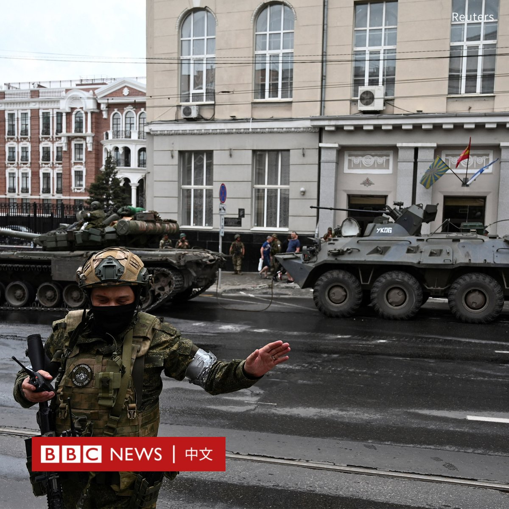
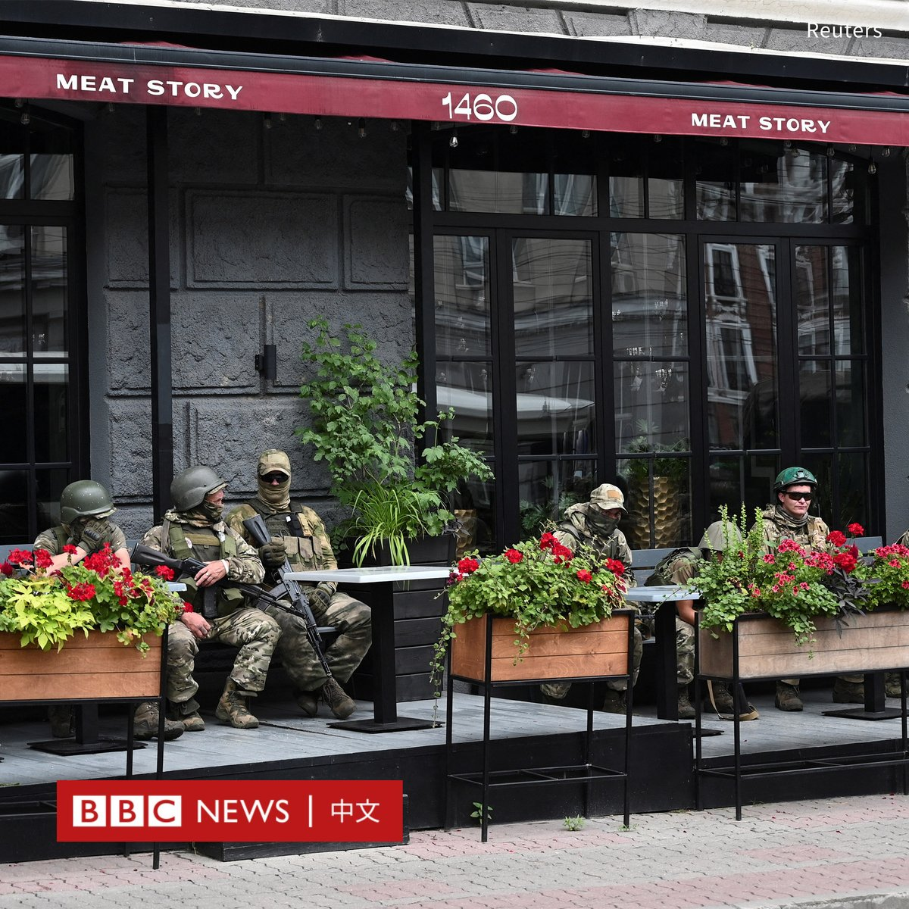
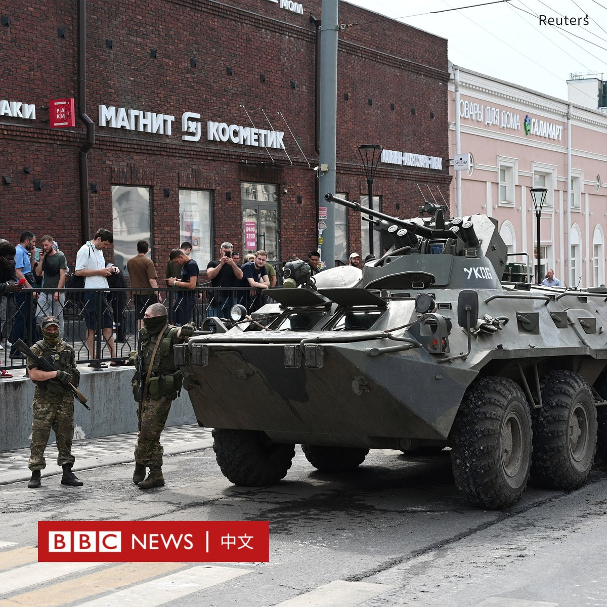
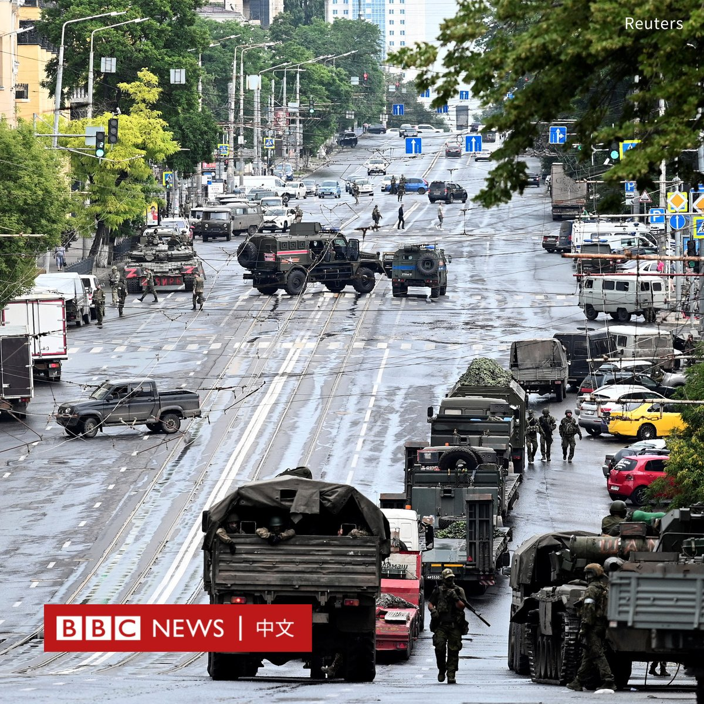
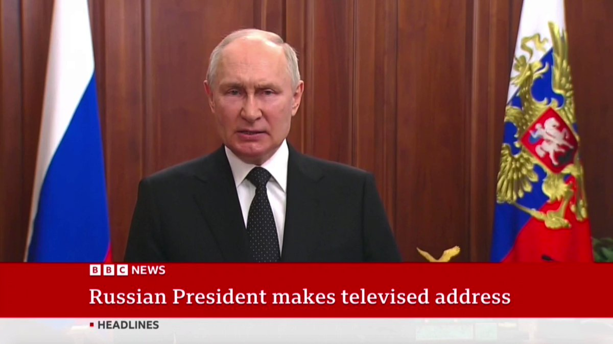
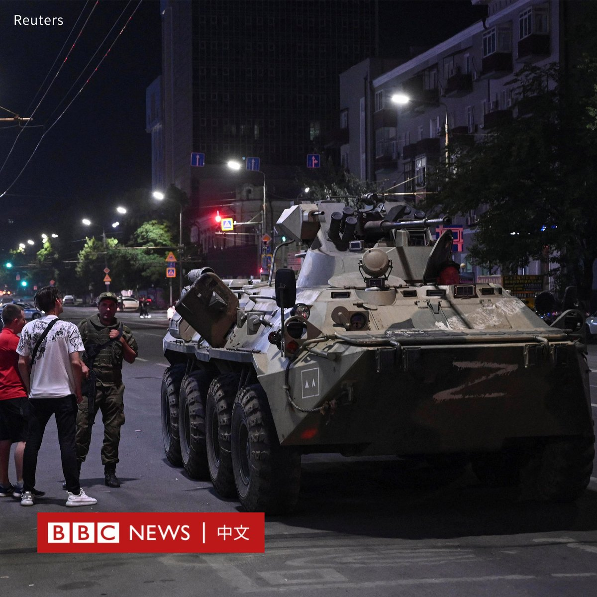
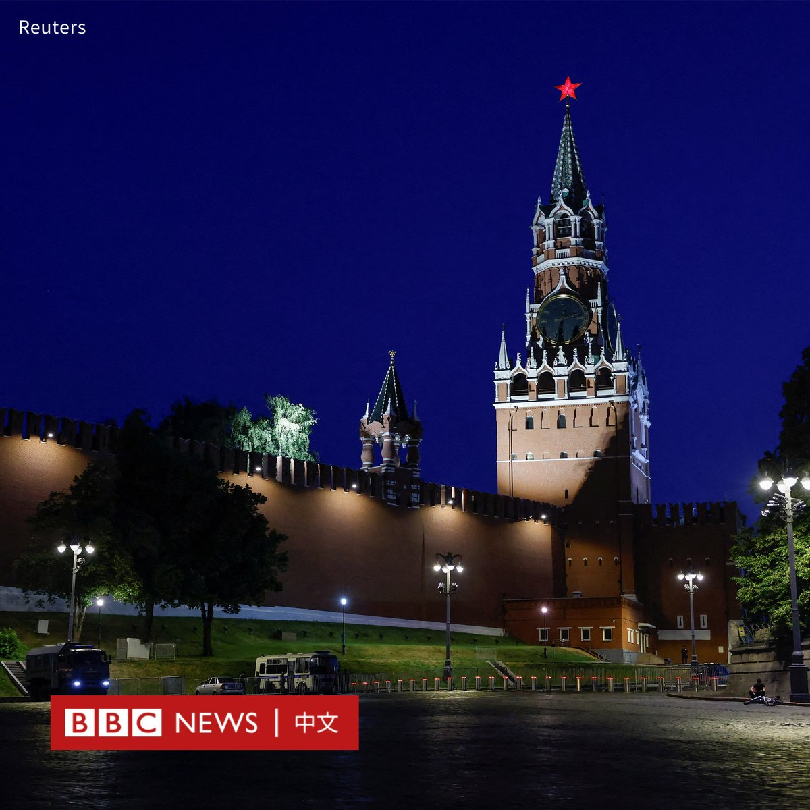
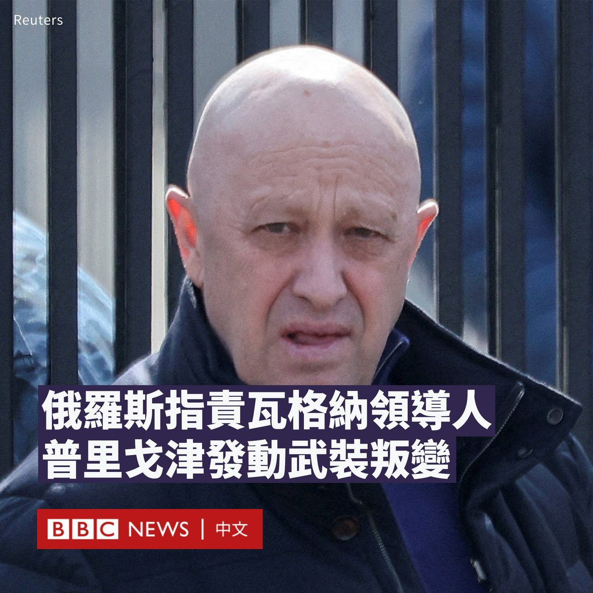

D英国广播公司BBC 北京时间 2023-06-24T17:00:51Z 1672530213090230272 【图集：顿河畔罗斯托夫街头的瓦格纳士兵】

在瓦格纳集团雇佣军据称控制俄罗斯南部城市顿河畔罗斯托夫（Rostov-on-Don）后，坐落在该市的俄罗斯南部军区总部附近出现瓦格纳士兵和军车。

俄罗斯总统普京表示，瓦格纳集团的行动是“背叛”和“叛国”，并补充称将采取“果断行动”戡乱。

瓦格纳集团领导人普里戈津（Yevgeny Prigozhin）则呼吁反抗俄罗斯军方领导层，但他否认自己发动“政变”。   D英国广播公司BBC 北京时间 2023-06-24T15:01:04Z 1672500069172477954 【一周热点回顾】在后新冠疫情的中超联赛回归常态、世界杯冠军阿根廷队访华引发球迷热潮的6月，中国西南省份一项民间乡村业余足球赛事，意外地成为一个瞩目的焦点。https://t.co/HfiYpoughX   D英国广播公司BBC 北京时间 2023-06-24T15:07:31Z 1672501690405380096 【最新消息】据路透社援引俄罗斯安全部门消息人士，瓦格纳集团雇佣军已经控制了莫斯科以南约500公里的沃罗涅日市（Voronezh）所有的军事设施。

俄罗斯当局此前已宣布，将在莫斯科和沃罗涅日地区实施反恐管制，这意味着当局可以限制行人活动、车辆进出，以及限制通信网络。 https://t.co/xeCKJ8KPZu   D英国广播公司BBC 北京时间 2023-06-24T15:31:07Z 1672507629489508353 【现场画面】在瓦格纳集团“兵变”后，俄罗斯总统普京发表演讲。他把雇佣兵挥师返俄形容为“背后捅刀子”。

普京表示，一些俄罗斯人“被诱骗进行犯罪冒险”，并警告分裂社会者将受到“不可避免的惩罚”。

普京强调，已经下达了应对危机的命令，并誓言捍卫俄罗斯。不过，他没有特别提及瓦格纳领导人普里戈津。 https://t.co/IaaLh0NLS8   D英国广播公司BBC 北京时间 2023-06-24T12:35:54Z 1672463534486159360 俄罗斯雇佣兵组织“瓦格纳集团”和俄罗斯军方之间的内斗急剧升级。克里姆林宫表示，瓦格纳集团首脑普里戈津目前正因煽动叛乱而接受调查。https://t.co/ZuObKPYFbR   D英国广播公司BBC 北京时间 2023-06-24T13:01:06Z 1672469876030488577 【一周热点回顾】中国算“发展中国家”吗？北京和华盛顿在这一问题上各执一词。有国际关系学者表示，该争议的背后源于发展中国家的标签“既有政治利益，也有经济利益”。https://t.co/R9offFU6Mx   D英国广播公司BBC 北京时间 2023-06-24T13:37:12Z 1672478962180829184 【最新消息】瓦格纳集团领导人普里戈津（Yevgeny Prigozhin）称其已抵达顿河畔罗斯托夫（Rostov-on-Don）的俄罗斯南部军区总部，并控制当地的关键地点。

他在一段影片中称，除非俄罗斯国防部长绍伊古（Sergei Shoigu）和武装部队总参谋长格拉西莫夫（Valery Gerasimov）前来会见，否则他的武装将封锁这座城市，并向莫斯科进发。

此前，普里戈津誓言要推翻俄罗斯的军事领导层，但否认发动“政变”。俄官方则宣布，已对普里戈津提起武装叛乱诉讼。他将面临最高20年监禁。   D英国广播公司BBC 北京时间 2023-06-24T11:03:06Z 1672440180433891328 普里戈津：招募罪犯参战的俄罗斯雇佣军“瓦格纳集团”首领是谁？
https://t.co/XqJpcSWjE1   D英国广播公司BBC 北京时间 2023-06-24T11:36:38Z 1672448621764317184 【最新消息】在俄罗斯指控瓦格纳领导人叶夫根尼·普里戈津（Yevgeny Prigozhin）发动武装叛变后，在俄罗斯南部城市顿河畔罗斯托夫（Rostov-on-Don），当地Telegram频道的画面显示，武装部队包围了一座政府大楼。

这段未经BBC证实的视频显示，身穿制服的武装人员在大楼周围走动，装甲车包围了大楼，包括两辆坦克。

路透社说，已经证实该地点是警方总部大楼。

与此同时，当地官员瓦西里·戈卢别夫（Vasily Golubev）呼吁居民避免前往市中心。

“考虑到目前的情况，我要求你们不要去市中心，如果可能的话，不要离开家。”他在Telegram上写道。   D英国广播公司BBC 北京时间 2023-06-24T12:16:42Z 1672458703713476609 【最新消息】莫斯科市长谢尔盖·索比亚宁（Sergey Sobyanin）宣布，莫斯科正在采取“反恐措施”，以加强首都的安全保卫。

“已在道路上采取额外的控制措施。”索比亚宁在Telegram上写道。“公共活动的举行可能受到限制，请理解这些措施。”

地方官员宣布，通往莫斯科的高速公路已关闭。

利佩茨克州长表示，穿越利佩茨克州和沃罗涅日州的M4高速公路已经关闭。M4公路连接莫斯科和南部地区。

此前，沃罗涅日政府敦促民众避免前往M4高速公路，因为有军用车队正在通行。

俄罗斯官方此前指控瓦格纳领导人叶夫根尼·普里戈津（Yevgeny Prigozhin）发动武装叛变。克宫发言人佩斯科夫（Dmitry Peskov）表示：“普京总统已经听取了所有关于普里戈津相关事件的简报，正在采取必要措施。”   D英国广播公司BBC 北京时间 2023-06-24T10:58:51Z 1672439112723501060 俄罗斯雇佣军组织瓦格纳（Wagner）的领导人叶夫根尼·普里戈津（Yevgeny Prigozhin）在社交平台上似乎号召对俄罗斯军队发动武装叛乱，并指责俄罗斯军方用导弹袭击了瓦格纳军队。

普里戈津在Telegram上还表示，必须制止俄罗斯军事领导层中的“邪恶”，并誓言要“为正义而战”。

克里姆林宫表示，普里戈津目前正因煽动哗变而接受调查，并否认袭击了瓦格纳军营。

莫斯科政府大楼和交通设施等地加强了安保。

俄罗斯塔斯社报道说，俄总检察院宣布，已对瓦格纳领导人普里戈津提起武装叛乱诉讼。他将面临最高20年监禁。

普里戈津经营着瓦格纳集团，这是一支由雇佣军组成的私人军队，此前一直在乌克兰与俄罗斯正规军并肩作战。

普里戈津在一段新发布的录音中还声称，瓦格纳部队已在多个地点越过俄乌边境，抵达俄罗斯。BBC独立无法核实这些消息。   D英国广播公司BBC 北京时间 2023-06-24T11:01:07Z 1672439682540478464 【一周热点回顾】在中国职场竞争激烈的环境下，许多年轻人回家做起了“全职儿女”，通过做家务或陪伴父母来获得认可。有人甚至与父母签订了一份劳务契约，列出付出与报酬。https://t.co/gcfiKKI2Yl   