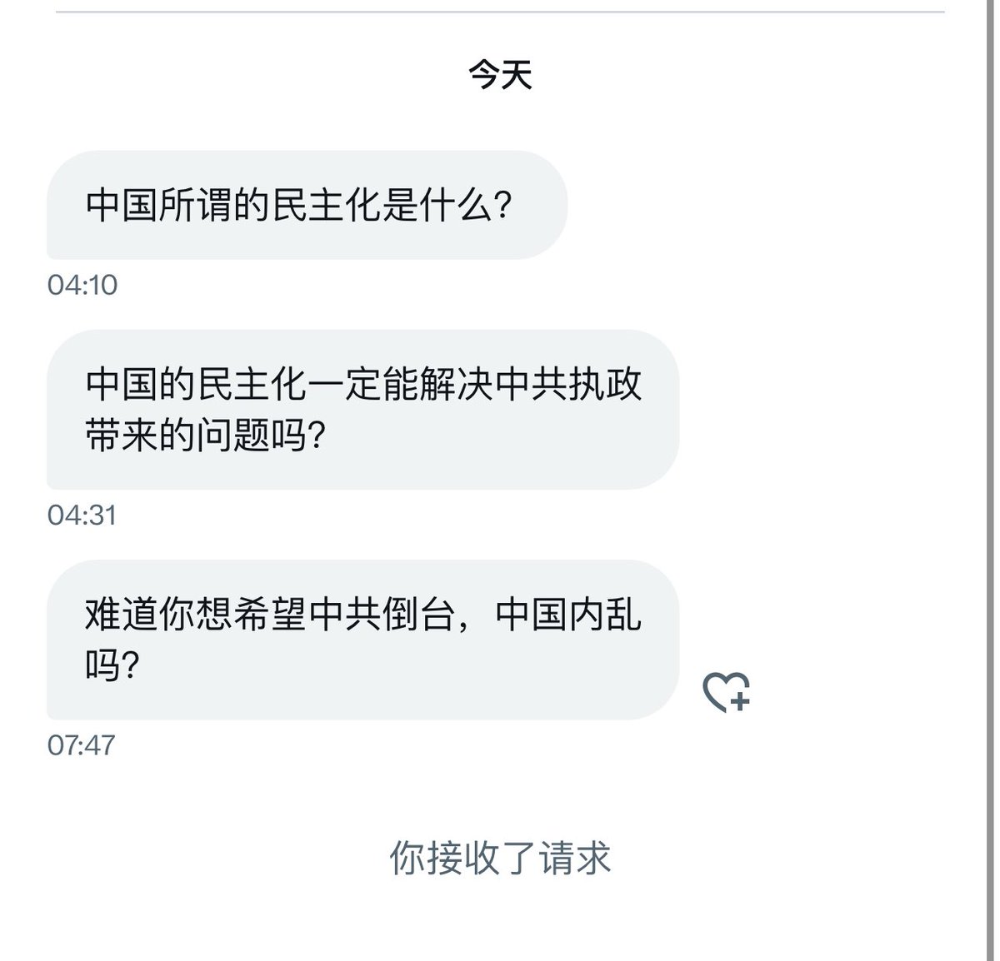

多伦多方脸 北京时间 2023-06-24T22:42:04Z 1672616081670930432 很多人认为中国只要不打台湾就可以了
但其实不是
世界上独裁者一般有三种获得合法性的方式
战争，经济，思想（宗教）
普京的合法性是战争
所以你看到的是普京在乌克兰的热战
而中共的合法性是经济
所以打的是经济战，中共的战争也早打响了，那就是中美贸易战，只是因为是经济战，大家感受没有那么明显 https://t.co/1VBwurcrSc   多伦多方脸 北京时间 2023-06-24T22:58:48Z 1672620292915728385 有时候独裁者真的比民选领导人差很多，你觉得民选领导人差，只是因为言论自由，批评他的声音能被你看到而已。
想想当时打到基辅的时候，泽连斯基没一会就发一个视频，证明自己没跑。
还说出了经典的：我要的是弹药，而不是搭车。
普京但凡，能出来和军队站在一起，做两次演讲，鼓舞一下士气，瓦格纳未必能挺进的那么快。
可是普京呢？电视讲话讲完人就没了，卢卡申科也全家跑路了。
人家泽连斯基逃跑，流亡到欧洲也能一直做个流亡政府，也能富贵一生，你普京能跑哪里去？
泽连斯基退路比你多，都没跑。你却跑了，真的差十万八千里啊。   多伦多方脸 北京时间 2023-06-24T23:09:33Z 1672622997281325059 瓦格纳雇佣军已抵达莫斯科地区，世纪大戏，莫斯科保卫战即将开始。   多伦多方脸 北京时间 2023-06-24T23:16:41Z 1672624792607019009 内乱不是民主化带来的。
中国的民主化，必然是因为中共执政不利，从而导致民怨四起，才会有人抗议，之后不愿意放权，才进入内乱的。
因果要分清楚
至于你说民主化就能解决问题吗？确实不一定能解决，但是不民主化肯定解决不了。不民主化他就会一直乱下去 https://t.co/Ai3VUOiiMB   多伦多方脸 北京时间 2023-06-24T23:20:15Z 1672625691500892162 白俄罗斯解放组织正在准备行动   多伦多方脸 北京时间 2023-06-24T23:41:39Z 1672631078337789953 哈哈哈哈，家都不要了，还在带兵线。   多伦多方脸 北京时间 2023-06-24T21:08:31Z 1672592539013238784 一切都来得太快   多伦多方脸 北京时间 2023-06-24T21:43:06Z 1672601241527144450 之前我记得有个小粉红，说你们这些人，小心中国打台湾之后被排华。
到时候排队求着回中国。
我从2022年开始只看到俄罗斯人排队逃离俄罗斯，没见过哪个俄罗斯人逃回去的。   多伦多方脸 北京时间 2023-06-24T21:53:14Z 1672603793224245249 之前入侵的时候，就是理直气壮。
现在快打输了，就愿世界和平？
不过这些大概率也是水军。 https://t.co/YN9iuFrvyp   多伦多方脸 北京时间 2023-06-24T19:15:19Z 1672564053317931008 瓦格纳现在的样子。
像不像你打游戏输了骂队友的样子？
只是打LOL或者打农药，你不能像友军开火。
但是现实可以 https://t.co/vAnJ57uQ94   多伦多方脸 北京时间 2023-06-24T19:45:13Z 1672571579052724224 一年前大家猜泽连斯基跑没跑。
现在大家猜普京跑没跑。
时过境迁啊   多伦多方脸 北京时间 2023-06-24T17:06:38Z 1672531666596941824 不装了🫵   多伦多方脸 北京时间 2023-06-24T17:12:11Z 1672533067016327168 https://t.co/22VfcKcUuC   多伦多方脸 北京时间 2023-06-24T17:17:53Z 1672534500155465728 粉红现在的口径已经是
觉得瓦格纳不可能推翻普京了，我也不觉得能推翻。
我也不觉得瓦格纳是啥好东西。
只是这么一搞，普京再说拿下乌克兰那就是笑话，普京自己的政权倒台，也要不了几年了。
瓦格纳是第一个，但是不会是最后一个。   多伦多方脸 北京时间 2023-06-24T14:54:41Z 1672498461219115008 从今天开始俄乌战争有两条战线了。
一条在乌克兰，一条在俄罗斯。   多伦多方脸 北京时间 2023-06-24T15:21:58Z 1672505327215067137 一定都是假的，被绍伊古控制了   多伦多方脸 北京时间 2023-06-24T15:28:36Z 1672506999073021959 有人说你看给大逼脸乐的。
我能不乐吗？
我当然要乐，我还要大乐特乐。   多伦多方脸 北京时间 2023-06-24T15:32:15Z 1672507915868192768 挺好的😁再接再厉   多伦多方脸 北京时间 2023-06-24T15:35:34Z 1672508750064934913 真正爱国的粉红
现在应该号召中央收回海参崴。
这不是千载难逢的机会？海参崴那国土可比台湾大多了   多伦多方脸 北京时间 2023-06-24T12:28:37Z 1672461703702011904 按照自古清君侧的习俗。
下一步，就要说普京已经被绍伊古控制了，现在俄罗斯中央发出来的内容都是假的。
都不是普京的意思。   多伦多方脸 北京时间 2023-06-24T12:51:54Z 1672467560670060544 心疼一波爱国俄粉
从一开始的1小时22分拿下基辅。
到现在瓦格纳叛乱都是谣言。
这段时间，不好过吧。   多伦多方脸 北京时间 2023-06-24T13:31:08Z 1672477434401402880 好的，现在还能相信俄罗斯必胜，还真是头铁。   多伦多方脸 北京时间 2023-06-24T14:18:06Z 1672489253706817542 虽然感觉瓦格纳要是搬倒普京有些难度。
但是大势已去，只是时间问题
现在想要拯救普京，只能期待尤里的出现了吧。 https://t.co/KkArtLZRb2   多伦多方脸 北京时间 2023-06-24T11:37:11Z 1672448758788030464 这   多伦多方脸 北京时间 2023-06-24T12:09:02Z 1672456775361257472 什么精神污染 https://t.co/hQntVgedDP https://t.co/UnFy5EuoWr   多伦多方脸 北京时间 2023-06-24T11:00:23Z 1672439496644902912 做这期视频的时候瓦格纳还没有哗变。
不过伴随着瓦格纳的叛变，普京开始变得岌岌可危
现在不论是外部因素还是内部因素都在变得对中共十分不利，其情况比89年还要差！
最近几年，将是中国民主化千载难逢的时机！
方脸说: 中国民主化千载难逢机会已经到了！https://t.co/2XpMtfOWWx   多伦多方脸 北京时间 2023-06-24T08:12:27Z 1672397235634716674 瓦格纳的突破叛变，也太有戏剧效果了   多伦多方脸 北京时间 2023-06-24T08:24:15Z 1672400206598643715 瓦格纳的口号是要除掉绍伊古等国防部蛀虫。
看来清君侧的口号，在什么时候都挺流行的。   多伦多方脸 北京时间 2023-06-24T08:28:00Z 1672401150124105729 就问脸方不方？ https://t.co/Ciz0zmP3ZV   多伦多方脸 北京时间 2023-06-24T08:59:47Z 1672409149773316097 刚看了下墙内俄粉对于瓦格纳的发言。
分为嘴硬派和美帝太坏派 
嘴硬派:
1.视频AI生成的，假的
2.普京和瓦格纳演戏，骗美国和乌克兰的
3.乌克兰的舆论战，信息战，大家不要上当。
美帝太坏派:
1.瓦格纳是雇佣军，一定是美帝重金收买的
2.都怪美国在其中挑拨   