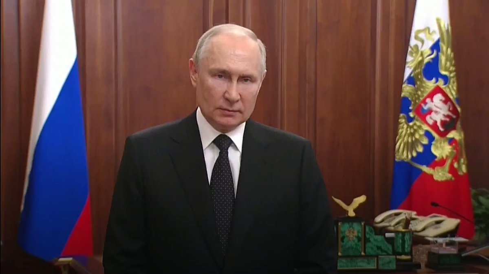

德国之声 北京时间 2023-06-24T20:49:01Z 1672587631249756160 韩国外交部声明称，布林肯告诉韩国外交部长朴振，他与中方进行了坦诚、务实和建设性的对话，并希望尽可能详细地解释访问结果。韩、美也呼吁北京在朝鲜问题上发挥建设性作用。这引起了平壤不满 https://t.co/uWArI7Nx7B   德国之声 北京时间 2023-06-24T21:41:00Z 1672600713820774401 美国司法部以涉嫌贩运 #芬太尼 ☠️ 原料等指控，起诉4家中国公司以及其8名中国雇员。对此，中国政府则批评美方以 #钓鱼执法 🎣 诱捕中国公民，损害中国公民的人权和企业的利益。

https://t.co/KrRjR3yhst   德国之声 北京时间 2023-06-24T18:40:00Z 1672555163775541249 美国国务卿布林肯结束北京之行后，中美两国又开始“秀肌肉”，台湾军方周六侦测到8架解放军军机✈️逾越台海中线；美军航母⛴️则预计在本周日停靠🇻🇳越南岘港。

https://t.co/Ln3ghfMjVd   德国之声 北京时间 2023-06-24T19:00:54Z 1672560426406539264 从监狱囚犯到“普京的厨师”，再到互联网研究机构的幕后黑手、“瓦格纳集团”的老板，普里戈津的影响力究竟有多大？他能对普京构成多大威胁？ https://t.co/4ak1BkbLC8   德国之声 北京时间 2023-06-24T19:36:00Z 1672569256381386753 6月24日，俄罗斯瓦格纳佣兵团首领普里戈津宣布，其部队已经跨过边境进入俄罗斯，目标是推翻莫斯科的军事领导层、逼迫国防部长与总参谋长下台。在俄乌战争中，瓦格纳佣兵团曾发挥过重要作用，在巴赫穆特包围战中甚至一度充当俄方主力。 https://t.co/OV8BpIlnoJ   德国之声 北京时间 2023-06-24T17:05:08Z 1672531291227529216 瓦格纳集团首领普里戈津质疑俄乌战争的意义，称俄罗斯出兵的理由都是谎言 https://t.co/hl5O27XXcx   德国之声 北京时间 2023-06-24T18:00:38Z 1672545259211964419 美情报机构：新冠起源又有新说法https://t.co/SnLfzJGLNk   德国之声 北京时间 2023-06-24T14:33:09Z 1672493044346568704 黎智英是持有英国护照的英国公民，他的儿子黎崇恩近日向英国政府喊话，要求该国将黎智英案件作为“政治优先事项”。他说：“如果他们（英国政府）在一个与他们有业务往来的地方，不去坚决保护其公民，那么说来丢脸的是：拥有其护照的意义何在？作为其公民的意义何在？” https://t.co/mVpEaajXk7   德国之声 北京时间 2023-06-24T15:27:17Z 1672506666900750338 75年前的“空中桥梁”！

如何在数月时间里仅以空运方式给一座百万人口的城市提供生活物资？盟军以1948/49年的西柏林“空中桥梁”作出了回答。

https://t.co/n5rZpyWQ0f

1948年6月24日，苏联封锁了所有通往西德的水、陆交通，供电亦被切断。西方盟军迅即作出反应。 https://t.co/1VEujEHSKZ   德国之声 北京时间 2023-06-24T16:20:58Z 1672520177135616002 普京：瓦格纳军团叛乱是对俄罗斯“背后捅刀子”

在雇佣军瓦格纳集团的首领普里戈津（Yevgeny Prigozhin）发誓要推翻俄罗斯军事领导层、并声称控制了南部的一个重要军事基地后，俄罗斯总统普京在向全国发表的电视讲话 https://t.co/RukJeAtTEA   德国之声 北京时间 2023-06-24T11:06:00Z 1672440910712299523 到底是先有鸡🐥还是先有蛋🐣？

到底是先有鸡🐥还是先有蛋🐣？ DW认认真真的回答这个问题…… https://t.co/2gpozAM5XJ   德国之声 北京时间 2023-06-24T08:58:00Z 1672408698541449217 旅德人类学家项飙观察中德社会和青年人生存状态

“我认为中国现在面临最大的一个问题是底层社会韧性的缺失” #dwbusiness https://t.co/pcCPiJNhc3   德国之声 北京时间 2023-06-24T05:59:00Z 1672363651422994432 德国绿党主席出任联邦经济部长以来，政府为德企在华投资提供的担保已经大幅削减。然而，同为执政党的社民党依然高度关注德中关系的经济方面。《明镜周刊》从政府圈内人士处获悉，绿党与社民党在对华政策上的巨大分歧，导致德国政府新对华战略迟迟不能出炉。

https://t.co/t46eVBDsHh   德国之声 北京时间 2023-06-24T00:00:03Z 1672273321432592393 拜登最近公开称习近平是独裁者，政治学者张俊华指出，这是在任美国总统首次对中国领导人如此毫不掩饰地评论。 拜登如此做的动机是什么？中国在国内媒体一字不提此事的情况下，在外却用威吓语言企图让美国收回此说，又是为什么？中美这场风波将如何平息下去？

https://t.co/TMRgEnaT4X   