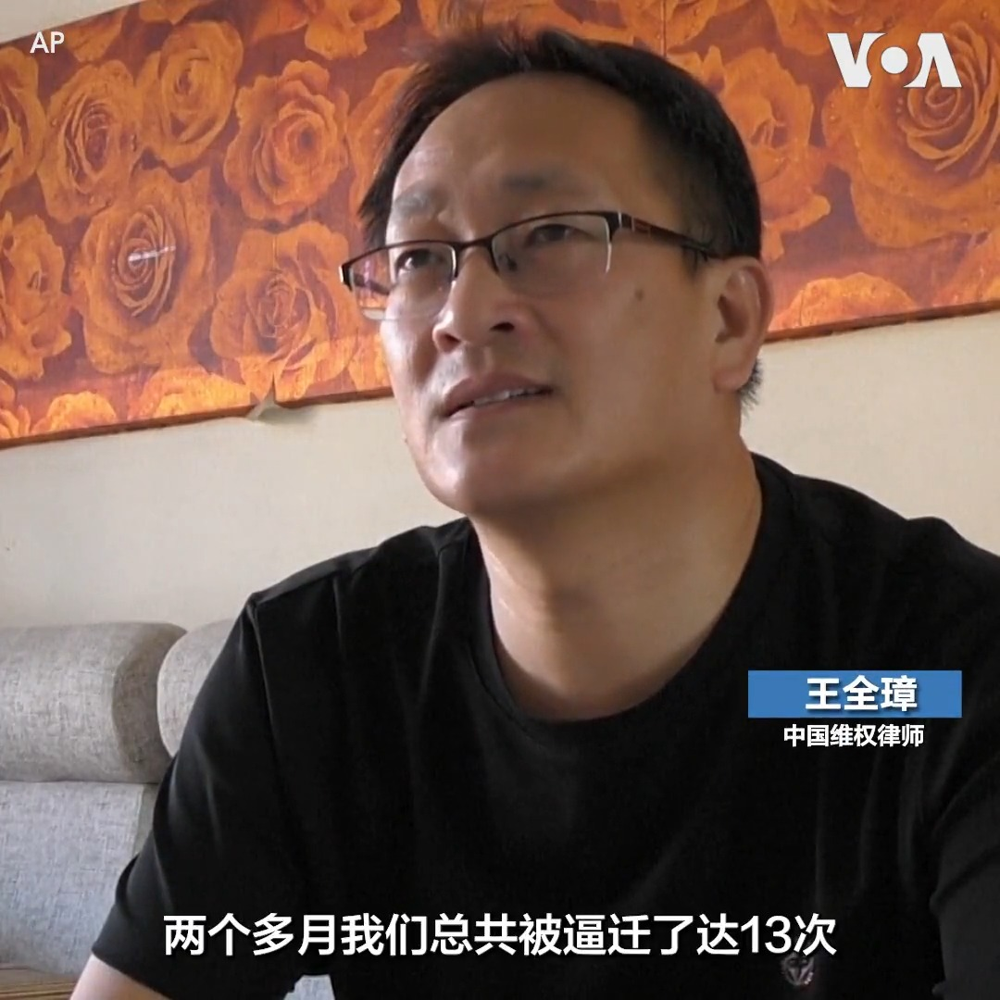
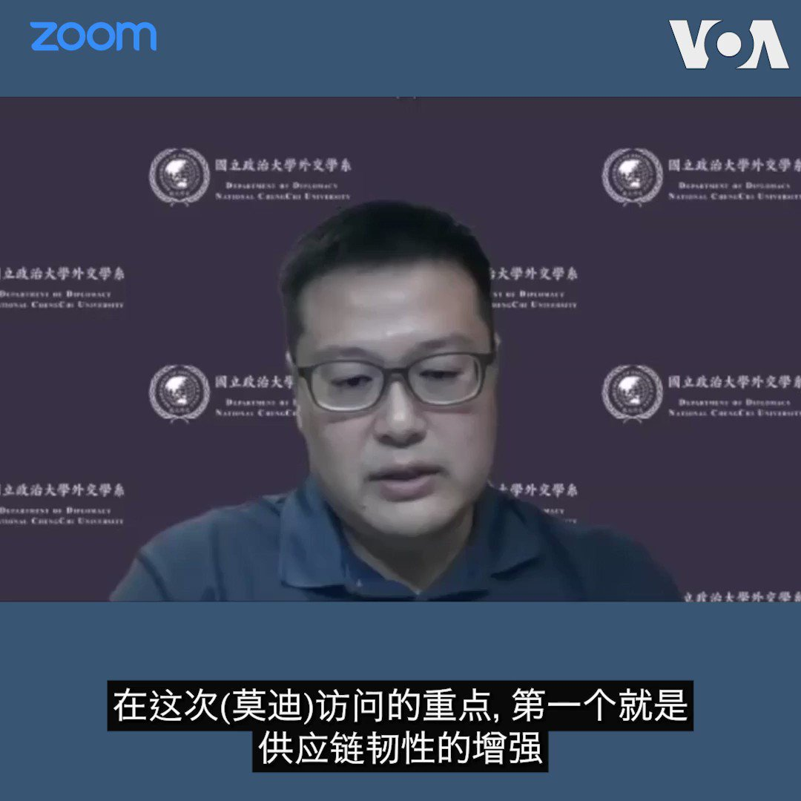

美国之音中文网 北京时间 2023-06-24T09:41:03Z 1672419533280391173 布林肯访中后北京指美“篡改”一中政策;专家：中国散布假信息 https://t.co/G7IszZNvnm   美国之音中文网 北京时间 2023-06-24T09:49:18Z 1672421611524493315 在美中关系持续紧张之际，美印关系进入“新时代”。印度总理莫迪23日结束访美行程，白宫表示访问非常成功。美印矢志扩充、夯实两国“全面全球战略伙伴关系”，并在防务和高科技等诸多领域达成一系列协议，其中不乏旨在制衡中国影响力的合作项目。莫迪此次美国之行有哪些重要成果？如何解读美印深化合作？ https://t.co/hOPXh7k5jS   美国之音中文网 北京时间 2023-06-24T04:27:34Z 1672340642515779585 利比亚在打击加密币采矿行动中逮捕50名中国公民 https://t.co/g42XVmeaCj   美国之音中文网 北京时间 2023-06-24T04:29:23Z 1672341099082547201 “听到门外有动静或敲门声我的心一下子就揪起来了, 真的是很害怕”, 中国著名维权律师王全璋的妻子李文足告诉美联社记者。 王全璋一家两个月内13次被迫搬家, 警察半夜上门、不明人士骚扰、跟踪、切断电源、半夜被赶出门已成为他们的生活常态。其他维权律师也受到骚扰。报道:https://t.co/fmIsTk8af9 https://t.co/kk7hyQQGPG   美国之音中文网 北京时间 2023-06-24T05:03:20Z 1672349643639001088 中国外交部发言人表示，中国不存在所谓“错误羁押”问题。然而事实是，至少有三名美国人被不当拘留在中国监狱中。有关案例，请看 #揭谎频道 
https://t.co/cA4AUZ2PQ3   美国之音中文网 北京时间 2023-06-24T05:09:21Z 1672351157266825216 印度总理莫迪6月22日与美国总统拜登举行会谈，两国关系也进一步获得深化。专家分析，美印在供应链和国防工业的协议是双边合作的重要议题，但新德里未全面倒向华盛顿，双方并非盟友而是战略伙伴。此外，印度周边的东南亚各国外交政策仍大致不变。报道内容：https://t.co/004EE9iKPQ https://t.co/bmpV5u5kw0   美国之音中文网 北京时间 2023-06-24T05:30:00Z 1672356354747498497 在印太地区局势持续紧张之际，美国星期四以最高礼遇的盛大典礼欢迎印度总理莫迪对美国进行国事访问，将两国近年来迅速升温的双边关系推向了顶点。在奥巴马政府时期担任美国驻印度大使的罗默认为，莫迪此次访美是一次划时代的访问，在很多方面都具有历史意义。报道内容：https://t.co/TigEe1zZQi https://t.co/mVt0hEsdTS   美国之音中文网 北京时间 2023-06-24T02:43:34Z 1672314469207375873 莫迪访美促两国关系跨入新时代，中国议题是“房间里的大象” https://t.co/eHQaYY8tMb   美国之音中文网 北京时间 2023-06-24T02:45:49Z 1672315038588358657 近期举办的Voguing上海三周年纪念舞会旨在庆祝一种以LGBTQ社区为中心的亚文化。这场活动有200多人参加，他们在纪念舞会上尽兴舞蹈、表演。有参与者说，人们参加这场活动并不仅仅是为了好玩，而是想要“逃离各种各样的环境”。还有人则希望Voguing舞会和LGBTQ相关活动能早日不受政府干涉。 https://t.co/uVWfpopmwl   美国之音中文网 北京时间 2023-06-24T03:13:34Z 1672322019009101826 乌克兰盟友承诺数百亿美元用于重建，基辅需要更多帮助 https://t.co/QSUbXJpnDp   美国之音中文网 北京时间 2023-06-24T04:14:40Z 1672337395965124610 “新全球融资契约峰会”(Summit for a New Global Financial Pact) 23日在巴黎闭幕之际，气候活动人士23日在巴黎举行抗议活动，呼吁停止向化石燃料投资。 https://t.co/dGdrIQBq25   美国之音中文网 北京时间 2023-06-24T01:12:03Z 1672291438850375682 忧影响新闻从业员利益，香港记协考虑介入《愿荣光归香港》禁制令 https://t.co/dTtyhokrjZ   美国之音中文网 北京时间 2023-06-24T01:25:02Z 1672294707165282306 联合国追责俄罗斯 将俄军及其代理武装团体列入“耻辱名单” https://t.co/TxDAvRSDNO   美国之音中文网 北京时间 2023-06-24T01:42:04Z 1672298992057864192 向俄罗斯提供“致命性援助”？纽时揭中国保利公司向俄兵工厂运送大量制造子弹的火药 https://t.co/gUd6VitGcq   美国之音中文网 北京时间 2023-06-24T00:10:33Z 1672275963344994305 莫迪转向亲美抗中?　观察人士:印中具矛盾本质，印美结盟趋好 https://t.co/aQdkSgs9pp   美国之音中文网 北京时间 2023-06-24T00:10:35Z 1672275971255463937 中国经济很奇怪，再多的钱砸进去也听不到响 https://t.co/Ar5QmiLaOu   美国之音中文网 北京时间 2023-06-24T00:21:27Z 1672278706516295681 “美国不寻求与中国的冲突或新冷战…但我们会保卫和巩固当前的世界秩序”, 美国官员说，当前的世界秩序让包括美中在内的大国合作成为可能。中国近三年提出三项全球安全、发展、文明倡议GSI、GDI、GCI，学者认为中国希望通过扩大影响力改变国际秩序，并建议西方国家深入与发展中国家合作，提供替代方案。 https://t.co/HVKa8ap73Y   