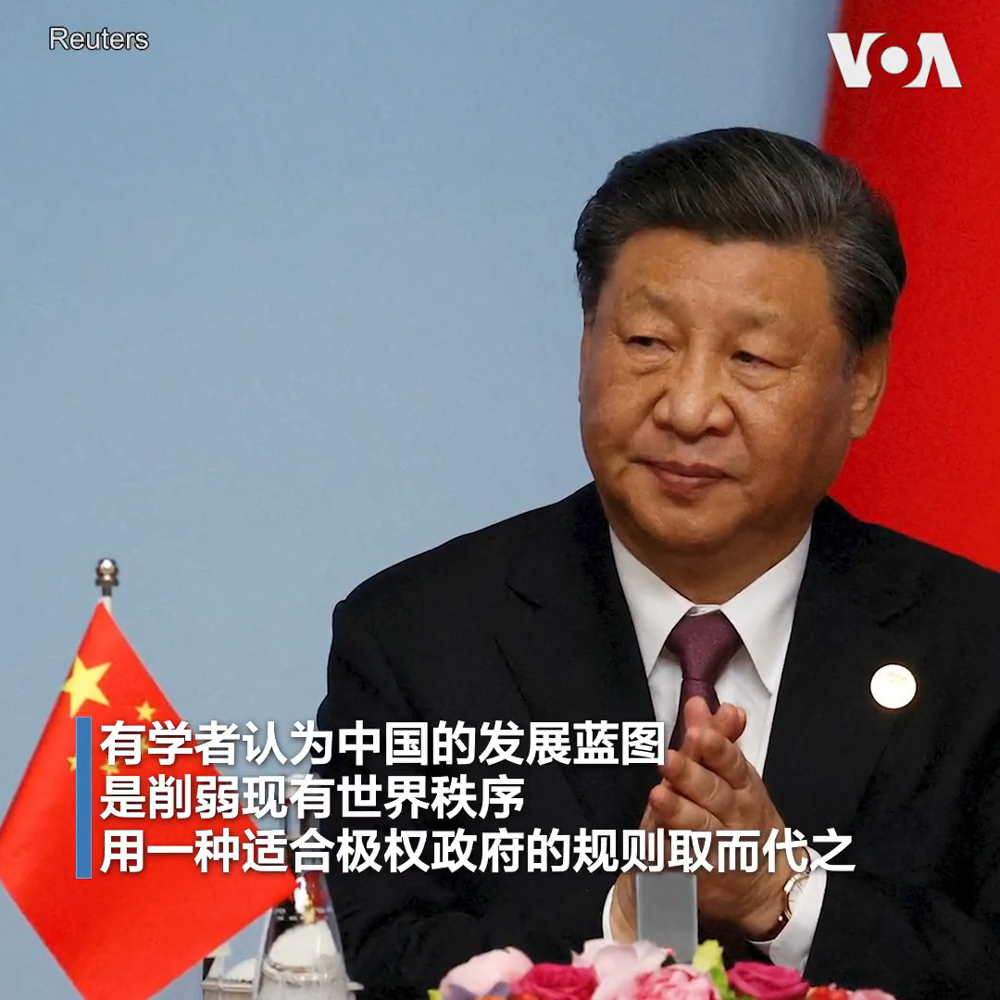

美国之音中文网 北京时间 2023-06-24T01:25:02Z 1672294707165282306 联合国追责俄罗斯 将俄军及其代理武装团体列入“耻辱名单” https://t.co/TxDAvRSDNO   美国之音中文网 北京时间 2023-06-24T01:42:04Z 1672298992057864192 向俄罗斯提供“致命性援助”？纽时揭中国保利公司向俄兵工厂运送大量制造子弹的火药 https://t.co/gUd6VitGcq   美国之音中文网 北京时间 2023-06-24T00:10:33Z 1672275963344994305 莫迪转向亲美抗中?　观察人士:印中具矛盾本质，印美结盟趋好 https://t.co/aQdkSgs9pp   美国之音中文网 北京时间 2023-06-24T00:10:35Z 1672275971255463937 中国经济很奇怪，再多的钱砸进去也听不到响 https://t.co/Ar5QmiLaOu   美国之音中文网 北京时间 2023-06-24T00:21:27Z 1672278706516295681 “美国不寻求与中国的冲突或新冷战…但我们会保卫和巩固当前的世界秩序”, 美国官员说，当前的世界秩序让包括美中在内的大国合作成为可能。中国近三年提出三项全球安全、发展、文明倡议GSI、GDI、GCI，学者认为中国希望通过扩大影响力改变国际秩序，并建议西方国家深入与发展中国家合作，提供替代方案。 https://t.co/HVKa8ap73Y   