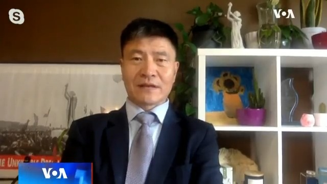
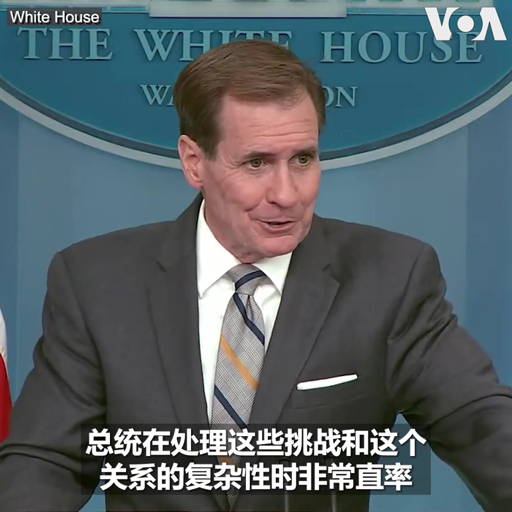
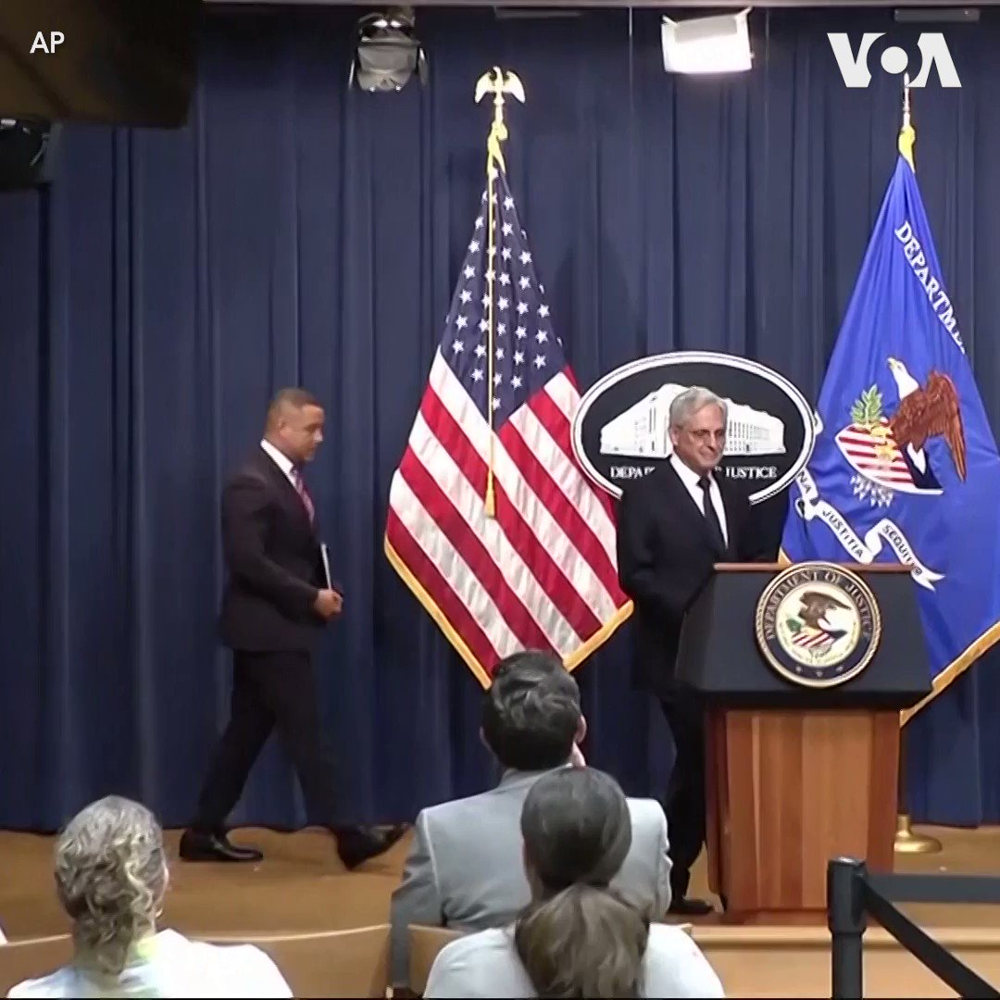
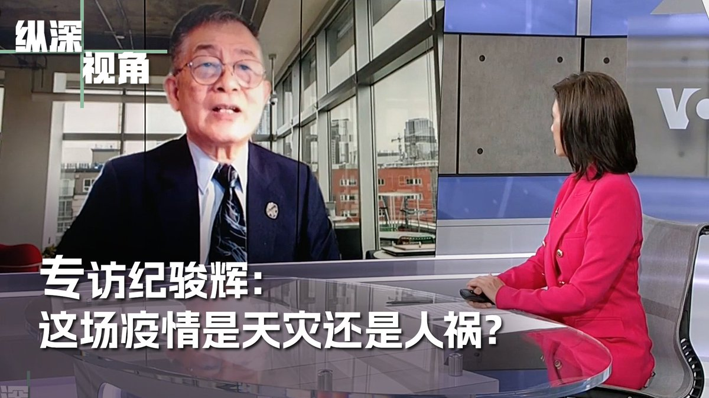
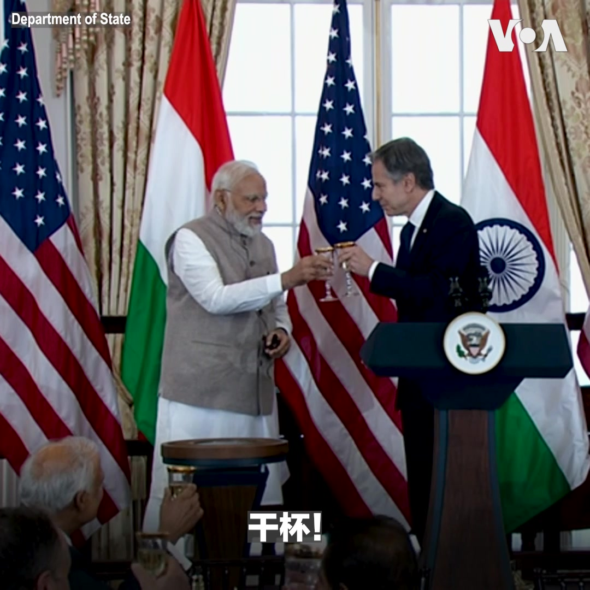
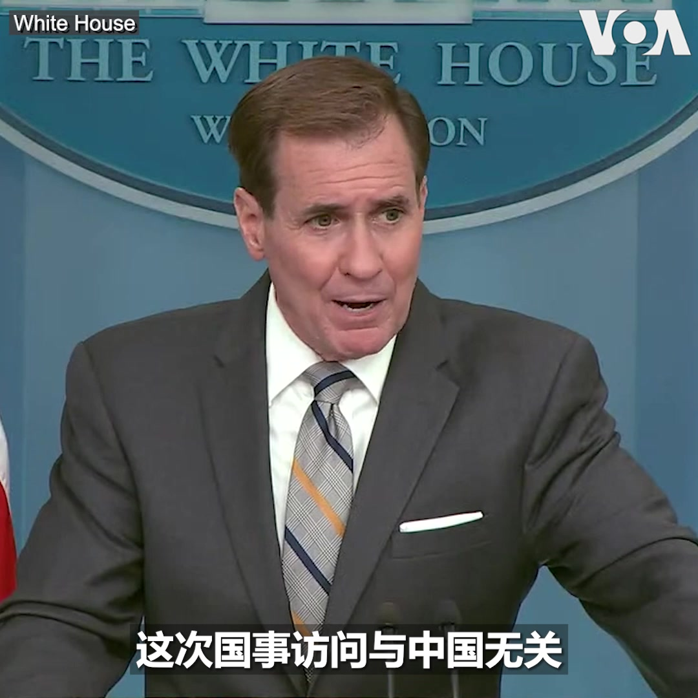
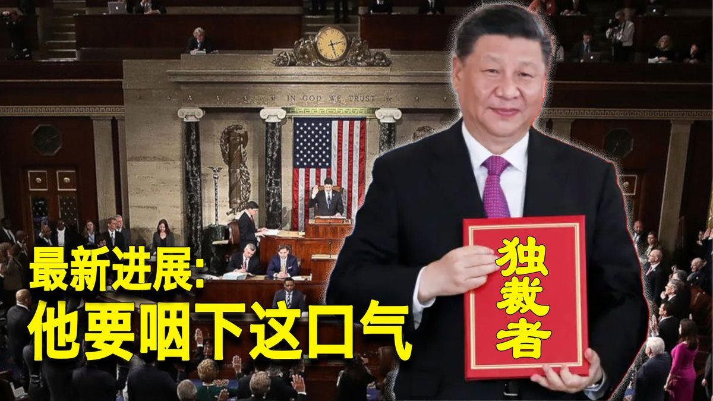

美国之音中文网 北京时间 2023-06-24T21:05:03Z 1672591665687838720 普京：瓦格纳集团在罗斯托夫的行动是“叛国”，誓言要“严厉”惩罚 https://t.co/xlimFXnUL3   美国之音中文网 北京时间 2023-06-24T21:57:54Z 1672604965909721088 俄罗斯南部顿河畔罗斯托夫街头24日下午仍可看到雇佣兵组织瓦格纳集团的战斗人员和军车；一些瓦格纳战斗人员在与当地居民交谈，一名妇女问是否会发生内战，瓦格纳战斗人员告诉她不用担心。瓦格纳集团领导人普里戈津早些时候表示，他的部队已控制了这里的俄罗斯军队总部，并控制了该市的军事基地。 https://t.co/CVyxxIOEil   美国之音中文网 北京时间 2023-06-24T22:00:01Z 1672605498716356608 在突破俄军第一道防线后，乌军放缓了进攻的步伐。在继续试探俄军防线薄弱处的同时，乌军也不断打击俄军后方目标。在西方军援方面，意大利开始交付完整的SAMP/T防空系统。SAMP/T是欧洲研发的第一个远程防空系统，具有反导能力。与此同时，瑞典宣布将训练乌克兰空军操作JAS鹰狮战机。 https://t.co/RqR1YVKvvJ   美国之音中文网 北京时间 2023-06-24T18:47:03Z 1672556939895795712 布林肯跟朴振讨论访华之行; 朝鲜警告要做出更强烈反应 https://t.co/HjjNRSGv7t   美国之音中文网 北京时间 2023-06-24T15:00:00Z 1672499800606908418 北京是否最担心升级中的美印军事合作？（美国智库）史汀生中心东亚项目共同主任、中国项目主任孙韵女士说习近平对包括印度在内的四方对话感到不舒适的最大原因是它造成了一种地区态势，中国被孤立。在亚洲地区对中国形成极大的战略压力和安全掣肘。#时事大家谈完整版：https://t.co/NmtVQbezCO https://t.co/8UhElcvvdo   美国之音中文网 北京时间 2023-06-24T13:00:00Z 1672469602343763968 拜登总统的“独裁者”点评打中了七寸，让北京跳起来？“中国人权”执行主任、“人道中国”创办人周锋锁先生认为这个批评让习这个独裁者感情在受伤，后果很严重，毛宁发言，谢峰大使也发言，这种外交反应少有：拜登说出了事实，打中了蛇的七寸，为拜登鼓掌。#时事大家谈完整版：https://t.co/NmtVQbezCO https://t.co/NrvEDtPodJ   美国之音中文网 北京时间 2023-06-24T12:17:34Z 1672458920189906950 台湾军方称 中共军机逾越海峡中线并抵近24海里线 https://t.co/vcV4XrBNOo   美国之音中文网 北京时间 2023-06-24T09:58:07Z 1672423827106844673 印度送护卫舰强化越南海军实力 此举能否有助于反击中国海上扩张？ https://t.co/JMahGOYb3G   美国之音中文网 北京时间 2023-06-24T09:58:08Z 1672423834761433088 记者手记：不准大声喊问题，“一次性”手机和规矩：布林肯备受关注的中国之行随团采访花絮 https://t.co/fMzu8lGJxU   美国之音中文网 北京时间 2023-06-24T10:41:33Z 1672434758801039360 美国情报报告称，没有直接证据表明新冠病毒源于武汉病毒研究所 https://t.co/6S9NUI9oAn   美国之音中文网 北京时间 2023-06-24T11:00:02Z 1672439409109794816 如何看中国大使馆出面抗议拜登说习是个独裁者？美国圣托马斯大学国际研究讲座教授叶耀元博士说，民主国家容忍对国家元首的批评，因为你不允许言论自由，才被批成独裁者。中国大使馆抗议传出的反民主反自由论述，正好与拜登的独裁者批评想吻合。 #时事大家谈完整版 ：https://t.co/NmtVQbf7sm https://t.co/MqynDy5hgu   美国之音中文网 北京时间 2023-06-24T06:33:35Z 1672372356227141632 “我们并不羞于坦率地谈论我们对中华人民共和国的一些关切和问题以及他们构成的挑战，”白宫国安会发言人科比6月23日在例行记者会上回应中方有关拜登总统称习近平是独裁者是“政治挑衅”时说。他说，美方所关注的是就推动美中关系向前发展进行沟通。 https://t.co/wCt6Eujaiv   美国之音中文网 北京时间 2023-06-24T06:43:18Z 1672374802395594752 一份由美国前情报机构负责人和前军方将领牵头的独立工作组的研究报告指出，台湾海峡重新成为主要地缘政治热点，中国的军事实力已经打破地区军力平衡，美国为确保台湾安全必须努力在军事、经济和安全方面加强对中国的威慑。但在如何加强对中国威慑的关键问题上仍无法达成一致。https://t.co/0OAMWZBPhZ https://t.co/A9V1teB6Su   美国之音中文网 北京时间 2023-06-24T06:50:00Z 1672376486186065920 美国司法部23日宣布向四家中国公司和八个人提起刑事诉讼，指控他们非法贩运用于制造芬太尼的前体化学品。起诉书在纽约的两个联邦法庭提交，这是美国首次对制造这种前体化学品的中国公司提出检控。 https://t.co/1bENZFAXSh   美国之音中文网 北京时间 2023-06-24T06:59:34Z 1672378893456801792 涉39名越南移民死亡惨案的罗马尼亚男子在英国认罪 https://t.co/Q3WcFd5Lz6   美国之音中文网 北京时间 2023-06-24T07:00:02Z 1672379011186540544 新冠疫情爆发三年多来，病毒起源仍然是谜。俄勒冈州立大学全球卫生中心主任纪骏辉说，现在唯一确定的是中国在疫情初期隐瞒了人传人的事实。他谈到下次疫情来自中国的可能性，并呼吁像对待核武试验一样，制定严格管理危险生物研究的国际公约。美国之音【纵深视角】在6月24日上午9点播出，敬请收看。 https://t.co/qf0dgcj3cg   美国之音中文网 北京时间 2023-06-24T07:15:03Z 1672382792687316992 孙韵: 莫迪访美与中国 https://t.co/jXrbUCE6eH   美国之音中文网 北京时间 2023-06-24T07:30:00Z 1672386555036696576 美国副总统哈里斯和国务卿布林肯6月23日在国务院为印度总理莫迪举办欢迎午宴。布林肯和母亲来自印度的哈里斯在午宴上发表讲话时，对印度文化和印度裔美国人对美国的影响和贡献表示赞赏。 https://t.co/B08bFRj4nP   美国之音中文网 北京时间 2023-06-24T07:39:32Z 1672388953146548225 针对与俄罗斯瓦格纳集团有关的事态发展，白宫国安会发言人说：“我们正在监测局势并将与盟国和伙伴就这些事态发展进行磋商。“瓦格纳首领普里戈津指责俄防长绍伊古下令火箭袭击其兵营，并宣布出兵推翻绍伊古。俄当局对其下达逮捕令并勒令瓦格纳武装人员返回兵营，莫斯科城内加强警戒。   美国之音中文网 北京时间 2023-06-24T07:45:00Z 1672390327812911104 “我们没把印度视为制衡中国的力量，也没有把这次国事访问当成向中国传递信息的机会，”白宫国安会战略沟通协调员科比6月23日在记者会上谈到印度总理莫迪对美国的访问时说。他表示，这次访问与中国无关，但美印双方讨论了北京对两国分别构成的挑战。 https://t.co/mSiOxczyGG   美国之音中文网 北京时间 2023-06-24T08:00:02Z 1672394111553265665 中国脱口秀演员李昊石因为一句“作风优良、能打胜仗”将野狗和解放军比较的段子被封杀并罚以巨款。美籍华人脱口秀演员张羽辰曾在美国海军陆战队服役，她对李昊石的际遇感到难以置信，因为在言论自由受保护的美国，军人与狗都可以是喜剧素材，海军陆战队甚至以斗牛犬作为吉祥物。 https://t.co/ARObIN911J   美国之音中文网 北京时间 2023-06-24T08:15:05Z 1672397901367234563 美国首次起诉中国芬太尼制造商 https://t.co/iWAx9ogJmJ   美国之音中文网 北京时间 2023-06-24T08:17:48Z 1672398585026207745 香港政府准备禁止《愿荣光归香港》。新闻报道中可以出现这支歌吗？报道内容：https://t.co/6JplmHSJiM https://t.co/NLB7pKk9UZ   美国之音中文网 北京时间 2023-06-24T09:00:01Z 1672409205167509505 一键解锁#美国热搜 榜：1、习独裁者名号来自于中国宪法2、拜登不收回称习近平独裁者言论 习近平要怂3、新西兰总理说习近平不是独裁者4、中国最大的对手是印度，不是美国5、“彭载舟”再现：年轻人北大举牌“罢黜一党极权，拥抱多党制度”6、荒诞的家庭教育令7、农村出现水井证8、退路还耕9、自古英雄出少年 https://t.co/zHtc6JD9mm   美国之音中文网 北京时间 2023-06-24T09:26:03Z 1672415759350501377 俄军重大内讧：普里戈津发兵讨伐绍伊古，当局指责其哗变并启动刑事调查 https://t.co/lm2JDXcQAh   美国之音中文网 北京时间 2023-06-24T09:41:03Z 1672419533280391173 布林肯访中后北京指美“篡改”一中政策;专家：中国散布假信息 https://t.co/G7IszZNvnm   美国之音中文网 北京时间 2023-06-24T09:49:18Z 1672421611524493315 在美中关系持续紧张之际，美印关系进入“新时代”。印度总理莫迪23日结束访美行程，白宫表示访问非常成功。美印矢志扩充、夯实两国“全面全球战略伙伴关系”，并在防务和高科技等诸多领域达成一系列协议，其中不乏旨在制衡中国影响力的合作项目。莫迪此次美国之行有哪些重要成果？如何解读美印深化合作？ https://t.co/hOPXh7k5jS   美国之音中文网 北京时间 2023-06-24T04:27:34Z 1672340642515779585 利比亚在打击加密币采矿行动中逮捕50名中国公民 https://t.co/g42XVmeaCj   美国之音中文网 北京时间 2023-06-24T04:29:23Z 1672341099082547201 “听到门外有动静或敲门声我的心一下子就揪起来了, 真的是很害怕”, 中国著名维权律师王全璋的妻子李文足告诉美联社记者。 王全璋一家两个月内13次被迫搬家, 警察半夜上门、不明人士骚扰、跟踪、切断电源、半夜被赶出门已成为他们的生活常态。其他维权律师也受到骚扰。报道:https://t.co/fmIsTk8af9 https://t.co/kk7hyQQGPG   美国之音中文网 北京时间 2023-06-24T05:03:20Z 1672349643639001088 中国外交部发言人表示，中国不存在所谓“错误羁押”问题。然而事实是，至少有三名美国人被不当拘留在中国监狱中。有关案例，请看 #揭谎频道 
https://t.co/cA4AUZ2PQ3   美国之音中文网 北京时间 2023-06-24T05:09:21Z 1672351157266825216 印度总理莫迪6月22日与美国总统拜登举行会谈，两国关系也进一步获得深化。专家分析，美印在供应链和国防工业的协议是双边合作的重要议题，但新德里未全面倒向华盛顿，双方并非盟友而是战略伙伴。此外，印度周边的东南亚各国外交政策仍大致不变。报道内容：https://t.co/004EE9iKPQ https://t.co/bmpV5u5kw0   美国之音中文网 北京时间 2023-06-24T05:30:00Z 1672356354747498497 在印太地区局势持续紧张之际，美国星期四以最高礼遇的盛大典礼欢迎印度总理莫迪对美国进行国事访问，将两国近年来迅速升温的双边关系推向了顶点。在奥巴马政府时期担任美国驻印度大使的罗默认为，莫迪此次访美是一次划时代的访问，在很多方面都具有历史意义。报道内容：https://t.co/TigEe1zZQi https://t.co/mVt0hEsdTS   美国之音中文网 北京时间 2023-06-24T02:43:34Z 1672314469207375873 莫迪访美促两国关系跨入新时代，中国议题是“房间里的大象” https://t.co/eHQaYY8tMb   美国之音中文网 北京时间 2023-06-24T02:45:49Z 1672315038588358657 近期举办的Voguing上海三周年纪念舞会旨在庆祝一种以LGBTQ社区为中心的亚文化。这场活动有200多人参加，他们在纪念舞会上尽兴舞蹈、表演。有参与者说，人们参加这场活动并不仅仅是为了好玩，而是想要“逃离各种各样的环境”。还有人则希望Voguing舞会和LGBTQ相关活动能早日不受政府干涉。 https://t.co/uVWfpopmwl   美国之音中文网 北京时间 2023-06-24T03:13:34Z 1672322019009101826 乌克兰盟友承诺数百亿美元用于重建，基辅需要更多帮助 https://t.co/QSUbXJpnDp   美国之音中文网 北京时间 2023-06-24T04:14:40Z 1672337395965124610 “新全球融资契约峰会”(Summit for a New Global Financial Pact) 23日在巴黎闭幕之际，气候活动人士23日在巴黎举行抗议活动，呼吁停止向化石燃料投资。 https://t.co/dGdrIQBq25   美国之音中文网 北京时间 2023-06-24T01:12:03Z 1672291438850375682 忧影响新闻从业员利益，香港记协考虑介入《愿荣光归香港》禁制令 https://t.co/dTtyhokrjZ   美国之音中文网 北京时间 2023-06-24T01:25:02Z 1672294707165282306 联合国追责俄罗斯 将俄军及其代理武装团体列入“耻辱名单” https://t.co/TxDAvRSDNO   美国之音中文网 北京时间 2023-06-24T01:42:04Z 1672298992057864192 向俄罗斯提供“致命性援助”？纽时揭中国保利公司向俄兵工厂运送大量制造子弹的火药 https://t.co/gUd6VitGcq   美国之音中文网 北京时间 2023-06-24T00:10:33Z 1672275963344994305 莫迪转向亲美抗中?　观察人士:印中具矛盾本质，印美结盟趋好 https://t.co/aQdkSgs9pp   美国之音中文网 北京时间 2023-06-24T00:10:35Z 1672275971255463937 中国经济很奇怪，再多的钱砸进去也听不到响 https://t.co/Ar5QmiLaOu   美国之音中文网 北京时间 2023-06-24T00:21:27Z 1672278706516295681 “美国不寻求与中国的冲突或新冷战…但我们会保卫和巩固当前的世界秩序”, 美国官员说，当前的世界秩序让包括美中在内的大国合作成为可能。中国近三年提出三项全球安全、发展、文明倡议GSI、GDI、GCI，学者认为中国希望通过扩大影响力改变国际秩序，并建议西方国家深入与发展中国家合作，提供替代方案。 https://t.co/HVKa8ap73Y   