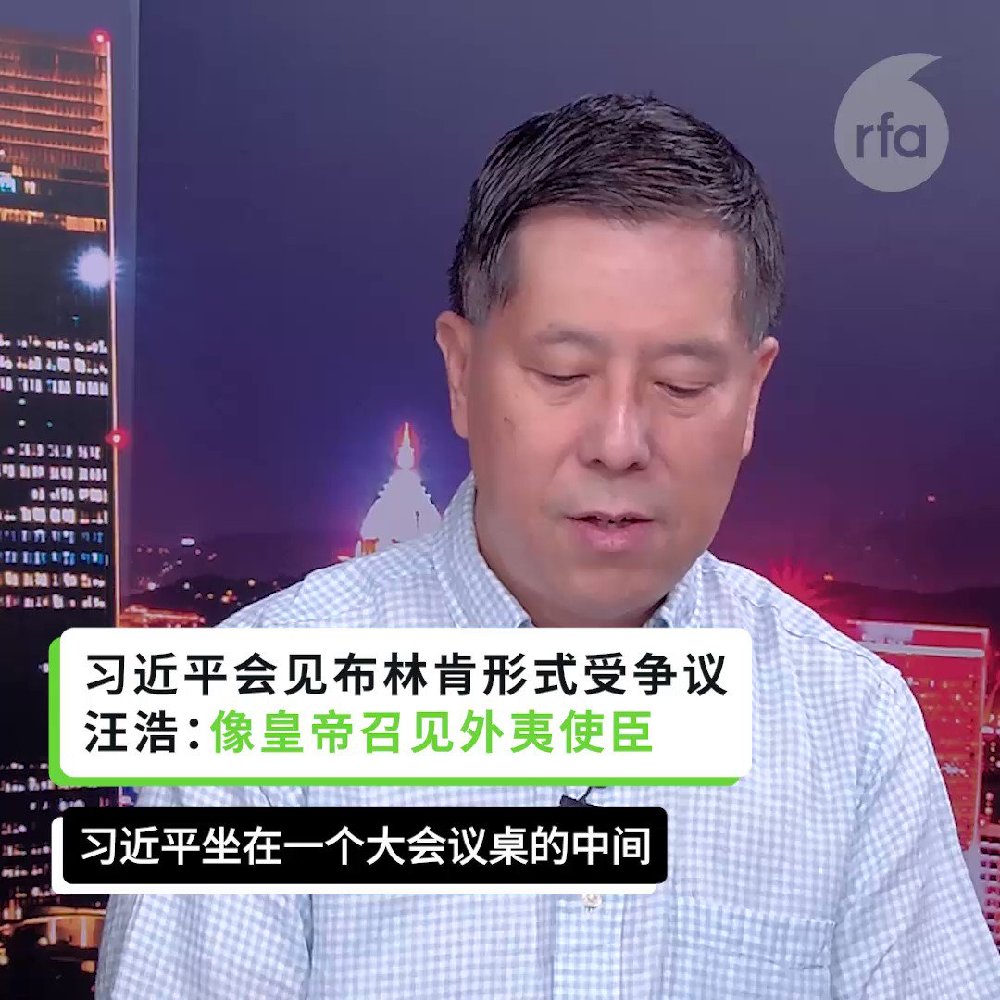
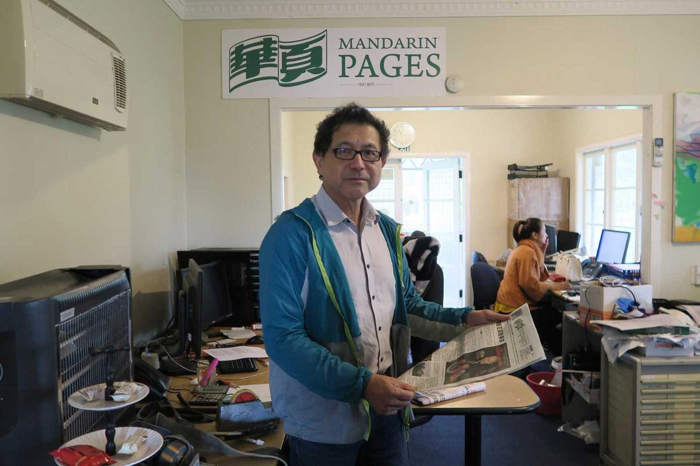

自由亚洲电台 北京时间 2023-06-24T02:58:40Z 1672318272077987840 长期关注塔肯纳雨林生态保育的布郎基金会(The Bob Brown Foundation)执行经理韦伯(JennyWeber)向本台解释,“#矿业金属集团”计划兴建的放置废料设施在落成后,将可容纳高达2500万立方米的剧毒污泥,恐怕会对塔肯纳雨林140公顷范围内的生态环境带来威胁。
https://t.co/XuR9pKgN0O   自由亚洲电台 北京时间 2023-06-24T04:00:00Z 1672333706290184192 【布林肯见习近平被摆谱？】
【美国主动破冰 拜登冒风险】
https://t.co/fVFdLC58kV
有关 #布林肯 见 #习近平 时座位安排，#汪浩 认为，这犹如公司董事长给部属讲话，不符合国际礼仪。
淡江大学战略所副教授 #黄介正 指出，美国采取主动，希望化解危机，但是拜登总统要面对风险，成果有待日后观察。 https://t.co/wE6sK2UJNq   自由亚洲电台 北京时间 2023-06-24T04:00:01Z 1672333709822013440 中国的百年老校 #中央美术学院 日前迎来了一位年仅47岁的新院长 #林茂，引发争议。
中央美院多名重量级教授联署公开信表达不满，称这次院长的推选工作草率，让大家无法理解。教育部则回应称，这次院长调整是著眼中央美院长远发展，并称林茂“政治素质好，拥护党的领导”。
https://t.co/PXBuUU67Di   自由亚洲电台 北京时间 2023-06-24T00:53:17Z 1672286716173119488 【RFA独家】这位青年为什么要 #冒用香港议员身份？ “我做这件事情，是为了表达我对过去香港议会中非亲共派不同声音的怀念。”
https://t.co/QZUYAZa3pA   自由亚洲电台 北京时间 2023-06-24T01:03:27Z 1672289274404782081 本台 #事实查核 深度报道 【#中国外宣在异乡：海外华人的平行媒体时空】
第二集 《北望“娘家” 大马华人看见了哪个中国？》

https://t.co/uGLLmWjEy7 https://t.co/R0wKCOK5Dp   自由亚洲电台 北京时间 2023-06-24T02:12:00Z 1672306527552647169 本台 #事实查核 深度报道 【#中国外宣在异乡：海外华人的平行媒体时空】 
第三集 《四个新闻理想 消失在南太平洋“最自由”的国度》
https://t.co/cWjZTz3BKx

“特别是微信，它有敏感词!”苏文德说，前阵子一篇提到中国渗透新西兰本地政治的文章，让《华页》被封号了一个礼拜。另一个啼笑皆非的例子，是在微信号上发一则“独立一房一卫”的租屋广告，竟不过审，后来才发现是“独立”两字是敏感词。广告从此改写成:"一房一卫，从不同门口出入"。

“这里有很多这样的谜”   自由亚洲电台 北京时间 2023-06-24T00:02:38Z 1672273971365179392 自从上月被北京当局驱逐后，#八九学运 领袖 #季风 到处流浪。近期他回到户籍所在的 #贵州 散心，当局的监控丝毫没有放松，不准他在省会贵阳长时间逗留，更强迫他返回偏远的老家。
https://t.co/KPao10vzNs   自由亚洲电台 北京时间 2023-06-24T00:19:00Z 1672278089051656193 RT @RFA_Chinese: 你是感到精神抑郁或对未来充满担忧失望的大陆年轻人吗？
如果你愿意分享，请发电邮fankui@rfa.org， 你的心事有我愿意听。 https://t.co/HgfoRydrkj   