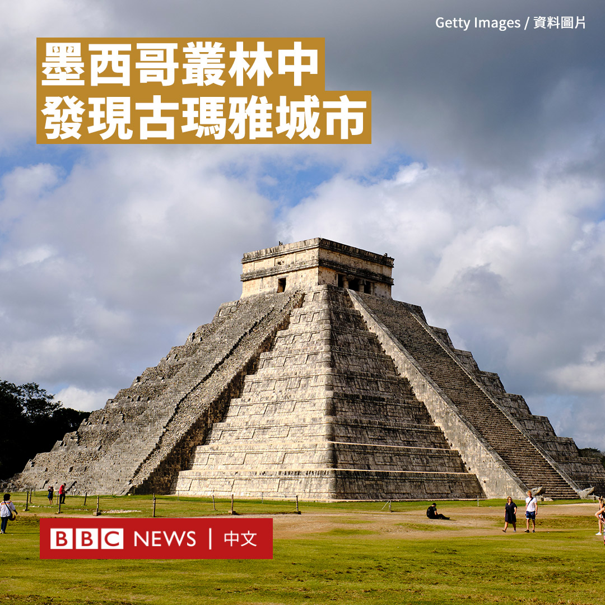

D英国广播公司BBC 北京时间 2023-06-23T12:46:58Z 1672103933094014977 乌克兰对俄罗斯展开反攻已有两周多，总统泽连斯基承认战场进展“比预期的要慢”。国防部长本周表示，反攻迄今已经收复了南部地区和东部顿涅茨克的8个村庄。

BBC记者夏昆汀和摄影师达伦·康威探访前线的第68猎兵旅，他们正试图扩大对近期夺回的布拉霍达特内村庄以东的控制。 https://t.co/lXoDW13KWl   D英国广播公司BBC 北京时间 2023-06-23T13:53:44Z 1672120736868352001 墨西哥考古学家在尤卡坦半岛的丛林深处发现了一座古玛雅城市的遗迹。

专家们发现了多个高度超过15米的金字塔状结构。

该遗址出土的陶器似乎表明，这里在公元600年至800年之间有人居住，这一时期被称为晚期古典期。

考古学家将该遗址命名为“奥康通”（Ocomtún；玛雅语意为石柱）。

玛雅被认为是西半球最伟大的文明之一，以其金字塔神庙和巨大的石头建筑而闻名，这些建筑位于现在的墨西哥南部、危地马拉和伯利兹。

这些最新遗迹是在坎佩切州的一个生态保护区内发现的，当地植被茂密，很少有人去探索。

墨西哥国家人类学和历史研究所表示，这一发现是旨在记录中央低地考古学的实地勘测的结果，该地区横跨3000平方公里的无人居住的丛林。

研究所表示，休斯顿大学进行的机载激光扫描帮助研究小组发现了“大量集中的前西班牙时代结构”。

研究者表示，该遗址可能在公元800至1000年间经历了相当大的变化，然后在10世纪伴随古典期玛雅文明的崩溃被掩藏在地下。   D英国广播公司BBC 北京时间 2023-06-23T11:04:19Z 1672078101331730432 自俄罗斯总统普京下令全面入侵乌克兰以来，这道问题便一直会被提起：克里姆林宫会在这场战争中选择核武器吗？BBC俄罗斯事务编辑罗森伯格探讨对乌克兰使用核武器的论调是如何渗透到俄罗斯媒体当中。https://t.co/MHlppEtli3   D英国广播公司BBC 北京时间 2023-06-23T09:22:41Z 1672052523908345856 美国海岸警卫队表示，失踪的“泰坦”号潜水器在泰坦尼克号残骸附近内爆，所载的五人全部遇难，包括一名驾驶员和四名乘客。

美国海岸警卫队的梅杰少将（John Mauger）证实，在距离泰坦尼克号残骸船头约480米处发现了该潜水器的五个部件，以及一片“残骸区”。

他在一场记者会上表示，“这些残骸与压力舱发生毁灭性内爆的情况一致。”

这艘潜水器在上周日（6月18日）出发探索泰坦尼克号残骸后失踪。

五名乘客分别为“海洋之门”（OceanGate）创始人兼首席执行官斯托克顿·拉什（Stockton Rush）、法国泰坦尼克号专家保罗-亨利·纳热奥莱（Paul-Henry Nargeolet）、巴基斯坦富豪沙赫扎达·达伍德（Shahzada Dawood）和他19岁的儿子苏尔曼（Suleman），以及英国商人和探险家哈米什·哈丁（Hamish Harding）。

一位官员对美国媒体CBS新闻表示，在“泰坦”号与地面失去联系后不久，美国海军发现了“与内爆相符的声音异常”。

该官员补充说，这些信息被转达给了美国海岸警卫队，后者利用这些信息缩小了搜索半径。

据CBS报道，早些时候报道的疑似敲击声后来被认为来自该地区的其他船只。   D英国广播公司BBC 北京时间 2023-06-23T00:19:06Z 1671915724963713024 【最新消息】美国海岸警卫队表示，负责搜寻失踪的“泰坦”号潜水器的团队发现了“残骸区”，这些残骸位于泰坦尼克号沉船的残骸附近。

目前尚不清楚这些新发现的残骸是否与“泰坦”号潜水器有关。专家正在对其进行评估。 https://t.co/4x367RnOWl   