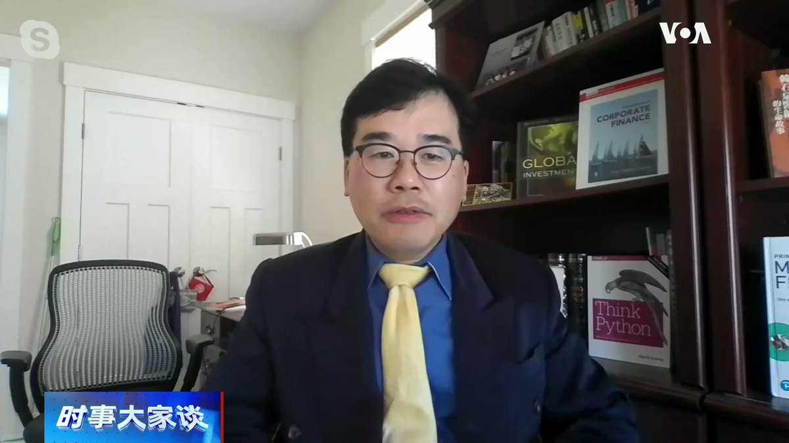
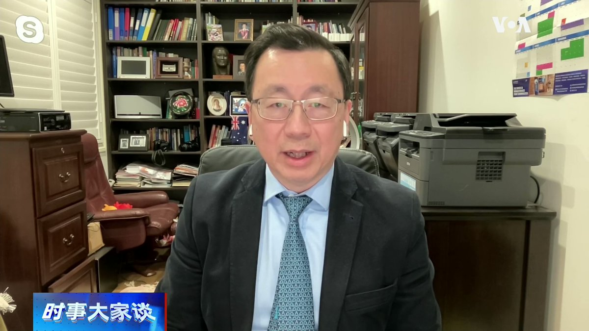
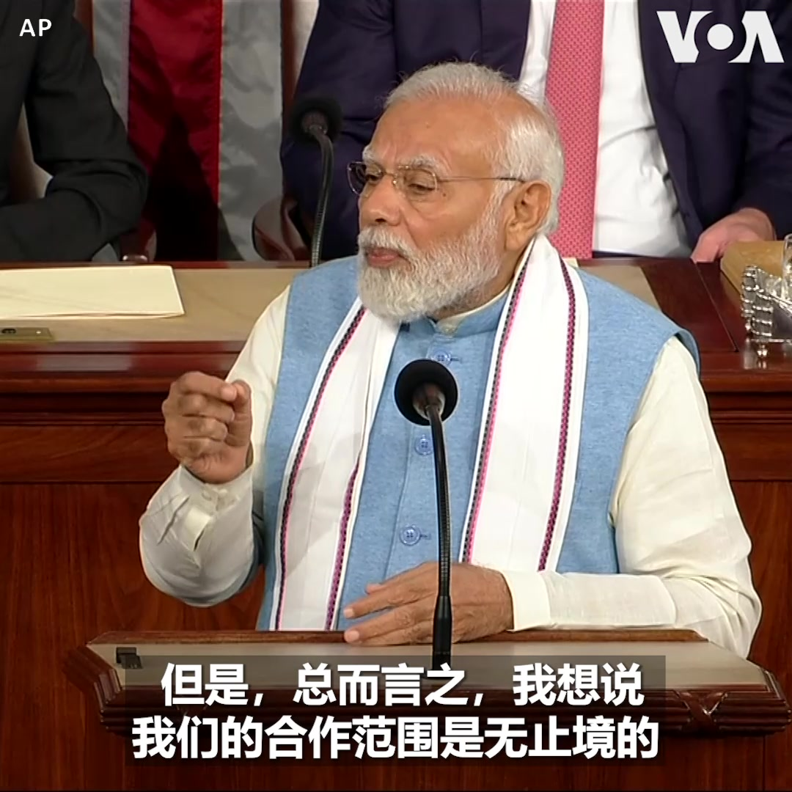
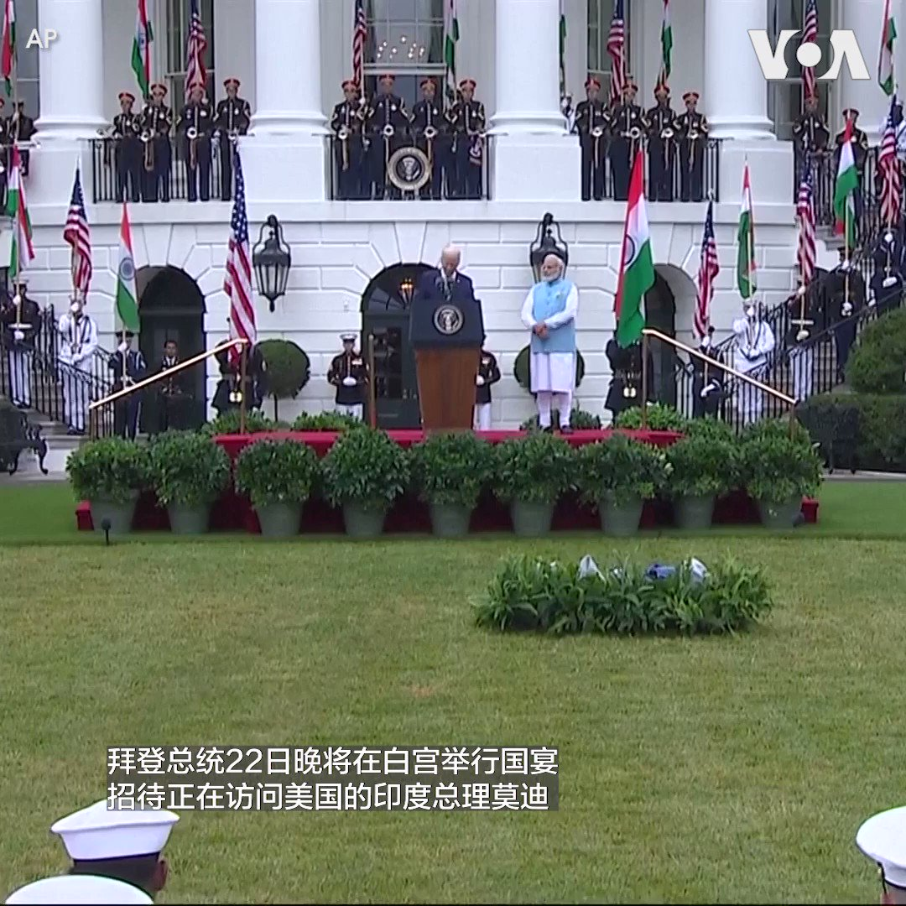
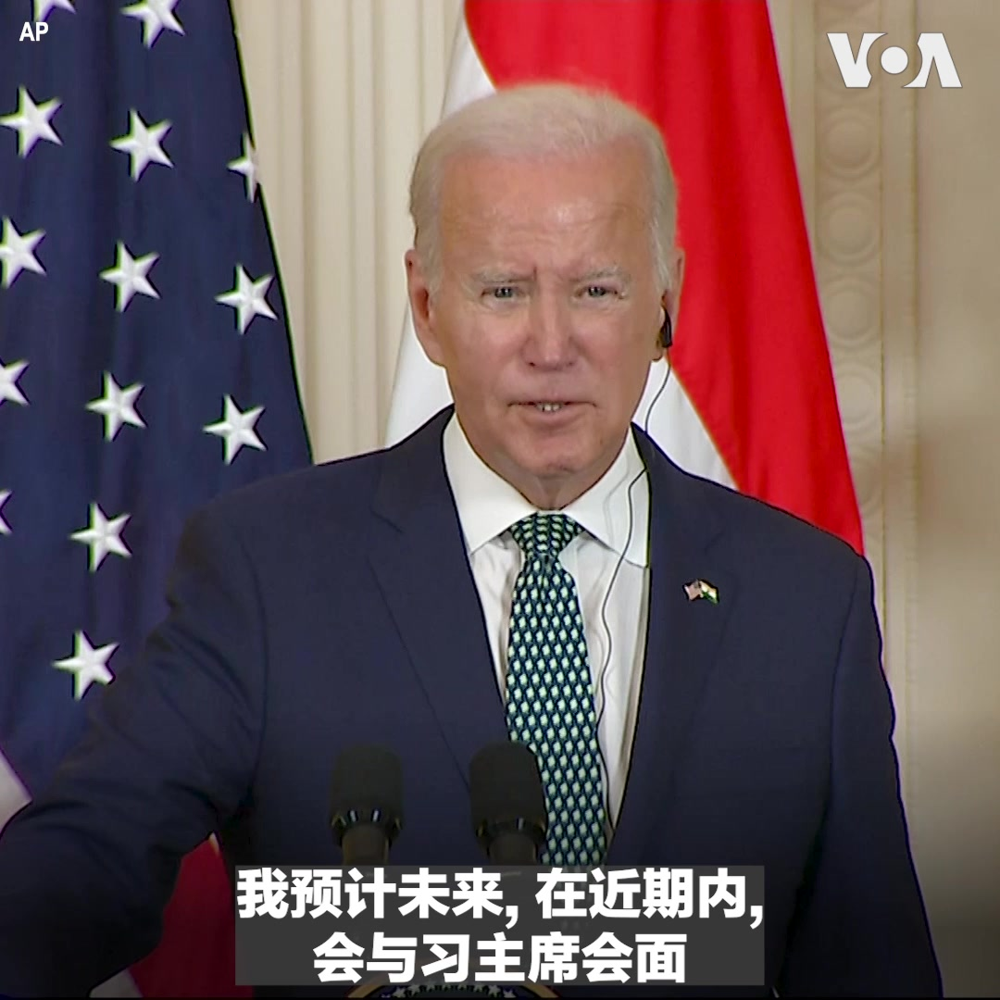
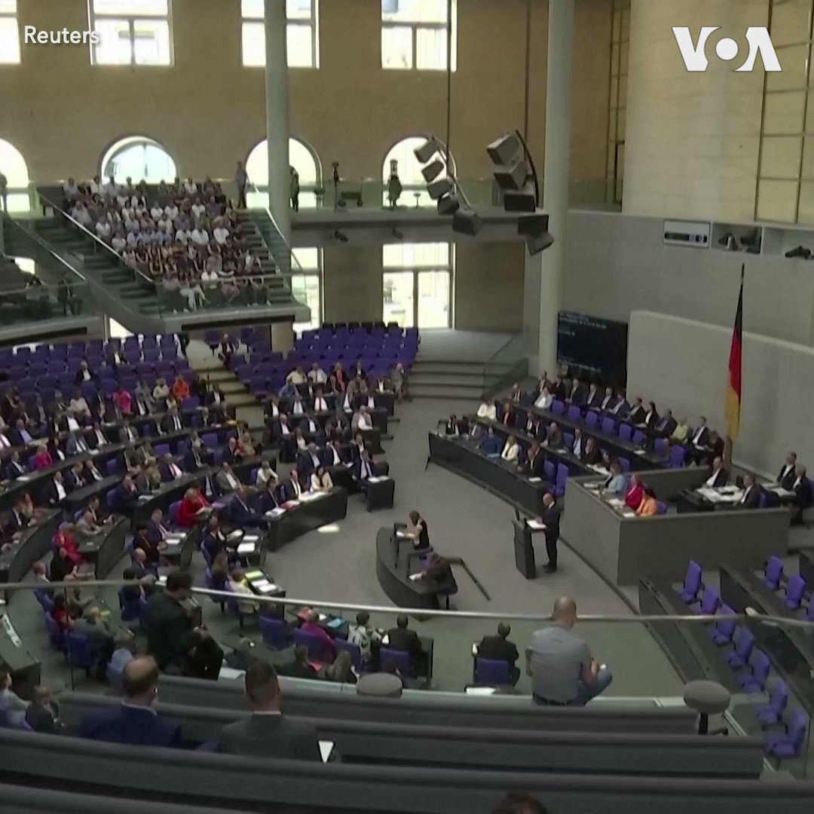
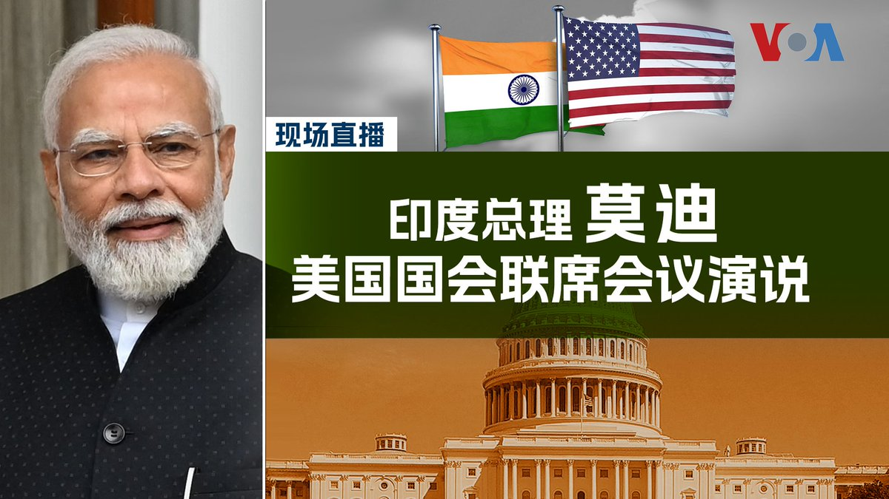

美国之音中文网 北京时间 2023-06-23T14:02:04Z 1672122831331786754 赞比亚与中国和西方债权人达成债务重组 有望为债务困境国家开先例 https://t.co/NdhrVmtUkJ   美国之音中文网 北京时间 2023-06-23T11:22:03Z 1672082565212274688 推特上的中国：美国应该联合印度应对中国的影响力吗？ https://t.co/t5L9L6WwJ1   美国之音中文网 北京时间 2023-06-23T10:08:34Z 1672064069782888448 上合组织成员对塔利班恐怖主义担忧缺乏统一立场 https://t.co/MwfxS6yPRi   美国之音中文网 北京时间 2023-06-23T10:17:48Z 1672066393486020608 世界媒体看中国--金哲报道：习近平是独裁者，该不该说 文字报道：https://t.co/X1dYRYHVQT https://t.co/8RXADI6oO3   美国之音中文网 北京时间 2023-06-23T10:30:00Z 1672069465536708608 今年的巴黎航展上，新型的电动飞行器正在抢走直升机的风采，包括德国初创公司Volocopter的旗舰机型Volocity，以及美国制造商Archer的N302AX，皆看好未来飞行出租车市场。 https://t.co/d1d4RkH8Wh   美国之音中文网 北京时间 2023-06-23T10:33:00Z 1672070218158358529 中国央行连续降低几项重要贷款利率，显示出对中国经济的担忧。波士顿东北大学教授邱万钧博士认为，世界主要经济体都在升息，而中国降息，这带来人民币贬值，加剧资金外逃。中国经济的问题在于信心疲软，降息于事无补。时事大家谈完整版：https://t.co/DTtEOT3Q02 https://t.co/xKsMzVE3PC   美国之音中文网 北京时间 2023-06-23T06:51:56Z 1672014584063070208 印度总理莫迪访美，美印宣布多项科技合作。澳大利亚蒙纳士大学教授史鹤凌博士认为，这将改变外资对印度的投资方向，让印度不仅仅在低端制造业上对中国形成挑战，还将成为高端产业链的主角。时事大家谈完整版：https://t.co/c5UJ0lYh5V https://t.co/T3YxkEsgwf   美国之音中文网 北京时间 2023-06-23T07:00:00Z 1672016617553776641 拜登先说习近平是独裁者，中国发怒后美国官方坚持不收回这个看法。拜登为何这个时间这样说？一边说习独裁，一边说要见习，拜登是什么策略？习打电话給拜登，十分不爽美、日、澳、印“四方对话”，要他停手，为何？超规格接待莫迪访美，美国为何高举印度牌？请看美国之音6月23日上午9点《时事大家谈》。 https://t.co/3ZlTkab5Bm   美国之音中文网 北京时间 2023-06-23T07:30:03Z 1672024177317130240 美众议院表决通过《美台21世纪贸易倡议首批协定实施法》，专家称若生效将使后续谈判更复杂 https://t.co/IAxzqsvWgn   美国之音中文网 北京时间 2023-06-23T07:58:02Z 1672031220367233024 美国会特设委员会公布对Shein和Temu涉及强迫劳动调查初步结果 https://t.co/JIY1lwzp5V   美国之音中文网 北京时间 2023-06-23T08:15:26Z 1672035598419505152 “我们的合作范围是无止境的，我们协同作用的潜力是无限的，”印度总理莫迪6月22日在美国国会参众两院联席会议上发表演讲时说。他表示，胁迫和对抗的乌云正在印太地区投下阴影，而美日印澳四方安全合作机制已成为该地区一支向善的主要力量。“美印关系是本世纪的决定性伙伴关系，”莫迪说。 https://t.co/fftkw3jdhk   美国之音中文网 北京时间 2023-06-23T09:54:33Z 1672060543493115904 拜登加倍强调习近平是独裁者 https://t.co/ekIN7PPZDG   美国之音中文网 北京时间 2023-06-23T04:27:58Z 1671978357028970496 美国总统拜登22日晚将在白宫举行国宴招待印度总理莫迪一行。 由于莫迪总理吃素,  所以这次国宴将以素食为主。美国之音记者获邀到白宫观看了国宴展示活动，让我们跟着美国之音记者去看看。 https://t.co/7Xa3za0w0s   美国之音中文网 北京时间 2023-06-23T05:14:33Z 1671990080154791937 美国海岸警卫队：泰坦潜水器的驾驶员和 4 名乘客死亡 https://t.co/521ddSEiln   美国之音中文网 北京时间 2023-06-23T05:30:04Z 1671993984699486209 联合国秘书长点名批评俄罗斯侵犯乌克兰儿童 https://t.co/xnC5Lqs9Ob   美国之音中文网 北京时间 2023-06-23T06:00:32Z 1672001651287420934 联合国呼吁解除对阿富汗女性禁令，塔利班对此无动于衷 https://t.co/tKoHnFImjc   美国之音中文网 北京时间 2023-06-23T06:14:02Z 1672005047469867008 巴勒斯坦领导人对中国新疆政策的支持引发强烈反弹 https://t.co/cVrxe1laD6   美国之音中文网 北京时间 2023-06-23T02:28:03Z 1671948176390250496 国际人权调查指中国人权状况敬陪末席 香港状况未有改善 https://t.co/v4ynvHxT3a   美国之音中文网 北京时间 2023-06-23T02:43:04Z 1671951955332337665 柬缅从中作梗？印尼将东盟联合军演移出有争议的南中国海 https://t.co/ZmUkg919RZ   美国之音中文网 北京时间 2023-06-23T03:28:34Z 1671963407124410369 中国总理李强首访德法拼经济，欧洲反对“脱钩”强调“去风险”保经济安全 https://t.co/7Bv6S8F3vr   美国之音中文网 北京时间 2023-06-23T03:45:09Z 1671967579525746688 研究报告：无论谁继任，拜登总统保卫台湾的承诺都不应收回 https://t.co/pq6qXrwKv3   美国之音中文网 北京时间 2023-06-23T04:00:40Z 1671971485768884233 正在美国进行国事访问的印度总理莫迪将在美东时间6月22号下午4点在美国国会参众两院联席会议上发表演说。Youtube直播链接：https://t.co/r8m7VsNZ9h   美国之音中文网 北京时间 2023-06-23T04:07:25Z 1671973183468228609 美国总统拜登最近称习近平是“独裁者”引发热议，华尔街日报记者6月22日在拜登与印度总理莫迪的联合记者会上问拜登，他这样的说法是否会破坏其政府为在维持美中关系上所取得的进展，拜登回答，“不会” 。关于印度人权问题，拜登说，他和莫迪就民主价值进行了很好的讨论。 https://t.co/GJlj0j2vtf   美国之音中文网 北京时间 2023-06-23T00:47:29Z 1671922868530167835 美国总统拜登和印度总理莫迪将在美东时间6月22号中午12点45分，在白宫东厅召开联合记者会。美印两国将如何加强合作，在印太地区抗衡来自中国的挑战将是众所关注的焦点。 https://t.co/hXPY6zRjJ1   美国之音中文网 北京时间 2023-06-23T00:59:12Z 1671925816400445441 中国北方再遭热浪烧烤 北京周四气温打破六月份最热记录 https://t.co/svSEfwMSs9   美国之音中文网 北京时间 2023-06-23T01:13:03Z 1671929304865968130 面对财大气粗的中国信息战，澳广要求国会大幅增加预算 https://t.co/SzL5TiUdvK   美国之音中文网 北京时间 2023-06-23T01:23:17Z 1671931878721437698 德国总统朔尔茨22日在国会表示，他本星期与中国代表团会谈时告诫中国不要使用武力改变现状，特别是针对台湾。他还谈到目前处于战争状态的乌克兰还无法加入北约。 https://t.co/Rr7vRo86qn   美国之音中文网 北京时间 2023-06-23T01:39:26Z 1671935942410600474 6月22号上午，美国总统拜登在白宫南草坪，以盛大军礼及21响礼炮，欢迎来访的印度总理莫迪，同时邀请了7000名来自美国各地的印度裔美国人观礼。拜登与莫迪在欢迎仪式上分别致词后，进入椭圆形办公室进行双边会谈，会谈后将举行联合记者会。 https://t.co/6eRQZnsyKS   美国之音中文网 北京时间 2023-06-23T02:22:16Z 1671946720354213891 正在美国进行国事访问的印度总理莫迪将在美东时间6月22号下午4点在美国国会参众两院联席会议上发表演说。美国之音将在美国之音官网、YouTube频道和推特平台进行同传直播，敬请收看。 https://t.co/eNQ8DZaJpS   美国之音中文网 北京时间 2023-06-23T00:14:02Z 1671914452994904064 习近平语录首现高考作文题：中国洗脑教育无人幸免 https://t.co/1AX6IlP1Ia   