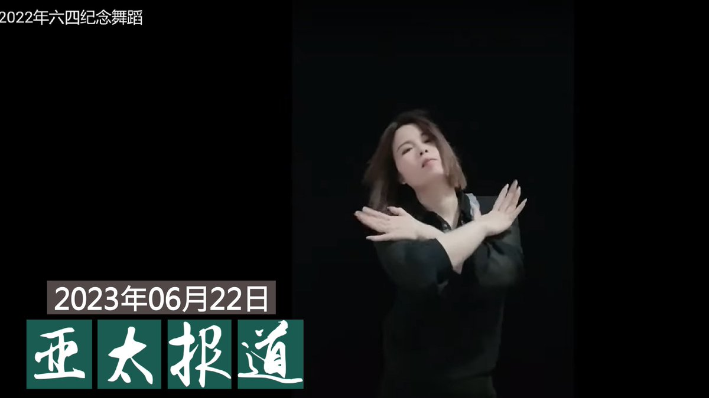
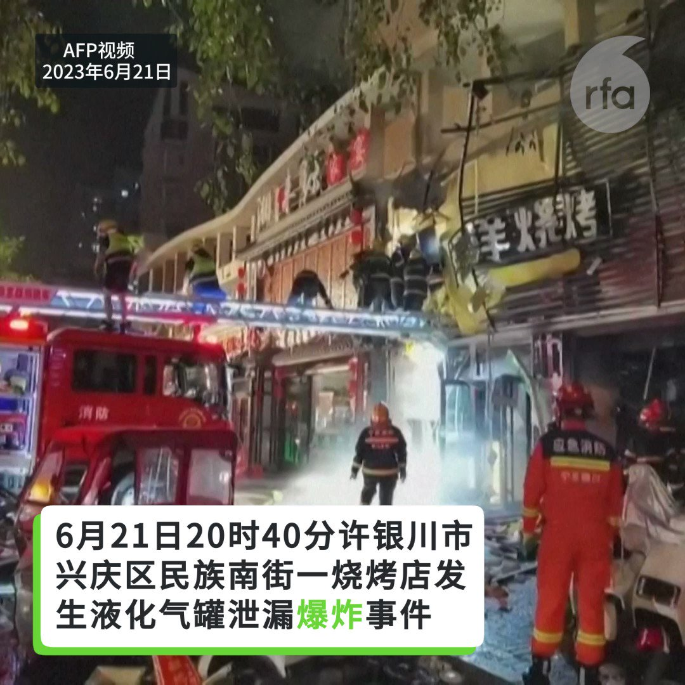

自由亚洲电台 北京时间 2023-06-23T10:59:52Z 1672076979829452801 涉"#厦门聚会案"的 #许志永、丁家喜和常玮平等人先后被判刑，同案被控"煽动颠覆国家政权罪"的女权工作者 #李翘楚 的案件因各种原因无法如期审判。

https://t.co/2WqgxQc2SH   自由亚洲电台 北京时间 2023-06-23T11:00:02Z 1672077021185454080 评论 | #王力雄：王胡子来了——回忆 #新疆 旅行见闻（45）
#王震 
https://t.co/dbtoxUnO6U   自由亚洲电台 北京时间 2023-06-23T06:30:02Z 1672009075314532353 你是感到精神抑郁或对未来充满担忧失望的大陆年轻人吗？
如果你愿意分享，请发电邮fankui@rfa.org， 你的心事有我愿意听。 https://t.co/HgfoRydrkj   自由亚洲电台 北京时间 2023-06-23T07:00:10Z 1672016656573534211 【#亚太报道（2023-6-22）】
欢迎收听和订阅播客【亚太报道】 https://t.co/MjLNSvVMqc

网友“#一品红”以手舞 #纪念六四 遭国保监控 / #李翘楚 被控“煽动颠覆”一案延期 / #银川烧烤店爆炸 导致众多民众死伤 / 美国炮舰再次过航台湾海峡 / 两岸华人社会的 #MeToo 运动有何不同？ https://t.co/hwtN8ZBGu0   自由亚洲电台 北京时间 2023-06-23T07:30:01Z 1672024168903352323 本周四，正在美国访问的印度总理 #莫迪 与 #拜登 总统召开联合记者会。拜登在会上重申，他称呼中国领导人 #习近平 为"#独裁者"是基于事实，并期待近期与习近平举行会晤。那么，莫迪此行在强化美印地区战略合作的同时，又会对美中竞争带来什么样的影响？

https://t.co/djABm752z4   自由亚洲电台 北京时间 2023-06-23T08:00:01Z 1672031721511071744 专栏 | #绿色情报员：走过大疫年，鲎还好吗？
https://t.co/AMnV7N3aBO   自由亚洲电台 北京时间 2023-06-23T09:00:01Z 1672046817616478209 福布斯的调查发现，#TikTok 将平台上美欧网红的财务资料存贮在中国伺服器，其中包括这些网红以及外部供应商的财务识别码、社会安全码，以及其他个人资料。而且针对两者的付款均透过TikTok北京母公司 #字节跳动 进行管理的。
https://t.co/VBaKUrtcLf   自由亚洲电台 北京时间 2023-06-23T09:27:00Z 1672053609532383232 RT @RFA_Chinese: 【#亚太报道（2023-6-22）】
欢迎收听和订阅播客【亚太报道】 https://t.co/MjLNSvVMqc

网友“#一品红”以手舞 #纪念六四 遭国保监控 / #李翘楚 被控“煽动颠覆”一案延期 / #银川烧烤店爆炸 导致众多民众死…   自由亚洲电台 北京时间 2023-06-23T09:27:14Z 1672053666730131460 RT @RFA_Chinese: 你是感到精神抑郁或对未来充满担忧失望的大陆年轻人吗？
如果你愿意分享，请发电邮fankui@rfa.org， 你的心事有我愿意听。 https://t.co/HgfoRydrkj   自由亚洲电台 北京时间 2023-06-23T09:46:35Z 1672058538749833222 RT @RFA_Chinese: 【漫谈“小风波” ｜“动物庄园”动画剧场】
关于 #六四，说也不是，不说也不是，这就是龙家的“小风波”悖论。 https://t.co/QQDXalcsyy   自由亚洲电台 北京时间 2023-06-23T09:54:38Z 1672060563541704705 【中国驻美大使谢锋发飙】
中国驻美大使馆星期四表示，已就日前美国总统 #拜登称习近平为独裁者 的言论，提出正式抗议。
据美联社报道，中国驻美大使 #谢峰 星期三对白宫和国务院官员表示，华盛顿必须采取有诚意的行动，化解拜登言论的负面影响，否则将“承担所有后果”。
中国大使馆的声明中称，“针对最近有关中国政治制度和领导人不负责任的言论，人们不禁怀疑美国寻求关系稳定的诚意何在？”“中国政府和人民无法接受对中国领导人的任何政治挑衅，势必做出坚决反应。”
【您认为习近平是不是独裁者？】   自由亚洲电台 北京时间 2023-06-23T09:57:15Z 1672061223699922950 女权工作者 #李翘楚 被控"煽动颠覆国家政权罪”的案件，原于周二（6月20日）在山东省临沂经济技术开发区人民法院开庭审理宣判，但因为法院以不配合安检为理由，不允许代表律师李国蓓进入法庭。同案的另一名代表律师于凯，向法院提出调取证据等要求均被拒绝，主动解除委托退庭，以示抗议，使案件无法完成庭审。
中国人权律师团在推特引述于凯称："我们将留下‘呈堂供证’，不是在法庭上，而是在历史上。 "

https://t.co/vrodxzbwje   自由亚洲电台 北京时间 2023-06-23T04:59:37Z 1671986321139855364 #周锋锁 在接受本台记者询问时抱歉地说了一声，“我给她带灾了。”去年他在看到这个视频后就联系上了“#一品红”，当时只是在微信上打了一个招呼，对她制作这个视频表示感谢，并没有多谈。但据王志华介绍，正是因为这个简短的问候，让“一品红”成为了中国警方监控的对象。
#六四 
https://t.co/f0KlihAyI1   自由亚洲电台 北京时间 2023-06-23T05:29:52Z 1671993934233620481 美国国务卿安东尼·布林肯刚刚结束了他的访华行程，美国总统拜登就在一次讲话中称习近平为“独裁者”，中国的民众对此如何看？ https://t.co/l6oYd4ddR7   自由亚洲电台 北京时间 2023-06-23T05:31:42Z 1671994395669966848 6月21日晚银川市一家烧烤店发生液化气罐泄漏爆炸事件，31人经抢救无效死亡。 https://t.co/7hJtMHmxxQ   自由亚洲电台 北京时间 2023-06-23T06:00:24Z 1672001618785497089 【AI 监管主控权之争：如果中国胜出，世界将会怎样？】
美国国会参议院多数党领袖查克· #舒默(Chuck Schumer) 6月21日宣布，将领导美国国会对 #人工智能(AI)监管的政策制订进程。舒默说，美国将成为AI监管方面的世界领袖，如果将AI算法的管理主控权拱手让给中国，将意味着民主的衰落。
中国在AI管理规范和行政规定的推行方面，从速度和数量上领先许多先进经济体。近两年，中国已经出台至少三部AI法规，对算法(algorithm)、深度伪造和生成式人工智能试图进行监管。   自由亚洲电台 北京时间 2023-06-23T06:16:04Z 1672005561746067456 台湾 #MeToo 风暴近日再次向海外民运圈延烧。旅美知名中国人权律师 #滕彪 6月20日在社媒发文称，他在2016年对 #心语 女士在一家旅馆所做的事是"异常笨拙的求爱", 并对此公开道歉。心语则对本台表示，其行为是强暴未遂。

https://t.co/6HLdcCvUdR   自由亚洲电台 北京时间 2023-06-23T02:25:51Z 1671947624449015829 RT @RFA_Chinese: 【中国聋人眼中的美国】
党大千，从小被诊断为聋人，这个结果给他和他的家庭带来无数的心酸和无助，2008年他毅然决定来美求学，对美国一无所知的他是否可以在美国生存？大千将用自己的亲身经历讲诉美中两国不同的生活，以及聋人眼中的美国社会。完整视频：h…   自由亚洲电台 北京时间 2023-06-23T02:46:50Z 1671952904058535941 北京时间6月21日晚，宁夏回族自治区银川市兴庆区一烧烤店发生爆炸。官方证实，事故已导致31人遇难。而在此前一天，官方确认在年初内蒙古的一起煤矿坍塌事故中，也有53人遇难。
https://t.co/fI71ilPK0h   自由亚洲电台 北京时间 2023-06-23T02:48:47Z 1671953396084146179 6月21日，美国“#斯特拉顿”（USCGC Stratton）号炮舰通过 #台湾海峡。此次行动恰逢 #布林肯 结束访华行程的隔日，引来中方不满。

https://t.co/KWEqTqq6Iw   自由亚洲电台 北京时间 2023-06-23T03:39:28Z 1671966150069219335 本台推出  【#中国外宣在异乡：海外华人的平行媒体时空】系列深度报道。
请看第一集：做“活着的狗熊” 在大马威权和中国影响的夹缝中
https://t.co/P4J8cHpmaW   自由亚洲电台 北京时间 2023-06-23T03:51:27Z 1671969167501856768 在“#免于国家威胁”和“#公民及政治权利”的综合评分中，中国在30个国家中排名垫底，比安哥拉、墨西哥和沙特阿拉伯等国家更差，出现任意逮捕、酷刑、强迫失踪等情况，而人民的言论自由、集会结社、参政，以及宗教信仰权利都被剥夺。
https://t.co/af8WecDp3m   自由亚洲电台 北京时间 2023-06-23T01:46:05Z 1671937617124896768 专栏 | #军事无禁区：大反攻还未到来－#乌克兰 亟需远程精确火力和集束弹药
https://t.co/AFvjsko7wA   自由亚洲电台 北京时间 2023-06-23T02:17:09Z 1671945435345485825 #加拿大安全情报局 发推文警告：“不要成为 #中国情报部门 的招募目标，小心你在 #领英 和所有其它网络平台上联系的人。”
https://t.co/bEOy39fXHh   