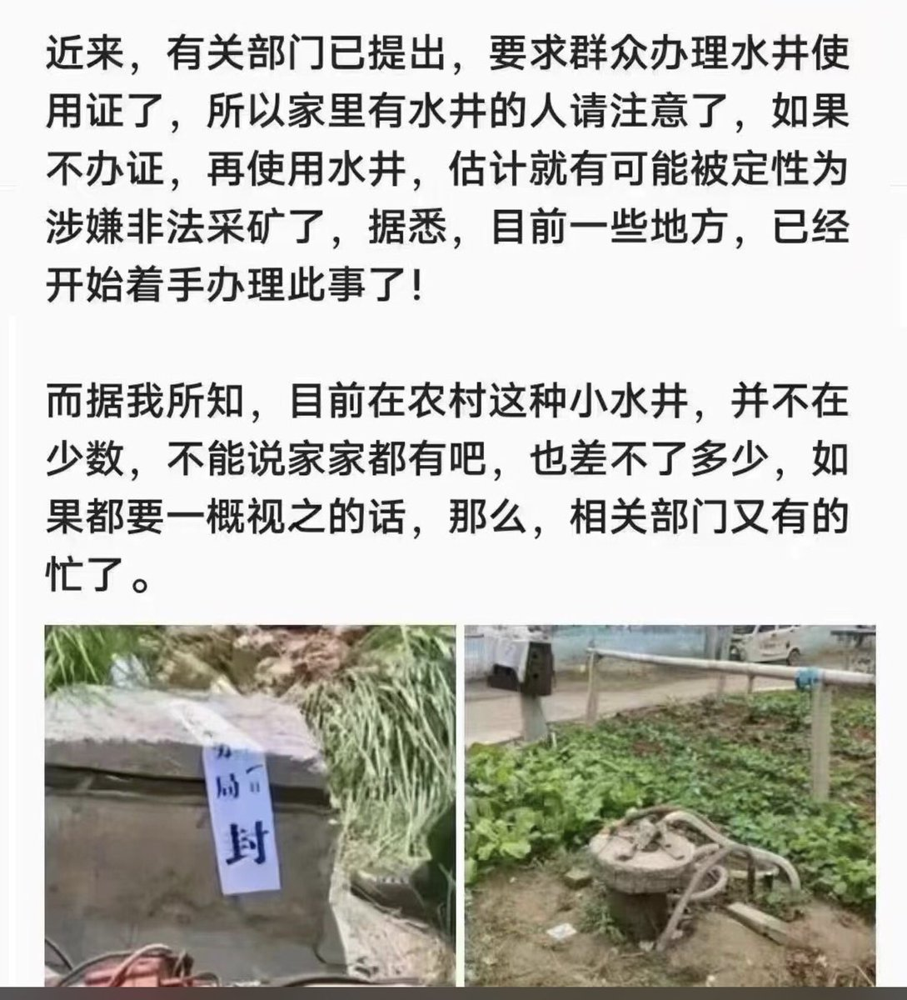

蔡霞 北京时间 2023-06-23T05:13:20Z 1671989773278367746 据说这是防止人跳河自杀的安装。习朝政府的脑子和钱都用在罚款、监视、管制、控制等方面了。2022年12月，不管死多少政府都躺平；现在搞这东西不许死，就是不为人们过上好日子而真心实意干正事。墙国里人活着难死也难。   蔡霞 北京时间 2023-06-23T05:16:25Z 1671990546942894084 RT @Fh8KiMtizQVhJ9r: 從張展判刑、方斌失蹤至今，每一天都發一貼，諸多朋友問有沒有用處?權當個儀式吧。
不過當年張展因披露武漢疫情在上海被判刑時，大家若都為她發聲，今天殃及全國的災禍可否減小或避免?
做事有始終，每日喊一聲:
張展、方斌——回家吃飯!
大家共同…   蔡霞 北京时间 2023-06-23T00:25:52Z 1671917428639449089 中共国内的这种“管理”，本质上是断绝生计。
2022年中共国内的封城封路毁了生活、毁了经济，而且使多少人被毁了生命。归根到底，毁了这国民众的未来，只有中共国对基层社会的极端管制做成了。他们毁了一切后，税收无来处，各地方政府财政将崩溃，于是他们为极权党国的生计而绝民众的生计。 https://t.co/WDxEK8GFfS   