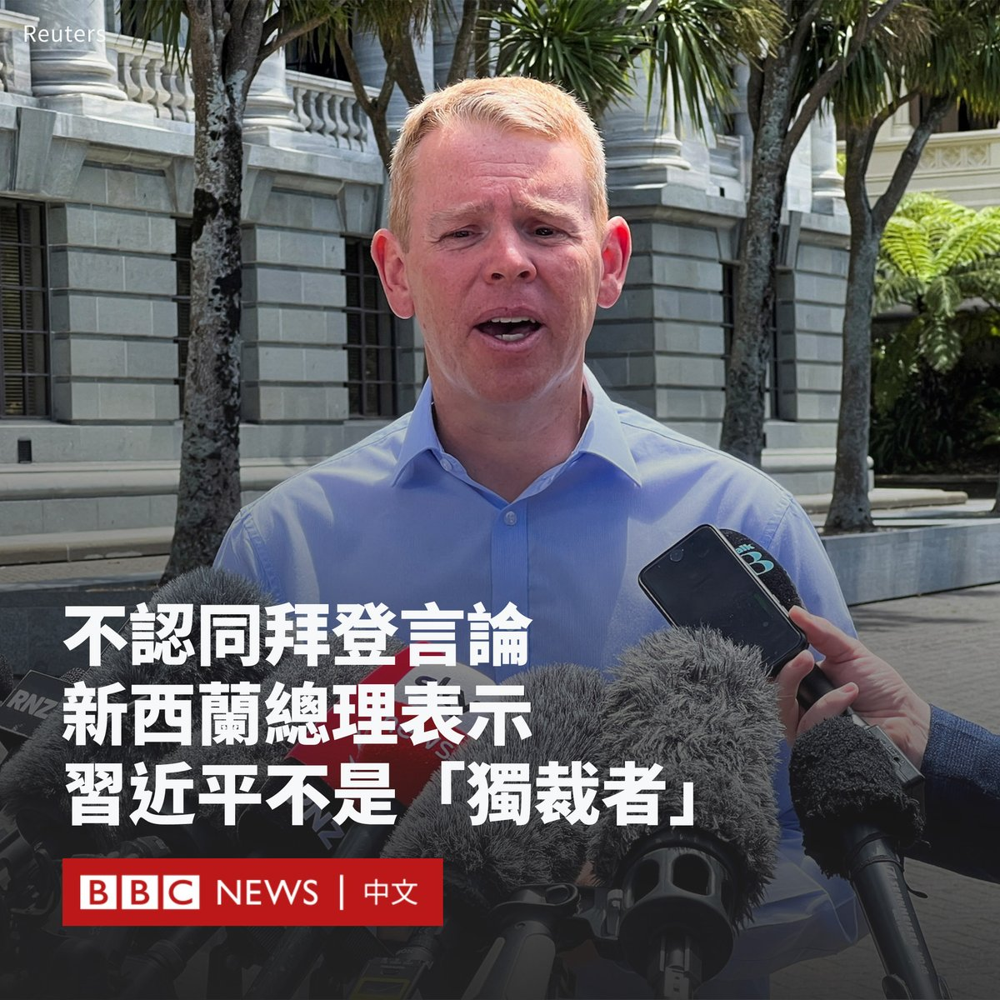
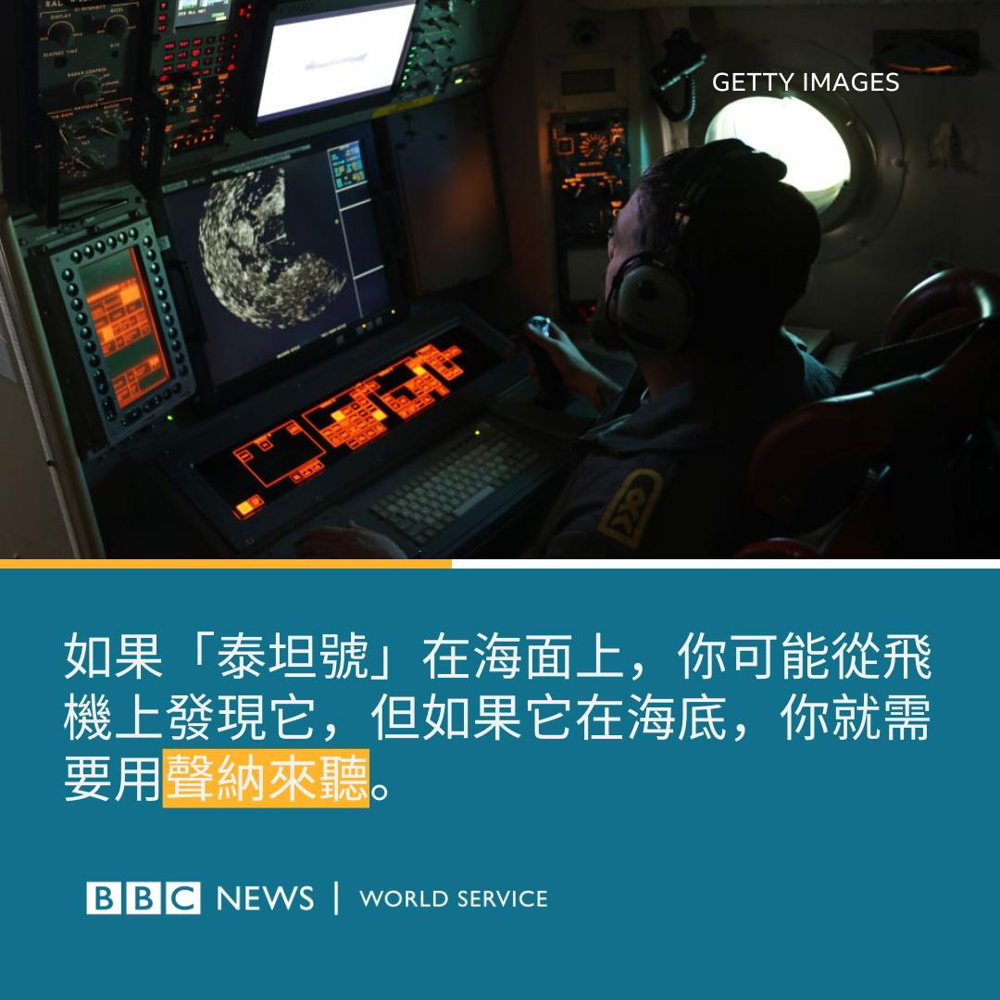

D英国广播公司BBC 北京时间 2023-06-22T20:13:23Z 1671853890931761152 美国总统拜登在出席加州的一场筹款活动时，称中国领导人习近平是“独裁者”。北京猛烈抨击该说法“是公开的政治挑衅”。这一事件再次牵动中美关系紧张神经。

不过，中国外交部没有在该场记者会的文字记录中提及回应内容，中国官媒也总体反应平淡，这可能释放了北京方面希望低调处理这场争议的信号。 https://t.co/UrxWpw7gju   D英国广播公司BBC 北京时间 2023-06-22T16:26:52Z 1671796884263018498 印度总理莫迪（Narendra Modi）在美国进行国事访问期间，与特斯拉首席执行官马斯克（Elon Musk）会晤。其后马斯克表示，他的电动汽车制造商特斯拉（Tesla）将尽快进入印度。

印度政府表示，已邀请马斯克探讨电动汽车和商业航天领域的投资机会。

马斯克表示，他正在“尝试找到合适的时机”实现这一目标。

不久前，推特（Twitter）联合创始人杰克·多尔西（Jack Dorsey）指责印度政府曾威胁，若不限制批评政府的账户便关闭Twitter在印度的运作。

多尔西在独立新闻节目的采访中发表了这一指控，印度政府强烈否认了这一指控，并称其为“彻头彻尾的谎言”。

马斯克在周三对此评论称，Twitter别无选择，只能服从地方政府，否则“我们将被关闭”。

他说：“我们将尽力在法律允许的范围内提供最自由的言论。”

马斯克还自称是“莫迪先生的粉丝”，表示印度“比世界上任何大国都更有前途”。

他告诉记者：“他（莫迪）真的关心印度，因为他正在推动我们在印度进行重大投资，这是我们打算做的事情。我们只是在尝试找到合适的时机……我相信特斯拉将进入印度，并会尽快实现这一目标。”   D英国广播公司BBC 北京时间 2023-06-22T17:00:28Z 1671805341867315201 即将访问中国的新西兰总理克里斯·希普金斯（Chris Hipkins）表示，他不同意美国总统拜登（Joe Biden）称中国领导人习近平是“独裁者”的言论。

希普金斯周四（6月22日）对记者说：“中国的政府形式是中国人民的事情。”

在被记者问及中国人民是否对政府形式有发言权时，希普金斯说：“如果他们想改变他们的政府体制，那将是他们自己的事。”

希普金斯计划于6月25日至30日率领贸易代表团访华，其中包括新西兰大型公司。他将会见国家主席习近平、国务院总理李强和全国人大常委会委员长赵乐际。

美国国务卿布林肯周一刚刚结束与中国国家主席习近平的会晤和访华行程，美国总统拜登周二就在加州一个筹款活动上称习近平为“独裁者”。

中国对此予以反击，称拜登的言论荒谬，“是公开的政治挑衅”，并且“严重侵犯中方政治尊严”。   D英国广播公司BBC 北京时间 2023-06-22T18:05:17Z 1671821653213609986 在美国国务卿布林肯访华引人注目之际，中国总理李强选择在德国和法国开启他的外交首秀。

在经过疫情的三年中断之后，这名今年新上任的总理已经会晤包括德国总理肖尔茨在内的多名政要，并签署多项合作协议。

但观察人士认为，随着中美的紧张关系不断升温，北京能否根本性地修好与欧洲的关系令人怀疑。 https://t.co/bxiUU0hXvh   D英国广播公司BBC 北京时间 2023-06-22T15:01:06Z 1671775302681350144 中国北部宁夏回族自治区银川市的一家烧烤店周三（6月21日）发生燃气爆炸，目前事故已致31人死亡，七人受伤。

官方媒体报导称，事发烧烤店为当地知名店家，爆炸发生时正值端午节假期前晚上的用餐高峰。事故具体原因正在调查中。 https://t.co/A7WCZO96kc   D英国广播公司BBC 北京时间 2023-06-22T12:54:45Z 1671743503687356416 一艘名为“泰坦号”的观光潜水器6月18日在前往探访泰坦尼克号沉船残骸时消失在数千米的深海中，五名成员至今杳无音信。

专家分析，该潜水器的氧气将在十小时内耗尽。救援人员正在争分夺秒地寻找潜水器。

那么，如果氧气耗尽会造成什么后果？来看潜水和高压医学专家的分析。 https://t.co/rm0a0sQuwH   D英国广播公司BBC 北京时间 2023-06-22T14:05:45Z 1671761370889719810 观光潜水器“泰坦号”自6月18日在大西洋下潜后失联，至今舱内氧气将要耗尽，救援行动陷入胶着。

该潜水器的大小与一辆大货车差不多。来自世界各地的搜救团队持续进行大规模搜索行动，大西洋的搜索区域为19,683平方公里，而水下深度几乎有四公里。

那么，救援人员是怎么寻找它的呢？(1/2) https://t.co/qpKxlXAyl4   D英国广播公司BBC 北京时间 2023-06-22T14:06:54Z 1671761660682600448 据美国媒体指，搜救团队表示，搜救过程中有听到规律撞击声，但专家目前还是无法辨别撞击声的来源。

加拿大皇家空军加入搜索行动，气象专家指出，过去几天搜索站点附近的天气状况良好，有利进行搜救工作。(2/2) https://t.co/2a0z9wVUkf   D英国广播公司BBC 北京时间 2023-06-22T11:29:32Z 1671722060307996676 五年来首位美国国务卿的访华行程以中国最高领导人一句“让中美关系稳下来好起来”作结，但分析人士对中美关系能否真正恢复正常抱有怀疑。https://t.co/boDRXvH9JU   D英国广播公司BBC 北京时间 2023-06-22T09:28:38Z 1671691633275043841 “端午节的时候，从小就是妈妈亲手包粽子。”

端午节到来，在台北的商铺前，许多民众排队购买粽子。

粽子是一种可以追溯到几个世纪前的中国传统小吃，传说是为了纪念战国时期政治家和诗人屈原。如今，不同的华人社区对粽子的喜好各有不同。

你今天吃粽子了吗？ https://t.co/3KBRUyHTa9   D英国广播公司BBC 北京时间 2023-06-22T09:47:02Z 1671696262670712834 【最新消息】据中国官方媒体报道，中国北部宁夏回族自治区银川市的一家烧烤店周三（6月21日）发生燃气爆炸，导致至少31人死亡。 https://t.co/rP50zZk4yC   