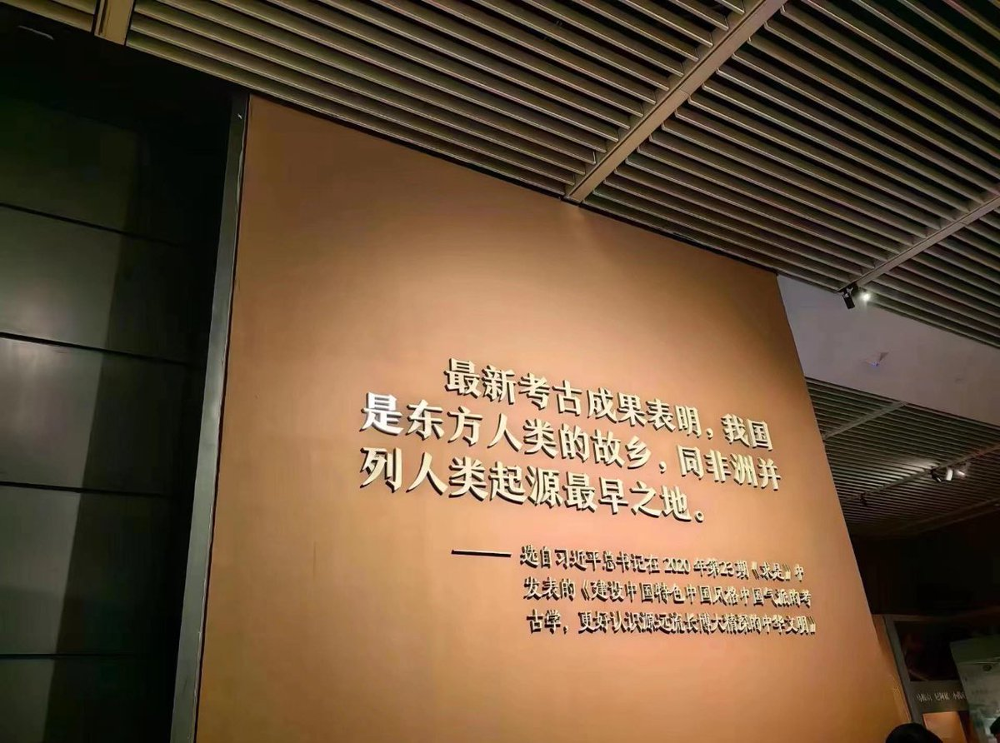
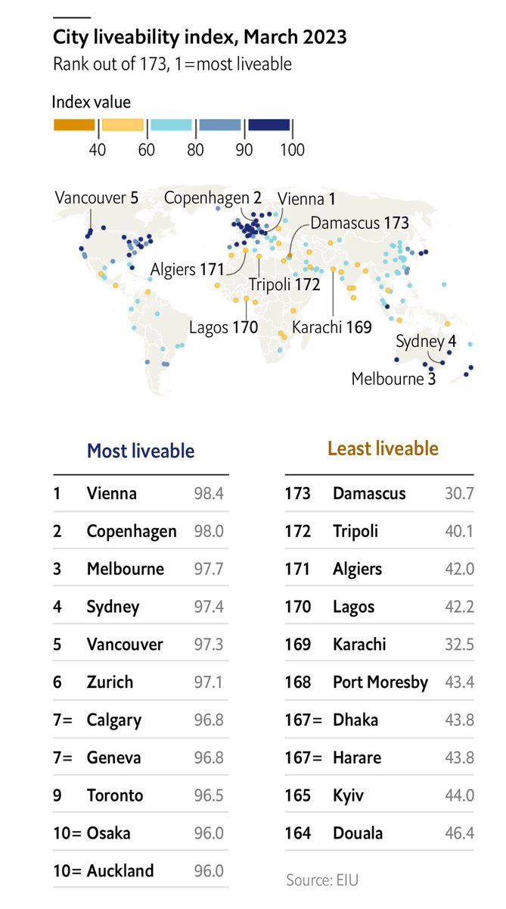
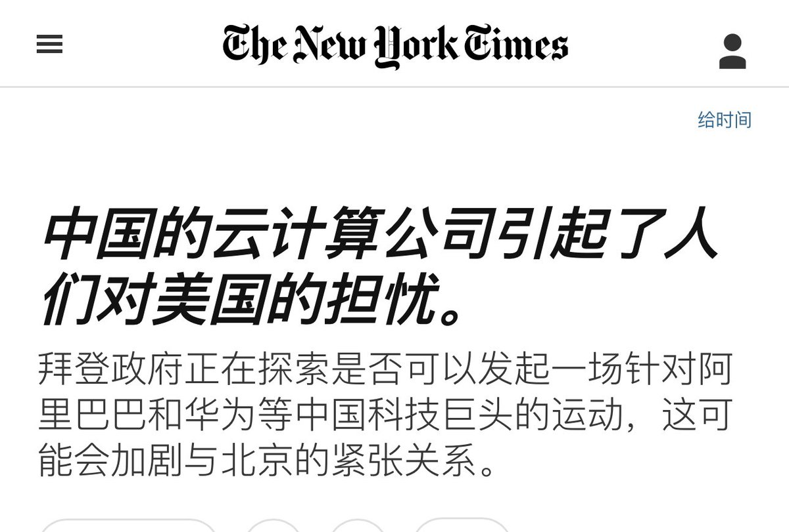

多伦多方脸 北京时间 2023-06-22T20:01:19Z 1671850852846546945 为人类起源指明方向😊 https://t.co/UPznUInm9H   多伦多方脸 北京时间 2023-06-22T20:20:02Z 1671855562949296128 经济学人公布了世界十大宜居城市
1.维也纳
2.哥本哈根
3.墨尔本
4.悉尼
5.温哥华
6.苏黎世
7.卡尔加里
7.日内瓦
9.多伦多
10.大阪
10.奥克兰 https://t.co/c3JYVP4QoO   多伦多方脸 北京时间 2023-06-22T20:31:55Z 1671858553253167104 我的评价不如大清。
大清康雍乾三代，支持率怎么也得99%吧   多伦多方脸 北京时间 2023-06-22T12:31:18Z 1671737604692389889 时至今日，你认为新冠病毒来源是？   多伦多方脸 北京时间 2023-06-22T10:53:42Z 1671713041208205313 今天看到经济学家多恩布什的一句话
描述中国问题最合适
“经济危机到来的时间比你想象的要久，但当它们真的到来时，它们发生的速度比你想象的要快”   多伦多方脸 北京时间 2023-06-22T11:02:56Z 1671715366400315393 最近中国又要开始大放水了。
如果还是这个思路下去，中国只有两个未来
经济崩溃OR房价再翻一倍
中国其实也在进行长期的去泡沫运动，但是如今来看，功亏一篑。
这也让中共能打的牌越来越少了
方脸说：中国又要开始大放水了？盘点中国房地产泡沫的前因后果，
https://t.co/c7C2x7WzNu   多伦多方脸 北京时间 2023-06-22T10:19:10Z 1671704351465963523 但凡提到黑人就是尼哥，说到印度人就是阿三。
结果看到眯眯眼，立马跳出来批判人家辱华。
我觉得这种人缺乏基本的共情能力，己所不欲勿施于人的道理都不懂。
天天想着能口嗨别人，轮到自己，就着急了？ https://t.co/3dceW0Z025   多伦多方脸 北京时间 2023-06-22T10:29:39Z 1671706986856214528 根据纽约时报消息。
拜登的下一个目标，阿里云和华为云 https://t.co/ZtZgMUL162   