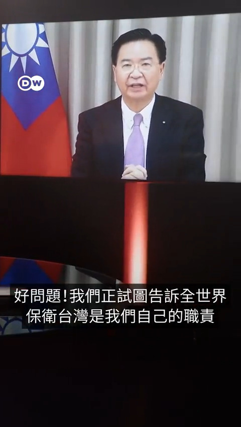
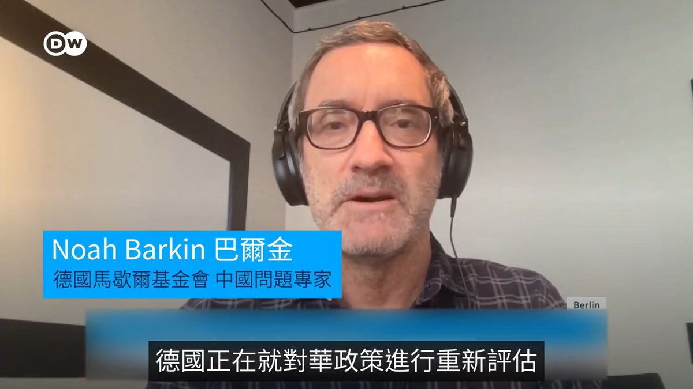
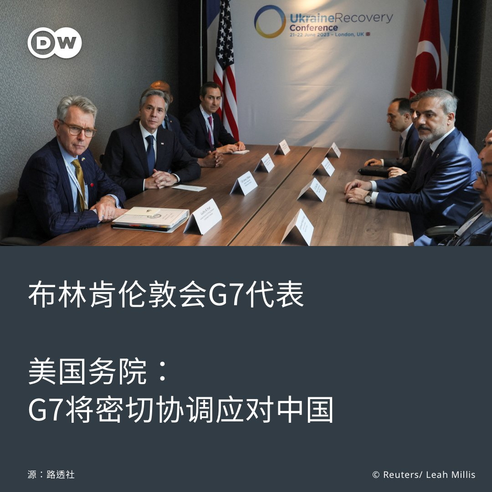
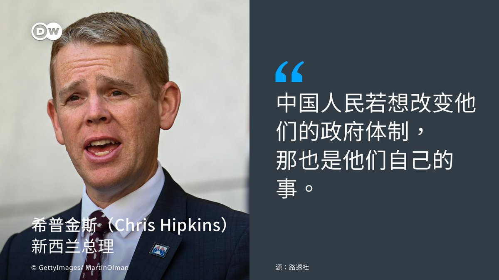

德国之声 北京时间 2023-06-22T23:35:00Z 1671904627439042561 台湾外长吴钊燮：仗还是要自己打

假如中国武力攻打台湾，会有国家坚定地与台湾并肩作战吗？面对德国之声记者Tim Sebastian的追问，台湾外长吴钊燮如何作答？ https://t.co/6mImlUpsGA   德国之声 北京时间 2023-06-22T21:00:30Z 1671865746752786433 脱离风险？关键要看如何定义
德中关系正在经历怎样的转型？德国通信网络中的华为设备是否会被彻底拆除？以脱离风险为主旨的对华政策又会遇到怎样的难处？德国之声专访了马歇尔基金会的中国问题专家巴尔金。 https://t.co/yWlWLdEIz5   德国之声 北京时间 2023-06-22T21:40:28Z 1671875805331488769 近来接连有国际媒体援引美国政府消息人士报道，美国迄今有关新冠溯源的调查显示，在疫情爆发之初，武汉病毒研究所的三名科学家感染过可疑的不明疾病，其中一人的研究还得到过美国官方的资助。

https://t.co/rlf9EaqivB   德国之声 北京时间 2023-06-22T18:49:00Z 1671832652909871105 周三夜晚发生在宁夏银川的液化气罐爆炸事件，已经造成31人死亡。这是近年来中国发生的伤亡最严重的餐馆爆炸事故。

在告别“清零”政策、取消防疫限制之后，烧烤行业十分火爆，得到了普通民众和网红的追捧。

https://t.co/4uAX6hgvxQ   德国之声 北京时间 2023-06-22T19:33:00Z 1671843725948129282 美国众议院周三通过了台美之间于今年6月初签署的"21世纪贸易倡议"。该协定内容广泛，首批签署的部分包括统一管理关税事务、简化贸易手段以及反贪腐措施等。美国参议院将在稍晚时候通过这一倡议文件。

中国认为这是美国虚化掏空一个中国原则的最新例证。

https://t.co/WgdtMhsbEi   德国之声 北京时间 2023-06-22T20:26:07Z 1671857093270175744 欧盟成员国就第11轮对俄制裁措施达成一致，其中也将针对绕过此前制裁的行为。外交官称，在北京的抗议下，列入制裁清单草案的八家中国企业中，有五家被撤除。

 https://t.co/Y6oSD6H0oC   德国之声 北京时间 2023-06-22T17:10:00Z 1671807738530377728 台湾与德国之间的民间交流不断，这其中动物明星们也扮演了不可或缺的作用。

https://t.co/RczgnEz4SH   德国之声 北京时间 2023-06-22T17:55:10Z 1671819105756749826 德国总理肖尔茨在联邦议院发表政府声明。他提出中国应该放弃武力解决南海和台湾问题的企图。他表示，在同中国国务院总理李强举行德中政府磋商会议时也强调了这一点。

肖尔茨还表示：「我们当中没有人想阻碍中国的经济发展。」他说，中国在解决粮食安全、减少贫困和气候变化等问题上发挥着决定性作用。 https://t.co/dozGOKr155   德国之声 北京时间 2023-06-22T18:07:10Z 1671822126490198016 https://t.co/TT7WHnSiSb   德国之声 北京时间 2023-06-22T14:38:11Z 1671769533034680326 【#美国：G7将密切协调应对中国】
美国国务卿 #布林肯 周三（21日）在伦敦会见七国集团（G7）代表后，美国国务院表示，#G7 重新确认了彼此的团结，并强调将在与 #中国 打交道时密切合作。

美国国务院的声明称："G7深知针对中国问题密切协调的重要性，并重申G7比以往任何时候都更加团结。"（续） https://t.co/ofnSm8LpAV   德国之声 北京时间 2023-06-22T14:38:38Z 1671769646599647235 美国国务院表示，布林肯在伦敦会议期间，向G7代表介绍了他日前访华、与中国领导人会面的情况，还讨论了如何向乌克兰提供支持。（完）   德国之声 北京时间 2023-06-22T15:35:53Z 1671784052821733378 在台湾出生、美国受教育，也是马云创业伙伴之一的蔡崇信，9月将接任中国最大电商阿里巴巴的董事长，它的独特背景、经历与能力，这能否挽救这家陷入成长困境的科技业巨头？https://t.co/Op3Fx6s2M8   德国之声 北京时间 2023-06-22T16:21:00Z 1671795407477952513 在 #国安法 上路之后，香港的 #民主自由 再度遭受打击。相当具代表性的香港民意研究所20日决定不公开敏感议题的民调，其中包含 #六四事件、#港人身份认同 等类别的调查。研究团队怎么说❓
详细报导👉https://t.co/q3id0Q8gsX https://t.co/qqXLgJTIZu   德国之声 北京时间 2023-06-22T13:11:20Z 1671747675820273667 【拜登称习近平为独裁者 新西兰总理不同意】
路透社报导，#新西兰 总理希普金斯（Chris Hipkins）周四（22日）表示，他不同意 #拜登 日前称 #习近平 为独裁者的言论。
 
希普金斯告诉记者，他认为「中国的政府形式是中国人民的事」（续） https://t.co/0RRObguY5G   德国之声 北京时间 2023-06-22T13:12:23Z 1671747942880002049 记者反问中国人民是否对政府形式有发言权时，希普金斯回答：「他们若想改变他们的政府体制，那也是他们自己的事。」
 
6月25日至30日，希普金斯预将率贸易代表团访问中国，其中包括新西兰的一些大公司。该贸易团此行将会见习近平、中国总理李强和全国人大常委会委员长赵乐际。（续）   德国之声 北京时间 2023-06-22T13:12:47Z 1671748040577945600 拜登日前间接称习近平为独裁者，引起中国反击，称其言论荒谬且具挑衅意味，在中美双方试图减少摩擦后，再掀意外波澜。
  
🤔您认同拜登和希普金斯的说法吗？请在留言处与我们分享👇   德国之声 北京时间 2023-06-22T11:13:30Z 1671718024364302337 【#莫迪 将罕见在记者会上接受提问】🇮🇳 🇺🇸

#印度 总理莫迪过去很少在记者会上发表谈话或接受提问，白宫高阶官员因此称莫迪与拜登共开的这场记者会为"一件大事"。与此同时，随着印度 #民主 逐渐倒退，#人权 议题成了美国媒体关切焦点。
详细报导👉https://t.co/9Hf4onWOoK https://t.co/E6PW7EBbye   德国之声 北京时间 2023-06-22T10:05:09Z 1671700824815464448 一项最新的报告指出，中国在许多指标上都是全世界人权最差的国家，香港的排名也迅速下降，这究竟是为什么？这项调查又是如何进行？https://t.co/vIXZQGFIBq   德国之声 北京时间 2023-06-22T07:00:00Z 1671654227012100098 厄尔尼诺：「圣婴」威力大增

伴随着厄尔尼诺现象的来临，全球很多地方今年将迎来有史以来最炎热的夏天。那么，究竟什么是厄尔尼诺现象？全球气候变化，又为何会让「圣婴」威力大增？ @dw_environment https://t.co/62MaVy1JCA   德国之声 北京时间 2023-06-22T08:58:21Z 1671684012711231488 世界经济论坛周三（6月21日）公布"2023年全球性别差距报告"，从经济机会、教育、健康和政治参与度等面向，评估全球146国的 #性别平等 状况。
 
今年的 #性平 排名中，冰岛、挪威、芬兰等北欧国家分别位居前3名。 （续） https://t.co/e229GJDwBn   德国之声 北京时间 2023-06-22T08:58:54Z 1671684150489939969 #德国 因联邦政府主要部会的男女人数几乎相等、且教育和医疗面向的分数很高，而攀至全球第6名，是有史以来最高名次；而 #中国 则位居第107名。 
 
报告指，全球性平进展受疫情影响而有所停滞，距实现性别平权还要131年；而东亚地区则因中日韩、印尼的进展停滞，尚需189年才能达到性平。   德国之声 北京时间 2023-06-22T08:59:15Z 1671684239035887617 🤔您所处的国家，性别平等状况如何？请在留言处与我们分享👇   德国之声 北京时间 2023-06-22T05:59:00Z 1671638875784216576 同来自中国的部长们进行政府磋商时肖尔茨总理说"支持去风险，反对脱钩"，但这不过是白宫腔调的一个回音。"使用这类言辞，西方政治家想让人们知道，自己是历史的推动者。但殊不知，北京更为深入的自给自足的梦早已开始。"

我们眼前将出现两个恒星系，涉及文化、经济以及军事"。https://t.co/mzZhoWZIMo   德国之声 北京时间 2023-06-22T00:02:00Z 1671549034299793412 德国宪法保护局局长哈尔登旺说，俄罗斯的情报活动更活跃并且不计手段，"俄罗斯的情报活动甚至不惜最严重的后果，包括杀人"。

德国情报部门认为，中国也尝试拉拢德国经济界代表、服务于其目的，并在此过程中利用其对中国市场的依赖。

https://t.co/OF3mrmjQpq   