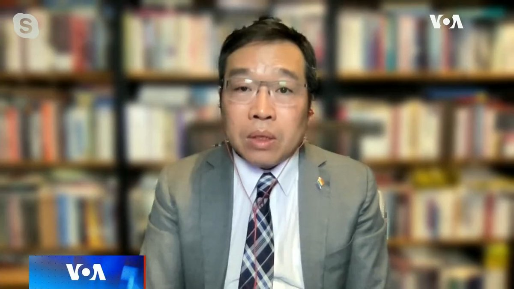
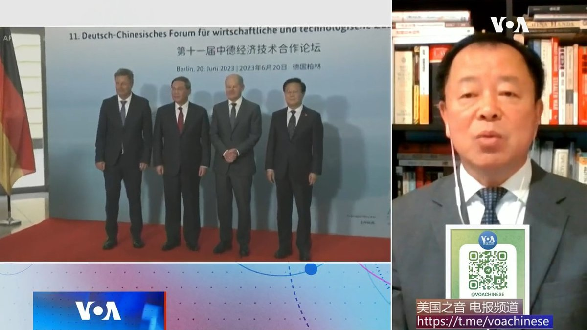
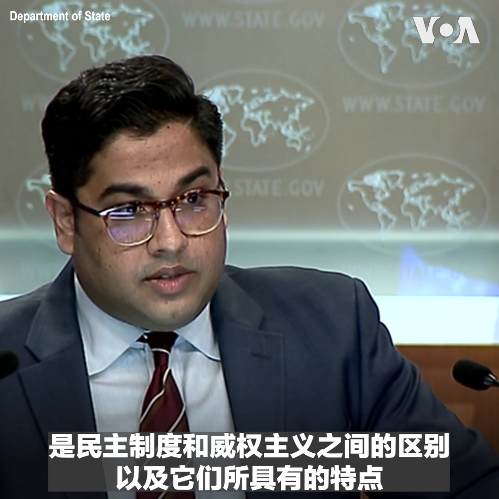
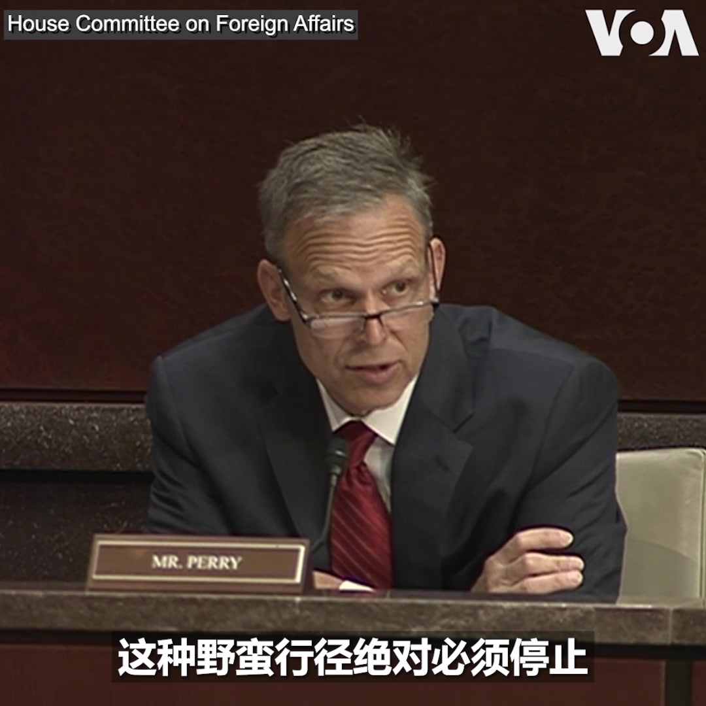
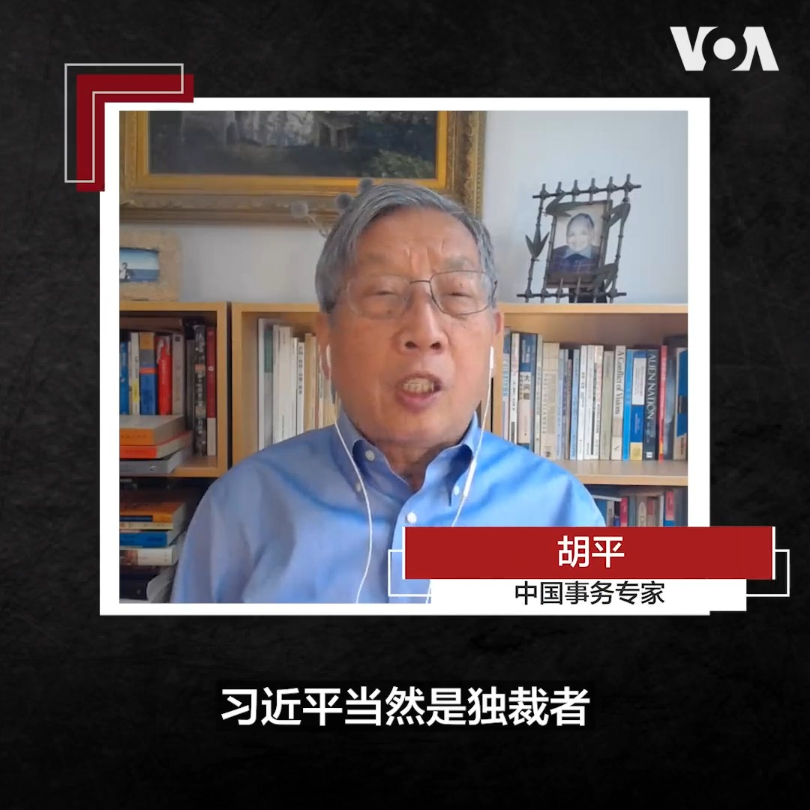
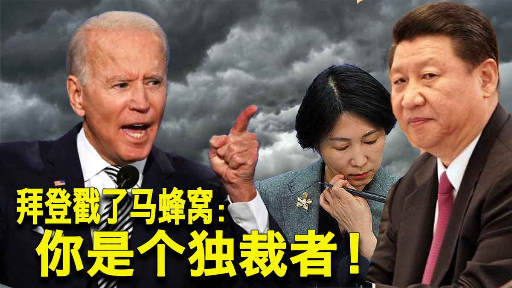
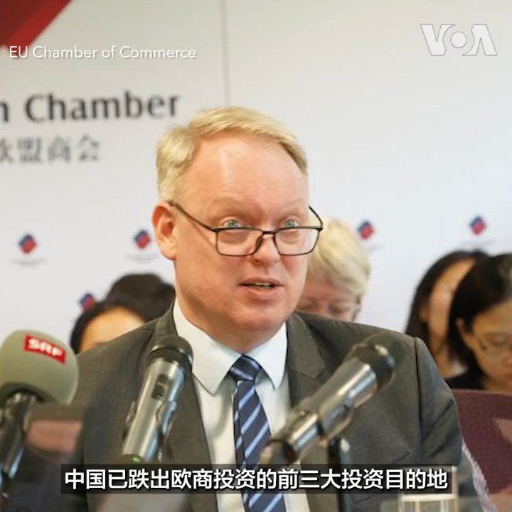

美国之音中文网 北京时间 2023-06-22T16:00:03Z 1671790135988604929 拜登称习近平为独裁者 新西兰总理希普金斯不认同 https://t.co/xOEQeqnpSi   美国之音中文网 北京时间 2023-06-22T12:29:03Z 1671737036259328000 布林肯访中后 美海警队巡逻艇通过台湾海峡 https://t.co/Khi93WVwgZ   美国之音中文网 北京时间 2023-06-22T13:15:03Z 1671748611766628353 布林肯在伦敦会见G7与欧盟代表 协调对华政策 https://t.co/YeeICx8vCQ   美国之音中文网 北京时间 2023-06-22T11:30:00Z 1671722176175833091 印度总理莫迪访美，华盛顿希望和新德里深化军事和科技纽带，使新德里成为在印太地区应对中国不可或缺的盟友。北京独立政治顾问吴强说，虽然印度传统上是不结盟领袖，可是美印已在桌面下形成“神圣同盟”。 
#时事大家谈 完整版：https://t.co/JE1ObMGoRB https://t.co/QUom0hMrbV   美国之音中文网 北京时间 2023-06-22T11:57:34Z 1671729115421085697 端午节前夕发生惨案 中国银川市一家烧烤店爆炸致至少31人死亡 https://t.co/W4yrrYbCK2   美国之音中文网 北京时间 2023-06-22T10:03:34Z 1671700424750166017 冲击国会大厦并用电击枪袭警的骚乱者被判监禁，刑期逾12年 https://t.co/b2Y42MAFPF   美国之音中文网 北京时间 2023-06-22T10:30:00Z 1671707076735934465 李强访问德国时说，应把防风险的主导权还给企业。美国“信息与战略研究所”经济学者李恒青说，李强纯粹不懂风险管控的基本规律，疫情中中国政府毫无约束的巨大权力，让外资看到极大的政治和社会风险，把防风险权还给企业，外资会走得更快。 
#时事大家谈 完整版：https://t.co/JE1ObMGoRB https://t.co/YoUmKlboeo   美国之音中文网 北京时间 2023-06-22T06:32:41Z 1671647353001099264 美国总统拜登星期二公开称中国国家主席习近平是"独裁者"，这会抵消布林肯访华所取得的进展吗？对此，美国国务院副发言人帕特尔6月21日在例行记者会上说，“完全不会”。 他表示，美中之间存在分歧不足为奇，本届政府相信外交手段的重要性，但也会坦率直言地表达分歧，包括民主制度和威权主义之间的区别。 https://t.co/IzsxdrEfxz   美国之音中文网 北京时间 2023-06-22T07:00:01Z 1671654231613267968 印度总理莫迪访问美国，白宫以超高规格接待。在美印关系全面深化的助推下，印度是否会成为全球供应链“去中国化”浪潮中最大的赢家？在另一方面，北京近日连续推出经济刺激政策，这是挽救经济的良药还是安慰剂？6月22日时事大家谈将讨论这些问题，请留言参与。 https://t.co/EDVaktnOlj   美国之音中文网 北京时间 2023-06-22T07:17:32Z 1671658640649109506 美军将领指责俄空军“空中胡闹” https://t.co/48JEbSwnWY   美国之音中文网 北京时间 2023-06-22T07:28:36Z 1671661424194596866 美国会众院外委会6月21日通过共和党议员莫兰（Rep. Nathaniel Moran) 提出的《不向维吾尔强迫劳动提供美元法案》法案，禁止任何国务院和其他政府机构的资金购买全部或部分在新疆制造的物品。外委会还通过了共和党议员佩里（Rep. Scott Perry) 提出的法案，要求对在中国参与强摘器官的个人进行制裁。 https://t.co/GXyudZgF4W   美国之音中文网 北京时间 2023-06-22T07:50:18Z 1671666886009028610 美国国会众议院外委会主席麦考尔6月20日发表声明，对布林肯的中国之行表示“失望”。国务院副发言人帕特尔6月21日在例行记者会上表示对声明的大部分内容“持强烈异议”，并对具体内容进行了反驳。帕特尔说，不与中国进行对话是不负责任的，对美国的利益来说也是适得其反的。 https://t.co/BRAyCFssEN   美国之音中文网 北京时间 2023-06-22T08:00:00Z 1671669329690230786 世界媒体看中国——金哲报道：拜登说习近平是独裁者，他是不是？报道：https://t.co/0cqTFtGUW6 https://t.co/mWsp0qmH58   美国之音中文网 北京时间 2023-06-22T09:00:01Z 1671684433479446537 一键解锁#美国热搜 榜 1、拜登称习近平是独裁者 毛宁迅速反击 2、0号病人浮现 坐等习总甩锅3、解放军欲驻扎古巴 危机升级 4、53条矿工命不敌熊猫丫丫思乡情5、荒诞的BBC滤镜传言6、习近平的言行不一7、警察跪抗议者的用意8、竖中指运动 https://t.co/mGABU9Op98 https://t.co/fw3BOwvzsJ   美国之音中文网 北京时间 2023-06-22T09:02:10Z 1671684972363796480 美国不收回拜登将习近平比作独裁者的言论 https://t.co/CdftSjTxk3   美国之音中文网 北京时间 2023-06-22T09:19:03Z 1671689223223808001 舒默宣布美国AI监管倡议：“中共主导算法监管将导致民主衰退” https://t.co/AJCcVuWBu3   美国之音中文网 北京时间 2023-06-22T09:19:05Z 1671689230748356608 布林肯鼓励土耳其外长支持瑞典加入北约 https://t.co/SwAzPVJLSt   美国之音中文网 北京时间 2023-06-22T05:05:03Z 1671625300906770432 伊朗与欧盟讨论降低核紧张的方法 https://t.co/4F2YLqQkWe   美国之音中文网 北京时间 2023-06-22T05:33:03Z 1671632345873678338 欧盟对俄罗斯实施新一轮制裁，聚焦贸易漏洞 https://t.co/61NigObolP   美国之音中文网 北京时间 2023-06-22T00:39:33Z 1671558484419284992 山东号航母沿台海南行，众多机舰侵扰台湾周边海空域 https://t.co/ZEZMxsL9cC   美国之音中文网 北京时间 2023-06-22T01:05:52Z 1671565108458160128 特斯拉首席执行马斯克6月20日与印度总理莫迪会面后表示，印度正在推动特斯拉在该国进行“重大投资”，他预计这一消息将会很快宣布。马斯克表示，印度在太阳能、固定电池组和电动汽车等方面有巨大潜力，他希望将SpaceX的“星链”（Starlink）卫星互联网服务带到印度。 https://t.co/f5LlDnCvXt   美国之音中文网 北京时间 2023-06-22T01:10:33Z 1671566286084784128 美国商业电视频道：中国商业间谍目标不光是窃取美企技术，还想要美企的命 https://t.co/4kzJZ7vPu5   美国之音中文网 北京时间 2023-06-22T01:27:04Z 1671570442405163009 世界媒体看中国：拜登说习近平是独裁者 https://t.co/eY3KShIK1m   美国之音中文网 北京时间 2023-06-22T01:58:02Z 1671578234847383553 拜登称习近平为独裁者让北京大为光火，刚刚企稳的美中关系再次紧张 https://t.co/asYhCrZSlC   美国之音中文网 北京时间 2023-06-22T01:58:04Z 1671578242246144001 在华欧企：对中国的商业信心跌至史上最低 https://t.co/rjw78dp3PH   美国之音中文网 北京时间 2023-06-22T02:18:04Z 1671583275708555264 中国欧盟商会(EU Chamber of Commerce in China)6月21日发布了2023年在华商业信心调查报告，结果显示，欧企对中国的营商环境和经济前景皆充满不确定性，商业信心更跌至史上最低，甚至有高达37%的受访欧企已經或打算未来将其亚洲总部移出中国。报道: https://t.co/lQe4VJwruO https://t.co/RlIwhaElof   