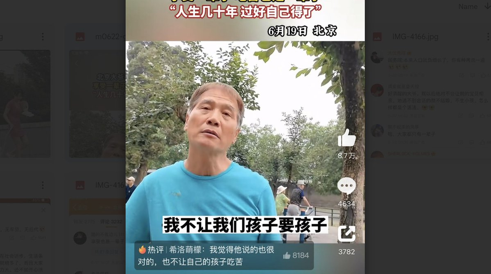
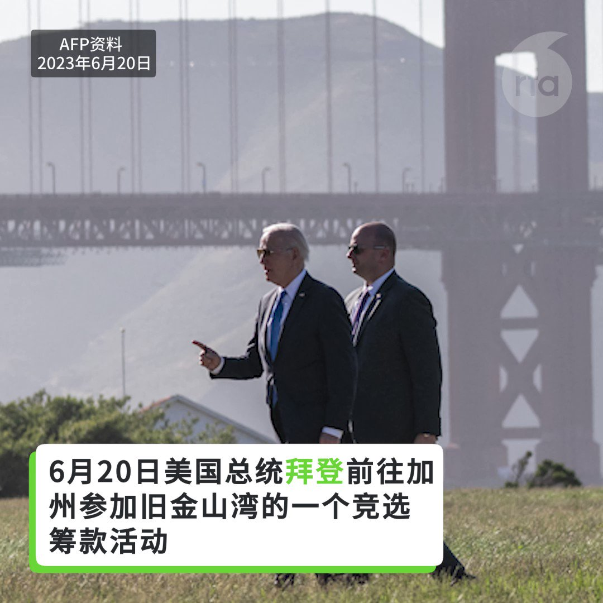
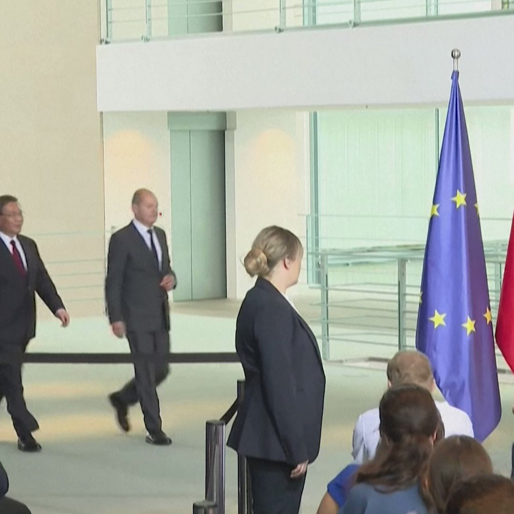

自由亚洲电台 北京时间 2023-06-22T23:16:16Z 1671899913544671234 6月21日20时40分许，宁夏回族自治区银川市兴庆区民族南街富洋烧烤店操作间液化石油气（液化气罐）泄漏引发爆炸，造成38人伤亡，其中31人经抢救无效死亡，7人救治中。
https://t.co/QtJsMcRCoO   自由亚洲电台 北京时间 2023-06-22T23:35:12Z 1671904679435948041 最近，#台湾 掀起"#MeToo"运动，遭性骚扰、性侵害的案例横跨行业领域、党派、性别，更涉及未成年、偷拍、染毒等议题。而中国大陆多年前也曾出现"#MeToo"运动。同为华人社会，两岸对相关事件的处理方式有何不同？
https://t.co/aL1p5YJ8xc   自由亚洲电台 北京时间 2023-06-22T20:37:55Z 1671860065471459330 中国计划在 #古巴 建立军事训练设施　#布林肯 提出警告
https://t.co/e7zeTTBJmI   自由亚洲电台 北京时间 2023-06-22T18:42:52Z 1671831108722503680 【李翘楚涉"煽颠罪"案审判再被拖延】
【抑郁症病发申请取保被拒】
涉"厦门聚会案"的 #许志永、#丁家喜 和 #常玮平 等人，先后被判刑，同案被控"煽动颠覆国家政权罪”的女权工作者 #李翘楚，案件疑因法院多项针对代表律师的要求，无法如期审判。
了解情况的丁家喜太太 #罗胜春 批评，法院以违法方式，阻止代表律师到庭，极为恶劣，李翘楚只因是许志永女友而被控告，担心她的抑郁症因案件被拖延恶化。
https://t.co/vrodxzc48M   自由亚洲电台 北京时间 2023-06-22T15:22:31Z 1671780692206948352 https://t.co/QtJsMcSaem   自由亚洲电台 北京时间 2023-06-22T16:22:52Z 1671795880343789568 【北京老人劝勿生子视频 获数千万浏览量】
【众人赞大爷思想通透】
中国年轻人不想结婚的人越来越多，甚至许多有子女的老年人也劝自己的孩子 #不生孩子。学者认为，中国不同年龄段的失落感在加深。周四上午，相关视频登上微博热搜第二名，浏览量近一亿人次。绝大多数网民支持这位老人的观点，不打算生孩子。
详细报道：https://t.co/LNXDGR3znE   自由亚洲电台 北京时间 2023-06-22T11:36:12Z 1671723736859394049 RT @RFA_Chinese: 本周二拜登总统在加州参加一个募捐活动时，再次提到中国间谍气球事件，并称中国国家主席 #习近平 为 #独裁者，此事引发中方不满并做出回应。
您认为谁说得对？ https://t.co/FlHrEgsyvg   自由亚洲电台 北京时间 2023-06-22T05:11:30Z 1671626922466369538 专栏 | #纵横大历史：第五十三讲 #红卫兵 运动的社会背景(上)
https://t.co/CLlGGoS4HM   自由亚洲电台 北京时间 2023-06-22T05:25:11Z 1671630365293961216 中国总理 #李强出访德国，两国就第十一届 #德中经济技术合作论坛 举行会谈。很多媒体报道分析李强此行是为中国经济困境寻找化解之方。 https://t.co/K18w2sDv87   自由亚洲电台 北京时间 2023-06-22T06:00:01Z 1671639132249141248 专栏 | #网络博弈：歌曲《代TA走下去》纪念香港 #反送中运动
https://t.co/PHhmfYlbU7   自由亚洲电台 北京时间 2023-06-22T06:05:38Z 1671640548191662080 【#亚太报道（2023-6-21）】
欢迎收听和订阅播客【亚太报道】 https://t.co/MjLNSvVMqc

北京广州染 #猴痘 人数突增/ #拜登 称 #习近平 为 #独裁者 北京不干/ #布林肯访华 使美国对台政策再成焦点/ 律师 #余文生 恐被加控罪名/ 中国公安部三年"#严打" 收缴枪支 https://t.co/Tb7Vn3wkiR   自由亚洲电台 北京时间 2023-06-22T02:52:11Z 1671591861105065985 本周二拜登总统在加州参加一个募捐活动时，再次提到中国间谍气球事件，并称中国国家主席 #习近平 为 #独裁者，此事引发中方不满并做出回应。
您认为谁说得对？ https://t.co/FlHrEgsyvg   自由亚洲电台 北京时间 2023-06-22T03:05:24Z 1671595187670482944 俄罗斯官方媒体以及另一家媒体Frank Media表示，中国银行开始终止 #俄罗斯 通过其代理行账户以 #人民币、美元、港币和欧元进行的转账。根据这项新规，中国银行不能被用作俄罗斯与第三方国家进行货币交换的中介银行。
这是为什么？
https://t.co/UMhkfk48vE   自由亚洲电台 北京时间 2023-06-22T03:09:57Z 1671596332296065024 #拜登 言论透露的信息显示，#习近平 在 #气球事件 发生前并不知情，才导致他“愤怒”且“尴尬”，这也引起针对习近平是否实现绝对领导的广泛辩论。
#独裁者 
https://t.co/agyYoK7v11   自由亚洲电台 北京时间 2023-06-22T03:30:01Z 1671601385417367552 年轻人疯抢“剩菜盲盒”的情势，也显现出中国年轻人的就业状况不佳、中国经济不见复甦的状况。今年5月，中国16到24岁年轻人的失业率高达20.8%，是5年来的新高。
https://t.co/VeI41h1Kuj   自由亚洲电台 北京时间 2023-06-22T04:00:05Z 1671608951996305408 据 #欧盟商会 统计，570家受访公司当中，有三分之二表示，在中国做生意更加困难。新冠疫情爆发前，这个数字不到一半。另外，有五分之三的公司认为，#中国营商环境 已经“更政治化”，一年前持同样看法的只有一半。
https://t.co/2vstuiiFSI   自由亚洲电台 北京时间 2023-06-22T00:43:48Z 1671559553320882177 港府早前宣布，为引进外来劳工的限制松绑，引发为 ＃香港 进行大规模"换血"的忧虑外，港府没有事先咨询亲中团体，也引发多个亲中工会不满。香港立法会周二（6月20日）讨论 ＃输入外地劳工 计划的会议，亲共的 ＃工联会 立法会议员黄国质问港府为何排斥他们的声音。

https://t.co/sVfWtzlYan   自由亚洲电台 北京时间 2023-06-22T01:46:42Z 1671575384574525440 退休美军上将、前美国参谋长联席会议主席Michael Glenn Mullen表示：“#台湾 岛位于四个大经济体的中心，相比2000年以及2008年的经济衰退，或是新冠疫情导致经济停滞，两岸若爆发战争，对美国、中国以及世界带来的经济冲击，都会比上述的情况还要严重。”

https://t.co/AlV7NWhEMJ   自由亚洲电台 北京时间 2023-06-22T02:15:54Z 1671582734123245568 #台湾投资中国大陆 今年四月创下单月记录二十一年新低，今年对中总投资可能跌破至四十亿美元。 https://t.co/6PLV9OMVRq
著名经济学家 #林毅夫 近日谈及大陆部分地区台商流失时表示 ，经济发展是产业不断转型升级的过程，失去比较优势的产业转移到工资水准较低的地方，”这是经济发展的必然规律”。这种转移是正常的，且有利于 #台商，同时也有利于大陆的产业升级。
你怎么看？   自由亚洲电台 北京时间 2023-06-22T00:09:11Z 1671550843617972225 四年前因参与厕所革命被重判的上海异议人士 ＃季孝龙 再度因涉嫌寻衅滋事而受审。控方在庭上以季孝龙公然侮辱国家领导人作为罪证，外界却认为，他实名向 ＃李强 追究 ＃上海封城 责任才是真正的导火索。

https://t.co/XezuR2NwpS   