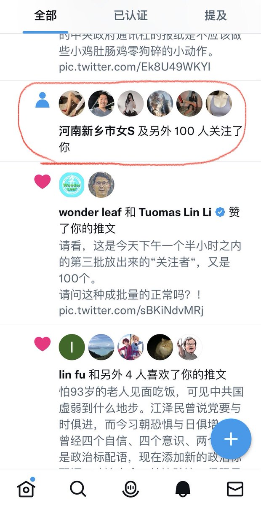
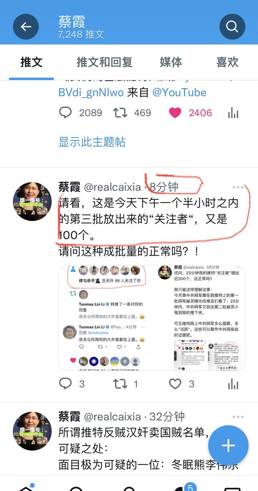
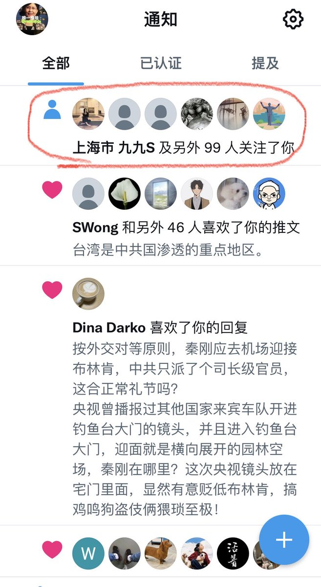
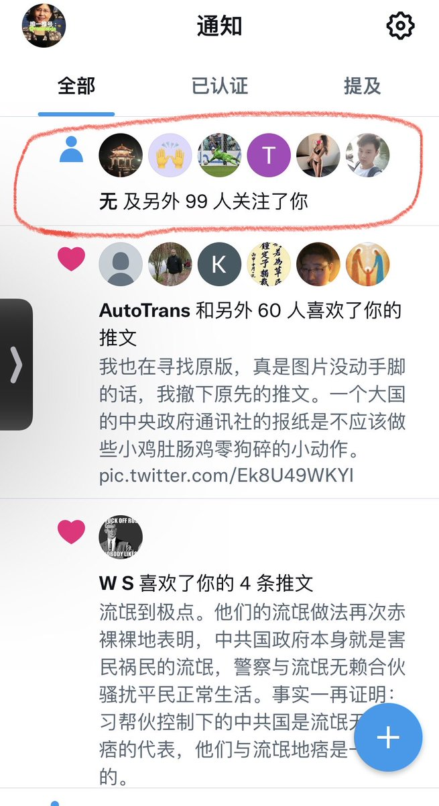
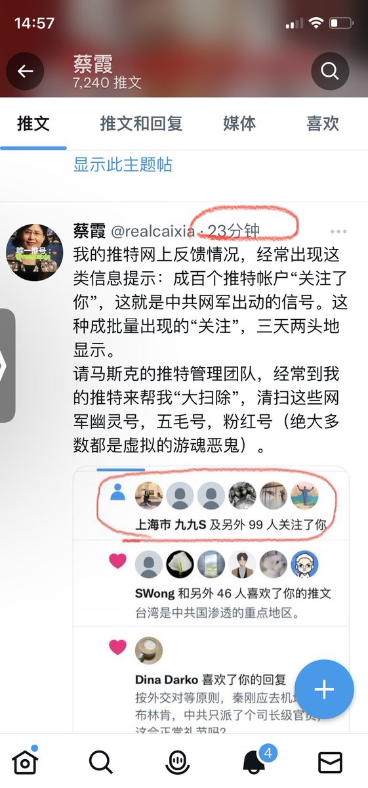
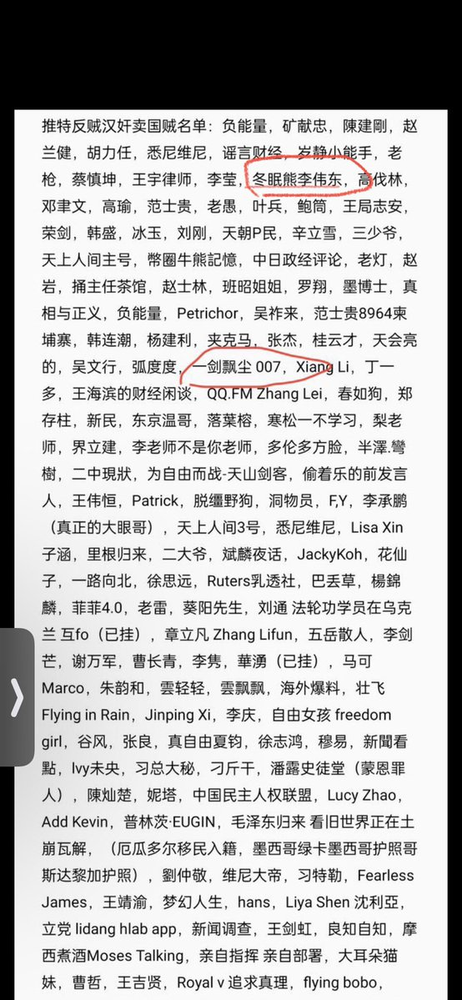
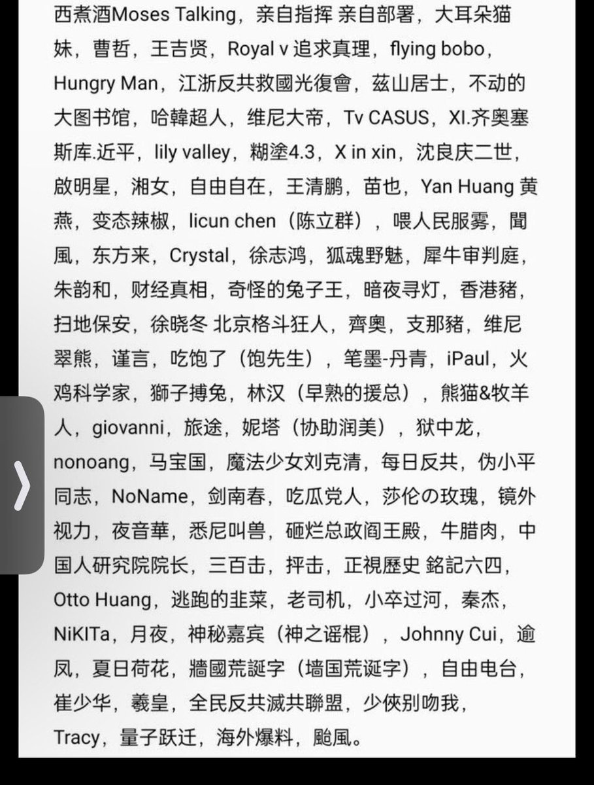
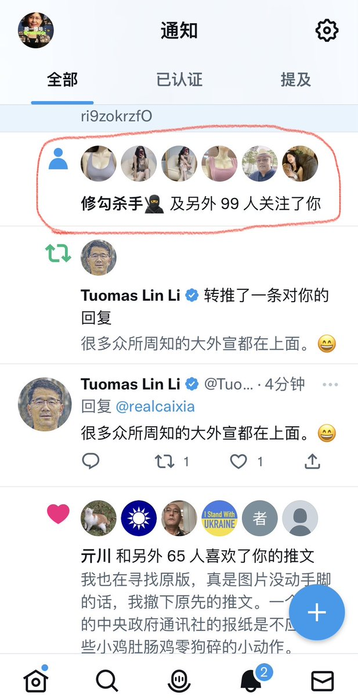
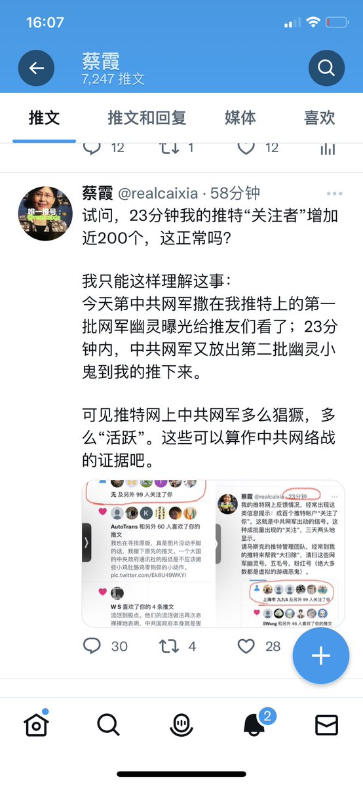

蔡霞 北京时间 2023-06-22T21:45:10Z 1671876987063869440 RT @whyyoutouzhele: 突发！
刚刚，北京大学，一名女子在家园食堂门口举牌：
“罢黜一党极权，拥抱多党制度”
随后被保安部立即带走。 https://t.co/BbIjzXbstR   蔡霞 北京时间 2023-06-22T10:46:41Z 1671711276991643648 RT @luoshch: #关注李翘楚 2023年6月18日李翘楚案辩护律师收到山东省临沂市中级人民法院通知，
李翘楚煽动颠覆国家政权罪一案，定于 2023年6月20日9时在
山东省临沂经济技术开发区人民法院第一审判庭开庭审理。（2022）鲁13刑初10号，翘楚母亲被告知该案是…   蔡霞 北京时间 2023-06-22T10:53:03Z 1671712876434972674 RT @RonaldSimmonsUS: @GanchengW @feimoyu21_ “三年大清零”运动确实弄破产了很多商人。
https://t.co/t56LxTtWNU   蔡霞 北京时间 2023-06-22T04:27:01Z 1671615729408573440 这是中共鬼魂第四批，与第三批只间隔几分钟！它们是一群恶鬼。这是证据。
我正好收集起来，发给美国国会的中国问题小组看看，中共网军说如何在美国网络上肆无忌惮的，这就是中共在美国打的网络战舆论战证据。 https://t.co/wqZJs9Z3jN   蔡霞 北京时间 2023-06-22T04:31:57Z 1671616968657600512 吴老师这推文好！   蔡霞 北京时间 2023-06-22T02:33:32Z 1671587170396835842 我的推特网上反馈情况，经常出现这类信息提示：成百个推特帐户“关注了你”，这就是中共网军出动的信号。这种成批量出现的“关注”，三天两头地显示。
请马斯克的推特管理团队，经常到我的推特来帮我“大扫除”，清扫这些网军幽灵号，五毛号，粉红号（绝大多数都是虚拟的游魂恶鬼）。 https://t.co/I9HfQFpMKv   蔡霞 北京时间 2023-06-22T03:08:36Z 1671595996449746944 试问，23分钟我的推特“关注者”增加近200个，这正常吗？

我只能这样理解这事：
今天第中共网军撒在我推特上的第一批网军幽灵曝光给推友们看了；23分钟内，中共网军又放出第二批幽灵小鬼到我的推下来。

可见推特网上中共网军多么猖獗，多么“活跃”。这些可以算作中共网络战的证据吧。 https://t.co/BmOopcD1PB   蔡霞 北京时间 2023-06-22T03:48:51Z 1671606124662116356 所谓推特反贼汉奸卖国贼名单，大有可疑之处：
面目极为可疑的一位：冬眠熊李伟东排在最前面第三行显著位置。
而魏京生、王军涛、王丹、周峰锁、胡平、盛雪、蔡霞、光传媒官网、陈光诚、suyutong等却都不在名单上……
这张所谓名单是什么人整理发布的？这不值得想想吗？！ https://t.co/ri9zokrzfO   蔡霞 北京时间 2023-06-22T04:13:08Z 1671612236232790016 请看，这是今天下午一个半小时之内的第三批放出来的“关注者“，又是100个。
请问这种成批量的正常吗？！ https://t.co/sBKiNdvMRj   