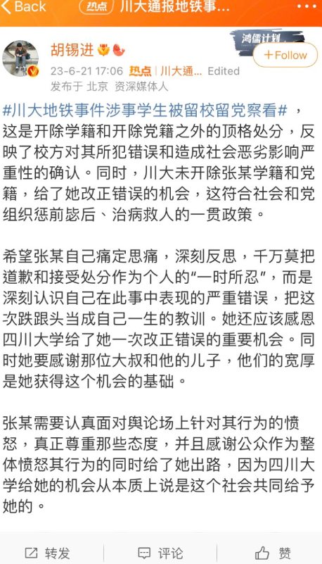
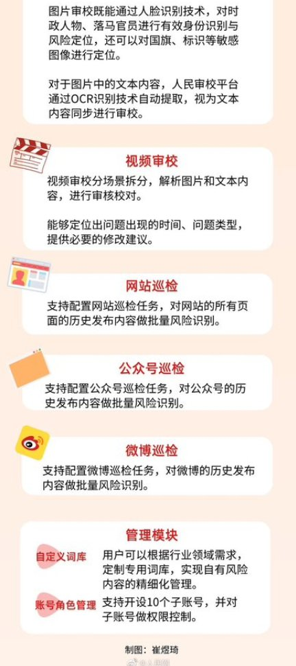
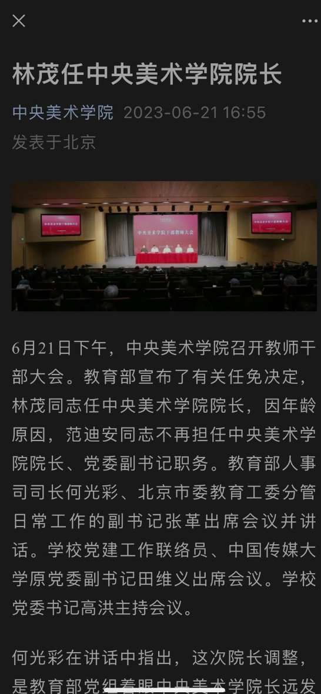
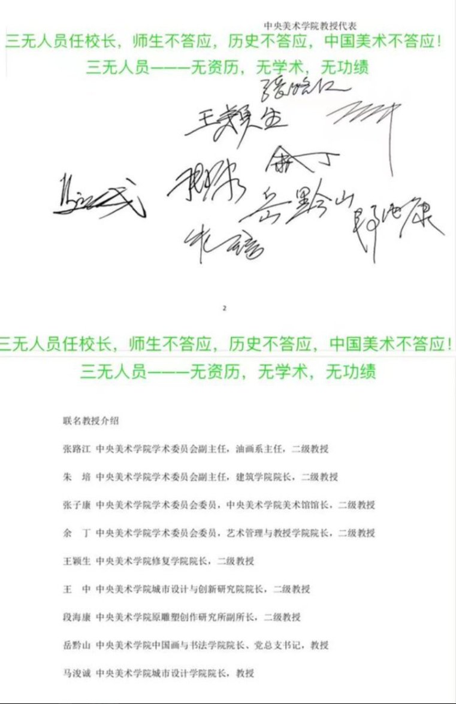
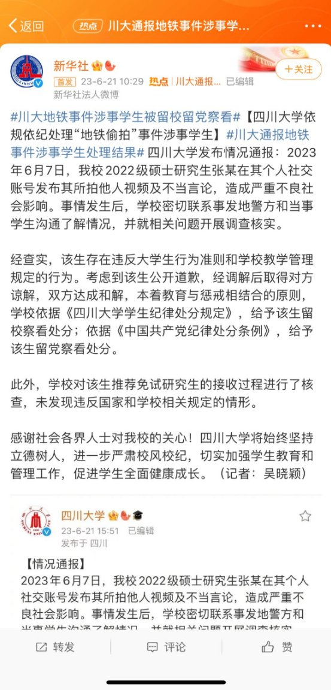
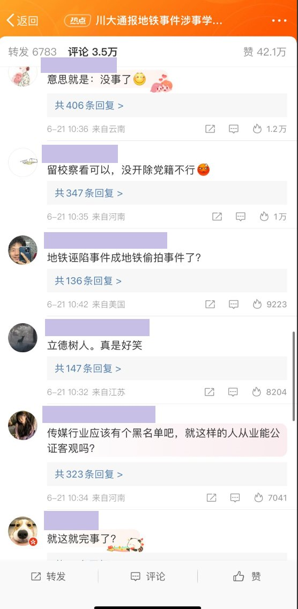
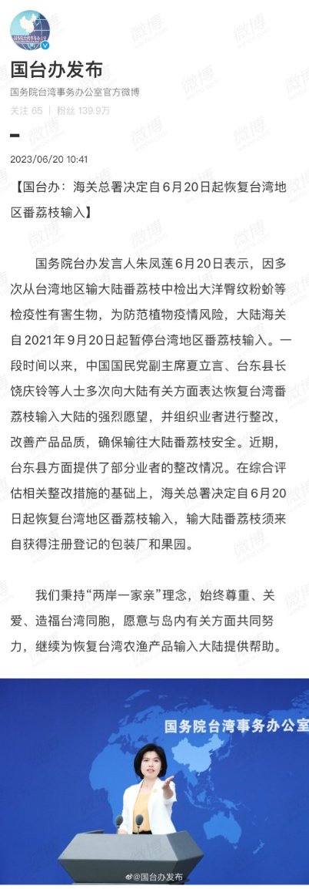

A李老师不是你老师 北京时间 2023-06-21T18:25:21Z 1671464315721863169 老胡发表评论 https://t.co/aS26iWE50N   A李老师不是你老师 北京时间 2023-06-21T18:35:18Z 1671466816680370181 后续，当地公安于17日依法对两名嫌疑人采取了刑事强制措施 https://t.co/QZ8zHguojs   A李老师不是你老师 北京时间 2023-06-21T18:47:38Z 1671469920998096896 网友投稿
近年来，随着言论管制的日益病态和不断扩充的敏感词库，导致内容风险已经涉及到了政府日常公文层面。
6月21日，人民网发布涉政内容校对风控平台“人民审校”。专门针对各类公文和官方发布文件进行审校。 https://t.co/c2cKZeUoEx   A李老师不是你老师 北京时间 2023-06-21T19:04:21Z 1671474127285239808 网友投稿
“排除万难”
6月21日下午，中央美术学院召开教师干部大会，教育部宣布林茂任中央美术学院院长。
此前，6月13日，中央美术学院各分院院长及教授曾发表联名公开信，抗议反对学校副院长林茂担任新院长。 https://t.co/sZs9N82OFY   A李老师不是你老师 北京时间 2023-06-21T19:04:46Z 1671474235527536641 https://t.co/xCOqSr7H4k   A李老师不是你老师 北京时间 2023-06-21T18:07:43Z 1671459876579561472 “南京传媒学院”竟成为敏感词？
6月21日，有网友发现，在网易新出的一款名为《巅峰极速》的游戏中，在俱乐部的名字中输入“南京传媒学院”  显示俱乐部名存在敏感字符 https://t.co/Z28jiHFl3i   A李老师不是你老师 北京时间 2023-06-21T18:17:35Z 1671462357715890176 网友投稿
6月21日，四川大学就广州地铁事件涉事女生的处分结果出炉：留校留党查看。
在相关新闻评论区引发网友强烈不满 https://t.co/KkicB8mCDD   A李老师不是你老师 北京时间 2023-06-21T06:27:36Z 1671283685893586945 网友投稿
在另一则关于“统一后台湾同胞将真正当家作主”的视频下方
网友一起刷屏提醒“台湾同胞一定要擦亮双眼” https://t.co/AIJqGEDT32   A李老师不是你老师 北京时间 2023-06-21T06:13:46Z 1671280203367104512 网友补充
在B站搜索“阿拉善矿难”，首页点击最高的三个视频全是关于熊猫丫丫的 https://t.co/lnb5xIHgiE   A李老师不是你老师 北京时间 2023-06-21T02:24:10Z 1671222424635834398 网友投稿
“养蛊终自噬”
6月20日，国台办微博发文将恢复台湾番荔枝进入中国，引发评论区网友强烈反对抗议。
随后评论区被关闭，网友们继续转发微博抗议 https://t.co/NP3P8wo0we   